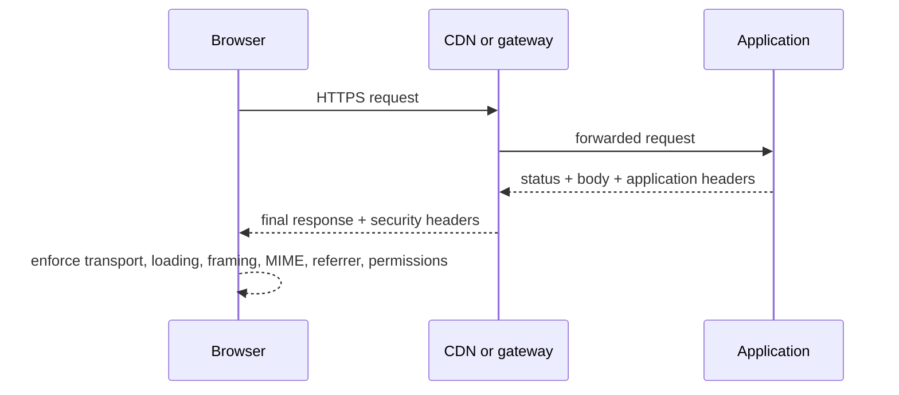

<TLDR>
  <TLDRCell label="what">
    Security response headers are browser policies sent by a server to constrain resource loading, framing, transport, type handling, referrer data, and sensitive features.
  </TLDRCell>
  <TLDRCell label="trap">
    Copying the “strictest” header set does not guarantee security; a broad CSP provides little protection, while a mistaken HSTS or permissions policy can make a site unreachable or break its features.
  </TLDRCell>
  <TLDRCell label="fix">
    Build a minimal policy per response class, give one deployment layer clear ownership, and tighten it only after report-only and real-browser validation.
  </TLDRCell>
</TLDR>

## What it is and why it exists

A security response header is a field that a server puts in an HTTP response so the browser enforces an additional security rule. These headers do not change an authorization decision already made by the server, and they do not sanitize untrusted input. They control what the browser may load, execute, send, or expose after receiving the response.

A web page handles documents, scripts, styles, images, forms, and embedded content at once. HTML and JavaScript alone cannot easily establish one consistent boundary that page scripts cannot casually rewrite. Response headers carry that boundary with a resource and can cover templates, static assets, and error pages.

This is defense in depth. The application still has to prevent XSS at its source; <Term id="content-security-policy">Content Security Policy (CSP)</Term> can limit script execution and data exfiltration after an injection occurs. TLS still provides connection confidentiality and integrity; <Term id="strict-transport-security">HTTP Strict Transport Security (HSTS)</Term> tells a browser that knows the policy not to try plaintext HTTP again.

You encounter these headers in application frameworks, middleware, reverse proxies, API gateways, and CDN configuration. Final behavior depends on the complete response the browser receives, not on what any one layer intended to send. Policy design and deployment verification must therefore cover success, redirect, and error paths together.

Common headers solve different problems and cannot replace one another:

| Header or directive | Boundary enforced by the browser | Does not replace |
| --- | --- | --- |
| `Content-Security-Policy` | Limits resource origins, script execution, form targets, and page ancestors | Output encoding and input validation |
| `Strict-Transport-Security` | Upgrades HTTP visits to this host to HTTPS for the policy lifetime | A TLS certificate and secure TLS configuration |
| `X-Content-Type-Options: nosniff` | Rejects mismatched MIME types for requests such as scripts and styles | A correct `Content-Type` |
| `Referrer-Policy` | Controls how much `Referer` information accompanies a request | Keeping secrets out of URLs |
| `Permissions-Policy` | Limits browser features available to documents and embedded content | User consent and operating-system permission |
| CSP `frame-ancestors` | Limits which ancestor pages may embed this page | Authorization inside the embedded page |
| `X-Frame-Options` | Provides older `DENY` or `SAMEORIGIN` framing control | CSP's multi-origin framing policy |

## How it works

The server sends a response body after the status line and response headers. The browser parses policies that apply to that response, then decides how to handle the body and later subresource requests. Different headers act at different stages, so “the header exists” is only the start of an audit; its value, response type, and browser context matter too.



### CSP's decision order

A CSP consists of semicolon-separated directives. Fetch directives such as `script-src`, `style-src`, `img-src`, and `connect-src` constrain scripts, styles, images, and network connections respectively. Many resource types fall back to `default-src` when their dedicated fetch directive is absent; `frame-ancestors`, `base-uri`, and `form-action` do not use that fallback and must be set explicitly when needed.

The broader a source expression is, the more content the browser accepts. `'self'` means the protected document's own origin, while `'none'` allows no source. Allowing all of `https:` or a broad host wildcard can still trust a source an attacker controls; derive a policy from the application's real dependencies instead of starting with “allow the internet.”

A strict `script-src` blocks inline scripts by default. When inline script must remain, generate an unpredictable, single-use <Term id="csp-nonce">CSP nonce</Term> for the response and put the same value in both the policy and approved `<script>` elements. A nonce proves only that the browser may execute that element; it does not replace safe serialization of data inserted into the element.

### Other headers keep their own state

HSTS is time-bounded state that a browser stores by host. A browser accepts the HSTS header only from a secure HTTPS response; on a later visit to a matching host, it upgrades an HTTP URL to HTTPS before making the network request. `includeSubDomains` extends the rule to subdomains, and `preload` expresses the site's intent to enter the browser preload mechanism, but writing that token alone does not register the site.

Use `X-Content-Type-Options: nosniff` with an accurate `Content-Type`. It is not a replacement for MIME type detection; it tells the browser not to execute a response with the wrong type as a script or style in the relevant contexts. Uploaded content still needs safe filenames, a separate origin, download semantics, and server-side validation.

`Referrer-Policy` selects how much `Referer` data accompanies navigation or subresource requests. `strict-origin-when-cross-origin` keeps a full URL for same-origin requests, sends only the origin cross-origin, and sends no referrer on an HTTPS-to-HTTP downgrade. A sensitive page can use `no-referrer`, but the primary rule remains: do not put tokens, passwords, or personal data in a URL.

`Permissions-Policy` declares an allowlist per feature: for example, `camera=()` disables the camera and `geolocation=(self)` limits geolocation to the same origin. It controls whether a feature is available to a document; an actual call may still require user consent. Browsers may ignore feature names they do not recognize, so test final behavior in the browsers you support.

### Policy ownership

A response may pass through an application, middleware, reverse proxy, and CDN. If several layers write the same header, the result may contain duplicate fields, overridden directives, or configuration that applies only to some status codes. The team should name one final policy owner and document other responsibilities—for example, the application supplies a per-response nonce while the edge consistently supplies static headers.

Multiple CSP fields do not simply merge into one more permissive policy. A browser enforces each policy separately, which generally produces a stricter result; operators still struggle to infer the real intent from layered output. Inspecting the final production response is more reliable than testing only a framework configuration object.

## Examples

### Build a baseline policy

This pure function creates a minimal baseline for an ordinary HTML response. It deliberately omits `includeSubDomains` and `preload` because those options require an audit of the whole domain namespace first. A real application must add CSP sources from its resource inventory and define separate policies for APIs, downloads, and static assets.

<Depth level="quick">

```javascript run title="baseline_headers.js"
function buildHeaders({ https = true, embedders = [] } = {}) {
  const ancestors = embedders.length
    ? ["'self'", ...embedders].join(' ')
    : "'none'";

  const headers = {
    'Content-Security-Policy': [
      "default-src 'self'",
      "script-src 'self'",
      "object-src 'none'",
      `frame-ancestors ${ancestors}`,
      "base-uri 'self'",
      "form-action 'self'",
    ].join('; '),
    'Referrer-Policy': 'strict-origin-when-cross-origin',
    'X-Content-Type-Options': 'nosniff',
    'Permissions-Policy': 'camera=(), microphone=(), geolocation=()',
  };

  if (https) {
    headers['Strict-Transport-Security'] = 'max-age=31536000';
  }
  return headers;
}

for (const [name, value] of Object.entries(buildHeaders())) {
  console.log(`${name}: ${value}`);
}
```

```text
Content-Security-Policy: default-src 'self'; script-src 'self'; object-src 'none'; frame-ancestors 'none'; base-uri 'self'; form-action 'self'
Referrer-Policy: strict-origin-when-cross-origin
X-Content-Type-Options: nosniff
Permissions-Policy: camera=(), microphone=(), geolocation=()
Strict-Transport-Security: max-age=31536000
```

</Depth>

`frame-ancestors 'none'` prevents every page from embedding this page; pass reviewed, complete origins when same-origin or partner embedding is a real requirement. The function emits HSTS only when `https` is true, but the deployment layer must also ensure it appears only on genuine HTTPS responses and interprets a trusted proxy's forwarded protocol correctly.

### Generate a CSP nonce per response

This render function uses Node 24's cryptographic random source to create a 128-bit nonce. It prints security properties rather than the random secret, so repeated runs still produce stable, reviewable output. The example also escapes `<` in the message, showing that nonce authorization and data safety are separate boundaries.

```javascript run title="nonce_csp.js"
import { randomBytes } from 'node:crypto';

function renderPage(message) {
  const nonce = randomBytes(16).toString('base64');
  const policy = [
    "default-src 'self'",
    `script-src 'nonce-${nonce}'`,
    "object-src 'none'",
    "base-uri 'none'",
  ].join('; ');

  // A nonce authorizes this element; escaping still protects the data boundary.
  const safeMessage = JSON.stringify(message).replaceAll('<', '\\u003c');
  const html = [
    '<!doctype html><meta charset="utf-8">',
    '<p id="status"></p>',
    `<script nonce="${nonce}">`,
    `document.querySelector('#status').textContent = ${safeMessage};`,
    '</script>',
  ].join('\n');
  return { nonce, policy, html };
}

const first = renderPage('</script><script>alert(1)</script>');
const second = renderPage('ready');
console.log('nonce bytes', Buffer.from(first.nonce, 'base64').length);
console.log('policy matches markup', first.policy.includes(`'nonce-${first.nonce}'`) && first.html.includes(`nonce="${first.nonce}"`));
console.log('changes per response', first.nonce !== second.nonce);
console.log('message escaped', first.html.includes('\\u003c/script>'));
```

```text
nonce bytes 16
policy matches markup true
changes per response true
message escaped true
```

A production template must not fix the nonce in a build artifact, process global, or long-lived cached HTML. If a CDN caches a page with a nonce, the policy header and HTML must belong to the same cached object, and an attacker must not be able to predict that object's nonce. HTML containing user data usually needs tighter cache rules as well.

### Audit every response path

This test applies common policy before route selection, then requests a success and a not-found path. It proves that both responses carry the target fields, but it does not claim that a local HTTP service enforces HSTS or full browser policy; follow raw-header inspection with real-browser tests.

```javascript run title="header_audit.js"
import { createServer } from 'node:http';

const secureHeaders = {
  'Content-Security-Policy': "default-src 'self'; object-src 'none'; frame-ancestors 'none'",
  'Referrer-Policy': 'strict-origin-when-cross-origin',
  'X-Content-Type-Options': 'nosniff',
  'Permissions-Policy': 'camera=(), microphone=(), geolocation=()',
};
const required = Object.keys(secureHeaders).map((name) => name.toLowerCase());

const server = createServer((request, response) => {
  for (const [name, value] of Object.entries(secureHeaders)) {
    response.setHeader(name, value);
  }
  if (request.url === '/ok') {
    response.writeHead(200, { 'Content-Type': 'text/plain; charset=utf-8' });
    response.end('ready');
    return;
  }
  response.writeHead(404, { 'Content-Type': 'text/plain; charset=utf-8' });
  response.end('not found');
});

server.listen(0, '127.0.0.1', async () => {
  const { port } = server.address();
  for (const path of ['/ok', '/missing']) {
    const response = await fetch(`http://127.0.0.1:${port}${path}`);
    const missing = required.filter((name) => !response.headers.has(name));
    console.log(path, response.status, `missing=${missing.join(',') || 'none'}`);
  }
  server.close();
});
```

```text
/ok 200 missing=none
/missing 404 missing=none
```

Deployment tests should also trigger authentication failure, oversized requests, rate limits, and upstream failures. A gateway may generate these responses without running application middleware at all. If the frontend must read an error status, inspect the corresponding CORS policy too, while keeping CORS distinct from the security response headers covered here.

## Pitfalls

### Trading policy for “compatibility”

> [!PITFALL]
> To make a page work immediately, generated configuration sets `script-src` to `* 'unsafe-inline' 'unsafe-eval'` or admits a whole unknown third-party domain. The header exists, but the script-execution boundary is close to ineffective.

**Fix:** derive the policy from a resource inventory observed in the browser. Prefer controlled external script files; use a per-response nonce or reviewed hash when inline script is necessary. Record an owner, purpose, resource type, and removal condition for every new source, and observe it in report-only mode before enforcing it.

### Reusing a nonce or changing one side

> [!PITFALL]
> The application generates one nonce at process startup and reuses it, or the CDN updates the CSP header while serving old HTML. Once an attacker obtains a reusable value—or the header and element no longer match—the policy loses its intended protection or breaks the page outright.

**Fix:** create an unpredictable nonce while rendering each response and carry it through one request context to both the policy builder and template. Test that the value changes and that both sides match exactly. Audit page caching so one personalized response and its nonce cannot be reused for other requests.

### Expanding HSTS too early

> [!PITFALL]
> Configuration copies a one-year lifetime, `includeSubDomains`, and `preload` before legacy subdomains, mail entry points, or recovery sites reliably support HTTPS. Once browsers remember the policy, those hosts may be unreachable for the policy lifetime.

**Fix:** inventory every subdomain and certificate-renewal path, verify with a short `max-age`, then increase it gradually. Add `includeSubDomains` and submit for preload only when the namespace meets the requirements and the team accepts the slower removal process. A rollback header takes effect only after the browser receives it again over HTTPS.

### Protecting only successful responses

> [!PITFALL]
> A route handler sets headers on `200` responses, but framework `404` pages, middleware `401` responses, proxy `413` errors, and upstream `502` pages use a different policy boundary.

**Fix:** set static headers in a common layer that covers every response, with an explicit interface for dynamic nonces. Trigger important application and infrastructure status codes one by one, inspect the final fields over raw HTTP, then confirm CSP, framing, and permission behavior in a browser.

### Confusing framing directions

> [!PITFALL]
> Configuration uses CSP `frame-src` to stop other sites embedding the current page, or sets only `X-Frame-Options: SAMEORIGIN` when several named partners need access. The first controls frames this page may load; the second cannot express a multi-origin allowlist.

**Fix:** use `frame-ancestors` to control who may embed this page and `frame-src` to control what this page may load in a frame. Choose `frame-ancestors 'none'` when no embedding is needed and list exact origins for partners. You may retain compatible X-Frame-Options, but it must not contradict the CSP intent.

### Keeping obsolete headers alive

> [!PITFALL]
> Old tutorials or generated code still add `X-XSS-Protection: 1; mode=block`, `X-Frame-Options: ALLOW-FROM`, or Permissions Policy feature names that no longer exist, then treat “no error” as evidence of protection.

**Fix:** remove legacy fields you cannot explain with target-browser support evidence. Use CSP for script execution, `frame-ancestors` for embedding origins, and only `DENY` or `SAMEORIGIN` compatibility forms of X-Frame-Options. Test feature behavior in browsers instead of assigning a score from the number of headers.

## In the AI era

**What generated code gets wrong here**

Models often splice together an apparently complete set from old posts: they reuse one CSP nonce globally, add `'unsafe-inline'` to repair a build failure, give every route one CSP, and enable HSTS preload before subdomains are audited. They may also set correct headers in the application while ignoring CDN overrides, error responses, and static hosting, leaving a gap between the configuration under review and what the browser receives.

**Ask your AI to check**

- List every page's required scripts, styles, connections, frames, form targets, and browser features, then map each dependency to the smallest CSP or Permissions Policy directive.
- Trace the nonce from cryptographic generation through request context and template attributes to the final response header, including whether any cache can reuse it.
- Generate deployment tests for `200`, redirects, `401`, `404`, `413`, `429`, and `502`, comparing the final headers seen by the application, gateway, and browser.

**Review checklist**

- Search for `unsafe-inline`, `unsafe-eval`, broad wildcards, fixed nonces, duplicate response headers, and allow-by-default behavior when configuration is empty.
- Confirm HSTS is sent only over HTTPS, `includeSubDomains` and preload follow a domain audit, and certificate renewal and rollback have named owners.
- Verify a blocked CSP sample, frame embedding, a MIME mismatch, and a disabled feature in a real browser; do not substitute `curl` output for enforcement behavior.

**Prompt vocabulary**

Use the exact terms `Content Security Policy`, `fetch directive`, `CSP nonce`, `frame-ancestors`, `HSTS max-age`, `MIME sniffing`, `referrer policy`, and `policy owner`. Asking for a “final response header matrix” and a “reason for every relaxation” produces a more reviewable answer than asking to “add security headers.”

<Depth level="deep">

## Progressive deployment and evidence

CSP works best as an observe, correct, and enforce sequence. First create a `Content-Security-Policy-Report-Only` that matches the target policy, while keeping the current enforcing policy. Report-only records behavior that would have been blocked but does not protect users, so it cannot be the permanent destination.

The browser console is useful during development, while a CSP reporting endpoint reveals more page paths. Report content comes from clients, and fields and URLs can be attacker-controlled; bound the body size and rate, validate the media type, escape logs, and avoid copying secrets from query strings into monitoring. Violation volume is not a risk score either: one browser extension or stale page can create heavy noise.

After reports stabilize, enforce the policy for a small population while keeping observability. Narrow one source or remove one keyword at a time, then test primary pages, login, payments, error handling, and background administration. Rollback should restore the last reviewed policy instead of temporarily adding `*` or `'unsafe-inline'`.

A versioned policy inventory should record these facts:

1. Which response class uses the policy and which final layer writes it.
2. The product feature, owner, and expiry condition behind every source and keyword.
3. Test evidence from report-only and enforcement, including a deliberately blocked sample.
4. Rollback steps for shortening or removing HSTS, removing a third-party source, and disabling a feature.

### CSP is not one template

A marketing page, login page, rich-text editor, and JSON API have different resource needs. Applying one policy to every response usually forces a team to keep relaxing it. Share a reviewed baseline by response class, then let a small number of routes add explicit minimal exceptions so a change's expanded permission stays visible.

A JSON API does not execute page scripts, but it should still send the correct `Content-Type` and `nosniff` and avoid being mistaken for downloadable HTML. File downloads also need a deliberate media type, `Content-Disposition`, safe handling of user-controlled filenames, and a hosting-origin decision. Security response headers cannot fix path traversal, malicious file content, or broken authorization.

### Report and enforcing policies

One response can carry a report-only policy and an enforcing policy at the same time to observe the next tightening step. Name and version both clearly, or an operator can mistake a reported console violation for an actual block. Tests should assert the current enforcement boundary and candidate boundary separately instead of checking only that both fields exist.

CSP reports cannot prove that all allowed behavior is safe. An allowed same-origin script may still come from a writable upload path, and a compromised approved third-party script runs within the policy boundary. Source review must continue to consider content ownership, publishing rights, integrity, and supply chain.

## HSTS state and rollback

HSTS differs from an ordinary uncached response header because the browser retains state for `max-age` seconds. A previously received long lifetime does not disappear when the server temporarily stops sending the header. To remove it actively, the browser must receive `max-age=0` over a valid HTTPS connection, and users who cannot connect are precisely the users who cannot receive that rollback instruction.

`includeSubDomains` extends the commitment to subdomains below the current host. When sent from the apex site, future subdomains must also offer valid HTTPS from their first visit. DNS, certificate issuance, renewal, emergency migration, and third-party hosting therefore belong in an HSTS change review.

Preloading closes the window before a browser has learned HSTS on a first visit, but it puts the domain into data shipped by browsers. The response's `preload` token is only one submission requirement and does not add the domain by itself. Removal requires a request followed by browser data updates, so preload is a long-term domain commitment rather than an ordinary header tweak.

### Caches and dynamic policy

Static security headers fit well at the edge; CSP containing a nonce, user data, or route exception must stay coupled to the response that produced it. If an edge caches HTML but regenerates CSP separately, the nonce no longer matches. If the cache key misses a policy difference, a more permissive page may also be reused for a more restricted path.

Policy tests should traverse the same CDN, compression, redirect, and error-handling chain as production. Reaching the origin directly isolates application output but does not prove final behavior. Record which fields every layer adds, removes, or normalizes so duplicate CSP and conflicting frame policy have a clear owner.

## Policy delivery details

HTTP field names are case-insensitive, but directive values have their own grammars. Do not lowercase or comma-join every security field through a generic “normalizer.” A CSP source may contain a case-sensitive URL path, and multiple policy fields represent multiple enforced policies rather than one comma-separated allowlist.

The response header is the primary place for CSP because it arrives before the protected document is processed and supports the complete policy model. A `<meta http-equiv="Content-Security-Policy">` can help on static hosting where response configuration is unavailable, but it supports only part of CSP and cannot provide HSTS, X-Content-Type-Options, or other HTTP-only controls.

In particular, do not use a meta-delivered CSP to claim framing protection. `frame-ancestors` is ignored in a meta policy, so an attacker can start embedding the document before its markup could establish that boundary. Put framing policy in the HTTP response and verify it from a genuinely different origin.

Headers also need the right response scope. An HSTS field on an HTTP response is ignored; a CSP on an image does not retroactively protect the document that loaded it; and a Permissions Policy on an embedded document governs a different context from the embedding page's `allow` attribute. Name the protected response when reviewing any configuration.

For each header-producing layer, record these delivery checks:

- Whether the field is added, replaced, appended, or removed when an upstream value already exists.
- Which status codes, content types, hostnames, and protocols receive it.
- Whether redirects, cached variants, generated errors, and direct origin responses differ.
- Which browser observation proves enforcement rather than mere field presence.

Treat these as release assertions, not one-time setup notes. A framework upgrade, CDN rule reorder, or new static-hosting path can change delivery without touching the source policy object.

## Browser verification matrix

Raw HTTP tests answer “what was finally sent,” while browser tests answer “how did the user agent enforce it.” You need both. This matrix selects observable positive and negative evidence for each policy.

| Boundary | Positive test | Negative test |
| --- | --- | --- |
| CSP script | A script with the correct nonce runs | An inline script without a nonce is blocked and reports a violation |
| CSP connection | A request to the allowed API succeeds | `connect-src` blocks an unlisted target |
| Page framing | An approved ancestor loads the page | A frame on an attacker origin cannot display the page |
| MIME | A correct JavaScript type loads | Loading a text response as script fails |
| Permissions Policy | An allowed page can request the feature | A disabled frame cannot use the feature |
| HSTS | An HTTP URL is internally upgraded after policy is stored | A certificate error does not fall back to plaintext |

When a test fails, first separate the network response from browser enforcement. CSP console messages, the Network panel, frame loading, and feature API errors provide different evidence. Automation can pin the main regression paths, but browser releases, extensions, and enterprise policy can still change the environment, so release verification should keep a clean browser profile as a control.

### Outside the boundary

Security response headers cannot replace output encoding, parameterized queries, server authorization, CSRF defenses, TLS configuration, or dependency governance. CSP is not a license to keep concatenating untrusted HTML either; bypasses, weaknesses in trusted origins, and already authorized scripts can still carry an attack.

Likewise, a missing header does not mean every response needs the same field. A pure API, public static resource, download, and embeddable component have different requirements. Write the threat model and response classification first, then decide which headers apply, who owns them, and what evidence proves their behavior.

</Depth>

<Checkpoint id="security/security-headers" />

## Further reading

- [MDN: Content Security Policy](https://developer.mozilla.org/en-US/docs/Web/HTTP/Guides/CSP)
- [MDN: Strict-Transport-Security](https://developer.mozilla.org/en-US/docs/Web/HTTP/Reference/Headers/Strict-Transport-Security)
- [MDN: X-Content-Type-Options](https://developer.mozilla.org/en-US/docs/Web/HTTP/Reference/Headers/X-Content-Type-Options)
- [MDN: Permissions Policy](https://developer.mozilla.org/en-US/docs/Web/HTTP/Guides/Permissions_Policy)
- [W3C: Content Security Policy Level 3](https://www.w3.org/TR/CSP3/)
