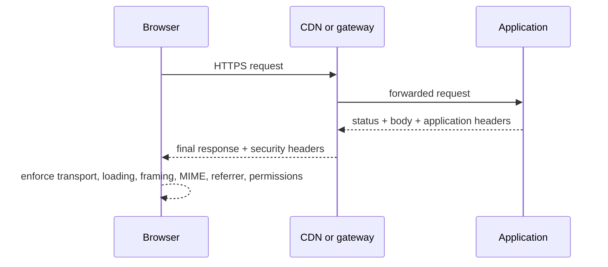

<TLDR>
  <TLDRCell label="what">
    安全响应头是服务器随响应发送的浏览器策略，用于约束资源加载、页面嵌入、传输方式、类型解释、来源信息和敏感功能。
  </TLDRCell>
  <TLDRCell label="trap">
    复制一套“最严格”的头并不等于安全；宽泛 CSP 会失去防护价值，错误的 HSTS 或权限策略还可能让站点无法访问或功能失效。
  </TLDRCell>
  <TLDRCell label="fix">
    按响应类型建立最小策略，由一个明确的部署层负责写入，在报告模式和真实浏览器中验证后再逐步收紧。
  </TLDRCell>
</TLDR>

## 是什么，为什么存在

安全响应头（security response header）是服务器放进 HTTP 响应的字段，浏览器据此执行额外的安全规则。它们不修改服务器已经做出的授权决定，也不会清理不可信输入。它们控制的是浏览器接到响应之后可以加载、执行、发送或暴露什么。

Web 页面会同时处理文档、脚本、样式、图片、表单和嵌入内容。只靠 HTML 与 JavaScript 代码，很难为这些行为建立统一且不可被页面脚本轻易改写的边界。响应头让边界跟随资源到达浏览器，并能覆盖模板、静态资源和错误页面。

这是一层纵深防御。例如，应用仍需从源头阻止 XSS；<Term id="content-security-policy">内容安全策略（Content Security Policy，CSP）</Term>可以在注入发生后限制脚本执行与数据外传。TLS 仍负责连接机密性与完整性；<Term id="strict-transport-security">HTTP 严格传输安全（HTTP Strict Transport Security，HSTS）</Term>则让已获知策略的浏览器不再尝试明文 HTTP。

你会在应用框架、中间件、反向代理、API 网关和 CDN 配置中遇到这些头。最终行为取决于浏览器收到的完整响应，而不是某一层打算发送的配置。因此，策略设计和部署验证必须同时覆盖成功、重定向与错误路径。

常用响应头解决不同问题，不能互相替代：

| 响应头或指令 | 浏览器执行的边界 | 不能替代 |
| --- | --- | --- |
| `Content-Security-Policy` | 限制资源来源、脚本执行、表单目标和页面祖先 | 输出编码与输入校验 |
| `Strict-Transport-Security` | 在有效期内把该主机的 HTTP 访问升级为 HTTPS | TLS 证书与安全 TLS 配置 |
| `X-Content-Type-Options: nosniff` | 对脚本和样式等请求拒绝不匹配的 MIME 类型 | 正确的 `Content-Type` |
| `Referrer-Policy` | 控制请求携带多少 `Referer` 信息 | 避免把秘密放入 URL |
| `Permissions-Policy` | 限制文档与嵌入内容可用的浏览器功能 | 用户授权与操作系统权限 |
| CSP `frame-ancestors` | 限制哪些祖先页面可以嵌入当前页面 | 被嵌入页面自身的授权 |
| `X-Frame-Options` | 为 `DENY` 或 `SAMEORIGIN` 提供较旧的嵌入控制 | CSP 的多来源嵌入策略 |

## 工作原理

服务器在状态行和响应头之后发送响应主体。浏览器先解析适用于该响应的策略，再决定怎样处理主体以及后续子资源请求。不同头在不同阶段生效，所以“头已经存在”只是检查起点，值、响应类型和浏览器上下文同样重要。



### CSP 的决策顺序

CSP 由分号分隔的指令组成。`script-src`、`style-src`、`img-src` 和 `connect-src` 等获取指令分别约束脚本、样式、图片和网络连接。缺少专用获取指令时，许多资源类型回退到 `default-src`；`frame-ancestors`、`base-uri` 与 `form-action` 不使用这项回退，必须按需要显式设置。

来源表达式越宽，浏览器允许的内容越多。`'self'` 表示与受保护文档同源，`'none'` 表示不允许任何来源。仅允许 `https:` 或宽泛主机通配符，仍可能信任一个可被攻击者利用的来源；策略必须从应用真实依赖反推，不能从“允许整个互联网”开始。

默认情况下，严格的 `script-src` 会阻止内联脚本。需要保留内联脚本时，可以给本次响应生成不可预测且只使用一次的<Term id="csp-nonce">CSP nonce</Term>，同时把同一个值放进策略与获准的 `<script>` 元素。Nonce 只证明浏览器可以执行该元素，不会替代对插入其中的数据进行安全序列化。

### 其他头各自维护状态

HSTS 是浏览器按主机保存的有期限状态。浏览器只接受安全 HTTPS 响应中的 HSTS 头；后续访问匹配主机时，它会先把 HTTP URL 升级为 HTTPS，再发出网络请求。`includeSubDomains` 扩大到子域名，`preload` 表示站点希望进入浏览器预加载机制，但单独写出这个令牌不会自动完成预加载登记。

`X-Content-Type-Options: nosniff` 要与准确的 `Content-Type` 一起使用。它不是 MIME 类型探测器的替代品，而是要求浏览器在相关上下文中不要把错误类型的响应当成脚本或样式执行。上传内容还需要安全文件名、独立来源、下载语义和服务端验证。

`Referrer-Policy` 决定导航或子资源请求中的 `Referer` 粒度。`strict-origin-when-cross-origin` 在同源请求中保留完整 URL，跨源时只发送源，并在从 HTTPS 降级到 HTTP 时不发送来源。敏感页面可以使用 `no-referrer`，但最重要的规则仍是不要把令牌、密码或个人数据放进 URL。

`Permissions-Policy` 按功能名声明允许列表，例如 `camera=()` 禁用摄像头，`geolocation=(self)` 只允许同源使用地理位置。它限制的是功能是否可供文档使用，实际调用仍可能触发用户授权。浏览器不认识的功能名可能被忽略，因此要针对目标浏览器测试最终行为。

### 策略所有权

一个响应可能经过应用、中间件、反向代理和 CDN。若多层同时写同一个头，可能产生重复字段、被覆盖的指令或只在部分状态码上生效的配置。团队应指定一个最终策略所有者，并把其他层的责任写清楚，例如应用提供每次响应的 nonce，边缘层统一补充静态头。

CSP 的多个字段不会简单地合并为一条更宽松策略。浏览器会分别执行每条策略，结果通常更严格；然而运维人员很难从多层输出中判断真实意图。检查最终线上的响应，比只测试框架配置对象更可靠。

## 示例

### 生成一套基线策略

这个纯函数为普通 HTML 响应生成最小基线。示例故意没有加入 `includeSubDomains` 或 `preload`，因为这两项必须先审计整个域名空间。真实应用还要按资源清单补充 CSP 来源，并为 API、下载和静态资源定义不同策略。

<Depth level="quick">

```javascript run title="baseline_headers.js"
function buildHeaders({ https = true, embedders = [] } = {}) {
  const ancestors = embedders.length
    ? ["'self'", ...embedders].join(' ')
    : "'none'";

  const headers = {
    'Content-Security-Policy': [
      "default-src 'self'",
      "script-src 'self'",
      "object-src 'none'",
      `frame-ancestors ${ancestors}`,
      "base-uri 'self'",
      "form-action 'self'",
    ].join('; '),
    'Referrer-Policy': 'strict-origin-when-cross-origin',
    'X-Content-Type-Options': 'nosniff',
    'Permissions-Policy': 'camera=(), microphone=(), geolocation=()',
  };

  if (https) {
    headers['Strict-Transport-Security'] = 'max-age=31536000';
  }
  return headers;
}

for (const [name, value] of Object.entries(buildHeaders())) {
  console.log(`${name}: ${value}`);
}
```

```text
Content-Security-Policy: default-src 'self'; script-src 'self'; object-src 'none'; frame-ancestors 'none'; base-uri 'self'; form-action 'self'
Referrer-Policy: strict-origin-when-cross-origin
X-Content-Type-Options: nosniff
Permissions-Policy: camera=(), microphone=(), geolocation=()
Strict-Transport-Security: max-age=31536000
```

</Depth>

`frame-ancestors 'none'` 禁止任何页面嵌入当前页面；确实需要同源或合作方嵌入时，应传入经过审查的完整来源。HSTS 只在 `https` 为真时生成，但部署层还必须保证它只出现在真实 HTTPS 响应中，并正确识别受信代理传来的协议。

### 为每次响应生成 CSP nonce

下面的渲染函数使用 Node 24 的密码学随机源生成 128 位 nonce。输出只检查安全性质，不打印随机秘密，所以重复执行仍能得到稳定、可审查的结果。示例也转义消息中的 `<`，说明 nonce 与数据安全是两条独立边界。

```javascript run title="nonce_csp.js"
import { randomBytes } from 'node:crypto';

function renderPage(message) {
  const nonce = randomBytes(16).toString('base64');
  const policy = [
    "default-src 'self'",
    `script-src 'nonce-${nonce}'`,
    "object-src 'none'",
    "base-uri 'none'",
  ].join('; ');

  // nonce 授权这个元素；转义仍负责保护数据边界。
  const safeMessage = JSON.stringify(message).replaceAll('<', '\\u003c');
  const html = [
    '<!doctype html><meta charset="utf-8">',
    '<p id="status"></p>',
    `<script nonce="${nonce}">`,
    `document.querySelector('#status').textContent = ${safeMessage};`,
    '</script>',
  ].join('\n');
  return { nonce, policy, html };
}

const first = renderPage('</script><script>alert(1)</script>');
const second = renderPage('ready');
console.log('nonce bytes', Buffer.from(first.nonce, 'base64').length);
console.log('policy matches markup', first.policy.includes(`'nonce-${first.nonce}'`) && first.html.includes(`nonce="${first.nonce}"`));
console.log('changes per response', first.nonce !== second.nonce);
console.log('message escaped', first.html.includes('\\u003c/script>'));
```

```text
nonce bytes 16
policy matches markup true
changes per response true
message escaped true
```

生产模板不能把 nonce 固定在构建产物、进程全局变量或可长期缓存的 HTML 中。若 CDN 缓存带 nonce 的页面，策略头和 HTML 必须属于同一个缓存对象，而且每个缓存对象的 nonce 不能被攻击者预测。包含用户数据的 HTML 通常还需要更严格的缓存规则。

### 审计所有响应路径

这项测试在路由判断前设置公共策略，再请求成功与未找到路径。它证明两种响应都携带目标字段，但没有声称本地 HTTP 服务会执行 HSTS 或完整浏览器策略；原始头检查之后仍需真实浏览器测试。

```javascript run title="header_audit.js"
import { createServer } from 'node:http';

const secureHeaders = {
  'Content-Security-Policy': "default-src 'self'; object-src 'none'; frame-ancestors 'none'",
  'Referrer-Policy': 'strict-origin-when-cross-origin',
  'X-Content-Type-Options': 'nosniff',
  'Permissions-Policy': 'camera=(), microphone=(), geolocation=()',
};
const required = Object.keys(secureHeaders).map((name) => name.toLowerCase());

const server = createServer((request, response) => {
  for (const [name, value] of Object.entries(secureHeaders)) {
    response.setHeader(name, value);
  }
  if (request.url === '/ok') {
    response.writeHead(200, { 'Content-Type': 'text/plain; charset=utf-8' });
    response.end('ready');
    return;
  }
  response.writeHead(404, { 'Content-Type': 'text/plain; charset=utf-8' });
  response.end('not found');
});

server.listen(0, '127.0.0.1', async () => {
  const { port } = server.address();
  for (const path of ['/ok', '/missing']) {
    const response = await fetch(`http://127.0.0.1:${port}${path}`);
    const missing = required.filter((name) => !response.headers.has(name));
    console.log(path, response.status, `missing=${missing.join(',') || 'none'}`);
  }
  server.close();
});
```

```text
/ok 200 missing=none
/missing 404 missing=none
```

部署测试还应触发认证失败、请求过大、限流和上游故障等响应。这些响应可能由网关生成，根本不会经过应用中间件。若前端需要读取错误状态，必须同时检查相应的 CORS 策略，但 CORS 与这里的安全响应头仍是不同配置。

## 陷阱

### 用宽松值换取“兼容”

> [!PITFALL]
> 生成的配置为了让页面立即工作，把 `script-src` 设为 `* 'unsafe-inline' 'unsafe-eval'`，或把未知第三方域名整体加入允许列表。头虽然存在，脚本执行边界却接近失效。

**修复方法：** 从浏览器实际加载的资源清单建立策略。优先把脚本放入受控外部文件，确需内联时使用每次响应的 nonce 或经过审核的 hash。每个新增来源都要记录所有者、用途、资源类型与移除条件，并在报告模式中观察后再执行。

### 重用 nonce 或只改策略一侧

> [!PITFALL]
> 应用在进程启动时生成一个 nonce，长期复用；或者 CDN 更新 CSP 头却继续发送旧 HTML。攻击者一旦取得可复用值，或头与元素不匹配，策略就会失去预期保护或直接破坏页面。

**修复方法：** 在渲染每个响应时生成不可预测 nonce，并通过同一个请求上下文传给策略构造器与模板。测试值每次变化且两侧严格相等。审计页面缓存，确保不会把一个用户化响应及其 nonce 错误复用于其他请求。

### 过早扩大 HSTS 范围

> [!PITFALL]
> 配置直接复制一年有效期、`includeSubDomains` 和 `preload`，但遗留子域名、邮件入口或恢复站点还不能稳定使用 HTTPS。浏览器记住策略后，这些主机可能在有效期内无法访问。

**修复方法：** 先清点所有子域名和证书自动续期路径，以短 `max-age` 验证，再逐步延长。只有整个域名空间满足预加载要求且团队接受较慢的撤销流程时，才添加 `includeSubDomains` 并提交预加载。回滚头只有浏览器再次通过 HTTPS 收到后才生效。

### 只保护成功响应

> [!PITFALL]
> 路由处理器为 `200` 响应设置头，但框架生成的 `404`、认证中间件的 `401`、代理的 `413` 和上游的 `502` 没有相同策略。浏览器最终收到的错误页面因而处于另一套边界中。

**修复方法：** 在能覆盖所有响应的公共层设置静态头，并为动态 nonce 保留明确接口。逐一触发应用与基础设施的重要状态码，使用原始 HTTP 检查最终字段，再用浏览器确认 CSP、嵌入和权限行为。

### 混淆嵌入方向

> [!PITFALL]
> 配置用 CSP `frame-src` 试图阻止别人嵌入当前页面，或者只写 `X-Frame-Options: SAMEORIGIN`，却又需要允许多个指定合作方。前者控制当前页面可以加载的 frame，后者表达不了多来源允许列表。

**修复方法：** 用 `frame-ancestors` 控制谁能嵌入当前页面，用 `frame-src` 控制当前页面能加载哪些 frame。无需嵌入时选择 `frame-ancestors 'none'`；需要合作方时列出准确来源。可保留兼容性的 `X-Frame-Options`，但不能让它与 CSP 意图冲突。

### 继续启用过时的头

> [!PITFALL]
> 旧教程或生成代码仍添加 `X-XSS-Protection: 1; mode=block`、`X-Frame-Options: ALLOW-FROM` 或已经不存在的 Permissions Policy 功能名，并把“没有报错”当成已经防护。

**修复方法：** 删除无法解释且没有目标浏览器支持依据的遗留字段。使用 CSP 约束脚本执行与 `frame-ancestors` 表达嵌入来源，只保留 `DENY` 或 `SAMEORIGIN` 形式的 X-Frame-Options 兼容值。用浏览器测试功能行为，而不是根据头的数量评分。

<Depth level="deep">

## 渐进式部署与证据

CSP 最适合按观察、修正、执行的顺序部署。先建立与目标策略相同的 `Content-Security-Policy-Report-Only`，在真实流量和测试环境中收集违规，同时保留现有执行策略。报告模式只记录本来会被阻止的行为，不会保护用户，因此不能无限期停在这一步。

浏览器控制台适合开发调试，CSP 报告端点适合发现更多页面路径。报告内容来自客户端，字段和 URL 都可能被攻击者控制；接收端要限制主体大小与速率、验证内容类型、转义日志并避免把查询参数中的秘密写入监控系统。违规数量也不是风险分数，同一个浏览器扩展或旧页面可能制造大量噪声。

报告稳定后，把策略放入小范围执行并保留可观测性。每次只缩小一个来源或移除一项关键字，测试主要页面、登录、支付、错误处理和后台任务界面。回滚应恢复上一份经过审核的策略，而不是临时添加 `*` 或 `'unsafe-inline'`。

建议用一份版本化策略清单记录以下事实：

1. 哪个响应类别使用该策略，以及最终由哪一层写入。
2. 每个来源和关键字对应的产品功能、所有者与到期条件。
3. 报告模式与执行模式的测试证据，包括被故意阻止的样本。
4. 缩短或撤销 HSTS、移除第三方来源和关闭功能时的回滚步骤。

### CSP 不是单一模板

营销页面、登录页面、富文本编辑器和 JSON API 的资源需求不同。给所有响应套用一条策略，通常会迫使团队不断放宽它。按响应类别共享经过审核的基线，再让少数路由显式增加最小例外，更容易看出一次变更扩大了什么权限。

JSON API 不会执行页面脚本，但仍应发送正确的 `Content-Type` 和 `nosniff`，并避免被误当成可下载 HTML。文件下载要同时考虑媒体类型、`Content-Disposition`、用户可控文件名和托管来源。安全响应头不能修复路径遍历、恶意文件内容或错误授权。

### 报告策略与执行策略

同一个响应可以同时携带报告策略和执行策略，用于观察下一步收紧会影响什么。两者必须明确命名和版本化，否则排障人员很容易把控制台中的报告违规误认为实际阻止。测试应分别断言当前执行边界与候选边界，而不是只检查字段存在。

CSP 报告不能证明所有允许行为都安全。策略允许的同源脚本若来自可写上传路径，仍可能执行；获准第三方脚本被攻破后，也在策略边界内。来源审查要继续检查内容所有权、发布权限、完整性与供应链。

## HSTS 的状态与回滚

HSTS 与普通无缓存响应头不同，因为浏览器会在 `max-age` 秒内保留状态。先前收到的较长有效期不会因为服务器暂时停止发送该头而立即消失。要主动清除，浏览器需要通过有效 HTTPS 连接收到 `max-age=0`，而无法连接的用户恰恰收不到这条回滚指令。

`includeSubDomains` 把承诺扩展到当前主机下的子域名。若从顶级站点发送，未来新建的子域名也必须从第一次访问起提供有效 HTTPS。DNS、证书签发、续期、紧急切换和第三方托管因此都属于 HSTS 变更评审范围。

预加载解决首次访问前还没有 HSTS 状态的窗口，但它把域名放入浏览器发布的数据中。响应里的 `preload` 令牌只是提交要求的一部分，不会自行加入列表。移除需要提交申请并等待浏览器数据更新，所以预加载是域名级长期承诺，不是一次普通的头值调整。

### 缓存与动态策略

静态安全头适合由边缘层统一添加；包含 nonce、用户数据或路由特例的 CSP 必须与生成它的响应保持一致。若边缘缓存 HTML，却在另一步重新生成 CSP，nonce 会不匹配。若缓存键没有覆盖策略差异，一个权限更宽的页面还可能被复用于权限更窄的路径。

策略测试应经过与生产相同的 CDN、压缩、重定向和错误处理链。直接访问源站只能定位应用输出，不能证明最终行为。记录每一层添加、删除或规范化的字段，出现重复 CSP 或冲突 frame 策略时才能找到责任边界。

## 策略传递细节

HTTP 字段名不区分大小写，但不同指令值有各自的语法。不要用通用“规范化器”把所有安全字段转成小写或用逗号连接。CSP 来源可能包含区分大小写的 URL 路径，而多个策略字段表示多条分别执行的策略，不是一条逗号分隔的允许列表。

响应头是传递 CSP 的首选位置，因为它在受保护文档处理前到达，并支持完整策略模型。静态托管无法配置响应时，`<meta http-equiv="Content-Security-Policy">` 可以提供部分能力，但它只支持一部分 CSP，也不能提供 HSTS、X-Content-Type-Options 或其他仅属于 HTTP 的控制。

尤其不能用 meta 传递的 CSP 声称已经提供嵌入保护。Meta 策略中的 `frame-ancestors` 会被忽略，攻击者可以在文档标记建立边界之前开始嵌入。应在 HTTP 响应中发送嵌入策略，并从真正不同的源验证结果。

响应头还必须覆盖正确范围。HTTP 响应中的 HSTS 字段会被忽略；图片响应上的 CSP 不会反过来保护加载它的文档；嵌入文档的 Permissions Policy 与外层页面 `allow` 属性控制的上下文也不同。审查任何配置时，都要明确受保护的是哪个响应。

为每个生成响应头的部署层记录以下传递检查：

- 上游值已经存在时，该层会添加、替换、追加还是删除字段。
- 哪些状态码、内容类型、主机名和协议会收到该字段。
- 重定向、缓存变体、自动生成错误与直接源站响应是否不同。
- 哪项浏览器观察能证明策略被执行，而不只是字段存在。

这些检查应成为发布断言，不是一次性的配置笔记。框架升级、CDN 规则调序或新增静态托管路径，都可能在不修改源策略对象的情况下改变最终传递结果。

## 浏览器验证矩阵

原始 HTTP 测试回答“最终发送了什么”，浏览器测试回答“用户代理怎样执行”。两者都需要。下面的矩阵为每项策略选择可观察的正向和负向证据。

| 边界 | 正向测试 | 负向测试 |
| --- | --- | --- |
| CSP 脚本 | 带正确 nonce 的脚本运行 | 无 nonce 的内联脚本被阻止并产生违规 |
| CSP 连接 | 允许的 API 请求成功 | 未列出的目标被 `connect-src` 阻止 |
| 页面嵌入 | 获准祖先可加载页面 | 攻击者来源的 frame 无法显示页面 |
| MIME | 正确 JavaScript 类型可加载 | 把文本类型响应作为脚本加载时失败 |
| Permissions Policy | 获准页面可请求目标功能 | 被禁用的 frame 无法使用该功能 |
| HSTS | 已记录策略后 HTTP URL 被内部升级 | 证书错误不会退回明文连接 |

测试失败时先区分网络响应和浏览器执行。CSP 控制台消息、Network 面板、frame 加载结果与功能 API 错误各自提供不同证据。自动化测试可以固定主要回归路径，但新浏览器版本、扩展与企业策略仍可能改变环境，因此发布验证要保留一个干净浏览器配置作为对照。

### 防护边界之外

安全响应头不能代替输出编码、参数化查询、服务端授权、CSRF 防护、TLS 配置或依赖治理。CSP 也不是允许应用继续拼接不可信 HTML 的许可证；绕过点、受信来源中的弱点和已授权脚本都可能让攻击继续发生。

同样，头缺失不一定代表所有响应都应添加同一字段。纯 API、公共静态资源、下载文件和可嵌入组件的需求不同。先写威胁模型和响应分类，再决定哪些头适用、由谁管理以及如何证明其行为。

</Depth>

<Checkpoint id="security/security-headers" />

## 延伸阅读

- [MDN：Content Security Policy](https://developer.mozilla.org/en-US/docs/Web/HTTP/Guides/CSP)
- [MDN：Strict-Transport-Security](https://developer.mozilla.org/en-US/docs/Web/HTTP/Reference/Headers/Strict-Transport-Security)
- [MDN：X-Content-Type-Options](https://developer.mozilla.org/en-US/docs/Web/HTTP/Reference/Headers/X-Content-Type-Options)
- [MDN：Permissions Policy](https://developer.mozilla.org/en-US/docs/Web/HTTP/Guides/Permissions_Policy)
- [W3C：Content Security Policy Level 3](https://www.w3.org/TR/CSP3/)
