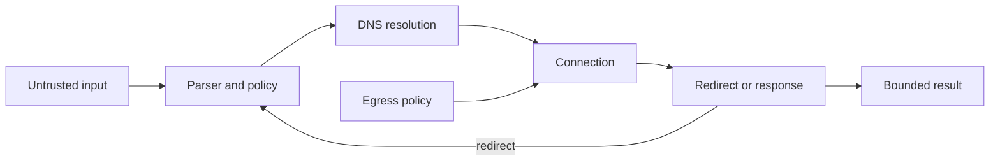

<TLDR>
  <TLDRCell label="what">
    Server-side request forgery lets untrusted input influence a request made from your server, so the request crosses boundaries the caller cannot cross directly.
  </TLDRCell>
  <TLDRCell label="trap">
    Checking a URL string once is not enough: DNS, redirects, alternate address forms, and the actual connection can change the destination.
  </TLDRCell>
  <TLDRCell label="fix">
    Prefer fixed service identifiers over arbitrary URLs; otherwise validate every hop, bind the approved address to the connection, and restrict egress independently.
  </TLDRCell>
</TLDR>

## What it is and why it exists

<Term id="server-side-request-forgery">Server-side request forgery (SSRF)</Term> is a vulnerability in which a caller influences where a server-side component sends a network request. The dangerous authority comes from the server: its network location, service identity, credentials, and access to destinations that are not exposed to the caller.

The vulnerable feature is often legitimate. Link previews, remote-image imports, webhooks, PDF renderers, feed readers, repository integrations, and URL-based file uploads all need to retrieve or contact something. SSRF appears when the feature accepts more destination authority than its product contract requires.

The input does not have to be a field literally named `url`. A hostname, webhook target, redirect location, document containing remote resources, or user-controlled part of a proxy route can reach the same request sink. Trace data into HTTP clients, SDK download helpers, headless browsers, image libraries, and document converters.

An ordinary SSRF response may return internal data to the attacker. In blind SSRF, the application hides the response, but timing, error differences, DNS lookups, or state-changing requests can still reveal reachability or cause effects. “We do not return the body” therefore changes the observation channel, not the trust boundary.

The immediate targets include loopback listeners, private networks, link-local services, Unix-host integrations exposed through HTTP gateways, and control planes reachable only from the workload network. In cloud environments, instance metadata is a well-known target because it may expose identity or configuration to the instance.

SSRF is not limited to stealing a response. A request can scan reachable services, invoke an internal state-changing endpoint, spend money through a metered API, download an oversized body, or hold sockets open. The defense must constrain both destination authority and resource consumption.

The safest design question is narrower than “is this URL safe?” Ask which remote service the feature needs, which operation it may perform, and which caller-controlled values belong only in data fields or path segments. That produces a small contract you can enforce and test.

## How it works

An SSRF path has three actors: the external caller, a server-side requester, and a destination visible to that requester. The application accidentally transfers part of its outbound authority from policy-controlled code to caller-controlled data.



The parser gives one interpretation of the input. Policy then decides whether the scheme, credentials, hostname, port, and operation are allowed. Handwritten substring checks are not parsers: `trusted.example.attacker.test` contains a trusted-looking label but is not a subdomain of `trusted.example`.

Hostname policy and network policy answer different questions. An exact hostname allowlist identifies an approved service name. DNS resolution yields one or more addresses for a particular attempt, and every usable answer must satisfy the address policy.

Address policy normally rejects more than RFC 1918 private IPv4 ranges. It also accounts for loopback, link-local, unspecified, multicast, IPv6 unique-local and link-local space, IPv4-mapped IPv6 forms, and environment-specific control-plane ranges. Maintain this set as policy data rather than scattering regular expressions through handlers.

Validation must govern the connection that actually occurs. If code resolves a host for checking but the HTTP client resolves it again, the two lookups can return different answers. This time-of-check/time-of-use gap enables <Term id="dns-rebinding">DNS rebinding</Term> and ordinary DNS changes to bypass the decision.

A safe connection layer uses the approved address for the socket while preserving the original hostname for TLS certificate verification, Server Name Indication, and the HTTP authority. That is subtle enough to justify a maintained outbound proxy or a client integration designed for custom lookup and address pinning. Replacing the hostname in an HTTPS URL with an IP is not an equivalent implementation.

Redirects begin a new destination decision. Resolve a relative `Location` against the current URL, then repeat scheme, host, port, address, credential, and method policy before the next connection. Automatic redirect following skips that control point unless the client exposes a policy hook that performs the full check.

The request itself also carries authority. Strip inbound `Authorization`, `Cookie`, proxy, and forwarding headers instead of copying the caller's header set. Fix or allowlist the method, request headers, and body shape that the integration needs.

The response is untrusted content from an untrusted dependency even when its destination was approved. Enforce connection and overall deadlines, redirect count, byte limit, content type, decompression limit, and concurrency budget. Stream under a byte counter when the body can be large; a `Content-Length` header alone is not proof of the bytes delivered.

Network controls provide a separate boundary. <Term id="egress-filtering">Egress filtering</Term> can force the workload through a controlled proxy or deny routes to internal and metadata networks. It limits damage when application checks are wrong, but it does not define which public services or billable operations the product intended to allow.

Cloud metadata hardening is another layer. For example, requiring AWS IMDSv2 makes metadata access require a session token obtained with a specific request flow. That reduces exposure for some SSRF shapes, but it does not repair arbitrary outbound requests or protect other internal services.

The complete decision sequence is:

1. Replace a caller-supplied URL with a server-side service identifier where the product permits it.
2. Parse once with the same URL semantics used by the request client.
3. Enforce scheme, exact hostname, effective port, credentials, method, headers, and path contract.
4. Resolve the hostname and reject the attempt if any selectable answer violates address policy.
5. Bind an approved answer to the connection while retaining hostname-based TLS verification.
6. Repeat the destination decision after every redirect and stop at a small fixed hop count.
7. Enforce time, byte, decompression, concurrency, and response-type limits.
8. Backstop the code with outbound network policy and narrow workload identity permissions.

## Examples

### Build a destination from a service contract

The strongest fix removes destination choice from input. This avatar feature owns the scheme and host; the account identifier is encoded as one path segment rather than concatenated into a URL.

<Depth level="quick">

```javascript run title="build_destination.js"
const SERVICES = new Map([
  ['avatar', new URL('https://media.example/')],
]);

function avatarURL(accountId) {
  const base = SERVICES.get('avatar');
  const segment = encodeURIComponent(accountId);
  const target = new URL(`/v1/accounts/${segment}/avatar`, base);

  // This invariant protects future refactors of the path builder.
  if (target.origin !== base.origin) throw new Error('origin changed');
  return target.href;
}

for (const accountId of ['acct-42', '../../admin?role=root']) {
  console.log(avatarURL(accountId));
}
```

```text
https://media.example/v1/accounts/acct-42/avatar
https://media.example/v1/accounts/..%2F..%2Fadmin%3Frole%3Droot/avatar
```

</Depth>

The second input remains one encoded segment. It cannot replace the destination authority or turn the rest into a query string. The origin assertion is defense against a later refactor; the primary design property is that callers never provide a hostname.

This pattern also improves authorization and observability. A service identifier can map to an exact method, route template, credential, quota, and response schema. Logs can record the identifier without retaining an attacker-supplied URL containing credentials or sensitive query data.

### Classify resolved addresses

When arbitrary public URLs are a real requirement, inspect concrete DNS answers using an IP parser and reviewed network ranges. This small example demonstrates the mechanics with Node's `net.BlockList`; production policy must include every special-purpose and environment-specific range relevant to its deployment.

```javascript run title="classify_addresses.js"
import net from 'node:net';

const denied = new net.BlockList();
for (const [network, prefix] of [
  ['0.0.0.0', 8], ['10.0.0.0', 8], ['100.64.0.0', 10],
  ['127.0.0.0', 8], ['169.254.0.0', 16], ['172.16.0.0', 12],
  ['192.168.0.0', 16], ['224.0.0.0', 4], ['240.0.0.0', 4],
]) denied.addSubnet(network, prefix, 'ipv4');

denied.addAddress('::', 'ipv6');
denied.addAddress('::1', 'ipv6');
for (const [network, prefix] of [
  ['fc00::', 7], ['fe80::', 10], ['ff00::', 8],
]) denied.addSubnet(network, prefix, 'ipv6');

function decision(address) {
  const version = net.isIP(address);
  if (version === 0) return 'invalid';
  if (address.toLowerCase().startsWith('::ffff:')) return 'blocked';
  const family = version === 4 ? 'ipv4' : 'ipv6';
  return denied.check(address, family) ? 'blocked' : 'allowed';
}

for (const address of [
  '93.184.216.34', '127.0.0.1', '169.254.169.254',
  '::1', '::ffff:127.0.0.1', 'not-an-address',
]) console.log(`${address}: ${decision(address)}`);
```

```text
93.184.216.34: allowed
127.0.0.1: blocked
169.254.169.254: blocked
::1: blocked
::ffff:127.0.0.1: blocked
not-an-address: invalid
```

Reject invalid text and any prohibited answer; do not silently keep only an allowed address from a mixed DNS response. The request layer must then connect to an address that passed this decision rather than resolving the hostname again.

The listed prefixes teach the shape of the policy, not a complete Internet routing registry. Generate or centrally maintain the production set from authoritative registries, add deployment-specific service and control-plane networks, and cover IPv4 and IPv6 in tests.

### Revalidate every redirect

This example uses a fake resolver and transport so it runs without network access. It abbreviates the address-range policy shown above and focuses on the control flow: inspection happens before the initial request and again before a redirected request.

```javascript run title="redirect_policy.js"
import net from 'node:net';
const allowedHosts = new Set(['start.example', 'cdn.example']);
const dnsAnswers = new Map([
  ['start.example', ['203.0.113.10']],
  ['cdn.example', ['203.0.113.20']],
]);
const responses = new Map([
  ['https://start.example/photo', { status: 302, location: 'https://cdn.example/p.jpg' }],
  ['https://cdn.example/p.jpg', { status: 200, body: 'image/jpeg' }],
  ['https://start.example/admin', { status: 302, location: 'http://127.0.0.1/admin' }],
]);
function inspect(target) {
  if (target.protocol !== 'https:' || !allowedHosts.has(target.hostname)) {
    throw new Error(`destination rejected: ${target.href}`);
  }
  const addresses = dnsAnswers.get(target.hostname) ?? [];
  if (addresses.length === 0 || addresses.some((ip) => net.isIP(ip) === 0)) {
    throw new Error(`DNS answer rejected: ${target.hostname}`);
  }
}
function fetchMock(target) {
  const response = responses.get(target.href);
  if (!response) throw new Error(`no response: ${target.href}`);
  return response;
}
function fetchWithPolicy(start, maxRedirects = 2) {
  let target = new URL(start);
  for (let hop = 0; hop <= maxRedirects; hop += 1) {
    inspect(target);
    const response = fetchMock(target);
    if (response.status < 300 || response.status >= 400) return response.body;
    if (hop === maxRedirects) throw new Error('redirect limit exceeded');
    target = new URL(response.location, target);
  }
}
for (const path of ['photo', 'admin']) {
  try { console.log(`${path}: ${fetchWithPolicy(`https://start.example/${path}`)}`); }
  catch (error) { console.log(`${path}: ${error.message}`); }
}
```

```text
photo: image/jpeg
admin: destination rejected: http://127.0.0.1/admin
```

The first chain moves between two approved HTTPS hosts. The second begins at an approved host but is stopped before the redirected connection. In real code, `inspect` must also apply the complete address policy and pass its chosen address into the connection layer.

Relative redirects need the same treatment. `new URL(location, current)` makes the resolution rule explicit, after which the resulting URL receives an independent policy decision. Do not compare the raw `Location` string with prefixes.

### Bound the response while streaming

An approved destination can still exhaust resources. This reader accepts one exact media type and cancels as soon as the observed bytes cross its limit, rather than buffering first and checking afterward.

```javascript run title="bounded_response.js"
function mockResponse(parts) {
  const encoder = new TextEncoder();
  const body = new ReadableStream({
    start(controller) {
      for (const part of parts) controller.enqueue(encoder.encode(part));
      controller.close();
    },
  });
  return new Response(body, {
    headers: { 'content-type': 'application/json' },
  });
}

async function readBounded(response, maxBytes) {
  if (response.headers.get('content-type') !== 'application/json') {
    throw new Error('content type rejected');
  }
  const reader = response.body.getReader();
  const chunks = [];
  let total = 0;
  while (true) {
    const { done, value } = await reader.read();
    if (done) break;
    total += value.byteLength;
    if (total > maxBytes) {
      await reader.cancel();
      throw new Error(`body exceeds ${maxBytes} bytes`);
    }
    chunks.push(Buffer.from(value));
  }
  return Buffer.concat(chunks).toString('utf8');
}

for (const parts of [['{"ok":', 'true}'], ['{"data":"', '0123456789', '"}']]) {
  try { console.log(await readBounded(mockResponse(parts), 12)); }
  catch (error) { console.log(error.message); }
}
```

```text
{"ok":true}
body exceeds 12 bytes
```

Production code also needs a total deadline, an idle-read deadline, decompression accounting, and a concurrency budget. Apply the byte limit to the representation whose cost matters; a small compressed transfer can expand into a much larger decoded body.

## Pitfalls

> [!PITFALL]
> A denylist of strings such as `localhost`, `10.`, and `169.254.169.254` looks broad but operates before canonical URL and IP parsing. Alternate textual forms, IPv6, user-info syntax, or parser disagreement can move the effective destination outside the check.
>
> **Fix:** minimize caller choice, parse with the client-compatible parser, compare exact normalized hostnames, parse every resolved IP, and default to rejection when any step is ambiguous.

> [!PITFALL]
> Code resolves a hostname, approves the answer, and then passes the original URL to a client that performs its own lookup. The checked address and connected address are not guaranteed to match.
>
> **Fix:** bind an approved address to the socket through a supported lookup hook or outbound proxy, while preserving the original hostname for TLS and HTTP. Test that the resolver cannot change the connected address after approval.

> [!PITFALL]
> An HTTP client follows redirects automatically after only the first URL passed policy. An approved public endpoint can then redirect to loopback, a private service, or a disallowed port.
>
> **Fix:** disable automatic redirects or install a hook that reruns the full policy for every hop. Resolve relative locations correctly, cap the hop count, and decide how each redirect status affects the method and body.

> [!PITFALL]
> A proxy route forwards the inbound header object to the outbound request. Internal credentials, cookies, forwarding headers, and tracing data then cross into a destination selected by the caller.
>
> **Fix:** construct outbound headers from a small allowlist, keep service credentials bound to fixed service identities, and never let a caller choose both the destination and the credential sent there.

> [!PITFALL]
> Destination checks pass, so the implementation buffers the entire response and trusts its declared media type and size. A remote endpoint can return an endless stream, compressed expansion, or content that a later parser treats as active input.
>
> **Fix:** enforce deadlines, byte and decompression limits, concurrency budgets, and accepted content types while streaming. Validate the decoded artifact again at the consumer boundary.

> [!PITFALL]
> A team treats metadata hardening or an outbound firewall as the whole SSRF fix. Internal services on allowed routes, public attacker hosts, and expensive external APIs can remain reachable.
>
> **Fix:** combine application destination policy, connection binding, resource limits, egress filtering, workload identity least privilege, and cloud-specific controls. Test each layer independently so one permissive layer is visible.

<Depth level="deep">

## The validation-to-connection boundary

URL policy starts with authority parsing. For HTTP URLs, authority includes the hostname and effective port, while user information can appear before the host. Compare parsed fields, not a displayed or partially decoded string, and reject embedded credentials unless the integration has a narrowly defined reason to use them.

Normalize only through documented parser behavior. Lowercasing a DNS hostname is expected, but repeated manual decoding can create a different string from the one the client ultimately interprets. If two layers use different URL parsers, add differential tests or redesign the interface so untrusted text does not cross both.

An allowlist entry should express an exact boundary. `api.partner.example` and a reviewed set of its subdomains are different policies; implement the latter by checking label boundaries, not suffix text alone. Also decide whether a trailing dot is accepted and normalize it consistently before comparison and DNS lookup.

The effective port matters even when it is omitted. An `https:` URL without a port means the HTTPS default, while `https://host:8443/` names another service boundary. Store allowed scheme-port pairs explicitly instead of assuming a hostname grants every listener on that host.

Literal IP hosts skip ordinary DNS but not address policy. Parse them into a canonical binary family before range checks. Treat IPv4-mapped IPv6 consistently, because libraries differ in whether they expose or normalize the mapped form during lookup and connection.

For DNS names, a response may contain several A and AAAA records. Rejecting only the first answer is unsafe when the connection algorithm can select another. Either reject the entire attempt if any selectable result is forbidden or make the connection consume exactly one approved result under a documented retry policy.

Address approval has a lifetime. Reusing a pooled connection is safe only if that established peer is still within the pool's destination identity and policy; opening a new socket requires a new resolution decision. Long DNS caches trade rebinding resistance against stale routing and should not replace connection binding.

TLS adds a second identity check. The approved IP says where the socket may go; certificate verification says which hostname the peer proves it serves. Secure HTTPS needs both, plus the original hostname as SNI when required. Disabling certificate verification to make IP pinning work trades SSRF defense for machine-in-the-middle exposure.

Proxies change where enforcement belongs. With an HTTP or service-mesh egress proxy, the application may connect only to the proxy while asking it to reach the target hostname. The proxy must therefore apply destination and DNS policy, and the application must be unable to bypass it through direct routes.

Retries are new attempts, not permission to loosen policy. A retry may resolve a new address, reuse a connection, or change proxy state. Define which events cause revalidation and keep the same destination, credential, and resource budget across attempts.

## Redirects, parsers, and secondary fetches

A redirect can change every security-relevant field. Besides hostname, it can change scheme, port, path, user information, and sometimes the request method under client-specific redirect behavior. Treat it as fresh input produced by the previous response.

Credentials must not follow merely because a library preserved headers. Even between approved hosts, each credential should have an audience and a service binding. Build headers again for the next hop after policy identifies the destination service.

Some fetches are indirect. An HTML-to-PDF renderer may request images, fonts, stylesheets, frames, and scripts found in a document. Validating only the top-level page URL leaves every subresource as another destination channel.

For renderers and headless browsers, intercept all request types or run the component inside a network sandbox whose only route is a policy-enforcing proxy. Disable unnecessary scripting and protocols, cap navigation and subresource counts, and treat the generated document as untrusted output.

Image and archive tooling may delegate remote access to codecs or helper programs. Inventory whether each library accepts URLs, local paths, redirects, embedded references, or external entities. The same policy should cover every network-capable layer, not only explicit `fetch()` calls found by text search.

Webhook registration and webhook delivery are separate attempts. A host that resolved publicly during registration may resolve differently at delivery time. Validate and bind at each delivery, and use a challenge response to prove endpoint control only as an additional property—not as proof that its future addresses are safe.

Blind SSRF deserves the same controls. A status-only validator, analytics callback, or health checker can still reach internal state-changing endpoints. Normalizing every failure into one public response may reduce an oracle, but destination denial is what prevents the request.

## Containment and verification

Place general-purpose remote fetching in a workload with no route to internal control planes, databases, orchestration APIs, or metadata services. Grant that workload only the outbound destinations and methods its role requires. If arbitrary public access is essential, isolate it from service identities that can turn reachability into privilege.

Egress rules should cover IPv4 and IPv6 and should be verified from the workload namespace, not inferred from a control-plane configuration. DNS, proxies, sidecars, NAT, and service-mesh routes can make the effective path differ from the diagram.

Metadata defenses are provider-specific and evolve independently. Require the strongest supported metadata mode, block metadata routes for workloads that do not need them, and narrow the attached identity's permissions. Never place secrets in instance user data on the assumption that metadata is unreachable.

Observability should record a policy decision without leaking secrets. Useful fields include the server-defined service identifier, normalized destination class, selected address class, redirect count, byte count, duration, and a stable denial reason. Avoid full URLs when query strings or user information can contain credentials.

Alert on denied internal destinations, repeated redirect denials, unusual destination diversity, and sustained resource-limit failures. These signals can indicate attack traffic, but they can also reveal a broken integration or a newly introduced secondary fetcher. Logs support detection; they do not make a permitted request safe.

A focused SSRF test suite includes:

- Exact and near-miss hostnames, trailing dots, embedded credentials, explicit ports, and disallowed schemes.
- IPv4, IPv6, mapped addresses, mixed DNS answers, empty answers, resolver errors, and answers that change between attempts.
- Absolute and relative redirects to allowed and denied destinations, redirect loops, and method-changing status codes.
- Inbound credential headers, service-bound outbound credentials, oversized and compressed bodies, slow streams, and concurrency exhaustion.
- Direct egress attempts that bypass the approved client or proxy, plus metadata and internal-service probes from the deployed workload.

The decisive integration test observes the peer selected for the socket. A unit test that says `validate(url) === true` proves only the validator's return value. Instrument the custom resolver, proxy, or test server so the assertion covers the connected address, TLS hostname, redirect decisions, and byte budget together.

Failure behavior should be closed and boring. A DNS timeout, malformed redirect, unavailable policy proxy, or unrecognized address family should not fall back to an unrestricted client. Return a bounded application error and log a stable internal reason.

</Depth>

<Checkpoint id="security/ssrf" />

## Further reading

- [OWASP Server-Side Request Forgery Prevention Cheat Sheet](https://cheatsheetseries.owasp.org/cheatsheets/Server_Side_Request_Forgery_Prevention_Cheat_Sheet.html)
- [RFC 6890: Special-Purpose IP Address Registries](https://www.rfc-editor.org/rfc/rfc6890)
- [Node.js v24 `net.BlockList`](https://nodejs.org/docs/latest-v24.x/api/net.html#class-netblocklist)
- [AWS EC2 instance metadata options](https://docs.aws.amazon.com/AWSEC2/latest/UserGuide/configuring-instance-metadata-service.html)
