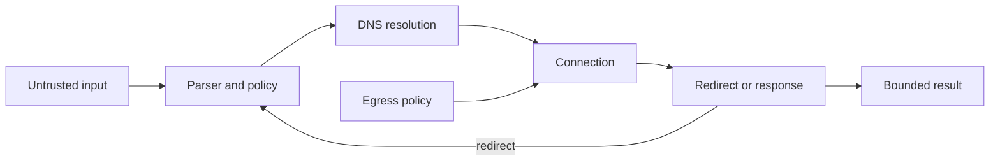

<TLDR>
  <TLDRCell label="what">
    服务端请求伪造让不可信输入影响服务器发出的请求，借用服务器跨越调用方无法直接跨越的边界。
  </TLDRCell>
  <TLDRCell label="trap">
    只检查一次URL字符串并不够；DNS、重定向、地址的其他写法与实际连接都可能改变目标。
  </TLDRCell>
  <TLDRCell label="fix">
    优先用固定服务标识代替任意URL；确实需要URL时，要校验每个跳转、把获准地址绑定到连接，并独立限制出站流量。
  </TLDRCell>
</TLDR>

## 是什么，为什么存在

<Term id="server-side-request-forgery">服务端请求伪造（server-side request forgery，SSRF）</Term>是一类漏洞：调用方能够影响服务端组件向哪里发送网络请求。危险的权限来自服务器，包括它所在的网络位置、服务身份、凭据，以及调用方无法直接访问的目标。

产生漏洞的功能通常本身合理。链接预览、远程图片导入、Webhook、PDF渲染器、订阅阅读器、代码仓库集成和通过URL上传文件，都需要读取或联系远端。功能接受的目标控制权超过产品契约所需时，就会出现SSRF。

输入字段不一定就叫`url`。主机名、Webhook目标、重定向位置、包含远程资源的文档，或代理路由中由用户控制的部分，都可能流入同一个请求接收点。应沿数据流检查HTTP客户端、SDK下载辅助函数、无头浏览器、图片库和文档转换器。

普通SSRF可能直接把内部数据返回给攻击者。盲SSRF不向应用用户暴露响应，但请求耗时、错误差异、DNS查询或具有副作用的请求，仍可暴露可达性或造成状态变化。因此，“不返回响应正文”只是改变观察通道，并没有改变信任边界。

直接目标包括回环监听器、私有网络、链路本地服务、通过HTTP网关暴露的Unix主机集成，以及只有工作负载网络可达的控制面。云环境中的实例元数据是常见目标，因为它可能向实例提供身份或配置信息。

SSRF的危害不限于窃取响应。请求还可以探测可达服务、调用内部写接口、消耗计费API、下载超大响应，或长期占用套接字。因此，防护既要约束目标权限，也要限制资源消耗。

最安全的设计问题不是宽泛的“这个URL安全吗”，而是功能究竟需要哪个远程服务、可以执行什么操作，以及调用方控制的哪些值只应进入数据字段或路径段。这样才能得到一份可执行、可测试的小型契约。

## 工作原理

一条SSRF路径包含三个参与方：外部调用方、服务端请求器，以及该请求器可见的目标。应用错误地把一部分出站权限从策略控制的代码转交给了调用方控制的数据。



解析器为输入给出一种确定解释，策略再决定是否允许协议、凭据、主机名、端口和操作。手写的子字符串检查不是解析器：`trusted.example.attacker.test`虽然含有看似可信的标签，却不是`trusted.example`的子域名。

主机名策略和网络策略回答不同问题。精确主机名允许列表用于识别获准服务名称。DNS解析会为一次请求返回一个或多个地址，每个可能使用的答案都必须符合地址策略。

地址策略通常不能只拒绝RFC 1918定义的私有IPv4地址。它还要覆盖回环、链路本地、未指定、多播、IPv6唯一本地与链路本地地址、IPv4映射的IPv6写法，以及环境特有的控制面网段。应把这些范围集中维护为策略数据，而不是把正则表达式散落在处理器中。

校验必须控制实际发生的连接。如果代码先解析主机用于检查，HTTP客户端随后又自行解析，两次查询可能得到不同答案。这种检查时间与使用时间不一致的问题，会让<Term id="dns-rebinding">DNS重绑定（DNS rebinding）</Term>和普通DNS变化绕过决策。

安全的连接层会用获准地址建立套接字，同时保留原始主机名，用于TLS证书校验、服务器名称指示和HTTP authority。这里的细节足以成为使用成熟出站代理或支持自定义解析与地址固定的客户端集成的理由。直接把HTTPS URL中的主机名替换为IP并不是等价实现。

每次重定向都要重新执行目标决策。先根据当前URL解析相对`Location`，然后在下一次连接前再次检查协议、主机、端口、地址、凭据和方法策略。自动跟随重定向会跳过这个控制点，除非客户端提供能执行完整检查的策略钩子。

请求本身也携带权限。应重新构造出站请求头，不要复制入站的`Authorization`、`Cookie`、代理头和转发头。方法、请求头与请求体形状也应固定，或只允许集成真正需要的小范围值。

即使目标获准，响应仍是来自不可信依赖的不可信内容。应限制连接期限、总期限、重定向次数、字节数、内容类型、解压后大小和并发预算。正文可能很大时，要在流式读取过程中计数；单凭`Content-Length`头不能证明最终传输了多少字节。

网络控制提供另一道独立边界。<Term id="egress-filtering">出站过滤（egress filtering）</Term>可以强制工作负载经过受控代理，或禁止前往内部网络和元数据网络的路由。应用检查出错时，它能限制损害，但不能说明产品原本允许哪些公共服务或计费操作。

云元数据加固也是一层防护。例如，强制使用AWS IMDSv2后，访问元数据需要通过特定请求流程取得会话令牌。这能降低某些SSRF形态的暴露面，却不能修复任意出站请求，也不能保护其他内部服务。

完整的决策顺序如下：

1. 产品允许时，用服务端定义的服务标识代替调用方提供的URL。
2. 使用与请求客户端语义一致的解析器，只解析一次。
3. 对协议、精确主机名、有效端口、凭据、方法、请求头与路径契约执行策略。
4. 解析主机名；只要任何可能选用的答案违反地址策略，就拒绝本次请求。
5. 把获准答案绑定到连接，同时保留基于主机名的TLS校验。
6. 每次重定向后重复目标决策，并在较小的固定跳转次数处停止。
7. 限制时间、字节、解压后大小、并发量与响应类型。
8. 再用出站网络策略和最小化的工作负载身份权限托底。

## 示例

### 从服务契约构造目标

最强的修复方式是让输入无法选择目标。这个头像功能由服务端确定协议和主机；账户标识经过编码，只能成为一个路径段，而不是直接拼接进URL。

<Depth level="quick">

```javascript run title="build_destination.js"
const SERVICES = new Map([
  ['avatar', new URL('https://media.example/')],
]);

function avatarURL(accountId) {
  const base = SERVICES.get('avatar');
  const segment = encodeURIComponent(accountId);
  const target = new URL(`/v1/accounts/${segment}/avatar`, base);

  // 这条不变量可以防住以后对路径构造器的不安全重构。
  if (target.origin !== base.origin) throw new Error('origin changed');
  return target.href;
}

for (const accountId of ['acct-42', '../../admin?role=root']) {
  console.log(avatarURL(accountId));
}
```

```text
https://media.example/v1/accounts/acct-42/avatar
https://media.example/v1/accounts/..%2F..%2Fadmin%3Frole%3Droot/avatar
```

</Depth>

第二个输入仍然只是一个经过编码的路径段。它无法替换目标authority，也无法把后续内容变成查询字符串。来源断言用于防御以后的重构错误；主要设计属性是调用方从未提供主机名。

这种模式也有利于授权与可观测性。一个服务标识可以映射到精确的方法、路由模板、凭据、配额和响应模式。日志可以记录该标识，无需保留可能含凭据或敏感查询数据的攻击者URL。

### 检查解析后的地址

如果产品确实需要接受任意公共URL，就要用IP解析器和经过评审的网段检查具体DNS答案。这个小例子用Node的`net.BlockList`展示机制；生产策略必须补齐部署环境所需的全部特殊用途网段与环境特有网段。

```javascript run title="classify_addresses.js"
import net from 'node:net';

const denied = new net.BlockList();
for (const [network, prefix] of [
  ['0.0.0.0', 8], ['10.0.0.0', 8], ['100.64.0.0', 10],
  ['127.0.0.0', 8], ['169.254.0.0', 16], ['172.16.0.0', 12],
  ['192.168.0.0', 16], ['224.0.0.0', 4], ['240.0.0.0', 4],
]) denied.addSubnet(network, prefix, 'ipv4');

denied.addAddress('::', 'ipv6');
denied.addAddress('::1', 'ipv6');
for (const [network, prefix] of [
  ['fc00::', 7], ['fe80::', 10], ['ff00::', 8],
]) denied.addSubnet(network, prefix, 'ipv6');

function decision(address) {
  const version = net.isIP(address);
  if (version === 0) return 'invalid';
  if (address.toLowerCase().startsWith('::ffff:')) return 'blocked';
  const family = version === 4 ? 'ipv4' : 'ipv6';
  return denied.check(address, family) ? 'blocked' : 'allowed';
}

for (const address of [
  '93.184.216.34', '127.0.0.1', '169.254.169.254',
  '::1', '::ffff:127.0.0.1', 'not-an-address',
]) console.log(`${address}: ${decision(address)}`);
```

```text
93.184.216.34: allowed
127.0.0.1: blocked
169.254.169.254: blocked
::1: blocked
::ffff:127.0.0.1: blocked
not-an-address: invalid
```

无效文本和任何被禁止的答案都应导致拒绝；如果DNS响应同时含允许与禁止地址，不能静默挑出一个允许地址继续。请求层随后必须连接到通过决策的地址，而不是再次解析主机名。

这里列出的前缀用于讲解策略结构，不是一份完整的互联网路由注册表。生产网段应根据权威注册表生成或集中维护，加入部署特有的服务与控制面网络，并同时测试IPv4和IPv6。

### 对每次重定向重新校验

这个例子使用伪造的解析器和传输层，因此无需联网即可运行。它省略了上例已展示的完整地址范围策略，重点呈现控制流：首次请求前执行检查，重定向后的请求前再检查一次。

```javascript run title="redirect_policy.js"
import net from 'node:net';
const allowedHosts = new Set(['start.example', 'cdn.example']);
const dnsAnswers = new Map([
  ['start.example', ['203.0.113.10']],
  ['cdn.example', ['203.0.113.20']],
]);
const responses = new Map([
  ['https://start.example/photo', { status: 302, location: 'https://cdn.example/p.jpg' }],
  ['https://cdn.example/p.jpg', { status: 200, body: 'image/jpeg' }],
  ['https://start.example/admin', { status: 302, location: 'http://127.0.0.1/admin' }],
]);
function inspect(target) {
  if (target.protocol !== 'https:' || !allowedHosts.has(target.hostname)) {
    throw new Error(`destination rejected: ${target.href}`);
  }
  const addresses = dnsAnswers.get(target.hostname) ?? [];
  if (addresses.length === 0 || addresses.some((ip) => net.isIP(ip) === 0)) {
    throw new Error(`DNS answer rejected: ${target.hostname}`);
  }
}
function fetchMock(target) {
  const response = responses.get(target.href);
  if (!response) throw new Error(`no response: ${target.href}`);
  return response;
}
function fetchWithPolicy(start, maxRedirects = 2) {
  let target = new URL(start);
  for (let hop = 0; hop <= maxRedirects; hop += 1) {
    inspect(target);
    const response = fetchMock(target);
    if (response.status < 300 || response.status >= 400) return response.body;
    if (hop === maxRedirects) throw new Error('redirect limit exceeded');
    target = new URL(response.location, target);
  }
}
for (const path of ['photo', 'admin']) {
  try { console.log(`${path}: ${fetchWithPolicy(`https://start.example/${path}`)}`); }
  catch (error) { console.log(`${path}: ${error.message}`); }
}
```

```text
photo: image/jpeg
admin: destination rejected: http://127.0.0.1/admin
```

第一条链在两个获准HTTPS主机之间跳转。第二条链虽然从获准主机开始，却在建立重定向连接前被阻止。真实代码中的`inspect`还必须执行完整地址策略，并把选定地址传给连接层。

相对重定向也要经过同样处理。`new URL(location, current)`明确给出解析规则，结果URL随后接受独立策略决策。不能用前缀比较原始`Location`字符串。

### 流式限制响应

获准目标仍然可能耗尽资源。这个读取器只接受一种精确媒体类型，并在实际读取的字节数越界时立即取消，而不是先把全部内容放进内存再检查。

```javascript run title="bounded_response.js"
function mockResponse(parts) {
  const encoder = new TextEncoder();
  const body = new ReadableStream({
    start(controller) {
      for (const part of parts) controller.enqueue(encoder.encode(part));
      controller.close();
    },
  });
  return new Response(body, {
    headers: { 'content-type': 'application/json' },
  });
}

async function readBounded(response, maxBytes) {
  if (response.headers.get('content-type') !== 'application/json') {
    throw new Error('content type rejected');
  }
  const reader = response.body.getReader();
  const chunks = [];
  let total = 0;
  while (true) {
    const { done, value } = await reader.read();
    if (done) break;
    total += value.byteLength;
    if (total > maxBytes) {
      await reader.cancel();
      throw new Error(`body exceeds ${maxBytes} bytes`);
    }
    chunks.push(Buffer.from(value));
  }
  return Buffer.concat(chunks).toString('utf8');
}

for (const parts of [['{"ok":', 'true}'], ['{"data":"', '0123456789', '"}']]) {
  try { console.log(await readBounded(mockResponse(parts), 12)); }
  catch (error) { console.log(error.message); }
}
```

```text
{"ok":true}
body exceeds 12 bytes
```

生产代码还需要总期限、空闲读取期限、解压计数和并发预算。字节限制应作用于真正产生资源成本的表示；很小的压缩传输也可能展开成大得多的解码正文。

## 陷阱

> [!PITFALL]
> `localhost`、`10.`与`169.254.169.254`等字符串组成的拒绝列表看似全面，实际上在URL与IP规范解析前工作。其他文本形式、IPv6、用户信息语法或解析器分歧都可能让实际目标逃过检查。
>
> **修复：**尽量减少调用方选择，使用与客户端兼容的解析器，精确比较规范主机名，解析每个DNS答案，并在任何步骤存在歧义时默认拒绝。

> [!PITFALL]
> 代码解析并批准主机名后，又把原始URL交给会自行查询DNS的客户端。被检查的地址与真正连接的地址不一定相同。
>
> **修复：**通过受支持的解析钩子或出站代理，把获准地址绑定到套接字，同时保留原始主机名用于TLS与HTTP。还要测试解析器无法在批准后改变连接地址。

> [!PITFALL]
> HTTP客户端只让首个URL通过策略，之后却自动跟随重定向。获准的公共端点可以继续跳转到回环地址、私有服务或未获准端口。
>
> **修复：**关闭自动重定向，或安装能对每次跳转重复完整策略的钩子。正确解析相对位置，限制跳转次数，并明确每种重定向状态对方法和正文的影响。

> [!PITFALL]
> 代理路由把入站请求头对象原样转发给出站请求。内部凭据、Cookie、转发头与追踪数据会因此流向调用方选择的目标。
>
> **修复：**从很小的允许列表构造出站请求头，把服务凭据绑定到固定服务身份，绝不能让调用方同时选择目标和发送给该目标的凭据。

> [!PITFALL]
> 目标检查通过后，实现便缓冲全部响应，并信任声明的媒体类型与大小。远端可以返回无尽数据流、压缩膨胀内容，或让后续解析器当作主动输入的内容。
>
> **修复：**流式处理时限制期限、字节数、解压后大小、并发预算与可接受内容类型。解码后的产物还要在消费者边界再次校验。

> [!PITFALL]
> 团队把元数据加固或出站防火墙当作SSRF的全部修复。允许路由上的内部服务、公共攻击者主机与昂贵的外部API仍可能可达。
>
> **修复：**组合应用目标策略、连接绑定、资源限制、出站过滤、工作负载身份最小权限与云平台专用控制。独立测试每一层，才能看见某一层过度宽松的问题。

<Depth level="deep">

## 校验与连接的边界

URL策略从authority解析开始。对于HTTP URL，authority包含主机名和有效端口，用户信息则可能出现在主机之前。应比较解析后的字段，而不是显示字符串或只解码一部分的字符串；除非集成有范围极窄的明确需求，否则应拒绝嵌入式凭据。

只能依赖解析器有文档保证的行为进行规范化。DNS主机名转为小写符合预期，但重复手工解码可能生成与客户端最终解释不同的字符串。如果两层使用不同URL解析器，应加入差异测试，或重新设计接口，不让不可信文本同时跨越两层。

允许列表条目应表达精确边界。`api.partner.example`与“该域名及一组经过评审的子域名”是两种不同策略；后者必须检查标签边界，不能只判断文本后缀。还要明确是否接受末尾的点，并在比较和DNS查询前一致地规范化。

即使URL省略端口，有效端口也很重要。没有端口的`https:` URL表示HTTPS默认端口，而`https://host:8443/`指向同一主机上的另一个服务边界。应显式存储获准的协议与端口组合，不能假设主机名意味着该主机的所有监听器都获准。

IP字面量主机会跳过普通DNS，但不能跳过地址策略。范围检查前要把它解析成规范的二进制地址族。还要一致处理IPv4映射的IPv6，因为不同库在查询和连接过程中暴露或规范化这种地址的方式不同。

对于DNS名称，一次响应可能包含多条A与AAAA记录。如果连接算法能选择其他答案，只检查第一条就不安全。可以在任何候选结果被禁止时拒绝整次请求，也可以让连接在有文档说明的重试策略下只使用一个获准结果。

地址批准存在有效期。只有已建立的对端仍属于连接池的目标身份与策略时，复用连接才安全；新建套接字必须重新执行解析决策。长时间DNS缓存是在重绑定防护与陈旧路由之间取舍，不能代替连接绑定。

TLS增加了第二项身份检查。获准IP决定套接字可以连接到哪里，证书校验则证明对端服务哪个主机名。安全HTTPS两者都需要，必要时还要把原始主机名作为SNI。为了让IP固定生效而关闭证书校验，只是把SSRF风险换成了中间人风险。

代理会改变策略执行位置。使用HTTP或服务网格出站代理时，应用可能只连接代理，再请代理访问目标主机名。因此，代理必须执行目标与DNS策略，应用也必须无法通过直连路由绕过它。

重试是新的尝试，不是放宽策略的许可。重试可能解析新地址、复用连接或面对变化后的代理状态。应明确哪些事件触发重新校验，并让多次尝试共享同一目标、凭据与资源预算。

## 重定向、解析器与二次抓取

重定向可以改变每个与安全有关的字段。除了主机名，它还可能改变协议、端口、路径、用户信息，有时还会根据客户端的重定向行为改变请求方法。应把它当作由上一个响应生成的新输入。

不能因为库保留了请求头，就让凭据跟随重定向。即使在两个获准主机之间，每份凭据也应有受众和服务绑定。策略识别出目标服务后，要为下一跳重新构造请求头。

有些抓取是间接发生的。HTML转PDF渲染器可能请求文档里的图片、字体、样式表、框架与脚本。只校验顶层页面URL，会让每个子资源都成为新的目标通道。

使用渲染器与无头浏览器时，应拦截所有请求类型，或把组件放进网络沙箱，使其唯一出站路由经过执行策略的代理。关闭不需要的脚本和协议，限制导航与子资源数量，并把生成文档当作不可信输出。

图片和归档工具可能把远程访问委托给编解码器或辅助程序。应清点每个库是否接受URL、本地路径、重定向、嵌入式引用或外部实体。同一策略必须覆盖每个能访问网络的层，而不是只覆盖文本搜索发现的显式`fetch()`调用。

Webhook注册与Webhook投递是两次独立尝试。注册时解析为公共地址的主机，投递时可能得到不同答案。每次投递都要校验并绑定；质询响应可以额外证明端点控制权，却不能证明该端点未来的地址安全。

盲SSRF也需要相同控制。只返回状态的校验器、分析回调或健康检查仍能访问内部写接口。把所有失败规范化为同一种公开响应可以削弱信息侧信道，但真正阻止请求的是目标拒绝策略。

## 遏制与验证

应把通用远程抓取放在无法路由到内部控制面、数据库、编排API或元数据服务的工作负载中。只向该工作负载授予其角色所需的出站目标和方法。如果任意公共访问确实不可少，就要把它与可能把网络可达性转化为权限的服务身份隔离。

出站规则要同时覆盖IPv4与IPv6，并从工作负载的网络命名空间验证，不能只根据控制面配置推断。DNS、代理、边车、NAT和服务网格路由都可能让有效路径偏离架构图。

元数据防护由云平台分别定义，也会独立演进。应要求最强的受支持元数据模式，为不需要元数据的工作负载阻断相应路由，并收紧附加身份的权限。不能因为假设元数据不可达，就把秘密放进实例用户数据。

可观测数据应记录策略决策，同时避免泄露秘密。实用字段包括服务端定义的服务标识、规范目标类别、选定地址类别、重定向次数、字节数、持续时间和稳定的拒绝原因。如果查询字符串或用户信息可能含凭据，就不要记录完整URL。

应对被拒绝的内部目标、反复出现的重定向拒绝、异常高的目标多样性，以及持续的资源越界失败发出告警。这些信号可能表示攻击流量，也可能暴露损坏的集成或新引入的二次抓取器。日志有助于检测，却不能让获准请求自动变得安全。

一组有针对性的SSRF测试包括：

- 精确主机名与相似主机名、末尾的点、嵌入式凭据、显式端口和未获准协议。
- IPv4、IPv6、映射地址、混合DNS答案、空答案、解析器错误，以及在多次尝试间变化的答案。
- 指向允许与禁止目标的绝对和相对重定向、重定向循环，以及会改变方法的状态码。
- 入站凭据头、绑定到服务的出站凭据、超大与压缩正文、慢速数据流和并发耗尽。
- 绕过获准客户端或代理的直接出站尝试，以及从已部署工作负载发起的元数据与内部服务探测。

关键集成测试应观察套接字实际选择的对端。只断言`validate(url) === true`的单元测试，只能证明校验器的返回值。应检测自定义解析器、代理或测试服务器，使断言同时覆盖连接地址、TLS主机名、重定向决策与字节预算。

失败行为应当封闭且平淡。DNS超时、畸形重定向、策略代理不可用或无法识别的地址族，都不能回退到不受限制的客户端。应用应返回有界错误，并在内部日志中记录稳定原因。

</Depth>

<Checkpoint id="security/ssrf" />

## 延伸阅读

- [OWASP服务端请求伪造防护速查表](https://cheatsheetseries.owasp.org/cheatsheets/Server_Side_Request_Forgery_Prevention_Cheat_Sheet.html)
- [RFC 6890：特殊用途IP地址注册表](https://www.rfc-editor.org/rfc/rfc6890)
- [Node.js v24 `net.BlockList`](https://nodejs.org/docs/latest-v24.x/api/net.html#class-netblocklist)
- [AWS EC2实例元数据选项](https://docs.aws.amazon.com/AWSEC2/latest/UserGuide/configuring-instance-metadata-service.html)
