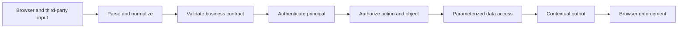

<TLDR>
  <TLDRCell label="what">
    Web security treats data from browsers, networks, and storage as untrusted whenever it crosses a trust boundary, then enforces a control where the operation actually occurs.
  </TLDRCell>
  <TLDRCell label="trap">
    Input validation, security headers, and CORS are not universal shields. A control at the wrong boundary still leaves XSS, injection, CSRF, or authorization flaws.
  </TLDRCell>
  <TLDRCell label="fix">
    Draw the data flow, then normalize, validate, authenticate, authorize each object, separate code from data, encode for the output context, and test rejection paths.
  </TLDRCell>
</TLDR>

## What it is and why it exists

Web security is the set of design and implementation constraints that protect browsers, HTTP services, and their data. It is not merely the practice of blocking “malicious strings”; it controls what untrusted data and identities may influence. Request parameters, cookies, headers, uploads, database records, and third-party responses can all be attacker-controlled inputs.

A web application crosses several trust boundaries at once. The browser enforces pages under the same-origin policy, the server holds database and internal-service privileges, and reverse proxies or CDNs rewrite and cache traffic. When data moves from a lower-trust region into a privileged operation, the control must match the way the destination interprets it. Encoding that is safe for HTML text does not automatically make SQL, URL, or JavaScript contexts safe.

The most common failures make sense in terms of boundaries. Cross-site scripting (XSS) makes a browser interpret untrusted data as code or markup; injection makes a database or command interpreter treat data as syntax; cross-site request forgery (CSRF) borrows credentials that a browser attaches automatically; broken access control lets an authenticated principal operate on someone else's object.

Those risks require composed controls because each control answers a different question. Input validation decides whether data meets the business contract, authentication establishes the caller's identity, authorization decides whether that identity may perform the action, and output encoding protects a particular interpretation context. Security headers and network policies add constraints but do not replace decisions at the business boundary.

You meet these boundaries whenever you handle a form, render user content, assemble a database query, accept an object ID, use a cookie-backed session, or call a downstream service. The fix usually belongs close to the dangerous operation, not inside one global “security middleware” layer.

### A minimum threat model

Before implementing a feature, write down the assets to protect, the principals that can affect them, and the assumptions the system trusts. A small endpoint does not need an enormous document, but it needs concrete answers: which bytes an attacker controls, which privileges the server has that the caller lacks, and which state remains after failure.

Use five checks to build the minimum model:

1. Mark assets such as passwords, sessions, personal data, money movement, and administrative capabilities.
2. List principals such as anonymous users, ordinary users, administrators, background jobs, and third-party services.
3. Mark boundaries between the browser, proxy, application, database, queue, and external services.
4. For each sensitive action, state the allow condition, rejection result, and observable side effects.
5. Record assumptions such as trusted proxy lists, cookie scope, and downstream identity.

The model must follow implementation changes. A new bulk endpoint, cache layer, rich-text editor, or outbound server request changes data flow and privilege. Code review should check whether those changes introduce a new boundary, not merely confirm that old middleware still exists.

### Secure defaults and exceptions

Secure defaults deny or grant the least capability when configuration is missing: new routes require authorization, output is text-encoded by default, and new service accounts cannot read across tenants. Exceptions should be local, searchable, and tested. A global switch that disables escaping or allows every origin gives distant code an invisible risk.

Defaults must also be verifiable after deployment. A CDN can overwrite framework configuration, a proxy can remove request headers, and a database migration can expand a service account's privileges. Release checks should observe the path users actually take and turn critical rejection behavior into automated regression tests.

### Boundary ownership

Every control needs an explicit owner. A frontend team can avoid dangerous DOM sinks, but the server team still owns authorization. A platform team can configure networks and response headers, but the feature team best understands which state transitions the current principal may perform.

Shared libraries should supply safe primitives rather than guess business policy. A library can parse an origin, bind query parameters, or generate a nonce; the caller must still provide an explicit allow rule. Clear ownership also routes alerts and fixes to the code that can actually change the boundary.

Boundary owners must also maintain attack counterexamples and deployment assertions. That way, a framework upgrade or AI rewrite of a local implementation does not leave the security semantics only in a reviewer's memory.

## How it works

For every sensitive data flow, first mark its source, transformations, execution point, and output. The source tells you which values are untrusted, the execution point determines the necessary control, and the output determines the browser's parsing context. Track identity separately from data because a well-formed object ID may still belong to another user.



The flow is not a fixed middleware chain that every endpoint must traverse. A public page needs no authentication but still needs safe rendering; a JSON API may have no HTML output but still needs object-level authorization. What matters is that each dangerous interpreter and privileged operation has a matching control before it, and rejection produces no side effect.

### Separate data from syntax

An interpreter cannot infer whether the developer intended a string as data or syntax. Parameterized queries pass the SQL template and parameters separately to the database driver; template autoescaping or `textContent` gives user text to an HTML text node. Concatenation mixes the two again, and deleting a few characters with a blacklist cannot restore the boundary.

Encoding must match its context. HTML text, HTML attributes, URLs, CSS, and JavaScript strings have different grammars; one generic `escape()` function cannot make every position safe. If the product genuinely permits rich text, use a maintained HTML sanitizer configured with an explicit policy instead of writing a tag blacklist.

### Normalize before validation

One external value can have several representations, such as hostnames with different casing, percent-encoded path segments, or Unicode composition forms. If a security decision sees one representation and a later component interprets another, validation and use disagree. Parse and normalize once according to the business protocol, validate the canonical form with exact allow rules, and pass that same result to the dangerous operation.

Normalization must not arbitrarily mutate business data. Passwords, signed bodies, and opaque tokens often require byte-for-byte preservation; lowercasing or Unicode-normalizing them changes their meaning. The protocol and data model should say which fields require normalization rather than leaving a global input filter to decide.

### Identity, action, and object

Authentication answers “who is calling,” not “what may they do.” An authorization decision needs at least a trusted principal, an action, a target object, and any necessary environmental conditions. A service should <Term id="deny-by-default">deny by default</Term> and check ownership, tenancy, or explicit policy at the boundary that reads or writes the object.

An unguessable UUID is not authorization. A valid ID can leak through logs, links, browser history, or another endpoint, so every object access requires a fresh decision. Carrying tenant or ownership conditions into the query reduces the chance that one branch fetches an object and forgets the later permission check.

### Automatic browser behavior

A browser automatically sends cookies whose domain and path match, and it enforces the <Term id="same-origin-policy">same-origin policy</Term>. That policy primarily restricts scripts from reading cross-origin responses; it does not guarantee that a cross-origin request cannot reach the server. CORS is therefore a response-sharing policy, not server-side authentication, authorization, or complete CSRF protection.

A cookie-authenticated state change should verify an unpredictable CSRF token bound to the session and inspect request context such as `Origin`. A `SameSite` cookie reduces some cross-site request risk, but compatibility, navigation semantics, and same-site subdomains make it an additional layer rather than the only control.

### Defense in depth

A browser-side <Term id="content-security-policy">Content Security Policy (CSP)</Term> can restrict script sources, inline execution, and page embedding. It can reduce the impact of some successful injections and report policy violations. CSP does not repair an unsafe DOM write, server-side injection, or missing authorization.

Service and database accounts should also follow <Term id="least-privilege">least privilege</Term>. If one control fails, a smaller privilege scope limits readable data, writable objects, and reachable networks. Logs should capture rejection reasons and request identifiers without recording passwords, complete tokens, or sensitive bodies.

### Verify controls with counterexamples

You cannot establish that a security control exists by looking only at configuration. Verification covers both accepted and rejected paths and observes the final side effects. At minimum, swap principals and objects, vary the method and content type, omit or duplicate critical fields, change the origin, and make a dependency fail.

Evidence should reach the place where the control actually executes: a database query includes its tenant condition, a browser renders an injection sample as text, a cross-origin state change never commits, and the final response still carries its policy after the proxy. Scanners help find known patterns, but they cannot replace counterexample tests for business authorization and state transitions.

## Examples

### Encode for an HTML text context

The first example shows the same untrusted display name entering an HTML text node. The helper demonstrates only the HTML text context; production code should prefer an autoescaping template or the DOM's `textContent`.

<Depth level="quick">

```javascript run title="render-profile.js"
function escapeHtmlText(value) {
  return String(value).replace(/[&<>"']/g, (character) => ({
    '&': '&amp;',
    '<': '&lt;',
    '>': '&gt;',
    '"': '&quot;',
    "'": '&#39;',
  })[character]);
}

function renderProfile(displayName) {
  // This position needs HTML text encoding because the value enters element content.
  return `<h1>${escapeHtmlText(displayName)}</h1>`;
}

const displayName = '';
console.log(`unsafe: <h1>${displayName}</h1>`);
console.log(`safe:   ${renderProfile(displayName)}`);
```

```text
unsafe: <h1></h1>
safe:   <h1>&lt;img src=x onerror=&quot;alert(1)&quot;&gt;</h1>
```

</Depth>

The unencoded string creates an `img` element and an event handler. The encoded string displays its original characters only in the HTML text node; it does not become markup. Do not reuse this function for `href`, `style`, or inline scripts. A better design keeps untrusted values out of those dangerous contexts.

### Carry authorization into a parameterized query

The second example authorizes the principal for the tenant before building a query that separates code from data. After receiving the query text and parameter array, the database driver should bind parameters as values rather than interpolate them back into the SQL string.

```javascript run title="invoice-query.js"
function buildInvoiceLookup(principal, tenantId, invoiceId) {
  const canReadTenant = principal.tenantIds.includes(tenantId);
  if (!canReadTenant) {
    throw new Error('forbidden');
  }

  return {
    text: 'SELECT id, total_cents FROM invoices WHERE tenant_id = $1 AND id = $2',
    values: [tenantId, invoiceId],
  };
}

const principal = { id: 'user-7', tenantIds: ['tenant-a'] };

for (const tenantId of ['tenant-a', 'tenant-b']) {
  try {
    const query = buildInvoiceLookup(principal, tenantId, "inv-42' OR '1'='1");
    console.log(`${tenantId}: ${query.text}`);
    console.log(JSON.stringify(query.values));
  } catch (error) {
    console.log(`${tenantId}: ${error.message}`);
  }
}
```

```text
tenant-a: SELECT id, total_cents FROM invoices WHERE tenant_id = $1 AND id = $2
["tenant-a","inv-42' OR '1'='1"]
tenant-b: forbidden
```

The hostile-looking invoice ID stays in the parameter array and cannot change the query structure. The tenant condition is part of the query, avoiding a design that fetches by invoice ID and relies on every caller to remember a later check. A real service must build `principal` from a server-verified session or token result, never from a role or tenant supplied in the request body.

### Protect a cookie-backed state change

The third example simulates the entry gate for a transfer handler. It accepts only the expected method and origin and requires the request token to match the token stored with the session. After these checks, the business layer must still authorize the destination account and amount.

```javascript run title="transfer-gate.js"
const { timingSafeEqual } = require('node:crypto');

function tokensMatch(requestToken, sessionToken) {
  const left = Buffer.from(requestToken ?? '');
  const right = Buffer.from(sessionToken ?? '');
  return left.length === right.length && timingSafeEqual(left, right);
}

function checkTransfer(request, session) {
  if (request.method !== 'POST') return { status: 405, reason: 'method' };
  if (request.origin !== 'https://bank.example') {
    return { status: 403, reason: 'origin' };
  }
  if (!tokensMatch(request.csrfToken, session.csrfToken)) {
    return { status: 403, reason: 'csrf' };
  }
  return { status: 204, reason: 'accepted' };
}

const session = { userId: 'user-7', csrfToken: 'session-token-91' };
const requests = [
  { method: 'POST', origin: 'https://bank.example', csrfToken: 'session-token-91' },
  { method: 'POST', origin: 'https://evil.example', csrfToken: 'session-token-91' },
  { method: 'POST', origin: 'https://bank.example', csrfToken: 'wrong-token' },
];

for (const request of requests) {
  const result = checkTransfer(request, session);
  console.log(`${result.status} ${result.reason}`);
}
```

```text
204 accepted
403 origin
403 csrf
```

The comparison checks lengths first so `timingSafeEqual()` does not throw on unequal inputs. A production system must generate tokens with a cryptographically secure random source, bind them to a server-recognized session, and define rotation and expiry where one-time operations need them. A proxy must preserve or reliably reconstruct original-origin information, or the origin check operates on the wrong boundary.

### Build a browser policy for each response

The final example centralizes browser policy in a testable pure function. The test uses a fixed nonce to keep the output stable; production requests must generate a fresh nonce with a cryptographically secure random source and inject the same value into approved script tags.

```javascript run title="document-headers.js"
function buildDocumentHeaders(nonce) {
  if (!/^[A-Za-z0-9+/_=-]{20,}$/.test(nonce)) {
    throw new Error('invalid nonce');
  }

  return {
    'Content-Security-Policy': [
      "default-src 'self'",
      `script-src 'self' 'nonce-${nonce}'`,
      "object-src 'none'",
      "base-uri 'none'",
      "frame-ancestors 'none'",
    ].join('; '),
    'X-Content-Type-Options': 'nosniff',
    'Referrer-Policy': 'no-referrer',
  };
}

// The fixed value is only for a reproducible test; production needs a new value per response.
const headers = buildDocumentHeaders('dGVzdC1ub25jZS0xMjM0NTY3OA==');
for (const [name, value] of Object.entries(headers)) {
  console.log(`${name}: ${value}`);
}
```

```text
Content-Security-Policy: default-src 'self'; script-src 'self' 'nonce-dGVzdC1ub25jZS0xMjM0NTY3OA=='; object-src 'none'; base-uri 'none'; frame-ancestors 'none'
X-Content-Type-Options: nosniff
Referrer-Policy: no-referrer
```

This CSP permits same-origin resources by default, while scripts must additionally match the same origin or current response nonce. `object-src 'none'`, `base-uri 'none'`, and `frame-ancestors 'none'` constrain plugin content, base URL changes, and page embedding. A real policy must be tightened or expanded from the application's resource inventory and verified in a browser, not copied blindly.

## Pitfalls

> [!PITFALL]
> Validating data once at ingress and treating it as permanently safe. When data enters a new interpretation context, combines with other values, or returns from storage, the earlier validation does not replace the control required at the current boundary.

**Fix:** Validate types, lengths, and allowed values against the business contract at ingress, then use parameterization, contextual encoding, or a fixed API at the dangerous sink. Do not try to predict every attack grammar by deleting `<script>`, quotes, or SQL keywords.

> [!PITFALL]
> Treating successful authentication as successful authorization. Generated CRUD routes are especially prone to checking a token and then reading, updating, or deleting the object ID supplied by the client.

**Fix:** Authorize every action and object under a default-deny policy, carry tenant or ownership constraints into data access, and test other users, other tenants, and alternate HTTP methods. A rejected path must not write data, emit events, or call downstream services.

> [!PITFALL]
> Treating CORS as access control or CSRF protection. Non-browser clients do not enforce CORS, and a browser may send a request even when it refuses to expose the response to attacker code.

**Fix:** Use CORS only to let explicitly allowed page origins read responses; the server must still authenticate and authorize. Cookie-backed state changes also need CSRF token and origin checks, and a credentialed response cannot use a wildcard allowed origin.

> [!PITFALL]
> Treating security headers as switches that repair root causes. A loose CSP, a fixed nonce, or headers added only to successful responses can defeat the policy. HSTS and `nosniff` do not repair injection or broken authorization either.

**Fix:** Remove unsafe sinks first, then use CSP, framing restrictions, and other response headers as additional layers. Generate a new unpredictable CSP nonce for every response and inspect the final post-CDN headers on redirects, authentication failures, 404s, and errors.

> [!PITFALL]
> Logging complete requests, cookies, tokens, or passwords in the name of a “security audit.” Attackers and insiders may then recover otherwise protected data from the logging system.

**Fix:** Record the principal ID, action, target, outcome, reason code, and request ID, with sensitive fields structurally removed or masked. Restrict log access and retention, and verify that error responses do not expose stacks, queries, or internal addresses.

<Depth level="deep">

## Browser boundary details

### Origin and site are not the same

An origin consists of a scheme, host, and port. `https://app.example` and `https://api.example` are different origins even though they may belong to the same registrable site. CORS and same-origin reads operate on origins, while cookie `SameSite` semantics operate on sites. Confusing the two can make development work while a production subdomain layout has a vulnerability or functional failure.

The `Origin` request header expresses the request's initiating origin and contains no path. Parse and compare it against normalized allowed origins; do not use suffix or substring matching, because `https://app.example.attacker.test` is plainly not `https://app.example`. When a proxy terminates TLS, the application should trust forwarded information only from configured proxies.

### The XSS sink determines the control

Text nodes in HTML templates are usually encoded by an autoescaping template engine, but a “raw HTML” escape hatch bypasses it. In the DOM, `textContent` writes text while `innerHTML` invokes the HTML parser. A URL attribute also needs a scheme policy, such as rejecting an unneeded `javascript:` scheme; HTML entity encoding alone is insufficient.

Putting data directly inside inline JavaScript, CSS, or an event handler enters a more complex grammar. A safer design passes values through JSON data blocks, `data-*` attributes, or type-constrained APIs and lets script read them from a safe position. When rich HTML is required, the sanitization policy should constrain allowed elements, attributes, and URL schemes and run attack samples against the library version.

### Cookie attributes provide separate layers

`Secure` sends a cookie only over secure connections, `HttpOnly` prevents JavaScript APIs from reading it, and `SameSite` controls some cross-site sending behavior. Those attributes do not prove that the user may operate on an object, and they do not prevent XSS from issuing requests as the current page. A session cookie should also use narrow domain and path scope, rotate its identifier after login, and have server-side expiry and revocation.

Cookie attributes alone are usually insufficient for high-impact operations. Require an explicit method, validate the CSRF token and origin, and reauthorize in the business layer. Repeated requests, concurrent submissions, and failed retries also need idempotency or transaction constraints; CSRF protection does not solve those correctness problems.

### Rejection paths are product behavior

Rejection responses should be stable and reveal only necessary information. For a private object, a service may consistently return `404` to avoid disclosing existence through a `403`/`404` difference; the exact choice depends on the API contract. Whatever the status, server logs should retain a correlatable internal reason code without exposing policy details to the caller.

A security test cannot assert only the status code. It must also confirm that the database did not change, no message was published, no cache entry was poisoned, the audit record is appropriate, and the response contains no target data. For streaming or asynchronous work, rejection must happen before an irreversible operation starts.

### Parsing and resource limits

The parser is itself a boundary. A service should specify accepted media types, character sets, field counts, nesting depth, and body size, then reject requests outside that contract before expensive business work. One component should also define the handling of duplicate JSON keys, repeated query parameters, and malformed encodings so a gateway and application do not see different values.

Resource limits should model actual cost. An IP-only request count can punish users behind a shared exit and be bypassed by distributed sources; upload bytes, expanded size, concurrent jobs, and downstream fan-out may better represent the risk. Whether a failed limiter rejects or degrades must be explicit for the endpoint's impact.

A timeout limits time but does not automatically release every resource. The application must also cancel downstream work, cap response reads, close unused streams, and place a total budget on retries. Otherwise, a rejected or timed-out request can keep consuming database connections, queue slots, or external-service quota.

### Composed attack paths

Real vulnerabilities often cross several individually safe-looking steps. A comment can be safely written through a parameterized query and later become stored XSS when an admin console passes it to `innerHTML`; that script can then call an endpoint as the administrator. A CSRF token usually does not stop same-origin XSS because malicious script in the page context can read or submit an available token.

Another common chain combines unauthorized reads with log disclosure. An endpoint accepts a well-formed object ID, omits object-level authorization, and writes the full response to centralized logs. Even after authorization is repaired, historical logs may extend the data exposure. Threat modeling must therefore follow the whole data lifecycle rather than review one function in isolation.

### Control matrix

| Risk boundary | Primary control | Does not replace |
|---|---|---|
| Untrusted text enters HTML | Safe DOM API or contextual encoding | Authorization, CSRF protection |
| Untrusted value enters SQL | Parameterized query and database least privilege | Object-level authorization |
| Cookie attaches to a state change | CSRF token, origin check, SameSite as an extra layer | XSS protection, business authorization |
| Principal accesses a target object | Default-deny authorization for each action and object | Unguessable ID, CORS |
| Browser loads or executes resources | Strict CSP and other response policies | Safe sinks, server-side controls |

The matrix exposes misplaced controls rather than asking for a tool in every cell. One data flow can cross several rows: a comment is written safely through parameterized SQL, then read back into HTML text. Avoiding SQL injection during storage does not prevent stored XSS during rendering.

</Depth>

<Checkpoint id="security/web-security-fundamentals" />

## Further reading

- [OWASP Authorization Cheat Sheet](https://cheatsheetseries.owasp.org/cheatsheets/Authorization_Cheat_Sheet.html)
- [OWASP REST Security Cheat Sheet](https://cheatsheetseries.owasp.org/cheatsheets/REST_Security_Cheat_Sheet.html)
- [MDN Same-origin policy](https://developer.mozilla.org/en-US/docs/Web/Security/Defenses/Same-origin_policy)
- [MDN CORS guide](https://developer.mozilla.org/en-US/docs/Web/HTTP/Guides/CORS)
