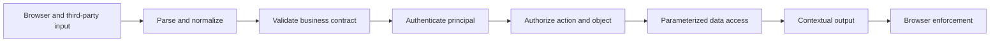

<TLDR>
  <TLDRCell label="what">
    Web 安全要求每次跨越信任边界时，都把来自浏览器、网络和存储的数据视为不可信，并在真正执行操作的位置实施控制。
  </TLDRCell>
  <TLDRCell label="trap">
    输入校验、安全响应头或 CORS 都不是通用护盾；把一种控制放在错误边界上，仍会留下 XSS、注入、CSRF 或越权漏洞。
  </TLDRCell>
  <TLDRCell label="fix">
    先画出数据流，再分别执行规范化、校验、认证、逐对象授权、代码与数据分离、上下文相关编码，并用拒绝路径测试验证结果。
  </TLDRCell>
</TLDR>

## 是什么，为什么存在

Web 安全（web security）是一组保护浏览器、HTTP 服务及其数据的设计和实现约束。它并不等同于拦截“恶意字符串”，而是要控制不可信数据和身份在系统中能够影响什么。请求参数、Cookie、请求头、上传文件、数据库记录和第三方响应，都可能成为攻击者控制的输入。

Web 应用同时跨越多个信任边界。浏览器按同源策略执行页面，服务器持有数据库与内部服务权限，反向代理和 CDN 又会改写或缓存请求与响应。一段数据从低信任区域进入高权限操作时，控制必须与当前解释方式匹配；对 HTML 文本安全的编码，不会自动让 SQL、URL 或 JavaScript 上下文安全。

最常见的失败可以按边界理解。跨站脚本（cross-site scripting，XSS）让不可信数据被浏览器当作代码或标记解释；注入让数据库或命令解释器把数据当作语法；跨站请求伪造（cross-site request forgery，CSRF）借用浏览器自动附带的凭据；失效的访问控制则让已认证主体操作不属于自己的对象。

这些风险需要组合控制，因为每项控制只回答一个问题。输入校验判断数据是否符合业务契约，认证确认调用方身份，授权决定该身份能否执行当前动作，输出编码保护特定解释上下文。安全响应头和网络策略提供额外约束，但不能替代业务边界上的决策。

你会在处理表单、渲染用户内容、拼装数据库查询、接受对象 ID、使用 Cookie 会话或调用下游服务时遇到这些边界。修复点通常靠近危险操作，而不是集中在一个全局“安全中间件”里。

### 最小威胁模型

开始实现功能前，先写下要保护的资产、能够影响它的主体和系统信任的假设。一个小型端点不需要庞大文档，但需要回答具体问题：攻击者能控制哪些字节，服务器拥有哪些调用方没有的权限，失败后会留下什么状态。

可以用五项清单建立最小模型：

1. 标出密码、会话、个人数据、资金操作和管理能力等资产。
2. 列出匿名用户、普通用户、管理员、后台作业和第三方服务等主体。
3. 标出浏览器、代理、应用、数据库、队列和外部服务之间的边界。
4. 为每个敏感动作写出允许条件、拒绝结果和可观察副作用。
5. 记录依赖的假设，例如可信代理列表、Cookie 范围和下游身份。

模型必须跟随实现变化。新增批量端点、缓存层、富文本编辑器或服务器出站请求，都会改变数据流和权限范围。代码审查应检查这些变化是否引入了新边界，而不只是确认旧中间件仍然存在。

### 安全默认值与例外

安全默认值让缺少配置时得到拒绝或最小能力，例如新路由默认需要授权，新输出默认按文本编码，新服务账户默认没有跨租户读取权限。例外需要局部、可搜索并带测试；一个全局关闭转义或允许所有来源的开关，会让远处代码承担不可见风险。

默认值也要能被部署验证。框架配置可能被 CDN 覆盖，代理可能移除请求头，数据库迁移可能扩大服务账户权限。发布检查应观察用户实际经过的路径，并把关键拒绝行为做成自动化回归测试。

### 边界所有权

每项控制都应有明确所有者。前端团队可以避免危险 DOM 接收器，但服务端团队仍负责授权；平台团队可以配置网络和响应头，但功能团队最清楚哪些状态转换允许当前主体执行。

共享库适合提供安全原语，不适合猜测业务策略。库可以解析来源、绑定查询参数或生成 nonce，调用方仍要传入明确的允许规则。所有权清楚后，告警和修复也能落到真正能够改变边界的代码上。

边界所有者还要维护攻击反例和部署断言。这样，框架升级或 AI 重写局部实现时，安全语义不会只存在于审查者记忆中。

## 工作原理

先为每条敏感数据流标出来源、转换、执行点和输出点。来源决定哪些值不可信，执行点决定需要哪类控制，输出点决定浏览器将采用哪种解析上下文。身份和数据要分别跟踪，因为格式合法的对象 ID 仍可能属于另一位用户。



流程不是所有端点都必须经过的固定中间件链。例如，公开页面不需要认证，但它仍需要安全渲染；JSON API 可能没有 HTML 输出，却仍要执行对象级授权。关键是每个危险解释器和高权限操作之前都有对应控制，而且拒绝后不产生副作用。

### 数据与语法分离

解释器无法猜出开发者希望某个字符串是数据还是语法。参数化查询把 SQL 模板与参数分别传给数据库驱动；模板自动转义或 `textContent` 把用户文本交给 HTML 文本节点。字符串拼接会重新混合两者，之后再用黑名单删除几个字符并不能恢复清晰边界。

编码必须与上下文对应。HTML 文本、HTML 属性、URL、CSS 和 JavaScript 字符串具有不同语法；一个通用 `escape()` 函数不可能为所有位置提供正确结果。如果确实允许富文本，应使用维护良好且按策略配置的 HTML 净化器，而不是自行编写标签黑名单。

### 规范化之后再校验

同一个外部值可能有多种表示，例如大小写不同的主机名、百分号编码的路径段或 Unicode 组合形式。如果安全决策基于一种表示，后续组件却解释另一种表示，就会出现校验与使用不一致。应用应先按业务协议解析和规范化一次，再对规范形式执行精确的允许规则，并把同一结果传给危险操作。

规范化也不能随意改变业务数据。密码、签名正文和不透明令牌往往要求逐字节保留，先做大小写转换或 Unicode 归一化会改变含义。需要规范化哪些字段，应由具体协议和数据模型明确规定，而不是由全局输入过滤器统一决定。

### 身份、动作与对象

认证只说明“调用方是谁”，不说明“可以做什么”。授权决策至少需要可信主体、动作、目标对象和必要的环境条件。服务应采用<Term id="deny-by-default">默认拒绝（deny by default）</Term>，并在读取或写入对象的边界上检查所有权、租户或明确策略。

不可猜测的 UUID 不是授权。合法 ID 可能从日志、链接、浏览器历史或另一个端点泄露，因此每次对象访问都要重新判断。把租户或所有权条件放进查询，可以减少先取出对象、后检查权限时遗漏分支的机会。

### 浏览器自动行为

浏览器会自动发送匹配域与路径的 Cookie，也会执行<Term id="same-origin-policy">同源策略（same-origin policy）</Term>。同源策略主要限制脚本读取跨源响应；它不会保证跨源请求无法到达服务器。因此，CORS 是响应共享策略，不是服务端认证、授权或完整的 CSRF 防护。

使用 Cookie 认证的状态变更，应校验不可预测且绑定到会话的 CSRF 令牌，并检查 `Origin` 等请求上下文。`SameSite` Cookie 能降低一部分跨站请求风险，但兼容性、导航语义和同站子域意味着它适合作为附加层，而不是唯一控制。

### 纵深防御

浏览器侧的<Term id="content-security-policy">内容安全策略（Content Security Policy，CSP）</Term>可以限制脚本来源、内联执行和页面嵌入。它能缩小某些注入成功后的影响，也能通过报告帮助发现策略违规。CSP 不会修复不安全的 DOM 写入、服务端注入或缺失的授权。

服务账户与数据库账户还应遵循<Term id="least-privilege">最小权限（least privilege）</Term>。如果一层控制失效，较小的权限范围可以限制可读数据、可写对象和可访问网络。日志需要记录拒绝原因与请求标识，但不能写入密码、完整令牌或敏感正文。

### 用反例验证控制

安全控制是否存在，不能只从配置文件判断。验证应覆盖允许路径和拒绝路径，并观察最终副作用。至少要交换主体和对象、改变方法与内容类型、缺失或重复关键字段、改变来源，以及让依赖失败。

测试证据应覆盖控制真正执行的位置：数据库查询带有租户条件，浏览器把注入样本显示为文本，跨源状态变更没有落库，最终响应经过代理后仍带预期策略。扫描器适合发现已知模式，但无法替代业务授权和状态转换的反例测试。

## 示例

### 为 HTML 文本上下文编码

第一个示例展示同一份不可信显示名称进入 HTML 文本节点时的差异。这里的辅助函数只演示 HTML 文本上下文；生产代码优先使用默认转义的模板或 DOM 的 `textContent`。

<Depth level="quick">

```javascript run title="render-profile.js"
function escapeHtmlText(value) {
  return String(value).replace(/[&<>"']/g, (character) => ({
    '&': '&amp;',
    '<': '&lt;',
    '>': '&gt;',
    '"': '&quot;',
    "'": '&#39;',
  })[character]);
}

function renderProfile(displayName) {
  // 这个位置需要 HTML 文本编码，因为值进入元素正文。
  return `<h1>${escapeHtmlText(displayName)}</h1>`;
}

const displayName = '';
console.log(`unsafe: <h1>${displayName}</h1>`);
console.log(`safe:   ${renderProfile(displayName)}`);
```

```text
unsafe: <h1></h1>
safe:   <h1>&lt;img src=x onerror=&quot;alert(1)&quot;&gt;</h1>
```

</Depth>

未经编码的字符串会形成一个 `img` 元素和事件处理器。编码后的字符串只在 HTML 文本节点中显示原字符，不会成为标记。不要把这个函数复用于 `href`、`style` 或内联脚本；更好的设计是避免让不可信值进入这些危险上下文。

### 把授权条件带入参数化查询

第二个示例先对主体与租户做授权，再构造代码和数据分离的查询。数据库驱动收到查询文本与参数数组后，应把参数作为值绑定，而不是把它们重新插回 SQL 字符串。

```javascript run title="invoice-query.js"
function buildInvoiceLookup(principal, tenantId, invoiceId) {
  const canReadTenant = principal.tenantIds.includes(tenantId);
  if (!canReadTenant) {
    throw new Error('forbidden');
  }

  return {
    text: 'SELECT id, total_cents FROM invoices WHERE tenant_id = $1 AND id = $2',
    values: [tenantId, invoiceId],
  };
}

const principal = { id: 'user-7', tenantIds: ['tenant-a'] };

for (const tenantId of ['tenant-a', 'tenant-b']) {
  try {
    const query = buildInvoiceLookup(principal, tenantId, "inv-42' OR '1'='1");
    console.log(`${tenantId}: ${query.text}`);
    console.log(JSON.stringify(query.values));
  } catch (error) {
    console.log(`${tenantId}: ${error.message}`);
  }
}
```

```text
tenant-a: SELECT id, total_cents FROM invoices WHERE tenant_id = $1 AND id = $2
["tenant-a","inv-42' OR '1'='1"]
tenant-b: forbidden
```

恶意外观的发票 ID 留在参数数组中，不会改变查询结构。租户条件也属于查询本身，避免只按发票 ID 读取后再依赖某个调用方记得检查。真实服务还要从经过认证的服务端会话或令牌验证结果构造 `principal`，不能相信请求正文提供的角色或租户。

### 保护 Cookie 会话的状态变更

第三个示例模拟转账处理器的入口门禁。它只接受预期方法与源，并要求请求令牌匹配会话中保存的令牌；这些检查通过后，业务层仍要授权收款账户和金额。

```javascript run title="transfer-gate.js"
const { timingSafeEqual } = require('node:crypto');

function tokensMatch(requestToken, sessionToken) {
  const left = Buffer.from(requestToken ?? '');
  const right = Buffer.from(sessionToken ?? '');
  return left.length === right.length && timingSafeEqual(left, right);
}

function checkTransfer(request, session) {
  if (request.method !== 'POST') return { status: 405, reason: 'method' };
  if (request.origin !== 'https://bank.example') {
    return { status: 403, reason: 'origin' };
  }
  if (!tokensMatch(request.csrfToken, session.csrfToken)) {
    return { status: 403, reason: 'csrf' };
  }
  return { status: 204, reason: 'accepted' };
}

const session = { userId: 'user-7', csrfToken: 'session-token-91' };
const requests = [
  { method: 'POST', origin: 'https://bank.example', csrfToken: 'session-token-91' },
  { method: 'POST', origin: 'https://evil.example', csrfToken: 'session-token-91' },
  { method: 'POST', origin: 'https://bank.example', csrfToken: 'wrong-token' },
];

for (const request of requests) {
  const result = checkTransfer(request, session);
  console.log(`${result.status} ${result.reason}`);
}
```

```text
204 accepted
403 origin
403 csrf
```

比较函数先检查长度，避免 `timingSafeEqual()` 因长度不同而抛错。生产系统必须用密码学安全随机源生成令牌，把令牌绑定到服务端认可的会话，并在一次性操作需要时定义轮换与失效。代理必须保留或可靠重建原始来源信息，否则源检查会基于错误边界。

### 构造每个响应的浏览器策略

最后一个示例把浏览器策略集中为可测试的纯函数。测试使用固定 nonce 以得到稳定输出；生产请求必须从密码学安全随机源生成新 nonce，并把同一个值注入获准的脚本标签。

```javascript run title="document-headers.js"
function buildDocumentHeaders(nonce) {
  if (!/^[A-Za-z0-9+/_=-]{20,}$/.test(nonce)) {
    throw new Error('invalid nonce');
  }

  return {
    'Content-Security-Policy': [
      "default-src 'self'",
      `script-src 'self' 'nonce-${nonce}'`,
      "object-src 'none'",
      "base-uri 'none'",
      "frame-ancestors 'none'",
    ].join('; '),
    'X-Content-Type-Options': 'nosniff',
    'Referrer-Policy': 'no-referrer',
  };
}

// 固定值仅用于可复现测试；生产环境需要为每个响应生成新值。
const headers = buildDocumentHeaders('dGVzdC1ub25jZS0xMjM0NTY3OA==');
for (const [name, value] of Object.entries(headers)) {
  console.log(`${name}: ${value}`);
}
```

```text
Content-Security-Policy: default-src 'self'; script-src 'self' 'nonce-dGVzdC1ub25jZS0xMjM0NTY3OA=='; object-src 'none'; base-uri 'none'; frame-ancestors 'none'
X-Content-Type-Options: nosniff
Referrer-Policy: no-referrer
```

这里的 CSP 默认只允许同源资源，脚本还需要匹配同源或当前响应 nonce。`object-src 'none'`、`base-uri 'none'` 和 `frame-ancestors 'none'` 分别限制插件内容、基础 URL 改写和页面嵌入。真实策略需要按应用资源清单收紧或扩展，并在浏览器中验证，不能盲目复制示例。

## 陷阱

> [!PITFALL]
> 只在入口处校验一次数据，然后认为它在整个系统中永久安全。数据进入新的解释上下文、与其他值组合或从数据库再次读出后，先前的校验并不能代替当前边界所需的控制。

**修复方法：** 在入口按业务契约校验类型、长度和允许值，在危险接收器处再使用参数化、上下文编码或固定 API。不要通过删除 `<script>`、引号或 SQL 关键字来猜测所有攻击语法。

> [!PITFALL]
> 把认证成功当作授权成功。生成的 CRUD 路由尤其容易只验证令牌，然后按客户端提供的对象 ID 执行读取、更新或删除。

**修复方法：** 为每个动作和对象执行默认拒绝的授权，把租户或所有权约束带入数据访问，并测试其他用户、其他租户和不同 HTTP 方法。拒绝路径必须不产生写入、事件或下游调用。

> [!PITFALL]
> 把 CORS 当作访问控制或 CSRF 防护。非浏览器客户端不会执行 CORS，而浏览器可能发送请求，只是不允许攻击者脚本读取响应。

**修复方法：** CORS 只允许明确的页面源读取响应；服务端仍要认证和授权。使用 Cookie 的状态变更还要校验 CSRF 令牌和来源，且不能把带凭据响应与通配源组合。

> [!PITFALL]
> 把安全响应头当作修复根因的开关。宽松 CSP、固定 nonce 或只在成功响应上添加的头，可能让策略失效；HSTS 和 `nosniff` 也不会修复注入或越权。

**修复方法：** 先消除不安全接收器，再把 CSP、点击劫持限制和其他响应头作为附加层。每个响应生成新的不可预测 CSP nonce，并在重定向、认证失败、404 与错误响应上检查最终经过 CDN 的头。

> [!PITFALL]
> 在日志中记录完整请求、Cookie、令牌或密码，以便“安全审计”。攻击者和内部人员随后可能通过日志系统获得原本受保护的数据。

**修复方法：** 记录主体标识、动作、目标、结果、原因码和请求 ID，并对敏感字段做结构化删除或掩码。限制日志读取权限和保留期，同时验证错误响应不会暴露堆栈、查询或内部地址。

## AI 时代

**生成代码在这里常犯的错**

模型经常生成看似完整的 Express 或前端中间件栈，却把控制放错边界：用正则“清理”所有输入、在认证后省略对象级授权、把 CORS 允许列表当成服务端权限，或把 `innerHTML` 与普通字符串拼接。它还会复用固定 CSP nonce、接受请求正文中的 `isAdmin` 或 `tenantId`、记录完整请求头，并复制已经弃用的包或响应头配置。

**让 AI 检查**

- 列出每个客户端可控值从来源到 HTML、SQL、文件系统、URL 或命令接收器的完整路径，并为每个接收器指出实际控制。
- 为每个端点列出主体、动作、目标对象和拒绝后的副作用，生成跨用户、跨租户及替代 HTTP 方法的反例测试。
- 区分认证、授权、CORS、CSRF、CSP 和输入校验各自执行的边界，并指出任何被当作通用防护的配置。

**审查清单**

- 用包含引号、标记、编码变体和超长值的输入运行正向与拒绝测试，确认数据始终由正确上下文解释。
- 用另一个有效用户和租户重放每个对象操作，确认读取、写入、日志与下游调用都被拒绝。
- 检查浏览器实际收到的 Cookie 与响应头，并验证跨源、嵌入、无令牌和错误响应路径。

**提示词词汇**

使用准确术语：`trust boundary`（信任边界）、`untrusted input`（不可信输入）、`contextual output encoding`（上下文相关输出编码）、`parameterized query`（参数化查询）、`object-level authorization`（对象级授权）、`deny by default`（默认拒绝）、`same-origin policy`（同源策略）、`CSRF token`（CSRF 令牌）、`Content Security Policy`（内容安全策略）和 `negative-path test`（拒绝路径测试）。要求模型给出数据流和执行点，比“让它更安全”更容易得到可验证结果。

<Depth level="deep">

## 浏览器边界的细节

### 源与站点不是同一个概念

源由协议、主机和端口组成。`https://app.example` 与 `https://api.example` 是不同源，即使它们可能属于同一个可注册站点。CORS 与同源读取按源判断，而 Cookie 的 `SameSite` 语义按站点判断；混淆两者会让开发环境正常、生产子域结构却出现漏洞或功能故障。

`Origin` 请求头表达发起请求的源，不包含路径。服务端比较时应解析并匹配规范化后的允许源，不能用后缀或子字符串判断；`https://app.example.attacker.test` 显然不是 `https://app.example`。如果代理参与 TLS 终止，应用需要只信任已配置代理提供的转发信息。

### XSS 接收器决定控制

HTML 模板中的文本节点通常由模板引擎自动编码，但“原始 HTML”逃生口会绕过它。DOM 中的 `textContent` 用于文本，而 `innerHTML` 会启动 HTML 解析器。URL 属性还需要协议策略，例如通常拒绝不需要的 `javascript:`，不能只做 HTML 实体编码。

把数据直接放进内联 JavaScript、CSS 或事件处理器，会进入更复杂的语法。更稳妥的设计是通过 JSON 数据块、`data-*` 属性或受类型约束的 API 传值，并让脚本从安全位置读取。确实需要富 HTML 时，净化策略要限定允许的元素、属性和 URL 协议，并针对库版本运行攻击样本。

### Cookie 属性各管一层

`Secure` 让 Cookie 只通过安全连接发送，`HttpOnly` 阻止 JavaScript API 读取 Cookie，`SameSite` 控制一部分跨站发送行为。这些属性不会验证用户是否有权操作对象，也不会让 XSS 无法以当前页面身份发请求。会话 Cookie 还应使用狭窄的域与路径，登录后轮换会话标识，并在服务端实现过期与撤销。

对高影响操作，仅有 Cookie 属性通常不够。服务端应要求明确方法、验证 CSRF 令牌与来源，并在业务层重新授权。对重复请求、并发提交和失败重试，还要定义幂等性或事务约束；CSRF 防护不负责解决这些正确性问题。

### 拒绝路径也是产品行为

拒绝响应应稳定且信息适量。对私有对象，服务可以统一返回 `404`，避免通过 `403` 与 `404` 的差异泄露对象存在性；具体策略取决于 API 契约。无论状态码如何，服务端日志都应保留可关联的内部原因码，而不向调用方暴露策略细节。

安全测试不能只断言状态码。它还要确认数据库没有改变、消息没有发布、缓存没有污染、审计记录符合预期，并且响应中不含目标对象内容。对于流式或异步处理，拒绝必须发生在不可逆操作开始之前。

### 解析和资源限制

解析器本身也是边界。服务应明确接受的媒体类型、字符集、字段数量、嵌套深度与正文大小，并在进入昂贵业务逻辑前拒绝不符合契约的请求。重复 JSON 键、重复查询参数和畸形编码如何处理，也要由一层组件统一决定，避免网关与应用看到不同值。

资源限制需要针对实际成本建模。仅按 IP 计算请求次数，会误伤共享出口，也会被分布式来源绕过；上传字节数、解压后大小、并发作业数和下游扇出可能更接近风险。限制器失败时是拒绝还是降级，必须按端点影响明确规定。

超时只限制时间，不自动释放所有资源。应用还要取消下游工作、限制响应读取量、关闭不再使用的流，并对重试设置总预算。否则一个被拒绝或超时的请求仍可能继续占用数据库连接、队列槽位或外部服务配额。

### 组合攻击路径

真实漏洞经常跨越多个看似安全的步骤。一个评论可以通过参数化查询安全写入数据库，却在管理后台通过 `innerHTML` 形成存储型 XSS；脚本随后以管理员身份调用本应有 CSRF 防护的接口。CSRF 令牌通常不能抵挡同源 XSS，因为恶意脚本可以在页面上下文中读取或提交可用令牌。

另一个常见链路是越权读取加日志泄露。端点接受格式正确的对象 ID，缺少对象级授权，并把完整响应写入集中日志；即使后来补上授权，历史日志仍可能扩大数据暴露范围。威胁建模因此要追踪数据的整个生命周期，而不是只审查单个函数。

### 控制矩阵

| 风险边界 | 主要控制 | 不能替代 |
|---|---|---|
| 不可信文本进入 HTML | 安全 DOM API 或上下文编码 | 授权、CSRF 防护 |
| 不可信值进入 SQL | 参数化查询与数据库最小权限 | 对象级授权 |
| Cookie 自动附带到状态变更 | CSRF 令牌、来源校验、SameSite 附加层 | XSS 防护、业务授权 |
| 主体访问目标对象 | 默认拒绝的逐动作与逐对象授权 | 不可猜测 ID、CORS |
| 浏览器加载或执行资源 | 严格 CSP 与其他响应策略 | 安全接收器、服务端控制 |

矩阵的价值在于暴露控制错位，而不是追求每格都有工具。一次数据流可能经过多行，例如评论先写入参数化 SQL，之后读出并进入 HTML 文本。存储阶段没有发生 SQL 注入，不代表渲染阶段不会产生存储型 XSS。

</Depth>

<Checkpoint id="security/web-security-fundamentals" />

## 延伸阅读

- [OWASP 授权备忘单](https://cheatsheetseries.owasp.org/cheatsheets/Authorization_Cheat_Sheet.html)
- [OWASP REST 安全备忘单](https://cheatsheetseries.owasp.org/cheatsheets/REST_Security_Cheat_Sheet.html)
- [MDN 同源策略](https://developer.mozilla.org/en-US/docs/Web/Security/Defenses/Same-origin_policy)
- [MDN CORS 指南](https://developer.mozilla.org/en-US/docs/Web/HTTP/Guides/CORS)
