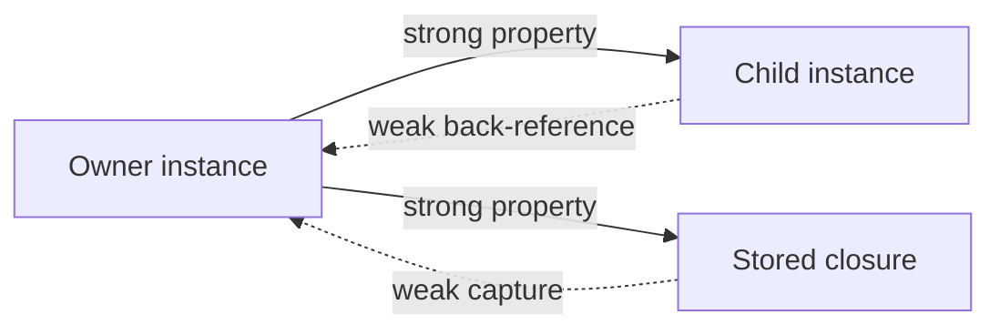

<TLDR>
  <TLDRCell label="what">
    Automatic Reference Counting (ARC) manages a class instance's lifetime from its strong references; after the last needed strong reference disappears, the instance can be deallocated.
  </TLDRCell>
  <TLDRCell label="trap">
    ARC does not detect strong reference cycles; two objects can own each other, or an object can own a closure that strongly captures it, even after external references disappear.
  </TLDRCell>
  <TLDRCell label="fix">
    Draw the ownership relationships first, then make a nonowning edge `weak`; use `unowned` only when a lifetime invariant guarantees that the target is always alive.
  </TLDRCell>
</TLDR>

## What it is and why it exists

Automatic Reference Counting (ARC) is Swift's mechanism for managing class-instance lifetimes. The compiler inserts retain and release operations where they are needed, and the runtime uses them to maintain strong references; when an instance has no strong references that still need it, its `deinit` runs and its memory can be reclaimed. Application code normally does not call retain or release operations directly.

ARC solves the release-timing problem for shared reference objects. Several variables, properties, or closures can point to one class instance, so lexical scope alone cannot identify which user leaves last. Strong references express ownership and keep the instance alive until every owner is finished with it.

Reference counting applies only to class instances. Structures and enumerations are value types whose assignment and parameter passing follow value semantics; they can contain references internally, but the value itself is not managed by reference-counting that value. Closures are also reference types, and their capture contexts can retain class instances, so they affect object lifetimes too.

ARC does not traverse an object graph to collect unreachable cycles. If two instances are left with only strong references to each other, those strong references still exist and their counts do not reach a releasable state. This strong reference cycle is one of the most common sources of Swift memory leaks.

You meet ARC in bidirectional model relationships, delegates, parent-child objects, caches, subscriptions, and escaping closures. The useful question is not “is there a closure here?” but “who stores whom, and does each edge represent ownership?” Establish ownership before choosing a strong, weak, or unowned reference.

## How it works

The default reference to a class instance is strong. Assigning an instance to another variable or strong property adds an ownership edge that keeps the target alive; clearing the variable, overwriting the property, or ending its required use removes the corresponding edge. Swift exposes no public reference count that application logic should depend on, so analyze edges instead of guessing a number at one instant.

A weak reference does not own its target and does not prevent that target from being deallocated. The weak reference automatically becomes `nil` when the target is deallocated, so `weak` must modify an optional `var`. A common relationship has a parent strongly own a child while the child only needs to refer back to its parent.

An unowned reference also does not own its target, but an ordinary `unowned` reference does not automatically become a checkable `nil`. It promises that the target is still alive whenever the reference is accessed; breaking that promise produces a runtime error. It suits relationships guaranteed by the model, such as a part that can never outlive its whole, not an attempt to avoid optional unwrapping.

A closure strongly captures a class instance it uses unless its capture list says otherwise. When an object strongly owns a closure property and the closure strongly captures that object, the two strong edges form a loop. `[weak self]` or `[unowned self]` changes the closure-to-instance edge; it does not change any other references in the object graph.



Solid lines in the diagram represent ownership, while dotted lines are nonowning relationships. An instance must stay alive while a long-lived root can still reach it through strong edges; weak and unowned edges do not extend the target's lifetime. A cycle is not inherently wrong—an all-strong cycle that cannot be broken deliberately is the leak.

Choose a reference kind in this order:

1. Should this reference own the target and keep it alive at least as long as the holder? If so, keep the default strong reference.
2. Can the target be deallocated before the holder, and can the caller handle “target no longer exists”? If so, use `weak`.
3. Does the model guarantee that the target is alive whenever the holder is alive? Use `unowned` only when this invariant holds.
4. Is a closure stored by the instance, directly or indirectly? If so, follow both storage and capture edges to find a loop.

## Examples

### Strong references determine lifetime

The first example points two optional variables at the same subscription. Setting `primary` to `nil` removes only one strong edge; `backup` still owns the instance, so access remains valid. The `deinit` runs only after the final strong edge is cleared.

<Depth level="quick">

```swift title="strong_references.swift"
final class Subscription {
    let channel: String

    init(channel: String) {
        self.channel = channel
        print("created:", channel)
    }

    deinit {
        print("released:", channel)
    }
}

func demonstrateStrongReferences() {
    var primary: Subscription? = Subscription(channel: "news")
    var backup = primary

    primary = nil
    print("active:", backup?.channel ?? "none")

    backup = nil
}

demonstrateStrongReferences()
```

```text
created: news
active: news
released: news
```

</Depth>

There is no need—and no reliable facility—to read a “current count” here. Knowing which variables form strong edges explains the output. Explicitly assigning `nil` makes the release point observable in this teaching example; real programs should follow resource ownership instead of expecting every closing brace to trigger `deinit` at that exact point.

### Break a bidirectional relationship with weak

The account owns its session, so `Account.session` is strong. A session only needs to know its current account and is not responsible for keeping that account alive, so the reverse property is `weak`. After the account is deallocated, the property automatically becomes `nil`, while the local variable keeps the session alive until the end.

```swift title="weak_back_reference.swift"
final class Account {
    let name: String
    var session: Session?

    init(name: String) {
        self.name = name
    }

    deinit {
        print("released account:", name)
    }
}

final class Session {
    let token: String
    weak var account: Account?

    init(token: String) {
        self.token = token
    }

    deinit {
        print("released session:", token)
    }
}

func demonstrateWeakReference() {
    var account: Account? = Account(name: "Mina")
    var session: Session? = Session(token: "S-42")

    account?.session = session
    session?.account = account
    account = nil

    print("owner missing:", session?.account == nil)
    session = nil
}

demonstrateWeakReference()
```

```text
released account: Mina
owner missing: true
released session: S-42
```

Changing `Session.account` to a strong property would make the two property edges a cycle. After the local variables were cleared, the account would still be owned by the session and the session would still be owned by the account, so neither `deinit` would run. Marking the nonownership direction as weak makes the code match the domain relationship.

### Express a strict invariant with unowned

A customer owns a membership card, and the card has no meaning without its customer. `MembershipCard.customer` can be `unowned` if no code can allow the card to outlive the customer. This example first releases the local card reference, while the customer still strongly owns the card; releasing the customer then ends both lifetimes.

```swift title="unowned_invariant.swift"
final class Customer {
    let name: String
    var card: MembershipCard?

    init(name: String) {
        self.name = name
    }

    deinit {
        print("released customer:", name)
    }
}

final class MembershipCard {
    let suffix: String
    unowned let customer: Customer

    init(suffix: String, customer: Customer) {
        self.suffix = suffix
        self.customer = customer
    }

    deinit {
        print("released card:", suffix)
    }
}

func demonstrateUnownedReference() {
    var customer: Customer? = Customer(name: "Priya")
    var card: MembershipCard? = MembershipCard(
        suffix: "4242",
        customer: customer!
    )

    customer?.card = card
    print("owner:", card?.customer.name ?? "none")

    card = nil
    print("card retained by customer:", customer?.card != nil)
    customer = nil
}

demonstrateUnownedReference()
```

```text
owner: Priya
card retained by customer: true
released customer: Priya
released card: 4242
```

If outside code can retain a `MembershipCard` independently, this invariant does not hold; use `weak var customer: Customer?` and handle a missing customer instead. `unowned` is an executable lifetime contract, not a style choice. During review, look for ways that a “part” can be extracted from its “whole” and stored for longer.

### Repair a closure cycle with a capture list

The object stores a closure in `onRefresh`, which is a strong edge from the object to the closure. The capture list gives the closure only a weak reference back, so retaining the callback elsewhere does not extend the `Dashboard` lifetime. Calling the callback again after deallocation takes the missing-object branch instead of accessing a dangling instance.

```swift title="weak_capture.swift"
final class Dashboard {
    let name: String
    var onRefresh: (() -> Void)?

    init(name: String) {
        self.name = name
    }

    func configureRefresh() {
        onRefresh = { [weak self] in
            guard let self else {
                print("skipped: dashboard released")
                return
            }
            print("refresh:", self.name)
        }
    }

    deinit {
        print("released dashboard:", name)
    }
}

func demonstrateWeakCapture() {
    var dashboard: Dashboard? = Dashboard(name: "sales")
    dashboard?.configureRefresh()
    var callback = dashboard?.onRefresh

    callback?()
    dashboard = nil
    callback?()
    callback = nil
}

demonstrateWeakCapture()
```

```text
refresh: sales
released dashboard: sales
skipped: dashboard released
```

If a closure exists only during a synchronous call and no path stores it back under `Dashboard`, strongly capturing `self` does not automatically create a cycle. Choose a weak capture from the closure's storage location and the intended behavior. A strong capture can be correct when the operation must finish.

## Pitfalls

> [!PITFALL]
> Mechanically adding `[weak self]` to every escaping closure changes the lifetime policy to “silently skip the work when the object disappears.” If no caller retains the object elsewhere, a save, telemetry event, or state update may never happen.

**Fix:** first establish who stores the closure and whether the work must complete. A strong capture need not form a cycle when the closure is not reachable from `self`; if a task must own its executor until completion, capture strongly and provide cancellation explicitly. A weak capture expresses the right semantics only when the work should be abandoned after the object disappears.

> [!PITFALL]
> Writing `guard let self` at the start of a long asynchronous closure upgrades the weak reference to a strong one for the entire remaining scope. The code visibly uses `[weak self]`, yet the instance can remain alive until every `await` completes.

**Fix:** decide whether the whole operation needs consistent ownership or each step may tolerate the object's disappearance. The former can hold strongly and say so; the latter should narrow the strong reference's scope, copy only the immutable data needed for one step, and recheck cancellation and target existence after suspension points.

> [!PITFALL]
> Replacing `weak` with `unowned` to avoid optional unwrapping turns recoverable target absence into a runtime error. Delayed callbacks, cancellation, navigation, and test doubles can all violate a lifetime ordering inferred from the initial design.

**Fix:** require the review to name the precise invariant supporting `unowned` and every API that can retain the holder or target independently. If you cannot prove that the target always lives longer, use `weak` and handle `nil`. Do not substitute minor syntactic convenience for a lifetime proof.

> [!PITFALL]
> A method reference can hide a strong capture. Storing `self.handleUpdate` directly as a callback, subscription handler, or retry action contains no explicit closure syntax, but it can still make the storage owner strongly retain `self`.

**Fix:** review a method reference as a closure that captures its receiver. Follow the storage owner's properties back to the receiver and look for a loop; when the relationship should be nonowning, write a wrapper closure with `[weak self]` and define what happens after the target disappears.

> [!PITFALL]
> Clearing a closure property or subscription token only in a success callback lets error, timeout, and cancellation paths keep the object graph alive. A test suite that exercises only successful completion will not reveal this leak.

**Fix:** disconnect ownership edges in cleanup that covers every termination path. Test successful completion, failure, and cancellation with a `deinit` signal or weak probe, and confirm that restarting replaces or releases an old callback instead of accumulating storage owners.

## In the AI era

**What generated code gets wrong here**

Generated code often treats `[weak self]` as a fixed template for every asynchronous closure without checking whether `self` stores the closure, so required work can vanish silently. In the other direction, a model can use `self` directly inside a closure property or pass `self.method` as a handler, hiding a strong loop from the object to the closure and back. It may also replace a relationship with `unowned` to remove `?` without proving that cancellation, navigation, or an external cache cannot make the referencing object live longer.

**Ask your AI to check**

- List the storage edges among every class instance, closure, task, and subscription, and label each edge strong, weak, or unowned.
- State the invariant that makes each `unowned` target live longer, then find a public call sequence that could violate it.
- Trace success, error, and cancellation paths and confirm that every long-lived callback or token is disconnected on all of them.

**Review checklist**

- Remove the final external strong reference, then use a weak probe or `deinit` test to confirm that the object graph is released.
- Inspect method references, nested closures, and task bodies for implicit strong captures instead of searching only for `[weak self]`.
- After every `await`, delayed callback, and cancellation point, verify that generated code's lifetime assumptions still hold.

**Prompt vocabulary**

Use the exact terms `automatic reference counting`, `strong reference`, `weak reference`, `unowned reference`, `strong reference cycle`, `capture list`, `zeroing weak reference`, `ownership graph`, and `lifetime invariant`. Ask the AI for a storage graph and separate release timelines for success, error, and cancellation; “add weak self” does not state the ownership you want.

<Depth level="deep">

## Deriving lifetime from the ownership graph

Reference counting is the implementation mechanism; an ownership graph is the more useful review model. Nodes are class instances, closures, or storage for other reference types, and strong edges mean that the source keeps the target alive. Weak and unowned edges permit access without ownership. Local variables, collection elements, properties, tasks, and subscriptions can all be sources of strong edges.

Start at roots still owned by the process, framework, or active execution stack and follow only strong edges. Nodes reachable from a root must stay alive; nodes unreachable from roots but locked in a strong cycle are not automatically collected by ARC either. To break a cycle, remove or weaken one edge that does not represent ownership rather than making every edge in the cycle weak.

Ownership and accessibility are different questions. A weak reference permits temporary access without promising that the target survives, an unowned reference permits direct access while putting that promise on the programmer, and only a strong reference extends lifetime. Keeping those questions separate prevents “I need to call it” from becoming “I must own it.”

### Choosing strong, weak, or unowned

| Reference | Owns target | After target deallocation | Property shape | Required premise |
| --- | --- | --- | --- | --- |
| strong | Yes | Target stays alive while held | Default `let` or `var` | Holder controls target lifetime |
| weak | No | Automatically becomes `nil` | Optional `var` | Target may leave first; absence is handled |
| unowned | No | Later access fails | Usually nonoptional `let` or `var` | Target is guaranteed to outlive the referrer |

The table describes semantics, not a performance ranking. Strong is the default and most common choice; weak and unowned exist only to express nonownership. In a bidirectional relationship, an aggregate root often strongly owns a part while the part weakly refers to the root, but a domain model can require the opposite direction.

A `weak` property must be a `var` because ARC needs to write `nil` when the target is deallocated. It must be optional because “target has disappeared” is a normal representable state. Bind the optional into one local scope before use; do not check it for non-nil and then reread the weak property, because the target can end its lifetime between those reads.

An ordinary `unowned` reference omits the absent state without extending the target's lifetime. It fits an invariant maintained jointly by construction and encapsulation, such as a part stored only inside its whole when no API hands that part to a longer-lived owner. Once a type permits independent caching or delayed execution, weak is usually more honest.

Swift also supports optional unowned references and more specialized forms such as `unowned(unsafe)`. They are not substitutes for clear ownership design; `unowned(unsafe)` in particular removes the runtime checks of an ordinary unowned reference and does not belong in general application examples. Consider it only for low-level interoperability backed by a separate safety argument.

### Capture lists take effect at closure creation

Capture-list entries are initialized when the closure is created. `[snapshot = value]` stores the value obtained at that time; if the value is a class instance and neither `weak` nor `unowned` appears, that storage is still a strong reference. A capture list is not syntax for automatically copying a whole object.

`[weak self]` creates a weak reference to the current instance, so the closure body sees optional `self`. A successful `guard let self` establishes a new strong local reference, and its scope determines how long the instance's lifetime is extended. This weak-to-strong transition is often correct, but it must be reviewed alongside suspension points and cancellation semantics.

`[unowned self]` assumes that the instance is alive every time the closure runs. If the instance owns the closure and the closure never escapes, their lifetimes may be coupled; as soon as the callback can be copied elsewhere, queued for delayed execution, or stored by another object, the premise needs a new proof. The closure's type usually does not prevent it from escaping to a longer lifetime.

Capturing a value type can change behavior too. A capture list stores the creation-time value, whereas directly referring to an outer mutable variable can observe shared capture storage. When reviewing ARC, distinguish both “which entity is captured” and “with which ownership”; otherwise a cycle fix can introduce a stale snapshot.

A capture list controls only the edges it names. `[weak self]` can still leave a different strong loop when the closure reaches `self` indirectly through another object, or captures a service that itself strongly owns `self`. A complete review expands the references held by captured values too.

### What ARC does not manage

ARC manages the lifetime of Swift references, but it does not automatically close a file descriptor, socket, or database transaction. A class can perform final cleanup in `deinit`, yet business correctness should not depend only on exactly when an object happens to deallocate. A resource with a required ending point needs an explicit `close`, `cancel`, or scoped API.

Reference cycles are not the only cause of memory growth. An unbounded cache, an ever-growing callback array, and tasks that are still running can all remain legitimately reachable from a root through strong edges, so ARC correctly retains them. Fix capacity or cancellation policy in that case instead of adding weak references blindly.

Value types are not reference-counted as values, but that does not mean they never use heap memory or participate in reference lifetimes. Values such as arrays and strings can use shared storage and copy-on-write, and a structure property can strongly own a class instance. When checking whether an object deallocates, follow reference fields inside structures instead of reading “value type” as “no memory management.”

The compiler can arrange releases around the final use, so `deinit` should not be treated as an ordinary control-flow callback. Exact log ordering can change with optimization, concurrency, and framework retention. Tests should assert eventual release and explicit cleanup of critical resources rather than depend on an incidental instantaneous count.

### Verify release with falsifiable tests

`deinit` logging works for small examples and debugging, but a weak probe is more useful in a larger test. Build the object graph, observe the target through a local `weak` variable, clear external strong references, and then assert that the probe eventually becomes `nil`. If tasks or queues are involved, drive their cancellation and completion boundaries first.

Exercise normal completion, thrown errors, early returns, and cancellation. Every path must release one-shot callbacks, observer tokens, and subscriptions, and repeated registration needs defined replacement behavior. Happy-path tests cannot expose the most common cleanup gaps.

A memory-graph tool can show why an instance is still reachable, but a tool's “potential leak” still needs interpretation through domain ownership. Find the strong path from a root to the target before deciding which edge should not own it. Making the first property on that path weak can instead cause premature deallocation.

A test should also retain an external copy of a callback before releasing the original object. This distinguishes a cycle caused by the object storing its own closure from safe invalidation after the closure escapes, and it exposes an `unowned` crash that happens only on delayed invocation.

The final review question is not “does this use ARC?” because Swift uses ARC by default. Verify that the ownership graph matches the domain, that nonowning edges choose the right invalidation behavior, and that every long-lived storage edge has a clear disconnection condition.

</Depth>

<Checkpoint id="swift/arc" />

## Further reading

- [The Swift Programming Language: Automatic Reference Counting](https://docs.swift.org/swift-book/documentation/the-swift-programming-language/automaticreferencecounting/)
- [The Swift Programming Language: Closures](https://docs.swift.org/swift-book/documentation/the-swift-programming-language/closures/)
- [Swift language reference: expressions and capture lists](https://docs.swift.org/swift-book/ReferenceManual/Expressions.html)
- [Swift.org: Debugging memory leaks and usage](https://www.swift.org/documentation/server/guides/memory-leaks-and-usage.html)
