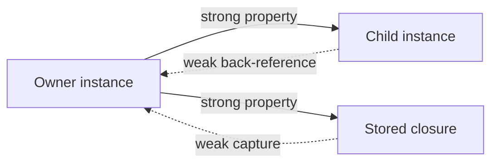

<TLDR>
  <TLDRCell label="what">
    自动引用计数（Automatic Reference Counting，ARC）根据类实例收到的强引用管理其生命周期；最后一个所需强引用消失后，实例可以释放。
  </TLDRCell>
  <TLDRCell label="trap">
    ARC 不会识别强引用循环；两个对象互相拥有，或对象拥有一个又强捕获它的闭包时，即使外部引用消失也可能无法释放。
  </TLDRCell>
  <TLDRCell label="fix">
    先画出所有权关系，再把不应拥有目标的一条边声明为 `weak`；只有生命周期不变量能够保证目标一直存活时，才使用 `unowned`。
  </TLDRCell>
</TLDR>

## 是什么，为什么存在

自动引用计数（ARC）是 Swift 管理类实例生命周期的机制。编译器会在需要的位置插入保留和释放操作，运行时据此维护强引用；当实例不再有需要保留它的强引用时，其 `deinit` 会运行，随后内存可被回收。业务代码通常不直接调用保留或释放操作。

ARC 解决的是共享引用对象的释放时机。多个变量、属性或闭包可以同时指向同一个类实例，单靠词法作用域无法判断哪个使用方最后离开。强引用表达所有权，使实例至少存活到每个所有者都不再需要它。

引用计数只适用于类实例。结构体和枚举是值类型，赋值与传参遵循值语义；它们可能在内部持有引用，但值本身不是通过对该值做引用计数来管理的。闭包也是引用类型，其捕获上下文可能保留类实例，因此同样会影响对象的生命周期。

ARC 不会遍历对象图寻找不可达的环。如果两个实例只剩下彼此之间的强引用，它们的强引用仍然存在，计数也不会降到可释放状态。这类强引用循环（strong reference cycle）是 Swift 内存泄漏最常见的来源之一。

你会在双向模型关系、委托、父子对象、缓存、订阅和逃逸闭包中遇到 ARC。真正的问题不是“这里是否出现闭包”，而是“谁存储谁，以及每条边是否表示所有权”。先回答所有权，再选择强、弱或无主引用。

## 工作原理

默认的类实例引用是强引用（strong reference）。把实例赋给另一个变量或强属性，会新增一条让目标存活的所有权边；清空变量、覆盖属性或让其结束有效使用，会移除相应的边。Swift 没有提供业务代码可依赖的公开引用计数，因此应分析边，而不是猜测某个瞬间的数字。

弱引用（weak reference）不拥有目标，也不会阻止目标释放。目标释放时，弱引用会自动变为 `nil`，所以 `weak` 必须修饰可选类型的 `var`。典型关系是父对象强持有子对象，而子对象只需回看父对象。

无主引用（unowned reference）也不拥有目标，但普通 `unowned` 不会自动变成可检查的 `nil`。它承诺访问引用时目标仍然存活；承诺被破坏时，访问会触发运行时错误。它适合“部分对象绝不会比整体对象活得更久”这类由模型保证的关系，而不适合为了省一次可选值解包而使用。

闭包会强捕获其使用的类实例，除非捕获列表另有指定。对象强持有闭包属性、闭包又强捕获该对象时，就形成两条闭合的强边。`[weak self]` 或 `[unowned self]` 改变的是闭包到实例的那条边，并不会修改对象图中的其他引用。



图中的实线表示所有权，虚线表示非拥有关系。只要从长期存活的根仍能沿强边到达实例，该实例就必须存活；弱边和无主边不会延长目标生命周期。环本身不一定有问题，全部由强边组成且无法主动断开的环才会泄漏。

选择引用种类时，可以按以下顺序检查：

1. 这个引用是否应当拥有目标，使目标至少与持有者一样久？如果是，保留默认强引用。
2. 目标能否先于持有者释放，而且调用方能够处理“目标已不存在”？如果是，使用 `weak`。
3. 模型是否保证持有者存活期间目标一定存活？只有这个不变量成立时，才使用 `unowned`。
4. 某个闭包是否被实例直接或间接存储？如果是，沿存储边和捕获边检查是否闭环。

## 示例

### 强引用决定实例何时存活

第一个示例让两个可选变量指向同一个订阅对象。把 `primary` 设为 `nil` 只移除一条强边；`backup` 仍然拥有实例，所以访问仍然有效。清空最后一条强边后，`deinit` 才运行。

<Depth level="quick">

```swift title="strong_references.swift"
final class Subscription {
    let channel: String

    init(channel: String) {
        self.channel = channel
        print("created:", channel)
    }

    deinit {
        print("released:", channel)
    }
}

func demonstrateStrongReferences() {
    var primary: Subscription? = Subscription(channel: "news")
    var backup = primary

    primary = nil
    print("active:", backup?.channel ?? "none")

    backup = nil
}

demonstrateStrongReferences()
```

```text
created: news
active: news
released: news
```

</Depth>

这里不需要也无法可靠读取“当前计数”。变量是否形成强边已经足以解释输出。显式赋值为 `nil` 让教学示例的释放点可观察；实际程序应以资源所有权为依据，而不是依赖每个结束花括号恰好触发 `deinit`。

### 用弱回指打破双向关系

账户拥有会话，因此 `Account.session` 是强引用。会话只需知道当前账户，并不负责让账户存活，所以反向属性使用 `weak`。账户释放后，这个属性自动变为 `nil`，而局部变量仍让会话活到最后。

```swift title="weak_back_reference.swift"
final class Account {
    let name: String
    var session: Session?

    init(name: String) {
        self.name = name
    }

    deinit {
        print("released account:", name)
    }
}

final class Session {
    let token: String
    weak var account: Account?

    init(token: String) {
        self.token = token
    }

    deinit {
        print("released session:", token)
    }
}

func demonstrateWeakReference() {
    var account: Account? = Account(name: "Mina")
    var session: Session? = Session(token: "S-42")

    account?.session = session
    session?.account = account
    account = nil

    print("owner missing:", session?.account == nil)
    session = nil
}

demonstrateWeakReference()
```

```text
released account: Mina
owner missing: true
released session: S-42
```

如果把 `Session.account` 改成强属性，两条属性边会构成环。局部变量清空后，账户仍由会话拥有，会话也仍由账户拥有，两个 `deinit` 都不会运行。把非所有权方向标成弱引用，才与领域关系一致。

### 用无主引用表达严格的不变量

顾客拥有会员卡，而会员卡没有顾客就没有意义。`MembershipCard.customer` 可以使用 `unowned`，前提是任何代码都不能让会员卡比顾客活得更久。这个示例先释放局部的卡片引用，仍由顾客强持有卡片；最后释放顾客时，两者一起结束生命周期。

```swift title="unowned_invariant.swift"
final class Customer {
    let name: String
    var card: MembershipCard?

    init(name: String) {
        self.name = name
    }

    deinit {
        print("released customer:", name)
    }
}

final class MembershipCard {
    let suffix: String
    unowned let customer: Customer

    init(suffix: String, customer: Customer) {
        self.suffix = suffix
        self.customer = customer
    }

    deinit {
        print("released card:", suffix)
    }
}

func demonstrateUnownedReference() {
    var customer: Customer? = Customer(name: "Priya")
    var card: MembershipCard? = MembershipCard(
        suffix: "4242",
        customer: customer!
    )

    customer?.card = card
    print("owner:", card?.customer.name ?? "none")

    card = nil
    print("card retained by customer:", customer?.card != nil)
    customer = nil
}

demonstrateUnownedReference()
```

```text
owner: Priya
card retained by customer: true
released customer: Priya
released card: 4242
```

如果外部代码还能单独保留 `MembershipCard`，这个不变量就不成立，应改用 `weak var customer: Customer?` 并处理缺失顾客。`unowned` 是可执行的生命周期契约，不是风格选择。评审时应寻找能否把“部分”从“整体”中取出并长期保存。

### 用捕获列表修复闭包环

对象把闭包存进 `onRefresh`，这是一条从对象到闭包的强边。捕获列表让闭包只弱引用对象，因此外部保存回调不会反过来延长 `Dashboard` 的生命周期。对象释放后再次调用回调，会走到缺失分支而不是访问悬空实例。

```swift title="weak_capture.swift"
final class Dashboard {
    let name: String
    var onRefresh: (() -> Void)?

    init(name: String) {
        self.name = name
    }

    func configureRefresh() {
        onRefresh = { [weak self] in
            guard let self else {
                print("skipped: dashboard released")
                return
            }
            print("refresh:", self.name)
        }
    }

    deinit {
        print("released dashboard:", name)
    }
}

func demonstrateWeakCapture() {
    var dashboard: Dashboard? = Dashboard(name: "sales")
    dashboard?.configureRefresh()
    var callback = dashboard?.onRefresh

    callback?()
    dashboard = nil
    callback?()
    callback = nil
}

demonstrateWeakCapture()
```

```text
refresh: sales
released dashboard: sales
skipped: dashboard released
```

如果闭包只在同步调用期间存在，而且没有任何路径把它存回 `Dashboard`，强捕获 `self` 不会自动构成循环。是否使用弱捕获应由闭包的存储位置和期望语义决定。需要保证操作完成时，强捕获可能正是正确选择。

## 陷阱

> [!PITFALL]
> 看到逃逸闭包就机械添加 `[weak self]`，会把生命周期策略变成“对象消失就静默跳过工作”。如果调用方没有另外强持有对象，保存、遥测或状态更新可能永远不发生。

**修复：** 先确认谁存储闭包，以及工作是否必须完成。如果闭包不会从 `self` 可达，强捕获未必成环；如果任务必须拥有执行者直到结束，就明确强捕获并提供取消机制。只有“对象消失后工作应放弃”时，弱捕获才表达正确语义。

> [!PITFALL]
> 在长时间异步闭包开头写 `guard let self`，会把弱引用升级为覆盖整个剩余作用域的强引用。代码表面上使用了 `[weak self]`，实例仍可能一直活到所有 `await` 完成。

**修复：** 决定需要的是整段操作的一致所有权，还是每一步都允许对象消失。前者可以明确强持有；后者应缩小强引用的作用域，只复制本步需要的不可变数据，并在挂起点之后重新检查取消和目标是否存在。

> [!PITFALL]
> 为了避免可选值解包而把 `weak` 改成 `unowned`，会把可恢复的目标缺失变成运行时错误。延迟回调、取消、导航返回和测试替身都可能打破模型猜出的生命周期顺序。

**修复：** 要求代码评审指出维持 `unowned` 的具体不变量，以及所有能把持有者或目标单独保存的 API。证明不了目标总是更长寿，就使用 `weak` 并处理 `nil`。不要用微小的语法便利替代生命周期证明。

> [!PITFALL]
> 方法引用也能隐藏强捕获。把 `self.handleUpdate` 直接存入回调、订阅或重试器，看不到显式闭包语法，却仍可能让保存方强持有 `self`。

**修复：** 把方法引用当作捕获了接收者的闭包来审查。沿着保存方回到接收者的属性检查闭环；需要非拥有语义时，写出带 `[weak self]` 的包装闭包，并明确目标消失后的行为。

> [!PITFALL]
> 只在成功回调中把闭包属性或订阅令牌设为 `nil`，会让错误、超时和取消路径继续保留对象图。测试全部通过成功路径时，这种泄漏很难出现。

**修复：** 把断开所有权边放在覆盖全部终止路径的清理位置。为成功、失败和取消分别测试 `deinit` 或弱探针，并确认重复启动会替换或释放旧回调，而不是不断累积保存方。

<Depth level="deep">

## 按所有权图推导生命周期

引用计数是实现机制，所有权图是更适合代码评审的模型。节点是类实例、闭包或其他引用类型的存储；强边表示源节点让目标存活，弱边和无主边只允许访问。局部变量、集合元素、属性、任务和订阅都可能成为强边的来源。

从进程、框架或当前执行栈仍然拥有的根开始，只沿强边追踪。能从根到达的节点必须存活；不能从根到达但处于强环中的节点也不会被 ARC 自动回收。打破环时只需移除或弱化一条不表示所有权的边，而不是把环上所有引用都改成弱引用。

所有权与可访问性不是同一件事。弱引用允许暂时访问却不承诺目标存活，无主引用允许直接访问却把存活承诺交给程序员；只有强引用负责延长生命周期。把这三个问题分开，能避免把“我需要调用它”误写成“我必须拥有它”。

### 强、弱与无主的选择

| 引用 | 是否拥有目标 | 目标释放后 | 属性形态 | 适用前提 |
| --- | --- | --- | --- | --- |
| strong | 是 | 持有期间目标不释放 | 默认 `let` 或 `var` | 持有者负责目标生命周期 |
| weak | 否 | 自动变为 `nil` | 可选类型的 `var` | 目标可以先释放，缺失可处理 |
| unowned | 否 | 再次访问会失败 | 通常为非可选 `let` 或 `var` | 目标保证比引用方活得更久 |

表格描述的是语义，而不是性能排序。强引用是默认且最常见的选择；弱和无主引用只用于表达非所有权关系。看到双向关系时，通常让聚合根强持有部件，让部件弱引用根，但领域模型可能要求相反方向。

`weak` 属性必须是 `var`，因为 ARC 需要在目标释放时写入 `nil`。它必须是可选类型，因为“目标已经消失”是正常可表示状态。使用前应在同一个局部作用域中可选绑定；不要先检查非空，再通过弱属性重复读取，因为目标可能在两次读取之间结束生命周期。

普通 `unowned` 省略了缺失状态，却没有延长目标生命周期。它最适合由构造和封装共同维护的不变量，例如部件只保存在整体内部，而且 API 不会把部件独立交给更长寿的所有者。一旦类型允许独立缓存或延迟执行，改用弱引用通常更诚实。

Swift 还支持可选无主引用和 `unowned(unsafe)` 等更特殊形式。它们并不能替代清楚的所有权设计；尤其是 `unowned(unsafe)` 会移除普通无主引用的运行时检查，不应出现在一般业务示例中。只有与底层互操作并有独立安全证明时才考虑它。

### 捕获列表在闭包创建时生效

捕获列表条目在闭包创建时初始化。`[snapshot = value]` 会为闭包保存当时取得的值；如果值是类实例，未写 `weak` 或 `unowned` 时，这个保存仍是强引用。捕获列表不是自动“复制整个对象”的语法。

`[weak self]` 创建对当前实例的弱引用，闭包体看到的是可选 `self`。`guard let self` 会在成功分支建立新的强局部引用，其范围决定实例被延长多久。这个弱转强动作常常正确，但必须与挂起点和取消语义一起审查。

`[unowned self]` 假定每次闭包执行时实例都存活。如果闭包由实例拥有且永不逃逸，二者可能具有绑定生命周期；但只要回调可以复制到外部、排队延迟执行或被另一个对象保存，假定就需要重新证明。类型签名通常不会阻止闭包逃逸到更长的生命周期。

捕获值类型也会改变行为。捕获列表保存创建时的值，而闭包体直接引用外层可变变量时，看到的可能是共享的捕获存储。审查 ARC 问题时应同时区分“捕获了哪个实体”和“以何种所有权捕获”，否则可能修复环却引入陈旧快照。

捕获列表只能控制它列出的边。闭包通过另一个对象间接回到 `self`，或者捕获一个内部又强持有 `self` 的服务时，写出 `[weak self]` 仍可能留下其他强环。完整检查必须展开捕获值自己的引用关系。

### ARC 管不到的边界

ARC 管理 Swift 引用的生命周期，却不自动关闭文件描述符、套接字或数据库事务。类可以在 `deinit` 中做最终清理，但业务正确性不应只依赖对象何时恰好释放。需要确定结束时机的资源应有显式的 `close`、`cancel` 或作用域化 API。

引用循环也不是唯一的内存增长原因。无限缓存、不断追加的回调数组和仍在运行的任务都可能从根沿强边合法可达，因此 ARC 正确地保留它们。此时应修复容量或取消策略，而不是盲目添加弱引用。

值类型不参与对自身的引用计数，不代表它永远没有堆内存或引用生命周期。数组、字符串等值可以使用共享存储和写时复制，一个结构体属性也可以强持有类实例。判断对象是否释放时，要追踪结构体内部的引用字段，而不是把“值类型”理解成“没有内存管理”。

编译器可以根据最后一次使用安排释放，因此 `deinit` 不应被当作普通控制流回调。日志中的确切行序在优化、并发和框架持有关系下可能变化。测试应断言对象最终能够释放，以及关键资源有显式清理，而不是依赖与业务无关的瞬时计数。

### 用可证伪的测试验证释放

`deinit` 日志适合最小示例和调试，但大型测试更适合使用弱探针。测试建立对象图，用 `weak` 局部变量观察目标，清空外部强引用，然后断言探针最终为 `nil`。如果系统包含任务或队列，还要先驱动其取消与完成边界。

验证时应覆盖正常完成、抛错、提前返回和取消。每条路径都要释放一次性回调、观察者令牌和订阅，并让重复注册具有明确语义。只测快乐路径，无法发现最常见的清理缺口。

内存图工具能显示某个实例为什么仍可达，但工具给出的“潜在泄漏”仍需结合领域所有权解释。先找到从根到目标的强路径，再决定哪条边不该拥有目标。直接把路径上的第一个属性改成弱引用，可能造成过早释放。

测试还应保留外部回调的副本，再释放原对象。这样能区分“对象自己保存闭包形成环”和“闭包逃逸后仍安全失效”两种情形，也能暴露使用 `unowned` 时延迟调用才发生的崩溃。

代码评审的最终问题不是“是否使用了 ARC”，因为 Swift 默认就在使用 ARC。真正需要验证的是：所有权图是否与领域关系一致，非拥有边是否选择了正确的失效行为，以及每条长期存储边是否有清楚的断开条件。

</Depth>

<Checkpoint id="swift/arc" />

## 延伸阅读

- [Swift 编程语言：自动引用计数](https://docs.swift.org/swift-book/documentation/the-swift-programming-language/automaticreferencecounting/)
- [Swift 编程语言：闭包](https://docs.swift.org/swift-book/documentation/the-swift-programming-language/closures/)
- [Swift 语言参考：表达式与捕获列表](https://docs.swift.org/swift-book/ReferenceManual/Expressions.html)
- [Swift.org：调试内存泄漏与内存使用](https://www.swift.org/documentation/server/guides/memory-leaks-and-usage.html)
