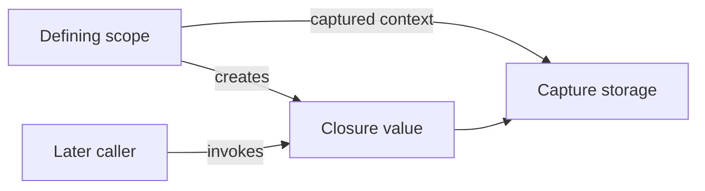

<TLDR>
  <TLDRCell label="what">
    A closure is a function value you can store, pass, and call, and it can retain access to context from where it was defined.
  </TLDRCell>
  <TLDRCell label="trap">
    `@escaping`, `[weak self]`, and capture lists change lifetime or value timing; applying them mechanically causes cycles, silently dropped work, or stale snapshots.
  </TLDRCell>
  <TLDRCell label="fix">
    Define each closure's invocation timing, call count, storage location, and capture ownership; when it crosses concurrency domains, check `@Sendable` and isolation too.
  </TLDRCell>
</TLDR>

## What it is and why it exists

A <Term id="closure">closure</Term> is a self-contained block of executable code. It has a function type, can be assigned to a variable, passed as an argument, or returned from a function, and can keep using captured values after its defining scope ends. Swift's global functions, nested functions, and closure expressions are three forms of closures.

Closures let an API delegate “what to do later” or “how to process a value” without requiring a new type for every behavior. Collection sorting, event handling, completion callbacks, lazy evaluation, and SwiftUI builders all accept function values. A closure carries additional state only when it captures surrounding context; a function that captures nothing can still be passed as the same function type.

A function type is written as `(ParameterTypes) -> ReturnType` and doesn't include argument labels. For example, `(Order, Order) -> Bool` describes a comparator that accepts two `Order` values and returns a Boolean. You invoke a closure like a function, using parentheses for its arguments.

The full closure-expression form is `{ (parameters) -> ReturnType in statements }`. With enough context, Swift infers parameter and return types; a single-expression closure can omit `return`, and a short closure can use `$0` and `$1`. These are syntax reductions over one type system, not changes to capture or escaping behavior.

The important review questions aren't about how short the braces look. They are where the function value lives, when it runs, and which external state it depends on. Once a closure is stored, queued, or transferred across a concurrency domain, the call site separates from the definition site and lifetime or mutable-state errors become harder to see locally.

## How it works

Swift uses lexical scope to determine which names a closure can reference. When a closure uses a local variable from an outer scope, the compiler preserves the required capture context so that the value remains accessible after the original scope ends. With a captured mutable variable, the original scope and the closure can observe later changes in the same capture storage instead of automatically freezing the creation-time value.

Closures are reference types. Assigning the same stateful closure to another variable doesn't copy an independent capture context; both variables invoke the same context. Calling the factory that produces the closure again creates separate captured state.

A <Term id="capture-list">capture list</Term> appears before the parameters, as in `{ [snapshot = value, weak owner] input in ... }`. Its entries are initialized when the closure is created, so `snapshot` retains the value evaluated then; a class instance is still strongly captured unless marked `weak` or `unowned`. A capture list isn't a switch that copies everything by value.

Closure parameters are nonescaping by default, meaning the function value can't outlive the current function call. If a function stores the parameter in an external variable, property, or queue, or arranges for it to run after returning, the parameter type needs `@escaping`. The attribute permits escape; it doesn't promise asynchronous execution or exactly one invocation.

`@autoclosure` automatically wraps an argument expression in a parameterless closure and delays evaluation. It suits assertions, short-circuit behavior, and clearly named lazy interfaces, but it hides braces and side effects at the call site. An autoclosure that must leave the current call needs both `@autoclosure` and `@escaping`.



This flow separates code from context. The closure value provides callable behavior, while the capture context retains the external state it needs; a later call reaches that context through the closure. When a captured value is a class instance, this path can also form an ownership edge that must be checked together with the object storing the closure.

Answer these questions in order when evaluating a closure API:

1. Is the closure used synchronously, or stored and called after the function returns?
2. Can it run zero, one, or multiple times, and is there a cancellation path?
3. Should each outer name observe later changes or preserve a creation-time snapshot?
4. Which class instances does the closure strongly capture, and who strongly stores the closure?
5. Does the closure cross a task or executor boundary, requiring `@Sendable` and isolation checks?

## Examples

### From a function type to trailing syntax

The first example declares a comparison rule as `(Order, Order) -> Bool` and passes it to `sorted(by:)`. Once the parameter and return types are explicit, the body can use a single-expression implicit return. The call could also be written as `orders.sorted { $0.total > $1.total }`, but a named comparator works better when it is reused or contains several ordering rules.

<Depth level="quick">

```swift title="rank_orders.swift"
// # not executed here: Swift toolchain is not installed.
struct Order {
    let id: String
    let total: Int
}

let orders = [
    Order(id: "A-17", total: 80),
    Order(id: "B-04", total: 125),
    Order(id: "C-31", total: 95),
]

let descending: (Order, Order) -> Bool = { left, right in
    left.total > right.total
}

let ranked = orders.sorted(by: descending)
for order in ranked {
    print("\(order.id): \(order.total)")
}
```

```text
Not executed here: Swift toolchain is not installed.
```

</Depth>

Trailing closure syntax changes only the call syntax: when the last argument is a closure, it can move outside the parentheses; if it is the only argument, the parentheses can be omitted. With multiple closure arguments, later trailing closures retain their labels. Syntax position doesn't determine whether a closure escapes—the parameter type in the function declaration does.

### Return a closure with state

Each call to `makeCounter(step:)` creates separate capture storage for `total`. `byTwo` and `sameCounter` refer to the same closure, so interleaving their calls advances one counter; `byFive` comes from another factory call and has independent state. This is a direct behavioral consequence of closures being reference types.

```swift title="step_counter.swift"
// # not executed here: Swift toolchain is not installed.
func makeCounter(step: Int) -> () -> Int {
    var total = 0

    func advance() -> Int {
        total += step
        return total
    }

    return advance
}

let byTwo = makeCounter(step: 2)
let sameCounter = byTwo
let byFive = makeCounter(step: 5)

print(byTwo())
print(sameCounter())
print(byFive())
print(byTwo())
```

```text
Not executed here: Swift toolchain is not installed.
```

Returning a closure fits a small state machine or preconfigured function with one operation. When state needs several operations, separate validation, or a clear identity, a type is usually easier to maintain than a set of closures over shared variables. Concurrent calls to this counter aren't automatically safe either; shared mutable captures still need isolation or synchronization.

### Distinguish shared captures from creation-time snapshots

`live` refers directly to the outer `pointsPerOrder`, so the later assignment affects its calculation. The capture list for `snapshot` initializes a same-named constant at creation time, which later outer changes don't modify. The `for`-`in` `index` is bound for each iteration, so these three readers preserve their respective indices rather than all observing a final value as in some JavaScript or Python patterns.

```swift title="capture_timing.swift"
// # not executed here: Swift toolchain is not installed.
func demonstrateCaptureTiming() {
    var pointsPerOrder = 2

    let live = { (orders: Int) in
        orders * pointsPerOrder
    }
    let snapshot = { [pointsPerOrder] (orders: Int) in
        orders * pointsPerOrder
    }

    pointsPerOrder = 5

    var readers: [() -> Int] = []
    for index in 0..<3 {
        readers.append { index }
    }

    print("live:", live(3))
    print("snapshot:", snapshot(3))
    print("loop:", readers.map { $0() })
}

demonstrateCaptureTiming()
```

```text
Not executed here: Swift toolchain is not installed.
```

A snapshot changes read timing, not necessarily ownership. If `pointsPerOrder` were replaced by a class instance, `[service]` would still store a strong reference to that instance; it simply wouldn't follow the outer variable if that variable later pointed elsewhere. Use `weak` or `unowned` according to the lifetime relationship when you need nonownership.

### Store an escaping autoclosure

`enqueue(_:)` stores its parameter in an array, so the parameter is both an autoclosure and an escaping closure. The string interpolation isn't evaluated until `flush()` invokes the provider, and therefore observes the new value of the shared `unreadCount`. An API like this must make “not evaluated now” obvious in its naming.

```swift title="deferred_messages.swift"
// # not executed here: Swift toolchain is not installed.
struct MessageQueue {
    private var providers: [() -> String] = []

    mutating func enqueue(
        _ provider: @autoclosure @escaping () -> String
    ) {
        providers.append(provider)
    }

    mutating func flush() {
        providers.forEach { print($0()) }
        providers.removeAll()
    }
}

var unreadCount = 2
var queue = MessageQueue()

queue.enqueue("unread: \(unreadCount)")
print("queued")
unreadCount = 5
queue.flush()
```

```text
Not executed here: Swift toolchain is not installed.
```

If the caller needs the creation-time message, it should first compute `let message = "unread: \(unreadCount)"` and then enqueue that value. A more general public API often accepts an explicit `() -> String`, making deferred execution visible at the call site; reserve `@autoclosure` for narrow interfaces with stable semantics.

## Pitfalls

> [!PITFALL]
> Mechanically adding `[weak self]` to every escaping or asynchronous closure changes behavior to “silently skip when the object disappears.” A required save, callback, or state transition can vanish.

**Fix:** first find who stores the closure and decide whether work should outlive the initiating object. Capture weakly only when work should genuinely stop after that object disappears. Work that must complete can capture strongly, but it must avoid a strong reference cycle from `self` through storage back to the closure and expose clear cancellation behavior.

> [!PITFALL]
> Describing `[value]` as universally “capture by value” hides two facts: the entry is evaluated only at creation, and if the result is a class instance, the closure still strongly owns that same object.

**Fix:** state “when the value is obtained” separately from “how the result is owned.” Capture a small value for an immutable snapshot; use `[weak object]` and handle `nil` when a class instance may disappear first. Don't use a capture list as a substitute for object-graph analysis.

> [!PITFALL]
> Adding `@escaping` to every closure parameter because it “might become async later” broadens the lifetime the API permits and forces callers to reason about the argument as a potentially stored callback.

**Fix:** keep the nonescaping default when the current implementation invokes the closure only before returning. Add `@escaping` only when storage or deferred invocation requires it, and document and test the call count, termination paths, execution context, and cancellation behavior.

> [!PITFALL]
> `@autoclosure` hides when an expression runs. If an argument removes an array element, reads mutable state, or performs expensive work, an ordinary-looking function call can make reviewers assume the side effect has already happened.

**Fix:** use an autoclosure only when the function name and domain convention clearly communicate laziness. Lazy work that may escape, run repeatedly, or cross a concurrency boundary should be an explicit closure with a defined result-caching policy.

> [!PITFALL]
> Generated code migrated from another language often claims that Swift closures in a `for`-`in` loop all see the final index and adds `[index]` unconditionally. This confuses the per-iteration pattern binding with a shared mutable variable declared outside the loop.

**Fix:** locate the declaration that is actually captured. Capturing each iteration's `index` preserves that iteration's value; closures share capture storage only if they reference an outer `var` that the loop repeatedly changes. Pin the expectation with a test that invokes the closures after the loop.

<Depth level="deep">

## Capture context is part of the API

A closure's function type describes inputs and outputs, but it doesn't fully express call count, invocation timing, ownership, or executor. Two parameters can both be `() -> Void` while one runs synchronously before return and the other is stored for months and triggered repeatedly from a task. A closure API needs type attributes, argument labels, documentation, and tests to express those additional constraints.

### Three forms, one type system

A global function has a name and captures no local values, a nested function has a name and can capture enclosing values, and a closure expression uses lightweight syntax and is usually unnamed. All three convert to a matching function type, so a parameter accepting `(Int) -> String` doesn't care which form the caller supplies.

Parameters in a function type don't have argument labels. A function declared as `func format(count: Int) -> String`, once passed as an `(Int) -> String` value, is invoked through a variable as `formatter(3)`. The label belongs to the declared function's call interface, not to the function-value type.

Type inference depends on surrounding context. In `numbers.map { $0 * 2 }`, the generic signature of `map` supplies the closure's input type and the expression determines its output type. A closure stored by itself without enough context usually needs a parameter annotation or a type on the variable.

Trailing syntax, shorthand arguments, and implicit return reduce only surface syntax. `$0` becomes hard to interpret in long bodies; when a closure has branches, nested closures, or several parameters of the same type, named parameters are more reliable than further compression.

### Capture storage isn't one copying rule

A closure captures only outer declarations its body actually uses, not the whole lexical scope automatically. When it captures a mutable local variable, the compiler provides storage shared by the original scope and closure; if the closure escapes, that storage continues to exist. Modifications can therefore accumulate across calls.

An immutable `let` won't be rebound later, but its value can still contain references to mutable objects. Capturing a struct snapshot stores the struct value from that time; if the struct contains a class reference, the snapshot's reference still points to the same class instance. Reason about value semantics and object identity as separate layers.

Accessing an instance member usually means capturing `self`, not independently capturing only the final property used. Requiring explicit `self.` in an escaping closure makes that capture visible in review. If the closure needs only one small, stable value, extract a local constant and name it in the capture list.

These capture forms have different semantics:

| Form | Initialization time | Later outer changes | Class-instance ownership |
| --- | --- | --- | --- |
| Direct outer `var` reference | When capture context is formed | Visible through shared storage | Referenced instances can remain strongly owned |
| `[snapshot = value]` | Evaluated when closure is created | Don't rewrite `snapshot` | Still strong unless marked otherwise |
| `[weak object]` | Weak reference taken at creation | Becomes `nil` after target release | Nonowning |
| `[unowned object]` | Unowned reference taken at creation | Access fails if target was released first | Nonowning, requires a lifetime guarantee |

The table describes semantics, not a performance ranking. `weak` and `unowned` apply only to class instances; they differ in behavior after the target disappears and in the lifetime invariant you must prove. Full strong-cycle analysis belongs in `swift/arc`, but closure review must at least draw the two edges between a closure and its storage owner.

### Nonescaping and escaping are lifetime contracts

Nonescaping doesn't mean “called exactly once.” A function can invoke the parameter zero, one, or several times on branches before returning, as long as the function value doesn't survive the call. The restriction lets both the compiler and reader reason more locally about lifetimes and exclusive access.

Likewise, `@escaping` doesn't mean “asynchronous.” A function can store the closure in a property and invoke it immediately, or call it only when a future event occurs. The attribute grants the ability to let the parameter leave the current call, so callers must consider extended captured lifetimes, reentrancy, and repeated invocation.

Using a member in an escaping closure must explicitly express `self` or put `self` in the capture list. Explicit doesn't mean weak: both `self.` and `[self]` can capture strongly. Only `[weak self]` or `[unowned self]` changes ownership.

A structure's `mutating` method can't let an escaping closure capture mutable `self`. After the method returns, an arbitrarily long-lived closure can't continue sharing that value's exclusive mutable access. Usually you should capture immutable inputs, return a new value, or place long-lived mutable state in a reference type with explicit isolation.

A callback API should also document reentrancy. A synchronous nonescaping closure can call back while an outer operation is incomplete, and an escaping closure can still make its first invocation before the function returns. “Synchronous” and “asynchronous” alone don't specify whether reentrancy, concurrent calls, or repeated completion are allowed.

### Autoclosures hide a function value

An autoclosure can wrap only a parameterless expression. The call looks like it passes an ordinary value, while the function receives `() -> Value`. Delayed evaluation is the core behavior; if the function always invokes the provider immediately and unconditionally, an autoclosure usually adds nothing.

Assertions and logging APIs suit autoclosures because callers expect that a condition or message might not be evaluated. A business operation with visible side effects is clearer as explicit `{ operation() }`. Public API naming should hint at semantics such as `ifNeeded`, `lazy`, or `deferred` instead of making callers discover them only from a type attribute.

An escaping autoclosure extends the context referenced by its expression. If the provider can run multiple times, it can repeat side effects each time; if evaluation should happen once, the receiver must cache the result or reject later calls in its state. An autoclosure itself provides no once-only guarantee.

### `@Sendable` adds concurrency constraints

A <Term id="sendable-closure">sendable closure</Term> has `@Sendable` on its function type, indicating that the function value can safely cross concurrency domains. Swift checks its captured values for sendability and restricts mutable captures that could be accessed concurrently. A normal closure that behaves correctly in serial execution isn't necessarily safe to invoke from multiple tasks.

`@Sendable` and `@escaping` answer different questions. The first constrains safe transfer across concurrency domains; the second controls whether a function value may outlive the current call. An API can need either, both, or neither. `async` only says that a closure can suspend and doesn't by itself prove capture safety.

In actor-isolated code, closure access to properties is also constrained by the executor. Generated code often adds `@Sendable` to an existing callback type while retaining a mutable, non-`Sendable` class capture, or silences the resulting diagnostic with `@unchecked Sendable`. The sound fix is to relocate state ownership, put the operation on an actor, or transfer only immutable sendable data.

Strict concurrency checking turns many potential data races into compile-time findings, but successful compilation doesn't make the callback protocol complete. Double completion, writes after cancellation, and business ordering on the wrong executor still need tests. Those tests should force interleavings instead of only invoking the closure sequentially.

### Method references and nested closures still capture

Passing `self.handleEvent` as a function value has no explicit closure expression in the source, but the method reference still has to retain its receiver for a later call. If that long-lived storage is itself reachable from `self`, this hidden strong capture can close a reference cycle. Capture review must treat method references as function values with context.

Rewriting it as `{ [weak self] event in self?.handleEvent(event) }` expresses nonownership, but also changes behavior after the target disappears. If the event must be handled, redesign storage or cancellation instead of making the callback silently return. The wrapper closure exists to make a policy explicit, not to mandate `weak`.

Nested closures can also strengthen a capture indirectly. After an outer closure uses `guard let self` to create a strong local binding, an inner escaping closure can capture that strong binding rather than the original weak reference. Inspecting only the outermost capture list misses the function value that actually extends the lifetime.

For multiple closure layers, trace every free name backward from the longest-lived closure. Mark whether the name comes from a property, an outer local binding, or a capture list, and then continue through the object it references. This exposes the false inference that “the outer capture is weak, so the inner one is weak too.”

### Callbacks also need a completion protocol

A function type can't express that a completion callback must run exactly once. An implementation can call it in a success branch and then fall through to generic cleanup that calls it again, or omit it on an early return or cancellation. If the caller releases a resource or resumes a continuation from that signal, duplication and omission are correctness bugs.

A completion protocol should define at least four things:

1. Which termination paths invoke the callback, and does cancellation count as completion?
2. How many times at most can it run, and how are duplicate underlying events deduplicated?
3. On which actor or executor does it run, and can invocations overlap?
4. Can it reenter the initiating object immediately, or only after state has been committed?

For one result, `async throws` often puts return, error, and cancellation into structured control flow and removes a hand-written completion protocol. Event streams, delegates, and bridges to older APIs still need closures. Choose `async` not because closures are obsolete, but because call count and lifetime can be expressed more accurately by the language structure.

Generated code that bridges a callback to a continuation is especially prone to resuming twice from competing branches. Let one owner decide completion state atomically, then disconnect callback storage, and test success racing with cancellation. A “call once” comment beside each branch doesn't provide mutual exclusion.

### Test the capture contract

Capture bugs usually require delayed invocation to surface. A test should create the closure, then change or release a value it depends on, and finally trigger the closure from another call site. Separating these three phases tests the real lifetime better than calling immediately after creation.

For a stateful factory, create two results and interleave their calls. If they should be independent, each sequence must advance separately; if they should share state, the API name and assertions should identify the shared owner. Testing one closure repeatedly can't distinguish those designs.

For a weak capture, retain an external copy of the closure before releasing the original object and invoking the copy. This detects an unintended strong capture and verifies that the missing-object branch meets the business requirement. For an `unowned` capture, also try to construct a public call sequence that violates the claimed lifetime ordering.

Concurrent closures need tests for cancellation and interleaving in addition to compiler checking. Trigger callbacks from several tasks at nearly the same time and assert result count, ordering constraints, and final state. The goal is to prove the protocol rather than depend on one scheduler run that happened to serialize calls.

### Choose a closure or a named type

A closure fits one clear operation with a small amount of easily named context. If callers need to pause, cancel, inspect state, or invoke several commands, a named type or protocol usually expresses those capabilities more directly. Hiding more state in mutually referring closures gradually erases ownership and test entry points.

When designing an API that accepts a closure, put the contract in argument labels and documentation: when it runs, on which isolation domain, how many times at most, who stores it, and whether it can still run after cancellation. If registration returns a cancellation token or handle, define whether releasing that handle removes the stored closure.

During implementation review, start from storage rather than searching only for `@escaping`. Properties, arrays, tasks, notification centers, subscriptions, and method references can all extend a function value's lifetime. Then expand references inside each captured value to ensure a service or delegate doesn't lead indirectly back to the storage owner.

### Read a call site as a contract

Different call forms give a reviewer different clues, but none replaces the receiver's declaration. Start with these questions:

- For a named function, check whether it actually carries a receiver or other context.
- For an explicit closure, inspect free names, its capture list, and the argument label matched by trailing syntax.
- For an autoclosure argument, determine when and how many times the expression is evaluated.
- For a method reference, check whether the function value extends its receiver's lifetime.

Then return to the receiving function and confirm that those clues agree with its escaping, sendability, isolation, and call-count contract. A simple-looking call site shows only that the syntax is short, not that the execution model is simple.

Finally, verify the contract with falsifiable tests: change outer values to distinguish snapshots from shared captures, interleave separate factory results to confirm state independence, release objects before invoking an externally retained callback to test ownership, and cover callback counts through success, error, and cancellation. Short closure code doesn't imply a simple lifetime.

</Depth>

<Checkpoint id="swift/closures" />

## Further reading

- [The Swift Programming Language: Closures](https://docs.swift.org/swift-book/documentation/the-swift-programming-language/closures/)
- [The Swift Programming Language: Automatic Reference Counting](https://docs.swift.org/swift-book/documentation/the-swift-programming-language/automaticreferencecounting/)
- [The Swift Programming Language: Attributes](https://docs.swift.org/swift-book/documentation/the-swift-programming-language/attributes/)
- [The Swift Programming Language: Concurrency](https://docs.swift.org/swift-book/documentation/the-swift-programming-language/concurrency/)
