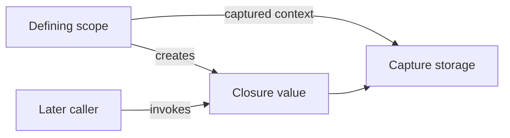

<TLDR>
  <TLDRCell label="what">
    闭包（closure）是可以保存、传递和调用的函数值，并能继续访问定义位置捕获的上下文。
  </TLDRCell>
  <TLDRCell label="trap">
    `@escaping`、`[weak self]` 和捕获列表都会改变生命周期或取值时机；机械套用模板，容易造成循环引用、工作静默丢失或陈旧快照。
  </TLDRCell>
  <TLDRCell label="fix">
    为每个闭包明确调用时机、调用次数、存储位置和捕获所有权；跨并发域时再检查 `@Sendable` 与隔离要求。
  </TLDRCell>
</TLDR>

## 是什么，为什么存在

<Term id="closure">闭包（closure）</Term>是自包含的可执行代码块。它具有函数类型，可以赋给变量、作为参数传入、从函数返回，并在定义它的作用域结束后继续使用所捕获的值。Swift 的全局函数、嵌套函数和闭包表达式都是闭包的不同形式。

闭包让 API 把“稍后做什么”或“如何处理一个值”交给调用方，而不必为每种行为声明新类型。集合排序、事件处理、完成回调、惰性求值和 SwiftUI 构建器都会接收函数值。只有捕获了外层上下文时，闭包才携带额外状态；不捕获任何值的函数仍然可以当作相同函数类型传递。

函数类型写成 `(参数类型) -> 返回类型`，不包含实参标签。例如，`(Order, Order) -> Bool` 表示接收两个 `Order` 并返回布尔值的比较器。调用闭包与调用函数相同，使用一对圆括号传入实参。

闭包表达式的完整形态是 `{ (parameters) -> ReturnType in statements }`。上下文足够时，Swift 可以推断参数和返回类型；单表达式闭包可以省略 `return`，短闭包还可以用 `$0`、`$1`。这些都是同一个类型系统上的语法缩写，不会改变捕获或逃逸规则。

真正需要评审的不是花括号有多短，而是函数值在哪里存活、何时运行，以及它依赖哪些外部状态。闭包一旦被存储、排队或跨并发域传递，调用点与定义点就会分离，生命周期和可变状态的错误也更难从局部代码看出。

## 工作原理

Swift 按词法作用域决定闭包能引用哪些名称。闭包使用外层局部变量时，编译器会保存所需的捕获上下文，使这些值在原作用域结束后仍可访问。捕获可变变量时，原作用域与闭包可以看到同一份捕获存储中的后续修改，而不是自动冻结创建时的值。

闭包是引用类型。把同一个有状态闭包赋给另一个变量，不会复制一份独立的捕获状态；两个变量调用的是同一个闭包上下文。再次调用产生闭包的工厂函数，才会建立一套新的捕获状态。

<Term id="capture-list">捕获列表（capture list）</Term>位于参数之前，例如 `{ [snapshot = value, weak owner] input in ... }`。列表项在创建闭包时初始化，因此 `snapshot` 保留当时求得的值；类实例没有标记 `weak` 或 `unowned` 时仍是强捕获。捕获列表不是“把所有东西都按值复制”的开关。

闭包参数默认是非逃逸的，也就是该函数值不能比当前函数调用活得更久。函数把参数存入外部变量、属性或队列，或者让它在返回后被调用时，参数类型必须标记 `@escaping`。这个标记只是允许逃逸，并不保证异步执行，也不保证只调用一次。

`@autoclosure` 让调用方传入的表达式自动包装成无参数闭包，从而推迟求值。它适合断言、短路逻辑和名称明确的惰性接口，但会在调用点隐藏花括号与副作用。自动闭包还要离开当前调用时，必须同时标记 `@autoclosure @escaping`。



这个流程把代码与上下文分开看。闭包值负责可调用行为，捕获上下文保存它所需的外部状态；之后的调用通过闭包访问该上下文。捕获类实例时，这条访问路径还可能形成所有权边，必须与存储闭包的对象一起检查。

判断一个闭包接口时，依次回答以下问题：

1. 闭包是同步使用，还是会被存储并在函数返回后调用？
2. 它可能调用零次、一次还是多次，是否存在取消路径？
3. 每个外层名称需要观察后续变化，还是需要创建时的快照？
4. 闭包强捕获了哪些类实例，谁又强持有这个闭包？
5. 闭包是否跨任务或执行器传递，因而需要 `@Sendable` 和隔离检查？

## 示例

### 从函数类型到尾随闭包

第一个示例把比较规则声明为 `(Order, Order) -> Bool`，再传给 `sorted(by:)`。参数类型和返回类型写出来后，闭包主体可以使用单表达式隐式返回。调用点也可以直接改写为 `orders.sorted { $0.total > $1.total }`，但命名比较器更适合重复使用或包含多条排序规则的场景。

<Depth level="quick">

```swift title="rank_orders.swift"
// # not executed here: Swift toolchain is not installed.
struct Order {
    let id: String
    let total: Int
}

let orders = [
    Order(id: "A-17", total: 80),
    Order(id: "B-04", total: 125),
    Order(id: "C-31", total: 95),
]

let descending: (Order, Order) -> Bool = { left, right in
    left.total > right.total
}

let ranked = orders.sorted(by: descending)
for order in ranked {
    print("\(order.id): \(order.total)")
}
```

```text
Not executed here: Swift toolchain is not installed.
```

</Depth>

尾随闭包只是调用语法：当最后一个实参是闭包时，可以把它移到圆括号外；闭包是唯一实参时还可以省略圆括号。函数有多个闭包参数时，后续尾随闭包保留参数标签。语法位置不会决定闭包是否逃逸，函数声明中的参数类型才决定这一点。

### 返回携带状态的闭包

`makeCounter(step:)` 的每次调用都会创建新的 `total` 捕获存储。`byTwo` 与 `sameCounter` 引用同一个闭包，因此交替调用会推进同一个计数；`byFive` 来自另一次工厂调用，拥有独立状态。这是“闭包是引用类型”对业务行为的直接影响。

```swift title="step_counter.swift"
// # not executed here: Swift toolchain is not installed.
func makeCounter(step: Int) -> () -> Int {
    var total = 0

    func advance() -> Int {
        total += step
        return total
    }

    return advance
}

let byTwo = makeCounter(step: 2)
let sameCounter = byTwo
let byFive = makeCounter(step: 5)

print(byTwo())
print(sameCounter())
print(byFive())
print(byTwo())
```

```text
Not executed here: Swift toolchain is not installed.
```

返回闭包很适合只有一个操作的小型状态机或预配置函数。状态需要多种操作、独立验证或清晰身份时，类型通常比一组互相捕获变量的闭包更易维护。并发调用这个计数器也不是自动安全的；共享可变捕获仍需要隔离或同步。

### 区分共享捕获与创建时快照

`live` 直接引用外层 `pointsPerOrder`，因此之后的赋值会影响计算。`snapshot` 的捕获列表在创建时初始化同名常量，外层变化不会改动它。`for`-`in` 的 `index` 则是每轮绑定的值，所以这里的三个读取器分别返回各轮索引，不会像某些 JavaScript 或 Python 写法那样全部读取最终值。

```swift title="capture_timing.swift"
// # not executed here: Swift toolchain is not installed.
func demonstrateCaptureTiming() {
    var pointsPerOrder = 2

    let live = { (orders: Int) in
        orders * pointsPerOrder
    }
    let snapshot = { [pointsPerOrder] (orders: Int) in
        orders * pointsPerOrder
    }

    pointsPerOrder = 5

    var readers: [() -> Int] = []
    for index in 0..<3 {
        readers.append { index }
    }

    print("live:", live(3))
    print("snapshot:", snapshot(3))
    print("loop:", readers.map { $0() })
}

demonstrateCaptureTiming()
```

```text
Not executed here: Swift toolchain is not installed.
```

快照改变的是读取时机，不一定改变引用所有权。若 `pointsPerOrder` 换成类实例，`[service]` 保存的仍是对该实例的强引用，只是不会跟随外层变量后来改指向另一个实例。需要非拥有关系时，应根据生命周期选择 `weak` 或 `unowned`。

### 存储逃逸的自动闭包

`enqueue(_:)` 把参数保存到数组，所以参数既是自动闭包，也是逃逸闭包。传入的字符串插值直到 `flush()` 调用提供者时才求值，因而会观察共享变量 `unreadCount` 的新值。这样的 API 必须用名称明确表达“现在不求值”。

```swift title="deferred_messages.swift"
// # not executed here: Swift toolchain is not installed.
struct MessageQueue {
    private var providers: [() -> String] = []

    mutating func enqueue(
        _ provider: @autoclosure @escaping () -> String
    ) {
        providers.append(provider)
    }

    mutating func flush() {
        providers.forEach { print($0()) }
        providers.removeAll()
    }
}

var unreadCount = 2
var queue = MessageQueue()

queue.enqueue("unread: \(unreadCount)")
print("queued")
unreadCount = 5
queue.flush()
```

```text
Not executed here: Swift toolchain is not installed.
```

如果调用方需要创建时的消息，应先算出 `let message = "unread: \(unreadCount)"` 再入队。更通用的公共 API 往往直接接收显式 `() -> String`，让延迟执行在调用点可见；`@autoclosure` 应留给语义非常稳定的窄接口。

## 陷阱

> [!PITFALL]
> 看到逃逸或异步闭包就机械添加 `[weak self]`，会把行为改成“对象消失时静默跳过”。本应完成的保存、回调或状态转换可能因此丢失。

**修复方法：** 先找出谁存储闭包，并决定工作是否应比发起对象活得更久。只有对象消失后确实应该放弃工作时才弱捕获；需要完成的操作可以强捕获，但必须避免从 `self` 经存储边回到该闭包的强引用循环，并提供清晰的取消策略。

> [!PITFALL]
> 把 `[value]` 一概描述为“按值捕获”会掩盖两个事实：列表项只在创建时求值，而结果若是类实例，闭包仍会强持有同一个对象。

**修复方法：** 分别写清“何时取得值”和“取得后如何拥有”。需要不可变快照时捕获小型值；需要让类实例可先释放时使用 `[weak object]` 并处理 `nil`。不要用捕获列表替代对象图分析。

> [!PITFALL]
> 为了“以后可能会异步”而给每个闭包参数添加 `@escaping`，会扩大 API 允许的生命周期，并让调用方必须按可被存储的回调来推理。

**修复方法：** 当前实现只在返回前调用闭包时，保持默认非逃逸。真正需要存储或延后调用时再添加 `@escaping`，并在 API 文档与测试中说明调用次数、终止路径、执行上下文和取消行为。

> [!PITFALL]
> `@autoclosure` 会隐藏表达式的执行时机。若实参会移除数组元素、访问可变状态或执行昂贵工作，普通函数调用的外观容易让评审者误以为副作用已经发生。

**修复方法：** 仅在函数名和领域惯例清楚表达惰性时使用自动闭包。可能逃逸、重复调用或跨并发域执行的惰性工作应使用显式闭包，并明确是否缓存结果。

> [!PITFALL]
> 从其他语言迁移的生成代码常声称 Swift `for`-`in` 循环中的闭包都会看到最终索引，并无条件加入 `[index]`。这混淆了每轮的模式绑定与循环外共享的可变变量。

**修复方法：** 先定位真正被捕获的声明。直接捕获每轮 `index` 会保留各轮值；如果闭包引用的是循环外声明并在循环中反复修改的 `var`，才会共享那份捕获存储。用循环结束后再调用的测试固定预期。

<Depth level="deep">

## 捕获上下文也是 API 语义

闭包的函数类型描述输入和输出，却不会完整表达调用次数、调用时间、所有权或执行器。两个参数都可以写成 `() -> Void`，其中一个在函数返回前同步执行，另一个则被长期存储并从任务中多次触发。设计和评审闭包 API 时，这些额外约束必须由类型属性、参数标签、文档与测试共同表达。

### 三种形式共享一个类型系统

全局函数有名字且不捕获局部值，嵌套函数有名字并可以捕获外层值，闭包表达式则使用轻量语法且通常没有名字。三者都能转换为匹配的函数类型，因此接收 `(Int) -> String` 的参数不关心调用方传入的是哪种形式。

函数类型中的参数没有调用标签。一个声明为 `func format(count: Int) -> String` 的函数，在作为 `(Int) -> String` 值传递后，通过变量调用时写成 `formatter(3)`。标签属于函数声明的调用接口，不是该函数值类型的一部分。

类型推断依赖周围上下文。`numbers.map { $0 * 2 }` 中，`map` 的泛型签名为闭包提供输入类型，表达式又确定输出类型。闭包单独存入变量而缺少上下文时，通常需要给参数或变量补上类型注解。

尾随闭包、参数简写和隐式返回只减少表面语法。过长闭包使用 `$0` 会让数据角色难以辨认；当主体包含分支、嵌套闭包或多个同类型参数时，命名参数比继续压缩更可靠。

### 捕获存储不是统一的复制规则

闭包只捕获其主体实际使用的外部声明，不会自动保存整个词法作用域。捕获可变局部变量时，编译器提供能被原作用域和闭包共同访问的存储；闭包逃逸后，这份存储也会继续存在。多次调用看到的修改因此可以累积。

不可变 `let` 的值不会在之后重新绑定，但值内部仍可能引用可变对象。捕获一个结构体快照会保存当时的结构体值；如果结构体含有类引用，快照中的引用仍指向同一类实例。值语义与对象身份需要分层判断。

访问实例成员通常意味着闭包捕获 `self`，而不是只捕获最终用到的那一个属性。逃逸闭包显式写 `self.`，正是为了让这种捕获在代码评审中可见。若只需要一个不会变化的小值，可以先取出局部常量，再在捕获列表中为其命名。

捕获方式可以按以下语义区分：

| 写法 | 初始化时机 | 外层后续变化 | 类实例所有权 |
| --- | --- | --- | --- |
| 直接引用外层 `var` | 形成捕获上下文时 | 可通过共享存储观察 | 经引用到的实例可能保持强拥有 |
| `[snapshot = value]` | 创建闭包时求值 | 不会改写 `snapshot` | 未标记时仍是强引用 |
| `[weak object]` | 创建闭包时取得弱引用 | 目标释放后变为 `nil` | 非拥有 |
| `[unowned object]` | 创建闭包时取得无主引用 | 目标先释放后再访问会失败 | 非拥有，要求生命周期保证 |

表格描述的是语义，不是性能排名。`weak` 与 `unowned` 只适用于类实例；二者的区别在于目标消失后的行为与需要证明的生命周期不变量。强引用循环的完整分析属于 `swift/arc`，但闭包评审必须至少画出闭包与存储者之间的两条边。

### 非逃逸与逃逸是生命周期契约

非逃逸不等于“恰好调用一次”。函数可以在返回前调用参数零次、多次或按分支调用，只要该函数值没有活过本次调用。非逃逸限制使编译器与读者都能进行更局部的生命周期和独占访问推理。

`@escaping` 同样不等于“异步”。函数可以把闭包存入属性后立刻调用，也可以只在未来事件发生时调用。该属性授予的是让参数离开当前调用的能力，所以调用方必须考虑捕获对象被延长生命周期、回调重入和多次触发。

类实例在逃逸闭包中使用成员时需要显式表达 `self`，或在捕获列表中写出 `self`。显式并不等于弱引用；`self.` 和 `[self]` 都可以是强捕获。只有 `[weak self]` 或 `[unowned self]` 会改变所有权。

结构体的 `mutating` 方法不能让逃逸闭包捕获可变的 `self`。方法返回后，该值的独占可变访问不能被一个任意存活的闭包继续共享。通常应捕获所需的不可变值，返回新的值，或把长期可变状态放入具有明确隔离的引用类型。

回调 API 还应说明重入行为。一个同步执行的非逃逸闭包可能在外层操作尚未完成时回调调用方；一个逃逸闭包也可能在函数返回前首次触发。只用“同步/异步”两个词不足以表达是否允许重入、并行调用或重复完成。

### 自动闭包隐藏了一层函数值

自动闭包只能包装无参数表达式，调用者看起来像传入普通值，函数内部拿到的却是 `() -> Value`。延迟求值是它的核心语义；如果函数立即且无条件调用提供者，使用自动闭包通常没有收益。

断言和日志接口适合自动闭包，因为调用者预期条件或消息可能不被求值。业务操作若有明显副作用，显式 `{ operation() }` 更容易暴露执行边界。公开 API 的命名应提示 `ifNeeded`、`lazy` 或 `deferred` 之类语义，不能只靠类型属性让调用者猜测。

逃逸自动闭包会把表达式引用的上下文一起延长。若提供者可调用多次，每次都可能重复副作用；若只应求值一次，接收方必须缓存结果或在状态中拒绝后续调用。自动闭包本身不提供“一次性”保证。

### `@Sendable` 增加并发约束

<Term id="sendable-closure">可发送闭包（sendable closure）</Term>的函数类型带有 `@Sendable`，表示该函数值可以安全地跨并发域传递。Swift 会检查其捕获值是否满足可发送性，并限制可能发生并发访问的可变捕获。普通闭包能正确串行运行，不代表它可以安全地从多个任务调用。

`@Sendable` 与 `@escaping` 回答不同问题。前者约束跨并发域传递的安全性，后者约束函数值能否比当前调用存活更久；一个 API 可能需要其中一个、两个都需要，或者都不需要。`async` 也只说明闭包可以挂起，不自动证明捕获安全。

在 actor 隔离代码中，闭包对属性的访问还受执行器约束。生成代码常把原有回调签名改成 `@Sendable`，却继续捕获非 `Sendable` 的可变类实例；也可能为了消除诊断而加上 `@unchecked Sendable`。正确修复是重新安排状态所有权、把操作放到 actor 上，或只传递不可变且可发送的数据。

严格并发检查把许多潜在数据竞争变成编译期问题，但编译通过不代表回调协议完整。重复完成、取消后继续写入和错误执行器上的业务顺序仍需要测试。测试应主动制造交错，而不只是顺序调用闭包。

### 方法引用与嵌套闭包仍然会捕获

把 `self.handleEvent` 作为函数值传递时，源码中没有显式的闭包表达式，但该方法引用仍要保留接收者才能完成之后的调用。如果长期存储者又能从 `self` 到达，这条隐藏的强捕获就可能闭合引用循环。评审捕获时必须把方法引用也当作带上下文的函数值。

改写成 `{ [weak self] event in self?.handleEvent(event) }` 可以表达非拥有关系，但同样会改变目标消失后的行为。若事件必须处理完毕，应重新设计存储关系或取消协议，而不是只让回调静默返回。包装闭包的价值是显式表达策略，不是固定使用 `weak`。

嵌套闭包还可能间接增强捕获。外层闭包用 `guard let self` 建立强局部引用后，内层逃逸闭包捕获的可能是这个强绑定，而不是原来的弱引用。只检查最外层的捕获列表会漏掉实际延长生命周期的内层函数值。

分析多层闭包时，从最终存活最久的闭包反向追踪每个自由名称。标出该名称来自属性、外层局部绑定还是捕获列表，再继续追踪它指向的对象。这样可以发现“外层是弱捕获，所以内层也弱”的错误推断。

### 回调还需要完成协议

函数类型不能表示完成回调必须恰好调用一次。实现可能在成功分支调用后继续落入通用清理分支再调用一次，也可能在提前返回或取消时漏掉调用。调用方若据此释放资源或恢复 continuation，重复与遗漏都会变成正确性问题。

一个完成协议至少应规定四件事：

1. 哪些终止路径会调用回调，取消是否算一种完成？
2. 回调最多调用几次，重复底层事件如何去重？
3. 回调在哪个 actor 或执行器上运行，是否允许并发调用？
4. 回调开始后能否重入发起对象，还是必须等状态提交完成？

对单次结果，`async throws` 往往能把返回、错误和取消放入结构化控制流，减少手写完成协议；但事件流、委托与桥接旧 API 仍需要闭包。选择 `async` 不是因为闭包过时，而是因为调用次数和生命周期是否更适合由语言结构表达。

桥接回调到 continuation 时，生成代码尤其容易在多个分支恢复两次。应让一个所有者原子地决定完成状态，随后断开回调存储，并测试成功与取消竞争。仅在每个分支旁写“只调用一次”的注释并不能建立互斥。

### 用测试验证捕获契约

捕获问题通常需要延迟调用才能暴露。测试应先创建闭包，再修改或释放它依赖的值，最后从另一个调用位置触发。把这三个阶段写开，比在创建后立即调用更能验证真实生命周期。

测试有状态工厂时，创建两个结果并交错调用。若两者应独立，输出序列必须分别推进；若它们应共享状态，API 名称和断言都应说明共享所有者。只连续测试一个闭包无法区分这两种设计。

测试弱捕获时，在外部保留闭包副本，再释放原对象并调用副本。这样既能发现意外强捕获，也能确认对象缺失分支满足业务要求。对 `unowned` 捕获，还要尝试构造违反生命周期顺序的公开调用序列。

并发闭包除了通过编译器检查，还要在测试中覆盖取消与交错。让多个任务接近同时触发回调，断言结果数量、顺序约束和最终状态。测试目标是证明协议，而不是依赖某次调度碰巧串行。

### 选择闭包还是具名类型

闭包适合一个清楚的操作和少量容易命名的上下文。若调用方需要暂停、取消、查询状态或执行多种命令，具名类型或协议通常能更直接地表达能力。把越来越多的状态藏进互相引用的闭包，会让所有权和测试入口逐渐消失。

设计接收闭包的 API 时，应把契约写进参数标签和文档：何时调用、在哪个隔离域调用、最多调用几次、由谁存储，以及取消后是否还可能调用。返回取消令牌或注册句柄时，还要明确释放句柄是否会解除闭包存储。

评审实现时，从存储位置开始，而不是只搜索 `@escaping`。属性、数组、任务、通知中心、订阅和方法引用都可能延长函数值的生命周期。然后展开每个捕获值内部的引用，确认没有通过服务或代理间接回到存储者。

### 把调用点读成契约

不同调用形式向评审者提供的线索不同，但都不能替代接收方声明。可以先按以下方式提出问题：

- 传入具名函数时，检查它是否实际携带接收者或其他上下文。
- 传入显式闭包时，检查自由名称、捕获列表和尾随闭包对应的参数标签。
- 传入自动闭包实参时，检查表达式究竟何时、几次被求值。
- 传入方法引用时，检查接收者是否因函数值而延长生命周期。

随后回到接收函数，确认这些线索与参数的逃逸、可发送性、隔离和调用次数契约一致。调用点看起来简单，只说明语法简短，并不说明执行模型简单。

最后用可证伪的测试验证契约：改变外层值以区分快照与共享捕获，交错调用多个工厂结果以验证状态独立，释放对象后触发外部保留的回调以验证所有权，并覆盖成功、错误与取消路径的调用次数。闭包代码短，不代表它的生命周期简单。

</Depth>

<Checkpoint id="swift/closures" />

## 延伸阅读

- [The Swift Programming Language：Closures](https://docs.swift.org/swift-book/documentation/the-swift-programming-language/closures/)
- [The Swift Programming Language：Automatic Reference Counting](https://docs.swift.org/swift-book/documentation/the-swift-programming-language/automaticreferencecounting/)
- [The Swift Programming Language：Attributes](https://docs.swift.org/swift-book/documentation/the-swift-programming-language/attributes/)
- [The Swift Programming Language：Concurrency](https://docs.swift.org/swift-book/documentation/the-swift-programming-language/concurrency/)
