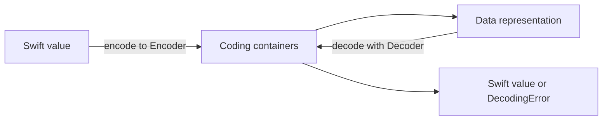

<TLDR>
  <TLDRCell label="what">
    `Codable` is an alias for `Encodable & Decodable` that describes external data with compiler-checked Swift types.
  </TLDRCell>
  <TLDRCell label="trap">
    Synthesis matches keys and value types; it neither applies property-declaration defaults nor validates business rules.
  </TLDRCell>
  <TLDRCell label="fix">
    Define the data contract first; use synthesis for simple shapes and `CodingKeys`, decoder strategies, or `init(from:)` when the formats differ.
  </TLDRCell>
</TLDR>

## What it is and why it exists

Swift's <Term id="codable">`Codable`</Term> combines `Encodable` and `Decodable`. `Encodable` writes a value to an external representation, while `Decodable` constructs a value from one. The protocols aren't tied to JSON; `JSONEncoder`, `JSONDecoder`, and the property-list coders are concrete formats built on the same system.

External data often contains only keys, arrays, and scalar values, while application code needs named models with known types. Working with `[String: Any]` throughout business logic scatters casts, missing-key behavior, and error handling. `Codable` moves that boundary into type declarations and lets the compiler generate repetitive, predictable conversion code for common shapes.

You meet it in network responses, disk snapshots, interprocess messages, and test fixtures. It fits data whose known format maps to Swift types; it doesn't turn arbitrary input into a trusted business object. Successful decoding proves only that the payload satisfied the decoding rules. Authorization, monetary ranges, string lengths, and cross-field constraints still require separate validation.

Conform to `Decodable` when you only read external data and to `Encodable` when you only write it. The smallest protocol avoids promising a reverse conversion by accident. It also prevents internal fields from entering output merely because a broad `Codable` conformance was convenient.

## How it works

The compiler can synthesize `init(from:)` and `encode(to:)` when the relevant stored properties of a structure or class conform to the target protocol. Without an explicit `CodingKeys`, property names become coding keys. Computed properties aren't stored state, so synthesis ignores them.

If you declare an enum named `CodingKeys` that conforms to `CodingKey`, the compiler uses it to choose participating properties and their external names. A <Term id="coding-key">coding key</Term> isn't an ad hoc string. It places the relationship between a model property and an external field in a checked type. An excluded property must still obtain a value after decoding, such as from its own default, or `Decodable` synthesis isn't possible.

A conversion follows this path:



1. `encode(to:)` requests a container from an `Encoder` and writes fields into it.
2. The concrete encoder converts the structure described by those containers into JSON, a property list, or another format.
3. `init(from:)` requests a container from a `Decoder` and reads values by key or index.
4. A missing key, `null`, type mismatch, or corrupt value causes the decoder to throw the corresponding error.

A <Term id="coding-container">coding container</Term> has one of three shapes. A keyed container represents fields addressed by `CodingKey`; an unkeyed container represents ordered elements; a single-value container represents one scalar or a custom type's chosen single representation. A type can request different containers at nested levels, but one value on one encoder or decoder should choose a container consistent with its data shape.

`JSONEncoder` and `JSONDecoder` also provide strategies for key names, dates, binary data, and nonfinite floating-point values. Strategies belong to coder instances, not model types, so producers and consumers must agree on the format. Keep configuration near the data boundary. Callers can then see the actual contract instead of depending on hidden state in a global instance.

Every `Encoder`, `Decoder`, and container maintains a `codingPath`. The path contains the keys and array indexes already entered, and error contexts carry it, so a deep failure can point to a location such as `orders[1].quantity`. `userInfo` can provide decoding context, but don't use it to hide core dependencies that belong in a function signature or model.

## Examples

These examples start with synthesis, then make compatibility and diagnostics increasingly explicit. Each is an independent Swift file with no application project or network dependency.

### Synthesis, custom keys, and date strategies

Every property in the first model is codable, so it needs only a `Codable` declaration and key mappings. The input uses an ISO 8601 date. The encoder uses the same strategy and sorts keys to make the demonstration output stable.

<Depth level="quick">

```swift
import Foundation

struct Book: Codable {
    let id: Int
    let title: String
    let publishedAt: Date

    enum CodingKeys: String, CodingKey {
        case id = "book_id"
        case title
        case publishedAt = "published_at"
    }
}

let input = Data(
    #"{"book_id":42,"title":"Systems","published_at":"2026-01-02T03:04:05Z"}"#.utf8
)
let decoder = JSONDecoder()
decoder.dateDecodingStrategy = .iso8601
let book = try decoder.decode(Book.self, from: input)
print("\(book.id) | \(book.title)")

let encoder = JSONEncoder()
encoder.dateEncodingStrategy = .iso8601
encoder.outputFormatting = [.sortedKeys]
let encoded = try encoder.encode(book)
print(String(decoding: encoded, as: UTF8.self))
```

```text
42 | Systems
{"book_id":42,"published_at":"2026-01-02T03:04:05Z","title":"Systems"}
```

</Depth>

`CodingKeys` lets the Swift property remain `publishedAt` while preserving `published_at` in the external contract. Date strategies must be configured separately in both directions; setting a decoder doesn't affect a newly created encoder. `sortedKeys` stabilizes presentation only and doesn't change object-field semantics.

### Explicit missing values and unknown enum cases

The second model only reads data, so it conforms to `Decodable`. A missing `units` becomes `0` by contract. Both a missing `note` and an explicit `null` become `nil`, while a new server-side state is retained in `.unknown`.

```swift
import Foundation
enum Availability: Decodable, CustomStringConvertible {
    case inStock
    case unknown(String)
    init(from decoder: Decoder) throws {
        let value = try decoder.singleValueContainer().decode(String.self)
        self = value == "in_stock" ? .inStock : .unknown(value)
    }
    var description: String {
        switch self {
        case .inStock: "in_stock"
        case .unknown(let value): "unknown(\(value))"
        }
    }
}

struct Product: Decodable {
    let name: String
    let note: String?
    let units: Int
    let availability: Availability
    enum CodingKeys: String, CodingKey { case name, note, units, availability }
    init(from decoder: Decoder) throws {
        let values = try decoder.container(keyedBy: CodingKeys.self)
        name = try values.decode(String.self, forKey: .name)
        note = try values.decodeIfPresent(String.self, forKey: .note)
        units = try values.decodeIfPresent(Int.self, forKey: .units) ?? 0
        availability = try values.decode(Availability.self, forKey: .availability)
    }
}

let payloads = [
    #"{"name":"Cable","availability":"in_stock"}"#,
    #"{"name":"Dock","note":null,"units":4,"availability":"back_order"}"#,
]

for payload in payloads {
    let product = try JSONDecoder().decode(Product.self, from: Data(payload.utf8))
    print("\(product.name) | \(product.note ?? "none") | \(product.units) | \(product.availability)")
}
```

```text
Cable | none | 0 | in_stock
Dock | none | 4 | unknown(back_order)
```

This tolerance is a field-level decision, not “ignore every error.” `name` and `availability` must still exist and have the right types; only `units` explicitly accepts absence. If an unknown state must stop business processing, throw `dataCorruptedError` instead of retaining the string.

### Locating a failure with `codingPath`

The third example deliberately makes the second array element's `quantity` a string. After catching a specific <Term id="decoding-error">decoding error</Term>, the code renders `codingPath` as a readable location without printing the entire, potentially sensitive payload.

```swift
import Foundation

struct Order: Decodable {
    struct Item: Decodable {
        let sku: String
        let quantity: Int
    }

    let items: [Item]
}

func render(_ path: [any CodingKey]) -> String {
    path.reduce("") { result, key in
        if let index = key.intValue { return result + "[\(index)]" }
        return result.isEmpty ? key.stringValue : result + "." + key.stringValue
    }
}

let input = Data(
    #"{"items":[{"sku":"A-1","quantity":2},{"sku":"B-2","quantity":"many"}]}"#.utf8
)

do {
    _ = try JSONDecoder().decode(Order.self, from: input)
} catch DecodingError.typeMismatch(_, let context) {
    print("typeMismatch at \(render(context.codingPath))")
    print("Expected Int")
}
```

```text
typeMismatch at items[1].quantity
Expected Int
```

The error case explains how decoding failed, while `codingPath` explains where. Boundary code generally also handles `keyNotFound`, `valueNotFound`, and `dataCorrupted`, then converts them to an application error type. Preserve the underlying error as a cause so logs and tests retain the precise context.

### Reading and writing a nested object with a flat model

The last example keeps the Swift model flat while preserving a nested `recipient` object in JSON. Because the two shapes differ, both directions need manual implementations that use the same key sets.

```swift
import Foundation
struct Shipment: Codable {
    let id: String
    let recipientName: String
    let city: String
    enum CodingKeys: String, CodingKey { case id, recipient }
    enum RecipientKeys: String, CodingKey { case name, city }
    init(id: String, recipientName: String, city: String) {
        self.id = id
        self.recipientName = recipientName
        self.city = city
    }
    init(from decoder: Decoder) throws {
        let root = try decoder.container(keyedBy: CodingKeys.self)
        id = try root.decode(String.self, forKey: .id)
        let recipient = try root.nestedContainer(keyedBy: RecipientKeys.self, forKey: .recipient)
        recipientName = try recipient.decode(String.self, forKey: .name)
        city = try recipient.decode(String.self, forKey: .city)
    }
    func encode(to encoder: Encoder) throws {
        var root = encoder.container(keyedBy: CodingKeys.self)
        try root.encode(id, forKey: .id)
        var recipient = root.nestedContainer(keyedBy: RecipientKeys.self, forKey: .recipient)
        try recipient.encode(recipientName, forKey: .name)
        try recipient.encode(city, forKey: .city)
    }
}

let shipment = Shipment(id: "S-7", recipientName: "Mina", city: "Paris")
let encoder = JSONEncoder()
encoder.outputFormatting = .sortedKeys
let data = try encoder.encode(shipment)
print(String(decoding: data, as: UTF8.self))
let decoded = try JSONDecoder().decode(Shipment.self, from: data)
print("\(decoded.recipientName) | \(decoded.city)")
```

```text
{"id":"S-7","recipient":{"city":"Paris","name":"Mina"}}
Mina | Paris
```

`nestedContainer` appends subsequent keys to the same `codingPath`, so a failure inside the object still has a complete path. If the application also needs a recipient concept, a nested `Recipient: Codable` model is usually simpler. Write this mapping only when the domain model intentionally omits the transport layer's nesting.

## Pitfalls

### Treating a property default as a decoding default

> [!PITFALL]
> `var units = 0` doesn't make synthesized `init(from:)` retain `0` when JSON omits `units`. The synthesized implementation still tries to decode that key and throws `keyNotFound`.

**Fix:** If the contract permits absence, write a custom initializer and use `decodeIfPresent(...) ?? 0`. Keep strict decoding when the field is required. You can instead exclude an internal property from `CodingKeys` and give it a default, but that says the property never belongs to the external format.

### Conflating a missing key with `null`

> [!PITFALL]
> `decodeIfPresent` returns `nil` both when a key is absent and when it is present with `null`. That loses information when a patch endpoint uses those states to mean “leave unchanged” and “clear.”

**Fix:** Call `contains(_:)` first to detect presence, then `decodeNil(forKey:)` to detect explicit null, and finally decode a nonnull value. A three-state enum is usually clearer than stacking optionals.

### Assuming key conversion understands acronyms

> [!PITFALL]
> `.convertFromSnakeCase` turns `html_url` into `htmlUrl`; it doesn't infer that your property is spelled `htmlURL`. Automatic strategies also aren't lossless inverses across every naming convention.

**Fix:** Use explicit `CodingKeys` for acronyms, legacy fields, and irregular keys. Before adopting a global strategy, test production keys with consecutive, leading, or trailing underscores and acronyms. Don't combine a strategy with hand-written mappings whose result is hard to predict.

### Letting date strategies drift across the boundary

> [!PITFALL]
> The default date behavior of `JSONEncoder` and `JSONDecoder` isn't an ISO 8601 string and mustn't be assumed to be a Unix timestamp. Generated clients often configure one direction and omit the other.

**Fix:** Put the unit, timezone, and string format in the interface contract, then configure matching encoder and decoder strategies. Round-trip a fixed instant and also test real server samples. A current timestamp can hide precision and timezone differences.

### Erasing diagnostics with `try?`

> [!PITFALL]
> `try? decoder.decode(...)` compresses every failure into `nil`, so callers can't distinguish a missing key, a wrong type, a new enum value, or malformed JSON. It also discards the most useful `codingPath`.

**Fix:** Catch specific `DecodingError` cases at the data boundary, record a redacted path, error category, and request identifier, then wrap the cause in a domain error. Tests should assert the category and path, not merely that “the result is empty.”

### Equating successful decoding with valid business data

> [!PITFALL]
> `Codable` checks whether a representation can construct the target type. It doesn't check that a price is nonnegative, a URL has an allowed host, or a user may claim a role. Malicious input with the right primitive types can still decode.

**Fix:** Separate transport models from validated domain models, or run an explicit validator after decoding. Bound sizes, ranges, formats, and cross-field invariants. Authorization decisions must use trusted server state rather than fields supplied in a client payload.

<Depth level="deep">

## Deep mechanics: containers define shape

A keyed container fits object-shaped data, with each field addressed by a `CodingKey`. An unkeyed container fits an array or sequence whose positions carry meaning and advances through `currentIndex`. A single-value container fits a string wrapper, scalar enum, or a type's chosen whole representation. “Single value” describes that layer's encoding shape, not the type's conceptual complexity.

### Synthesis boundaries

Synthesis is compiler generation of protocol requirements, not runtime reflection. A model's encodable structure is fixed at compile time, so adding a participating stored property that doesn't conform prevents synthesis directly instead of failing only when some payload arrives.

A generic model can use conditional conformance, providing `Codable` only when its type parameters are also `Codable`. This retains boundary constraints more effectively than erasing every value to `Any`, and it makes nonencodable combinations visible at call sites.

When you write `CodingKeys`, case names must correspond to the properties that participate in synthesis. Renaming fields alone doesn't require two manual protocol methods. Take over the implementation only when the data shape, tolerance rules, or conversion logic exceed a one-to-one mapping.

Nested objects don't automatically require manual containers. If the Swift model preserves the same nesting, making the child structure `Codable` usually gives the clearest synthesized implementation. Reach for `nestedContainer`, `nestedUnkeyedContainer`, or `superDecoder()` only when flattening an external shape, interpreting dynamic keys as data, or decoding a discriminated union at one level.

A heterogeneous array can't restore concrete types automatically from `[any Codable]`, because the payload carries no Swift metatype. Define an enum with a discriminator field, read that discriminator in a custom `init(from:)`, and then decode the matching payload. Whether an unknown discriminator throws, retains raw data, or skips the item is an interface compatibility policy, not a choice for a generic helper.

Custom `encode(to:)` and `init(from:)` needn't be symmetric, but asymmetry must be an explicit contract. Accepting a legacy field while emitting only its replacement can support migration; omitting a secret prevents disclosure. If the system requires a true round trip, test domain equivalence for `decode(encode(value))` instead of comparing JSON key order.

### Context isn't implicit global state

`userInfo` can carry a locale, version, or policy object into one encoding or decoding operation. Define keys centrally and turn a missing value into a clear error. Force-casting absent context deep in a model merely converts a format problem into an obscure runtime failure.

Context can reasonably affect representation, but it shouldn't inject a database, network client, or permission principal. Those dependencies give pure data conversion hidden side effects and make the same payload decode differently under mutable external state.

Test custom conformances with valid context, no context, and context of the wrong type. Those cases verify whether a default truly exists and prevent callers from reusing one key for incompatible values.

## Deep mechanics: schema evolution is API design

Synthesized decoding generally ignores unknown extra object keys, so adding an unrelated server field doesn't break an old client. Adding a required property makes old payloads throw `keyNotFound`; only an optional or a deliberate default may preserve compatibility. A rename needs `CodingKeys` or migration logic, because renaming the Swift property alone changes its default external key.

A raw-string enum fails synthesized decoding when it sees a value it doesn't know. That strictness fits security states or commands that must be exhaustive; a server-extensible display status usually needs `.unknown(String)`. Retaining the raw value preserves observability, but business branches must still decide explicitly what the unknown state may do.

Property wrappers change the stored property seen by synthesis, so coding behavior applies to the wrapper's backing storage. A wrapper's `init(from:)` can handle a present but malformed value, yet it might not handle a completely absent key because failure can occur first in the outer keyed container. Test missing, `null`, and wrong-type cases, and be cautious with container overloads specialized to a wrapper type.

### Errors are part of the boundary contract

`keyNotFound` means a required key is absent, `valueNotFound` means a nonoptional target encountered null, `typeMismatch` means the representation has the wrong type, and `dataCorrupted` means a value or document violates the format. A caller can map these cases to separate telemetry classes or user guidance without exposing the payload.

`DecodingError.Context.debugDescription` helps diagnostics, but it isn't stable user-interface copy. Application errors should retain the underlying cause and path while returning controlled, localizable text to users.

Logs need only a request identifier, model type, error category, and redacted path. Recording complete JSON may simplify reproduction, but it can copy tokens, email addresses, or health data into a system with a longer retention period.

### A round trip isn't byte identity

Decoding drops unknown fields that the model never reads, so encoding the model can't recreate them. Tolerant enums, defaults, and format migrations can also produce output unlike the input while retaining an acceptable domain meaning.

JSON object key order has no business meaning, and floating-point values or dates can have different equivalent representations. Tests should compare model values or a defined canonical form, not treat an ordinary encoder's bytes as a universal canonicalization algorithm.

If bytes feed a signature, hash, or cache key, define canonicalization separately and use a dedicated implementation. Setting `sortedKeys` alone doesn't settle all differences in numbers, escaping, and Unicode representation.

Round-trip tests still matter because they expose missing keys and asymmetric implementations. Combine them with fixed golden payloads, invalid payloads, and cross-version samples rather than letting one successful round trip replace compatibility testing.

Once a data format reaches disk or another process, it is a cross-version protocol. Keep golden payloads for important models and test old data into the new model, new output into old consumers, and encode-then-decode behavior separately. A version field helps only when migration code reads it and executes the corresponding branch.

</Depth>

<Checkpoint id="swift/codable" />

## Further reading

- [Apple documentation: Codable](https://developer.apple.com/documentation/swift/codable/)
- [Apple documentation: Encoding and Decoding Custom Types](https://developer.apple.com/documentation/foundation/encoding-and-decoding-custom-types)
- [Apple documentation: JSONDecoder](https://developer.apple.com/documentation/foundation/jsondecoder)
- [Swift Evolution SE-0166: Swift Archival & Serialization](https://raw.githubusercontent.com/swiftlang/swift-evolution/main/proposals/0166-swift-archival-serialization.md)
- [Swift 6.3 release notes](https://www.swift.org/blog/swift-6.3-released/)
