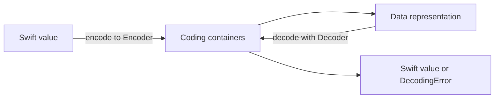

<TLDR>
  <TLDRCell label="what">
    `Codable` 是 `Encodable & Decodable` 的类型别名，用编译器可检查的 Swift 类型描述外部数据。
  </TLDRCell>
  <TLDRCell label="trap">
    自动合成只匹配键和值的类型，不会应用属性声明中的默认值，也不会验证业务规则。
  </TLDRCell>
  <TLDRCell label="fix">
    先写清数据契约；简单结构使用合成，格式不一致时用 `CodingKeys`、解码策略或自定义 `init(from:)`。
  </TLDRCell>
</TLDR>

## 是什么，为什么存在

Swift 的 <Term id="codable">`Codable`</Term> 是 `Encodable` 与 `Decodable` 的组合。`Encodable` 把值写入某种外部表示，`Decodable` 从外部表示构造值。协议本身不绑定 JSON；`JSONEncoder`、`JSONDecoder` 和属性列表编解码器只是采用这套协议的具体格式实现。

外部数据通常只有键、数组和标量，应用代码却需要命名清晰、类型确定的模型。如果直接在业务逻辑中操作 `[String: Any]`，类型转换、缺失键和错误路径会散落在各处。`Codable` 把这个边界收进类型声明，并允许编译器为常见结构生成重复但可预测的转换代码。

你会在网络响应、磁盘快照、进程间消息和测试夹具中遇到它。它适合格式已知且能映射为 Swift 类型的数据，不适合把任意输入自动变成可信业务对象。解码成功只说明载荷满足解码规则；权限、金额范围、字符串长度和跨字段约束仍要单独验证。

只需要读取外部数据时，应遵循 `Decodable`；只需要写出时，应遵循 `Encodable`。使用最小协议能避免无意间承诺反向转换，也不会让内部字段因为一个宽泛的 `Codable` 声明而自动进入输出。

## 工作原理

当一个结构体或类的相关存储属性都遵循目标协议时，编译器可以合成 `init(from:)` 和 `encode(to:)`。没有显式 `CodingKeys` 时，属性名就是编码键。计算属性不属于存储状态，因此不会参与自动合成。

如果声明名为 `CodingKeys`、遵循 `CodingKey` 的枚举，编译器会用它决定参与转换的属性及其外部名称。<Term id="coding-key">编码键（coding key）</Term>不是随手拼接的字符串；它把模型属性与外部字段之间的关系放进一个可检查的类型。被排除的属性必须能在解码后取得值，例如它本身已有默认值，否则无法合成 `Decodable`。

一次转换经过以下路径：



1. `encode(to:)` 向 `Encoder` 请求容器，再把字段写入容器。
2. 具体编码器把容器表达的结构转换为 JSON、属性列表或其他格式。
3. `init(from:)` 从 `Decoder` 请求容器，并按键或索引读取值。
4. 键缺失、值为 `null`、类型不匹配或数据损坏时，解码器抛出对应错误。

<Term id="coding-container">编码容器（coding container）</Term>有三种形状。键控容器表示以 `CodingKey` 定位的字段，无键容器表示有顺序的元素，单值容器表示一个标量或由自定义类型选择的单一表示。类型可以在嵌套层级中请求不同容器，但同一个编码器或解码器上的一个值应选择与其数据形状一致的容器。

`JSONEncoder` 与 `JSONDecoder` 还提供键名、日期、二进制数据和非有限浮点数等策略。策略属于编解码器实例，而不是模型类型；生产端和消费端必须约定相同格式。把配置集中在数据边界附近，调用方才能知道实际契约，而不是依赖某个全局实例的隐含状态。

每个 `Encoder`、`Decoder` 和容器都维护 `codingPath`。路径由已经进入的键和数组索引组成，错误上下文会携带它，因此深层失败可以定位到 `orders[1].quantity` 这类位置。`userInfo` 可以传入解码所需的上下文，但不应被用来隐藏本该出现在函数签名或模型中的核心依赖。

## 示例

三个示例从合成开始，再逐步收紧兼容性和诊断行为。代码都作为独立 Swift 文件执行，不依赖应用工程或网络。

### 合成、自定义键与日期策略

第一个模型的属性都可编码，因此只需要声明 `Codable` 和键映射。输入使用 ISO 8601 日期；编码端采用相同策略，并排序键以得到稳定的演示输出。

<Depth level="quick">

```swift
import Foundation

struct Book: Codable {
    let id: Int
    let title: String
    let publishedAt: Date

    enum CodingKeys: String, CodingKey {
        case id = "book_id"
        case title
        case publishedAt = "published_at"
    }
}

let input = Data(
    #"{"book_id":42,"title":"Systems","published_at":"2026-01-02T03:04:05Z"}"#.utf8
)
let decoder = JSONDecoder()
decoder.dateDecodingStrategy = .iso8601
let book = try decoder.decode(Book.self, from: input)
print("\(book.id) | \(book.title)")

let encoder = JSONEncoder()
encoder.dateEncodingStrategy = .iso8601
encoder.outputFormatting = [.sortedKeys]
let encoded = try encoder.encode(book)
print(String(decoding: encoded, as: UTF8.self))
```

```text
42 | Systems
{"book_id":42,"published_at":"2026-01-02T03:04:05Z","title":"Systems"}
```

</Depth>

`CodingKeys` 让 Swift 属性继续采用 `publishedAt`，同时保持外部契约中的 `published_at`。日期策略必须在两个方向分别配置；设置解码器不会改变之后新建的编码器。`sortedKeys` 只用于让输出顺序稳定，不改变对象字段的语义。

### 明确缺失值与未知枚举值

第二个示例只读取数据，因此模型遵循 `Decodable`。`units` 缺失时按契约变为 `0`，`note` 对缺失和显式 `null` 都变为 `nil`，服务端新增的状态则保留在 `.unknown` 中。

```swift
import Foundation
enum Availability: Decodable, CustomStringConvertible {
    case inStock
    case unknown(String)
    init(from decoder: Decoder) throws {
        let value = try decoder.singleValueContainer().decode(String.self)
        self = value == "in_stock" ? .inStock : .unknown(value)
    }
    var description: String {
        switch self {
        case .inStock: "in_stock"
        case .unknown(let value): "unknown(\(value))"
        }
    }
}

struct Product: Decodable {
    let name: String
    let note: String?
    let units: Int
    let availability: Availability
    enum CodingKeys: String, CodingKey { case name, note, units, availability }
    init(from decoder: Decoder) throws {
        let values = try decoder.container(keyedBy: CodingKeys.self)
        name = try values.decode(String.self, forKey: .name)
        note = try values.decodeIfPresent(String.self, forKey: .note)
        units = try values.decodeIfPresent(Int.self, forKey: .units) ?? 0
        availability = try values.decode(Availability.self, forKey: .availability)
    }
}

let payloads = [
    #"{"name":"Cable","availability":"in_stock"}"#,
    #"{"name":"Dock","note":null,"units":4,"availability":"back_order"}"#,
]

for payload in payloads {
    let product = try JSONDecoder().decode(Product.self, from: Data(payload.utf8))
    print("\(product.name) | \(product.note ?? "none") | \(product.units) | \(product.availability)")
}
```

```text
Cable | none | 0 | in_stock
Dock | none | 4 | unknown(back_order)
```

这里的容错是字段级决策，不是“所有错误都忽略”。`name` 和 `availability` 仍然必须存在且类型正确；只有 `units` 明确接受缺失。若未知状态必须阻止业务流程，就应抛出 `dataCorruptedError`，而不是保留字符串。

### 用 `codingPath` 定位失败

第三个示例让第二个数组元素的 `quantity` 故意使用字符串。捕获具体的 <Term id="decoding-error">解码错误（decoding error）</Term> 后，代码把 `codingPath` 渲染为可读位置，而不打印可能包含敏感数据的整个载荷。

```swift
import Foundation

struct Order: Decodable {
    struct Item: Decodable {
        let sku: String
        let quantity: Int
    }

    let items: [Item]
}

func render(_ path: [any CodingKey]) -> String {
    path.reduce("") { result, key in
        if let index = key.intValue { return result + "[\(index)]" }
        return result.isEmpty ? key.stringValue : result + "." + key.stringValue
    }
}

let input = Data(
    #"{"items":[{"sku":"A-1","quantity":2},{"sku":"B-2","quantity":"many"}]}"#.utf8
)

do {
    _ = try JSONDecoder().decode(Order.self, from: input)
} catch DecodingError.typeMismatch(_, let context) {
    print("typeMismatch at \(render(context.codingPath))")
    print("Expected Int")
}
```

```text
typeMismatch at items[1].quantity
Expected Int
```

错误类别说明失败方式，`codingPath` 说明失败位置。实际边界代码通常还要处理 `keyNotFound`、`valueNotFound` 和 `dataCorrupted`，然后转换为应用自己的错误类型。保留底层错误作为原因，能让日志和测试继续访问精确上下文。

### 在扁平模型中读写嵌套对象

最后一个示例让 Swift 模型保持扁平，同时让 JSON 保留嵌套的 `recipient` 对象。因为两种形状不同，两个方向都需要手写，并且必须使用相同的键集合。

```swift
import Foundation
struct Shipment: Codable {
    let id: String
    let recipientName: String
    let city: String
    enum CodingKeys: String, CodingKey { case id, recipient }
    enum RecipientKeys: String, CodingKey { case name, city }
    init(id: String, recipientName: String, city: String) {
        self.id = id
        self.recipientName = recipientName
        self.city = city
    }
    init(from decoder: Decoder) throws {
        let root = try decoder.container(keyedBy: CodingKeys.self)
        id = try root.decode(String.self, forKey: .id)
        let recipient = try root.nestedContainer(keyedBy: RecipientKeys.self, forKey: .recipient)
        recipientName = try recipient.decode(String.self, forKey: .name)
        city = try recipient.decode(String.self, forKey: .city)
    }
    func encode(to encoder: Encoder) throws {
        var root = encoder.container(keyedBy: CodingKeys.self)
        try root.encode(id, forKey: .id)
        var recipient = root.nestedContainer(keyedBy: RecipientKeys.self, forKey: .recipient)
        try recipient.encode(recipientName, forKey: .name)
        try recipient.encode(city, forKey: .city)
    }
}

let shipment = Shipment(id: "S-7", recipientName: "Mina", city: "Paris")
let encoder = JSONEncoder()
encoder.outputFormatting = .sortedKeys
let data = try encoder.encode(shipment)
print(String(decoding: data, as: UTF8.self))
let decoded = try JSONDecoder().decode(Shipment.self, from: data)
print("\(decoded.recipientName) | \(decoded.city)")
```

```text
{"id":"S-7","recipient":{"city":"Paris","name":"Mina"}}
Mina | Paris
```

`nestedContainer` 会把后续键追加到同一条 `codingPath`，因此内部字段失败时仍能得到完整路径。如果应用本身也需要收件人这个概念，直接定义嵌套的 `Recipient: Codable` 通常更简单；只有领域模型刻意不保留传输层嵌套时，才值得手写这段映射。

## 陷阱

### 把属性默认值当作解码默认值

> [!PITFALL]
> `var units = 0` 不会让合成的 `init(from:)` 在 JSON 缺少 `units` 时自动保留 `0`。合成实现仍会尝试解码该键，并抛出 `keyNotFound`。

**修复方法：** 如果契约允许缺失，编写自定义初始化器并使用 `decodeIfPresent(...) ?? 0`。如果字段必须存在，就保留严格解码。另一种做法是从 `CodingKeys` 排除内部属性并给它默认值，但那表示该属性从不属于外部格式。

### 混淆缺失键与 `null`

> [!PITFALL]
> `decodeIfPresent` 对“键不存在”和“键存在但值为 `null`”都返回 `nil`。当补丁接口用这两种状态分别表示“不修改”和“清空”时，信息会丢失。

**修复方法：** 先用 `contains(_:)` 判断键是否存在，再用 `decodeNil(forKey:)` 判断显式空值，最后解码非空值。把三态模型写成枚举通常比叠加多个可选值更清楚。

### 认为键转换策略总能处理缩写

> [!PITFALL]
> `.convertFromSnakeCase` 会把 `html_url` 转为 `htmlUrl`，它不会猜出模型属性写作 `htmlURL`。自动策略也不是所有命名约定之间的无损双向映射。

**修复方法：** 对缩写、旧字段和不规则键使用显式 `CodingKeys`。选用全局策略前，用生产载荷覆盖连续下划线、首尾下划线和缩写；不要同时依赖策略与难以推断的手写映射。

### 让日期策略在边界两端漂移

> [!PITFALL]
> `JSONEncoder` 与 `JSONDecoder` 的默认日期行为不是 ISO 8601 字符串，也不能假定为 Unix 时间戳。生成的客户端常配置了一个方向，却遗漏另一个方向。

**修复方法：** 在接口契约中明确单位、时区和字符串格式，再为编码器与解码器成对设置策略。用固定时刻做往返测试，并另外测试服务端真实样本；不要用当前时间掩盖精度或时区差异。

### 用 `try?` 吞掉诊断信息

> [!PITFALL]
> `try? decoder.decode(...)` 把所有失败压成 `nil`，调用方无法区分缺键、类型错误、未知枚举值和损坏的 JSON。它还会丢掉最有用的 `codingPath`。

**修复方法：** 在数据边界捕获具体 `DecodingError`，记录经过脱敏的路径、错误类别和请求标识，再把原因包装进领域错误。测试应断言错误类别与路径，而不只断言“结果为空”。

### 把解码成功当作业务验证成功

> [!PITFALL]
> `Codable` 检查表示能否构造目标类型，不会验证价格是否非负、URL 是否指向允许的主机，或用户是否有权声明某个角色。类型正确的恶意输入仍可能通过解码。

**修复方法：** 把传输模型与已验证的领域模型分开，或者在解码后调用显式验证器。对大小、范围、格式和跨字段不变量设限；授权决策必须依据可信服务端状态，不能依据客户端载荷中的字段。

<Depth level="deep">

## 深入：容器决定数据形状

键控容器适合对象式数据，每个字段通过 `CodingKey` 访问。无键容器适合数组或位置有含义的序列，并通过 `currentIndex` 推进。单值容器适合字符串包装器、标量枚举或一个类型选择的整体表示；它不表示“类型一定简单”，只表示该层只有一个编码值。

### 合成的边界

合成是编译器生成协议要求，不是运行时反射。模型的可编码结构在编译时确定，所以新增一个参与转换、却不符合协议的存储属性会直接阻止合成，而不是等到某份载荷到来才失败。

泛型模型可以使用条件一致性，只在类型参数也遵循 `Codable` 时提供 `Codable`。这比把所有类型擦除为 `Any` 更能保留边界约束，也能让调用点看到无法编码的组合。

手写 `CodingKeys` 时，键的 case 名必须与参与合成的属性对应。只想重命名字段时无需手写两个协议方法；只有数据形状、容错规则或转换逻辑超出一对一映射时才接管实现。

嵌套对象不一定需要手写容器。如果 Swift 模型保留相同嵌套结构，让子结构也遵循 `Codable`，合成实现通常最清楚。只有模型要把外部嵌套结构压平、动态键本身承载数据，或同一层需要判别联合类型时，才直接调用 `nestedContainer`、`nestedUnkeyedContainer` 或 `superDecoder()`。

异构数组不能靠 `[any Codable]` 自动恢复具体类型，因为载荷没有提供 Swift 元类型。稳定做法是定义带判别字段的枚举，在自定义 `init(from:)` 中先读取判别值，再解码对应载荷。未知判别值是抛错、保留原始值还是跳过，属于接口兼容策略，不能由通用辅助函数擅自决定。

自定义 `encode(to:)` 与 `init(from:)` 不必对称，但不对称必须是明确契约。例如，只接收旧字段而只输出新字段可以支持迁移；省略秘密字段可以防止外泄。若系统需要真正往返，就应测试 `decode(encode(value))` 的领域等价性，而不是只比较 JSON 字节顺序。

### 上下文不是隐式全局状态

`userInfo` 可以向一轮编码或解码传递区域、版本或策略对象。键应集中定义，取值失败要产生明确错误；在模型深处强制转换一个不存在的上下文值，只会把格式错误变成难懂的运行时失败。

上下文适合影响表示方式，不适合注入数据库、网络客户端或权限主体。后者让纯数据转换产生隐藏副作用，也使相同载荷的结果取决于外部可变状态。

测试自定义一致性时，应同时覆盖有上下文、无上下文和上下文类型错误。这样可以确认默认行为是否真的存在，也能防止多个调用方用同一个键传入不同类型。

## 深入：把格式演进当作 API 设计

合成解码通常会忽略对象中的额外未知键，因此服务端增加无关字段不会破坏旧客户端。增加新的必需属性则会让旧载荷触发 `keyNotFound`；把字段改为可选或提供经过讨论的默认值，才可能保持兼容。重命名字段需要 `CodingKeys` 或迁移初始化器，单纯重命名 Swift 属性会改变默认外部键。

字符串原始值枚举遇到未知值时，合成解码会失败。这种严格性适合安全状态或必须穷举的命令；服务端可扩展的展示状态通常需要 `.unknown(String)`。保留原始值能继续观测新状态，但业务分支仍必须显式决定未知状态能做什么。

属性包装器会改变合成所看到的存储属性：编解码行为落在包装器的后备存储上。包装器的 `init(from:)` 可以处理键存在但值异常的情况，却不一定能处理键完全缺失，因为失败可能先发生在外层键控容器。为默认值设计包装器时，应同时测试缺失、`null` 和错误类型，并谨慎提供只针对该包装器类型的容器重载。

### 错误也是边界契约

`keyNotFound` 表示必需键缺失，`valueNotFound` 表示非可选目标遇到空值，`typeMismatch` 表示表示类型不符，`dataCorrupted` 表示值或整体数据不满足格式。调用方可以把它们映射为不同的遥测分类或用户提示，而不必暴露原始载荷。

`DecodingError.Context.debugDescription` 适合诊断，但不是稳定的用户界面文案。应用错误应保存底层原因和路径，同时向用户返回受控、可本地化的信息。

日志只需要请求标识、模型类型、错误类别和脱敏路径。记录完整 JSON 虽然方便复现，却可能把令牌、邮箱或健康数据复制到保留时间更长的日志系统。

### 往返不等于字节相同

解码会忽略模型不读取的未知字段，重新编码后这些字段不会凭空恢复。容错枚举、默认值和格式迁移也可能让输出与输入不同，但仍保持领域上可接受的含义。

JSON 对象的键顺序没有业务含义，浮点数和日期还可能存在等价的不同表示。测试应比较模型值或经过定义的规范形式，不应把普通编码器的字节输出当作通用规范化算法。

如果字节序列参与签名、哈希或缓存键，必须另外定义规范化规则，并用专门实现生成输入。只设置 `sortedKeys` 不足以解决数字、转义和 Unicode 表示的全部差异。

往返测试仍然有价值，因为它能发现遗漏键和不对称实现。应把它与固定黄金载荷、无效载荷和跨版本样本组合使用，而不是让一次成功往返替代兼容性测试。

数据格式一旦写入磁盘或发给其他进程，就成为跨版本协议。为关键模型保存黄金载荷，分别测试旧数据到新模型、新模型到旧消费方，以及编码后再解码。版本字段只有在迁移逻辑真正读取并执行对应分支时才有价值。

</Depth>

<Checkpoint id="swift/codable" />

## 延伸阅读

- [Apple 文档：Codable](https://developer.apple.com/documentation/swift/codable/)
- [Apple 文档：自定义类型的编码与解码](https://developer.apple.com/documentation/foundation/encoding-and-decoding-custom-types)
- [Apple 文档：JSONDecoder](https://developer.apple.com/documentation/foundation/jsondecoder)
- [Swift Evolution SE-0166：Swift 归档与序列化](https://raw.githubusercontent.com/swiftlang/swift-evolution/main/proposals/0166-swift-archival-serialization.md)
- [Swift 6.3 发布说明](https://www.swift.org/blog/swift-6.3-released/)
