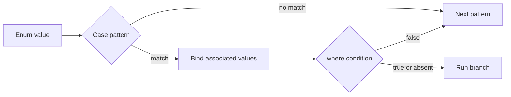

<TLDR>
  <TLDRCell label="what">
    A Swift enum is a closed set of alternatives, and each case can carry associated values with a different shape.
  </TLDRCell>
  <TLDRCell label="trap">
    A `default` makes a `switch` compile but can hide new cases; raw values aren't associated values and can't store per-instance data.
  </TLDRCell>
  <TLDRCell label="fix">
    Switch exhaustively over enums you own, bind payloads with case patterns, and reserve `@unknown default` for external enums that can evolve.
  </TLDRCell>
</TLDR>

## What it is and why it exists

An <Term id="enumeration">enumeration</Term> defines a closed set of cases. A value is exactly one of those cases at a time, which makes enums suitable for connection states, parse results, user actions, and workflow stages. Because the compiler knows the possibilities, it can check whether a `switch` leaves one out.

Swift enums aren't just named integers. Each case can carry its own <Term id="associated-value">associated values</Term>, and the payload shape can differ from one case to another. A success case might carry a result, a failure case an error, and a waiting case no data at all. This puts the current state and the data valid in that state into one type.

An enum can also declare a <Term id="raw-value">raw value</Term> of one common type. Raw values are fixed in the case declarations and often provide stable string or numeric mappings. Associated values are supplied when you create an individual enum value. They solve different problems and aren't interchangeable.

<Term id="pattern-matching">Pattern matching</Term> checks a value's shape and binds data when that shape matches. The same case patterns appear in `switch`, `if case`, `guard case`, and `for case`. A `where` clause can add a Boolean condition after the structural match succeeds.

Enums earn their keep by ruling out invalid states. If a loading operation is represented by separate `isLoading`, `data`, and `error` properties, the model can say that it is loading and has failed at the same time. Replacing them with `.loading`, `.loaded(Data)`, and `.failed(Error)` means each value represents one legal state.

## How it works

An enum declaration creates a constructor for every case. A case without associated values can be written as `.idle`; a case with associated values accepts arguments like a function, as in `.failed(message: "timeout")`. You can omit the enum name when context already determines the type.

Every case of a raw-value enum has one fixed, unique `rawValue`. A string case can omit the explicit value and use its case name; integer cases can increment from an explicit starting point. `init?(rawValue:)` is failable because external input might not name any known case.

Associated values belong to an individual enum value, not to the case declaration itself. Two `.loaded` values can carry different results. A `.failed` case can carry both a message and a retry decision. Labels make construction readable, while patterns destructure the values in the same order.

A `switch` tests cases from top to bottom. The first branch whose structural pattern and `where` condition both match wins, and later branches aren't considered. Leaving out `default` for enums you own lets the compiler point to every site that needs a decision after a case is added.

The matching flow is:



A value-binding pattern introduces matched data into the branch scope. `.loaded(let value)` makes `value` available only in that branch; `case let .loaded(value)` is equivalent. Use `_` for data you don't need instead of creating a variable that is never read.

`if case pattern = value` suits a local check for one case. `guard case pattern = value else` suits a function that can continue only for one case. Neither construct checks that the other cases are handled, so an exhaustive `switch` remains the better tool for state dispatch.

`for case pattern in sequence` iterates only over elements that match the pattern. It can use `where` for further filtering, but it doesn't tell you how many elements were skipped. If skipping is itself exceptional, use an ordinary loop with an exhaustive `switch`.

Patterns aren't limited to enums. Tuples, ranges, optionals, type casts, and wildcards can all appear in pattern positions. Organize complex matches around business decisions; packing too many dimensions into one `switch` makes branch coverage hard to review.

## Examples

These four examples start with a fixed mapping, then add associated values, single-case matching, and recursive data. Each file is independent and requires no app project or network access.

### Raw values and exhaustive dispatch

`HTTPMethod` uses string raw values to connect Swift cases to external protocol tokens. `permitsBody(_:)` names all four cases, so adding a method later forces a decision here.

<Depth level="quick">

```swift title="http_methods.swift"
// # not executed here: Swift toolchain is not installed.
enum HTTPMethod: String, CaseIterable {
    case get = "GET"
    case post = "POST"
    case put = "PUT"
    case delete = "DELETE"
}

func permitsBody(_ method: HTTPMethod) -> Bool {
    switch method {
    case .post, .put:
        return true
    case .get, .delete:
        return false
    }
}

for token in ["GET", "POST", "PATCH"] {
    if let method = HTTPMethod(rawValue: token) {
        print("\(method.rawValue): body=\(permitsBody(method))")
    } else {
        print("\(token): unsupported")
    }
}
```

```text
Not executed here: Swift toolchain is not installed.
```

</Depth>

`init?(rawValue:)` makes the caller handle unknown input. Here, `PATCH` isn't silently mapped to another case; it takes the failure path. If the protocol must preserve unknown methods, retain the original string or use an associated-value case such as `.unknown(String)` instead of force-unwrapping.

### Associated values, binding, and `where`

`LoadState` keeps the data for each stage in its corresponding case. Branch order matters: the more specific low-progress branch precedes the general `.loading` branch, or it could never match.

```swift title="load_state.swift"
// # not executed here: Swift toolchain is not installed.
enum LoadState<Value> {
    case idle
    case loading(progress: Double)
    case loaded(Value, cached: Bool)
    case failed(message: String, retryable: Bool)
}

func render(_ state: LoadState<String>) -> String {
    switch state {
    case .idle:
        return "Idle"
    case .loading(let progress) where progress < 0.5:
        return "Starting \(Int(progress * 100))%"
    case .loading(let progress):
        return "Loading \(Int(progress * 100))%"
    case let .loaded(value, cached):
        return cached ? "Cached: \(value)" : "Fresh: \(value)"
    case .failed(let message, true):
        return "Retry: \(message)"
    case .failed(let message, false):
        return "Stop: \(message)"
    }
}

let states: [LoadState<String>] = [
    .loading(progress: 0.2),
    .loaded("profile", cached: true),
    .failed(message: "offline", retryable: true),
]
states.map(render).forEach { print($0) }
```

```text
Not executed here: Swift toolchain is not installed.
```

One `LoadState<String>` can't be both `.loaded` and `.failed`. Pattern bindings also ensure that only the `.loaded` branch can access the result and only the `.failed` branch can access the error message. Unlike several optional properties, this constraint doesn't depend on a runtime convention.

### `guard case` and `for case`

This event stream contains several kinds of order events. `receipt(for:)` uses `guard case` to state that it accepts only payment events, while the `for case` loop selects paid orders with a particular prefix.

```swift title="order_events.swift"
// # not executed here: Swift toolchain is not installed.
enum OrderEvent {
    case submitted(id: String, total: Int)
    case paid(id: String, receipt: String)
    case rejected(id: String, reason: String)
    case note(String)
}

func receipt(for event: OrderEvent) -> String? {
    guard case let .paid(_, receipt) = event else {
        return nil
    }
    return receipt
}

let events: [OrderEvent] = [
    .submitted(id: "EU-17", total: 80),
    .paid(id: "EU-17", receipt: "R-900"),
    .rejected(id: "US-04", reason: "address"),
    .paid(id: "US-08", receipt: "R-901"),
]

for case let .paid(id, receipt) in events where id.hasPrefix("EU-") {
    print("European payment \(id): \(receipt)")
}

for event in events {
    if case let .rejected(id, reason) = event {
        print("Rejected \(id): \(reason)")
    }
}

print(receipt(for: events[1]) ?? "none")
```

```text
Not executed here: Swift toolchain is not installed.
```

The `guard case` pattern sits to the left of the equals sign and the inspected value to the right. `for case` works well for queries that consume one kind of event. If a handler must account for every event, use an exhaustive `switch` inside an ordinary loop.

### A recursive enum for a rule tree

A recursive enum lets an associated value contain the same enum again. `indirect` puts recursive storage behind an indirection; without it, the value couldn't have a finite inline size.

```swift title="feature_rule.swift"
// # not executed here: Swift toolchain is not installed.
indirect enum Rule {
    case feature(String)
    case not(Rule)
    case all([Rule])
    case any([Rule])
}

func evaluate(_ rule: Rule, enabled: Set<String>) -> Bool {
    switch rule {
    case .feature(let name):
        return enabled.contains(name)
    case .not(let inner):
        return !evaluate(inner, enabled: enabled)
    case .all(let rules):
        return rules.allSatisfy { evaluate($0, enabled: enabled) }
    case .any(let rules):
        return rules.contains { evaluate($0, enabled: enabled) }
    }
}

let access: Rule = .all([
    .feature("paid"),
    .any([.feature("admin"), .feature("editor")]),
    .not(.feature("suspended")),
])

print(evaluate(access, enabled: ["paid", "editor"]))
print(evaluate(access, enabled: ["paid"]))
print(evaluate(access, enabled: ["paid", "admin", "suspended"]))
```

```text
Not executed here: Swift toolchain is not installed.
```

The evaluator's `switch` mirrors the grammar of `Rule`. Adding a rule without defining its evaluation semantics becomes a compiler error. Empty-array behavior comes from the collection operations: `allSatisfy` is `true` for an empty collection and `contains` is `false`; reject empty lists during construction if the domain needs different rules.

## Pitfalls

### Swallowing a new local case with `default`

> [!PITFALL]
> Adding `default` to shorten a `switch` sends every later case through old fallback behavior. The code keeps compiling even when its business meaning is wrong.

**Fix:** Name every case of an enum you control. Combine patterns only when known cases deliberately share behavior. For a nonfrozen enum supplied by another framework, use `@unknown default` when forward compatibility is required, then record or safely reject the unknown state.

### Treating a raw value as input validation

> [!PITFALL]
> `Enum(rawValue:)` proves only that a string or number maps to a case. It doesn't prove that the case is allowed for this user, protocol version, or workflow stage.

**Fix:** Handle the failable initializer first, then apply business validation separately. Never force-unwrap a raw value from the network, disk, or user input. If unknown values must survive, model `.unknown(String)` explicitly instead of silently choosing a familiar case.

### Confusing raw values with associated values

> [!PITFALL]
> A raw value is a fixed mapping for a case; it can't change per instance. Modeling an order ID, error text, or progress as a raw value forces you to expand the case set or keep parallel storage.

**Fix:** Use raw values for stable protocol tokens and associated values for per-instance data. If every case shares the same fields and a closed alternative set isn't the central constraint, a struct with ordinary properties may be clearer.

### Letting a general branch shadow a `where` branch

> [!PITFALL]
> A `switch` selects the first matching branch in source order. If `.loading(let progress)` comes before the branch with `where progress < 0.5`, the latter is unreachable.

**Fix:** Put specific patterns and conditions before the general branch for the same case. Test boundary values such as `0`, `0.5`, and `1`. When conditions overlap, named predicates are usually easier to review.

### Replacing state dispatch with single-case syntax

> [!PITFALL]
> A chain of independent `if case` statements isn't exhaustive and can run multiple paths after conditions or state mutations overlap. Adding a case doesn't force these checks to change.

**Fix:** Use one exhaustive `switch` for a complete state machine. Reserve `guard case`, `if case`, and `for case` for functions or queries that genuinely consume one case. Name the filtering intent.

### Assuming associated values are automatically comparable

> [!PITFALL]
> Two enum values can belong to the same case without supporting `==`. Swift can synthesize `Equatable` only when the enum declares that conformance and every associated value can participate.

**Fix:** Use pattern matching when you only need to identify the case. Declare and review `Equatable` semantics when full-value equality matters. Don't discard meaningful payload data just to obtain `==`, and don't use `String(describing:)` as a stable identity.

## In the AI era

**What generated code gets wrong here**

Generators often add `default` to every `switch` to clear an exhaustiveness error quickly, silently routing new states through old behavior. They also confuse raw and associated values, force-unwrap `init?(rawValue:)`, or reverse the two sides of `if case pattern = value`. For a server enum, a model may invent one known case as a fallback; for an internal state, it may add `.unknown` and hide the compiler work that a new case should trigger.

**Ask your AI to check**

- List every case handled by each `switch`, and justify every `default` or `@unknown default`.
- Trace unknown input through every raw-value initializer and verify that no path force-unwraps or silently remaps it.
- Supply boundary values for every case with `where`, and check whether an earlier branch shadows it.

**Review checklist**

- Temporarily add a case to each owned enum and confirm that every switch requiring a decision produces a compiler diagnostic.
- Confirm that associated data exists only in the cases that allow it, without parallel booleans or optionals creating invalid combinations.
- Test unknown raw values, empty lists in recursive structures, and both sides of each `where` boundary.

**Prompt vocabulary**

Use the exact terms `enum case`, `associated value`, `raw value`, `case pattern`, `value binding`, `exhaustive switch`, `where clause`, `indirect enum`, and `@unknown default`. Asking an AI for a case-coverage table and an unknown-input policy preserves the type constraints better than asking it to “simplify this switch.”

<Depth level="deep">

## Patterns and type evolution

### Patterns describe structure, not Boolean expressions

A case pattern describes the structure a value must have. `.loaded(let value)` both checks the case and binds its payload, `(_, 0)` matches a tuple whose second item is zero, and `let value as Int` performs a type-cast pattern. Bindings enter scope only after the pattern succeeds.

Expression patterns use the standard library's `~=` operator, which is why a range case can match one value. Customizing `~=` can extend the syntax, but it hides a business rule behind an uncommon operator. Unless the relation is as natural as range membership and the project has a clear convention, a named predicate is easier to search and test.

The `_` in a pattern explicitly says that a position exists but this branch doesn't use it. It doesn't change whether the associated value is created or how long it lives. If most branches ignore the same large payload, the design problem is usually at the API boundary or in the model's responsibilities, not in the wildcard.

### Branch order creates coverage relationships

The compiler checks that enum cases are exhaustive, but it doesn't prove that every `where` condition is reachable. Two conditions can overlap or leave a gap under domain constraints. Put special conditions before general patterns and cover boundaries and precedence in tests.

Tuple patterns can put two finite dimensions into one `switch`, such as `(connection, permission)`. As dimensions accumulate, the number of branches grows quickly. Compute a named intermediate decision or put transitions on the type that owns the state instead of maintaining a combination matrix that is hard to review.

### `Optional` is an enum too

Swift's `Optional<Wrapped>` has the shapes `.none` and `.some(Wrapped)`. The optional pattern `case let value?` matches `.some(let value)`, so `for case let item? in items` skips `nil`. That spelling is useful for filtering; an explicit branch retains more information when `nil` represents an error or missing record.

Read nested optional and enum patterns from the outside in. For example, `case .success(let value)?` first requires the outer optional to be present, then requires the inner result to be the success case. More than two layers usually means the call boundary can be split so each failure gets a more precise name.

### Recursion needs indirect storage

A value type that directly contains itself inline can't have a finite static size. `indirect` puts an indirection on the recursive edge, allowing an enum to represent expression trees, rule trees, and syntax trees. You can mark the whole enum or only the recursive cases.

Recursive structures still need input limits. A very deep tree from untrusted data can exhaust the call stack during recursive traversal, while very wide arrays can consume excessive memory. Bound depth and node count at the parsing boundary, and define what empty `all` and `any` nodes mean.

### External enums and `@unknown default`

Enums in your own module should usually be switched case by case. A nonfrozen enum from a library-evolution-enabled external module may gain cases later, so clients need a path for unknown future values. `@unknown default` expresses that intent while allowing the compiler to diagnose a case known to the current SDK that wasn't named explicitly.

A plain `default` doesn't provide the same reminder. `@unknown default` also can't choose the right business response: a UI might show a conservative placeholder, a data boundary might reject the operation, and a security-sensitive state should often disable capability. Record an approved telemetry category for the decision, not the full associated payload when it may be sensitive.

### Case identity and full equality

Pattern matching can inspect only the case without requiring its payload to conform to `Equatable`. Full equality is a separate contract: synthesized `Equatable` checks the case and compares all associated values for that case in order. If one payload doesn't support equality, the enum can't receive the synthesized implementation.

Sometimes the domain asks only whether a value is loading. Put that question in a computed property backed by pattern matching instead of copying `if case` checks across call sites. If the domain needs stable identity, model an identifier explicitly; case names, reflection descriptions, and raw strings shouldn't become persistent identities by convenience.

### Keep behavior close to the case set

Enums can have computed properties, methods, initializers, and protocol conformances. If an operation has a definite answer for every case, an exhaustive `switch` in an enum extension is usually more reliable than copied dispatch logic across several views and services. Adding a case then exposes the missing decisions in those methods.

This doesn't mean every business operation belongs on the enum. Work that needs a network, database, or user session should remain in the corresponding service. Enum methods fit calculations that depend only on the current case and its associated values. Boundaries can pass enums to services without making a value type secretly own environment dependencies.

With `CaseIterable`, the compiler can synthesize `allCases` for an enum without associated values. A case with a payload can't enumerate every value automatically because its value set is usually unbounded. If a product needs a finite menu of presets, model a separate payload-free enum instead of claiming that the menu contains every possible payload.

Protocol synthesis depends on every payload. `Hashable`, `Equatable`, and `Codable` each require associated values that satisfy the corresponding constraints; having a raw value doesn't grant those conformances automatically. When synthesis fails, inspect the payload types instead of silencing the error with a handwritten implementation that discards data.

### State transitions need modeling too

An enum defines legal states, but it doesn't by itself restrict every transition between them. If arbitrary code can assign a new case to a property, `.delivered` can still jump straight back to `.pending`. Put transitions on the type that owns the state and decide the result from both the current case and the incoming event.

When reviewing a state machine, write down each of these:

1. The current-state and input-event combination.
2. The permitted next state.
3. The error returned for a rejected transition.
4. The invariants that must hold before and after the transition.

A tuple `switch`, such as `switch (state, event)`, can implement this matrix. Combine unlisted pairs into one fallback only when they all mean the same rejection; otherwise, naming them individually leaves better review evidence.

A mutable `mutating` method can update the state in place, while an immutable function returns a new state or an error. The former suits a well-encapsulated single owner; the latter is easier to test and to record in a transition history. Either form should validate event payloads before committing the state change.

Concurrent code also needs to isolate the state owner. The enum doesn't make “read the case, check it, then assign” atomic, so two tasks can both pass a check against the same old state. Put transitions behind an actor or another synchronization boundary, and let external callers submit events instead of writing the state directly.

A well-designed enum turns a new case into traceable compiler work instead of a silent behavior change.

</Depth>

<Checkpoint id="swift/enums-pattern-matching" />

## Further reading

- [The Swift Programming Language: Enumerations](https://docs.swift.org/swift-book/documentation/the-swift-programming-language/enumerations/)
- [The Swift Programming Language: Patterns](https://docs.swift.org/swift-book/documentation/the-swift-programming-language/patterns/)
- [The Swift Programming Language: `switch` statements](https://docs.swift.org/swift-book/documentation/the-swift-programming-language/controlflow/#Switch-Statement)
