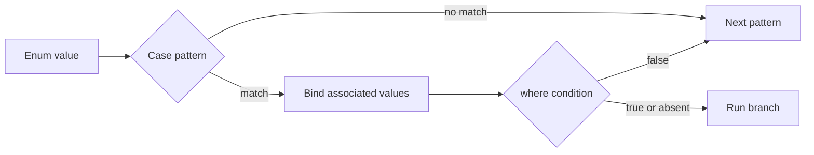

<TLDR>
  <TLDRCell label="what">
    Swift枚举是封闭的备选类型集合；每个case还可以携带形状不同的关联值。
  </TLDRCell>
  <TLDRCell label="trap">
    `default`虽然能让`switch`通过编译，却会遮住新case；原始值也不是关联值，不能用来保存每个实例的数据。
  </TLDRCell>
  <TLDRCell label="fix">
    用穷尽的`switch`处理自有枚举，用case模式绑定关联值，并只在需要兼容外部可演进枚举时使用`@unknown default`。
  </TLDRCell>
</TLDR>

## 是什么，为什么存在

<Term id="enumeration">枚举（enumeration）</Term>定义一个封闭的case集合。一个值在任一时刻只属于其中一个case，因此枚举适合表示连接状态、解析结果、用户操作和工作流阶段。编译器知道所有可能性，可以检查`switch`是否遗漏分支。

Swift枚举不只是带名字的整数。每个case都可以携带自己的<Term id="associated-value">关联值（associated value）</Term>，而且各case的数据形状可以不同。例如，成功case可以携带结果，失败case可以携带错误，等待case则不需要额外数据。这种建模方式把“当前是哪种状态”和“该状态允许哪些数据”放进同一个类型。

枚举也可以声明一个统一类型的<Term id="raw-value">原始值（raw value）</Term>。原始值在case声明时确定，常用于稳定的字符串或数字映射；关联值则在创建具体枚举值时传入。两者解决的问题不同，不能互相替代。

<Term id="pattern-matching">模式匹配（pattern matching）</Term>检查值的形状，并在匹配成功时绑定其中的数据。你会在`switch`、`if case`、`guard case`和`for case`中使用同一套case模式。`where`子句还能在结构匹配之后增加布尔条件。

枚举最有价值的地方是排除无效状态。若把加载过程表示成`isLoading`、`data`和`error`三个独立属性，就可能同时得到“正在加载且已有错误”这样的矛盾组合。把它改成`.loading`、`.loaded(Data)`和`.failed(Error)`后，每个值只能表达一种合法状态。

## 工作原理

枚举声明为每个case建立构造方式。没有关联值的case可以直接写成`.idle`；带关联值的case像函数一样接收参数，例如`.failed(message: "timeout")`。在上下文已经确定枚举类型时，可以省略类型名。

原始值枚举的每个case都有唯一且固定的`rawValue`。字符串case可以省略显式原始值，此时默认使用case名；整数case可以从一个显式值开始递增。`init?(rawValue:)`返回可选值，因为外部输入不一定对应已知case。

关联值属于具体枚举值，不属于case声明本身。两个`.loaded`值可以携带不同结果；一个`.failed` case也可以同时携带消息和是否可重试。关联值标签改善构造调用的可读性，但模式可以按同样的顺序解构这些值。

`switch`从上到下测试case。第一个同时满足结构模式和`where`条件的分支获胜，其余分支不会执行。对自有枚举省略`default`，编译器才能在增加case后指出所有需要重新审视的位置。

匹配过程可以概括为：



值绑定模式把匹配到的数据引入分支作用域。`.loaded(let value)`只让`value`在该分支中可用；`case let .loaded(value)`是等价写法。用`_`忽略不需要的数据，不要为了满足语法创建永远不会读取的变量。

`if case pattern = value`适合只关心一个case的局部判断。`guard case pattern = value else`适合要求某个case才能继续执行的函数入口。两者都不会检查其他case是否被处理，因此状态分派仍应优先使用穷尽的`switch`。

`for case pattern in sequence`只迭代匹配该模式的元素。它可以配合`where`做进一步过滤，但不会告诉你有多少元素被跳过。若遗漏项本身是异常，普通循环加穷尽`switch`会更清楚。

模式不只用于枚举。元组、范围、可选值、类型转换和通配符都能出现在模式位置。复杂匹配应围绕业务分支组织；把太多维度塞进一个`switch`，会让分支覆盖关系难以审核。

## 示例

下面四个示例从固定映射开始，逐步加入关联值、单case匹配与递归数据。每个文件都独立，不依赖应用工程或网络。

### 原始值与穷尽分派

`HTTPMethod`用字符串原始值连接Swift case与外部协议标记。`permitsBody(_:)`明确列出四个case，所以未来新增方法时，编译器会要求这里作出决定。

<Depth level="quick">

```swift title="http_methods.swift"
// # not executed here: Swift toolchain is not installed.
enum HTTPMethod: String, CaseIterable {
    case get = "GET"
    case post = "POST"
    case put = "PUT"
    case delete = "DELETE"
}

func permitsBody(_ method: HTTPMethod) -> Bool {
    switch method {
    case .post, .put:
        return true
    case .get, .delete:
        return false
    }
}

for token in ["GET", "POST", "PATCH"] {
    if let method = HTTPMethod(rawValue: token) {
        print("\(method.rawValue): body=\(permitsBody(method))")
    } else {
        print("\(token): unsupported")
    }
}
```

```text
Not executed here: Swift toolchain is not installed.
```

</Depth>

`init?(rawValue:)`迫使调用方处理未知输入。这里的`PATCH`不会被偷偷映射到其他case，而是走失败分支。若协议允许未知方法继续传播，应保存原字符串或改用带`.unknown(String)`的关联值枚举，而不是强制解包。

### 关联值、绑定与`where`

`LoadState`把每个阶段所需的数据放在对应case中。分支顺序很重要：更具体的低进度分支位于一般`.loading`分支之前，否则它永远不会命中。

```swift title="load_state.swift"
// # not executed here: Swift toolchain is not installed.
enum LoadState<Value> {
    case idle
    case loading(progress: Double)
    case loaded(Value, cached: Bool)
    case failed(message: String, retryable: Bool)
}

func render(_ state: LoadState<String>) -> String {
    switch state {
    case .idle:
        return "Idle"
    case .loading(let progress) where progress < 0.5:
        return "Starting \(Int(progress * 100))%"
    case .loading(let progress):
        return "Loading \(Int(progress * 100))%"
    case let .loaded(value, cached):
        return cached ? "Cached: \(value)" : "Fresh: \(value)"
    case .failed(let message, true):
        return "Retry: \(message)"
    case .failed(let message, false):
        return "Stop: \(message)"
    }
}

let states: [LoadState<String>] = [
    .loading(progress: 0.2),
    .loaded("profile", cached: true),
    .failed(message: "offline", retryable: true),
]
states.map(render).forEach { print($0) }
```

```text
Not executed here: Swift toolchain is not installed.
```

同一个`LoadState<String>`不能同时是`.loaded`和`.failed`。模式绑定还保证只有`.loaded`分支能访问结果，只有`.failed`分支能访问错误信息。相比多个可选属性，这种约束不需要运行时约定。

### `guard case`与`for case`

这个事件流包含多种订单事件。`receipt(for:)`用`guard case`表达函数只接受付款事件，循环则用`for case`直接筛出带指定前缀的已付款订单。

```swift title="order_events.swift"
// # not executed here: Swift toolchain is not installed.
enum OrderEvent {
    case submitted(id: String, total: Int)
    case paid(id: String, receipt: String)
    case rejected(id: String, reason: String)
    case note(String)
}

func receipt(for event: OrderEvent) -> String? {
    guard case let .paid(_, receipt) = event else {
        return nil
    }
    return receipt
}

let events: [OrderEvent] = [
    .submitted(id: "EU-17", total: 80),
    .paid(id: "EU-17", receipt: "R-900"),
    .rejected(id: "US-04", reason: "address"),
    .paid(id: "US-08", receipt: "R-901"),
]

for case let .paid(id, receipt) in events where id.hasPrefix("EU-") {
    print("European payment \(id): \(receipt)")
}

for event in events {
    if case let .rejected(id, reason) = event {
        print("Rejected \(id): \(reason)")
    }
}

print(receipt(for: events[1]) ?? "none")
```

```text
Not executed here: Swift toolchain is not installed.
```

`guard case`的模式写在等号左侧，待检查的值写在右侧。`for case`很适合“只消费某一类事件”的查询；若处理函数必须确认所有事件都得到响应，就应改用循环内的穷尽`switch`。

### 递归枚举表示规则树

递归枚举允许关联值再次包含同一枚举。`indirect`让递归存储通过间接层实现，否则值的内联大小无法有限确定。

```swift title="feature_rule.swift"
// # not executed here: Swift toolchain is not installed.
indirect enum Rule {
    case feature(String)
    case not(Rule)
    case all([Rule])
    case any([Rule])
}

func evaluate(_ rule: Rule, enabled: Set<String>) -> Bool {
    switch rule {
    case .feature(let name):
        return enabled.contains(name)
    case .not(let inner):
        return !evaluate(inner, enabled: enabled)
    case .all(let rules):
        return rules.allSatisfy { evaluate($0, enabled: enabled) }
    case .any(let rules):
        return rules.contains { evaluate($0, enabled: enabled) }
    }
}

let access: Rule = .all([
    .feature("paid"),
    .any([.feature("admin"), .feature("editor")]),
    .not(.feature("suspended")),
])

print(evaluate(access, enabled: ["paid", "editor"]))
print(evaluate(access, enabled: ["paid"]))
print(evaluate(access, enabled: ["paid", "admin", "suspended"]))
```

```text
Not executed here: Swift toolchain is not installed.
```

求值函数的`switch`与`Rule`的语法结构一一对应。新增一种规则时，遗漏的求值语义会变成编译错误。空数组的行为来自集合操作：`allSatisfy`对空集合为`true`，`contains`对空集合为`false`；如果领域规则不同，应在构造时拒绝空列表。

## 陷阱

### 用`default`吞掉自有枚举的新case

> [!PITFALL]
> 为了缩短代码而加入`default`，会让后来新增的case自动走旧的兜底逻辑。代码仍能编译，但业务语义可能已经错了。

**修复方法：** 对你能控制的枚举逐一列出case。只有多个已知case明确共享同一行为时才合并模式。外部框架提供的非冻结枚举需要未来兼容时，使用`@unknown default`，并记录或安全拒绝未知值。

### 把原始值当成外部输入验证

> [!PITFALL]
> `Enum(rawValue:)`只确认字符串或数字对应某个case，不会验证该case在当前用户、协议版本或业务阶段中是否允许。

**修复方法：** 先安全处理可选初始化结果，再单独检查业务规则。不要用`!`强制解包来自网络、磁盘或用户的原始值。需要保留未知值时，显式设计`.unknown(String)`，不要静默替换成看似安全的已知case。

### 混淆原始值与关联值

> [!PITFALL]
> 原始值是case的固定映射，不能在创建实例时改变。把订单编号、错误文本或进度设计成raw value，会迫使你扩大case集合或另建平行存储。

**修复方法：** 稳定的协议标记使用原始值；每个实例不同的数据使用关联值。若所有case都共享同一组字段，而且case集合不是核心约束，结构体加普通属性可能更清楚。

### 让一般分支遮住`where`分支

> [!PITFALL]
> `switch`按源码顺序选择第一个匹配项。若`.loading(let progress)`写在带`where progress < 0.5`的分支之前，后者永远不会执行。

**修复方法：** 先写更具体的模式和条件，再写同一case的一般分支。为边界值准备测试，例如`0`、`0.5`和`1`。条件互相重叠时，把判定提取成有名字的函数通常更容易审核。

### 用单case语法代替状态分派

> [!PITFALL]
> 一串彼此独立的`if case`不具备穷尽性，而且在条件重叠或状态变化后可能执行多个代码路径。新增case时，编译器也不会要求更新这些判断。

**修复方法：** 完整状态机使用一个穷尽的`switch`。只有函数确实只接受一个case，或循环确实只消费一个case时，才使用`guard case`、`if case`或`for case`。在名字中说明过滤意图。

### 假设关联值自动支持相等比较

> [!PITFALL]
> 两个枚举值看起来属于同一case，并不表示可以直接用`==`。只有枚举遵循`Equatable`，而且所有关联值也能参与相等比较时，编译器才能合成实现。

**修复方法：** 只需判断case时使用模式匹配；需要比较完整值时声明并检查`Equatable`语义。不要为了获得`==`而忽略本应参与比较的关联数据，或用`String(describing:)`充当稳定标识。

<Depth level="deep">

## 模式与类型演进

### 模式是结构，不是布尔表达式

case模式描述一个值必须具有的结构。`.loaded(let value)`同时检查case并绑定载荷，`(_, 0)`匹配第二项为零的元组，`let value as Int`则先做类型转换。模式成功后，绑定才进入对应作用域。

表达式模式由标准库的`~=`运算符参与实现，范围case因而可以匹配单个值。自定义`~=`虽然能扩展这种语法，但会把业务规则藏进一个不常见的运算符。除非匹配关系已经像范围一样自然且项目有一致约定，否则命名谓词更容易搜索和测试。

模式中的`_`明确表示“这个位置存在，但此处分支不使用它”。它不会改变关联值的创建或生命周期。若大量分支都忽略同一份大载荷，问题通常在API边界或模型职责，而不是通配符本身。

### 分支顺序形成覆盖关系

编译器检查枚举case是否穷尽，但不会证明所有`where`条件都可达。两个条件可能重叠，也可能在业务约束下留下空隙。把特殊条件放在一般模式前，并用测试覆盖边界与优先级。

元组模式能把两个有限维度放在一个`switch`中，例如`(connection, permission)`。维度继续增加时，case数量会迅速膨胀。此时应先计算一个有名字的中间决策，或把状态转移放进拥有该状态的类型，而不是维护难以审查的组合矩阵。

### `Optional`也是枚举

Swift的`Optional<Wrapped>`有`.none`和`.some(Wrapped)`两种形状。`case let value?`是匹配`.some(let value)`的可选模式，因此`for case let item? in items`能跳过`nil`。这种写法适合筛选；若`nil`代表错误或数据缺口，显式分支更能保留信息。

把可选模式与另一个枚举嵌套时，要从外向内读。例如`case .success(let value)?`先要求外层可选值存在，再要求内部结果是成功case。嵌套超过两层通常说明调用边界可以先拆开处理，从而给每次失败留下更具体的名字。

### 递归需要间接存储

值类型若直接内联包含自身，就无法得到有限的静态大小。`indirect`在递归边上加入间接层，使枚举可以表示表达式树、规则树和语法树。可以在整个枚举上写`indirect`，也可以只标记递归case。

递归结构仍需定义输入限制。来自不可信数据的极深树可能让递归遍历耗尽调用栈，极宽数组也可能消耗过多内存。解析边界应限制深度和节点数；求值函数还要明确空的`all`与`any`所代表的语义。

### 外部枚举与`@unknown default`

你自己模块中的枚举通常应逐case穷尽。对启用库演进的外部模块，非冻结枚举将来可能增加case；客户端必须保留一个处理未知未来值的路径。`@unknown default`表达这种意图，同时让编译器在当前SDK已知case未被明确列出时发出诊断。

普通`default`不会提供同样的提醒。`@unknown default`也不负责决定正确业务行为：界面可以显示保守占位，数据边界可以拒绝继续，安全敏感状态往往应关闭能力。选择策略后记录遥测类别，但不要把可能敏感的完整关联数据写入日志。

### Case身份与完整相等

模式匹配可以只检查case，而不要求载荷遵循`Equatable`。完整相等则是另一个契约：编译器合成的`Equatable`会比较case，并按顺序比较该case的所有关联值。若某个载荷不支持相等，整个枚举无法自动合成。

有时领域只需要“是否处于加载状态”。把这个问题写成计算属性，并在属性内部使用模式，比在调用点复制多个`if case`更统一。若领域需要稳定标识，应显式建模标识；case名、反射描述和原始字符串都不应被顺手当作持久身份。

### 让行为靠近case集合

枚举可以拥有计算属性、方法、初始化器和协议一致性。若一项行为对每个case都有明确答案，把穷尽的`switch`放进枚举扩展，通常比让多个界面和服务各自复制分派逻辑更稳。新增case时，编译器会把遗漏集中暴露在这些方法中。

这种集中不等于把所有业务都塞进枚举。需要网络、数据库或用户会话的操作仍应留在相应服务中；枚举方法适合纯粹依赖自身case和关联值的计算。边界可以把枚举传给服务，但不应让值类型悄悄拥有环境依赖。

遵循`CaseIterable`时，编译器可以为没有关联值的枚举合成`allCases`。带关联值的case无法自动列出所有值，因为其取值集合通常不是有限的。若产品只需要一组可选预设，应另建一个无载荷枚举，不要声称它代表所有可能载荷。

协议合成取决于全部载荷。`Hashable`、`Equatable`和`Codable`都要求关联值满足相应约束；原始值一致性不会自动赋予这些协议。看到合成失败时，应检查具体载荷类型，而不是手写一个忽略数据的实现来压掉错误。

### 状态转移也需要建模

枚举定义合法状态，但不会单独限制所有状态之间的转移。若任意代码都能给属性赋新的case，`.delivered`仍可能直接变回`.pending`。把转移放进拥有状态的类型，并用当前case与事件共同决定结果。

审核一个状态机时，可以逐项列出：

1. 当前状态和输入事件的组合。
2. 允许的下一状态。
3. 拒绝转移时返回的错误。
4. 转移前后必须保持的不变量。

这张矩阵适合用元组`switch`实现，例如`switch (state, event)`。不过，只有在未列出的组合都明确代表同一种拒绝时，才把它们合并到一个兜底分支；否则逐项写出能保留审核线索。

可变`mutating`方法可以原地更新状态，不可变函数则返回新状态或错误。前者适合封装良好的单一所有者，后者更容易测试和记录转移历史。两种形式都应先验证事件关联值，再提交状态变化。

并发环境还需要隔离状态的所有者。枚举本身不会让“读取当前case、检查、再赋值”成为原子操作；多个任务可能基于同一个旧状态同时通过检查。把转移放进actor或其他同步边界，并让外部调用者提交事件而不是直接写状态。

设计良好的枚举会让新增case变成一次可追踪的编译任务，而不是一次静默的行为变化。

</Depth>

<Checkpoint id="swift/enums-pattern-matching" />

## 延伸阅读

- [Swift编程语言：枚举](https://docs.swift.org/swift-book/documentation/the-swift-programming-language/enumerations/)
- [Swift编程语言：模式](https://docs.swift.org/swift-book/documentation/the-swift-programming-language/patterns/)
- [Swift编程语言：`switch`语句](https://docs.swift.org/swift-book/documentation/the-swift-programming-language/controlflow/#Switch-Statement)
