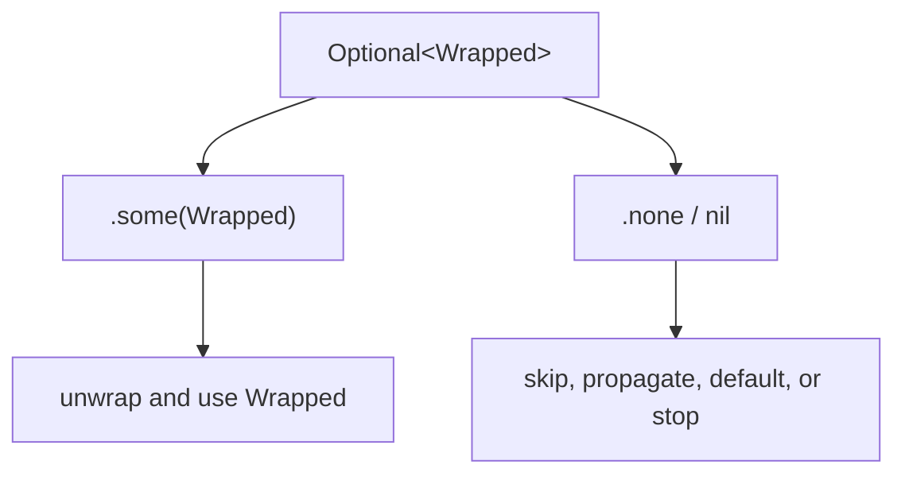

<TLDR>
  <TLDRCell label="what">
    An <Term id="optional-value">optional value</Term>, written `Wrapped?`, contains either one `Wrapped` value or `nil`. Absence is part of the type, so a caller can't use a possibly missing value as an ordinary value.
  </TLDRCell>
  <TLDRCell label="trap">
    `!` bypasses safe handling, `??` replaces absence with a default, and optional chaining reports only whether the whole chain succeeded. Each can erase distinctions between business states.
  </TLDRCell>
  <TLDRCell label="fix">
    Define what `nil` means before choosing `if let`, `guard let`, `?.`, `??`, or explicit pattern matching. Use `throws` or `Result` when the caller needs a failure reason.
  </TLDRCell>
</TLDR>

## What it is and why it exists

Swift optionals put "this value may be missing" in the static type.
`String` must contain a string, while `String?` can be `.some(String)` or `.none`; `nil` is the literal spelling of `.none`.
It isn't an untyped null pointer that can be assigned anywhere.

This distinction solves an interface-contract problem.
Integer parsing can fail, a dictionary key may be absent, and a user may leave a nickname blank; these operations return optionals so absence remains visible at the call site.
The compiler rejects an operation that belongs to `String` when its receiver is `String?`.

Optionals don't guarantee that a program can never crash because of a missing value.
Force-unwrapping `value!` still traps at runtime when the value is `nil`, and implicitly unwrapped optionals carry the same risk.
Swift provides explicit modeling and safe handling paths, not an automatic repair for a false assertion.

`Optional` fits only when two outcomes, presence and absence, describe the contract.
If callers must distinguish permission denial, network failure, and malformed input, one `nil` discards the reason; use a throwing function or `Result` instead.
Likewise, an empty string, empty array, `false`, and `0` are values, not automatic substitutes for `nil`.

You'll meet optionals throughout the standard library and at application boundaries.
`Int(_:)` returns `Int?` when parsing text, dictionary subscripting returns `Value?`, and a collection's `first` and `last` are optional.
Decoding, user input, and object relationships bring optional properties into your own models.

## How it works

`Wrapped?` is shorthand for `Optional<Wrapped>`.
`Optional` is a generic enumeration with two cases, `.some(Wrapped)` and `.none`.
That representation is also why `switch` and optional patterns work with optional values.



A declaration such as `var nickname: String?` defaults to `nil` when it has no initializer.
A non-optional variable can't store `nil` and must be initialized before it is read.
Optional and non-optional types remain different even when they share the same `Wrapped` type.

<Term id="optional-binding">Optional binding</Term> checks for a value and creates an unwrapped name in one operation.
`if let value = candidate` fits code where both the present and absent branches matter.
Since Swift 5.7, a same-name binding can use the shorthand `if let candidate`.

`guard let` expresses a prerequisite for the code that follows.
When the value is absent, the `else` branch must leave the current scope with `return`, `throw`, `break`, or another control-transfer statement; after the check, the unwrapped name is available for the rest of the scope.
This rule keeps the main path out of another level of braces.

<Term id="optional-chaining">Optional chaining</Term> places member access, a method call, or subscripting after `?.`.
If the receiver is `nil`, the remaining operation isn't performed and the expression returns `nil`; otherwise it continues with the unwrapped value.
The result is optional even when the final member normally has a non-optional type.

The <Term id="nil-coalescing">nil-coalescing</Term> expression `candidate ?? fallback` returns the unwrapped left side when present, or evaluates and returns the default on the right.
The right side is short-circuited, so an expensive or side-effecting default runs only when the left side is `nil`.
The default must be compatible with the wrapped type.

An optional's `map` runs a transformation only when a value is present and wraps the result again.
`flatMap` accepts a transformation that itself returns an optional and avoids adding another `Optional` layer.
A sequence's `compactMap` is a different operation: it transforms every element and collects the non-`nil` results.

The postfix `!` performs a <Term id="force-unwrapping">force unwrap</Term>.
It states the programmer's assertion that a value exists rather than checking it; a false assertion stops the program.
Consider it only when absence really means an internal invariant has been violated and a safe form would hide that error.

## Examples

The four examples build from boundary parsing to member access, optional transformations, and nested state.
This environment has no Swift toolchain, so each block is marked as unexecuted and no guessed output is presented.

### Parse boundary input

The seat count comes from a string dictionary, where the key may be missing and the text may not be an integer.
One `guard` collects all three requirements at the function boundary; the caller still decides how to handle an invalid request.

<Depth level="quick">

```swift title="seat_request.swift"
// # not executed here: Swift toolchain is not installed.
func confirmedSeats(from fields: [String: String]) -> Int? {
    guard
        let rawSeats = fields["seats"],
        let seats = Int(rawSeats),
        (1...8).contains(seats)
    else {
        return nil
    }

    return seats
}

let requests = [
    ["name": "Mina", "seats": "4"],
    ["name": "Noah", "seats": "many"],
    ["name": "Iris"],
]

for request in requests {
    let name = request["name"] ?? "unknown"
    if let seats = confirmedSeats(from: request) {
        print("\(name): \(seats)")
    } else {
        print("\(name): invalid")
    }
}
```

```text
Not executed here: Swift toolchain is not installed.
```

<TryToBreak items={['missing seats field', 'unparseable integer', 'out-of-range 0 and 9']} />

</Depth>

`confirmedSeats(from:)` uses `nil` for a missing key, failed parse, and out-of-range value.
If the caller must show different errors to a user, this return type is too narrow and should become an error type with specific cases.
Two outcomes are enough at a boundary that only accepts or rejects the request.

### Read through an object relationship

Optional chaining fits a query where any missing link means no result.
The final `??` supplies display text without changing the missing state in the model.

```swift title="profile_contact.swift"
// # not executed here: Swift toolchain is not installed.
struct Contact {
    var email: String?
}

struct Profile {
    let displayName: String
    var contact: Contact?
}

func contactLine(for profile: Profile?) -> String {
    let email = profile?.contact?.email?.lowercased()
    return email ?? "no email"
}

let profiles: [Profile?] = [
    Profile(
        displayName: "Mina",
        contact: Contact(email: "MINA@EXAMPLE.COM")
    ),
    Profile(displayName: "Noah", contact: nil),
    nil,
]

for profile in profiles {
    let name = profile?.displayName ?? "missing profile"
    print("\(name): \(contactLine(for: profile))")
}
```

```text
Not executed here: Swift toolchain is not installed.
```

For the second and third elements, `email` is `nil` in both cases.
One optional chain can't say whether the profile, contact, or email was missing; branch before merging if those states need different UI or metrics.
That is a choice about the information in the result, not a flaw in the syntax.

### Transform and discard invalid elements

`flatMap` connects "there may be an input" to "the transformation may fail."
An array's `compactMap` instead collects each element's successful transformation and discards `nil`.

```swift title="optional_transforms.swift"
// # not executed here: Swift toolchain is not installed.
let discountText: String? = "15"
let discountLabel = discountText
    .flatMap { Int($0) }
    .map { "\($0)%" }
    ?? "none"

let rawOrderIDs: [String?] = ["101", nil, "bad", "205"]
let orderIDs = rawOrderIDs.compactMap { rawID -> Int? in
    guard let rawID else {
        return nil
    }
    return Int(rawID)
}

let missingText: String? = nil
let skipped = missingText.map { value in
    print("transforming \(value)")
    return value.uppercased()
}

print(discountLabel)
print(orderIDs)
print(skipped == nil)
```

```text
Not executed here: Swift toolchain is not installed.
```

When `discountText` contains valid integer text, `flatMap` produces one `Int?` and the following `map` builds the label.
If the input is absent or parsing fails, both steps propagate `nil`.
The final transformation doesn't execute its closure because its receiver is `nil`.

### Preserve three dictionary states

When a dictionary's value type is itself optional, subscript lookup produces a nested optional.
The outer layer records whether the key exists; the inner layer records whether that key stores `nil`.

```swift title="nested_optional.swift"
// # not executed here: Swift toolchain is not installed.
let ratings: [String: Int?] = [
    "approved": 5,
    "pending": nil,
]

func describe(_ rating: Int??) -> String {
    switch rating {
    case .none:
        return "missing key"
    case .some(.none):
        return "present, unrated"
    case .some(.some(let value)):
        return "rating \(value)"
    }
}

print(describe(ratings["approved"]))
print(describe(ratings["pending"]))
print(describe(ratings["unknown"]))

let flattened: Int? = ratings["pending"].flatMap { $0 }
print(flattened == nil)
```

```text
Not executed here: Swift toolchain is not installed.
```

Two bindings in succession, or `flatMap`, collapse both outer and inner absence into one `nil`.
Flatten only when the domain truly doesn't distinguish "no record" from "record exists but is unrated."
When all three states matter, a `switch` is more honest than a chain of convenience operations.

## Pitfalls

### Fixing a compiler error with a force unwrap

> [!PITFALL]
> Generated code often adds `!` when the compiler requires it to handle a `String?`. That only converts a compile-time prompt into a runtime trap; asynchronous responses, empty collections, and test fixtures can all break the original non-`nil` assumption.

**Fix:** Validate the claim at the boundary that creates the optional. Use binding, a default, or an error when absence is recoverable; if absence violates an internal invariant, a `preconditionFailure` with a specific message exposes the contract better than a distant `!`.

### Hiding invalid data with a default

> [!PITFALL]
> `Int(text) ?? 0` turns a real zero, missing input, and malformed input into the same `0`. If zero has business meaning, later code can't recover the original state and may persist bad data.

**Fix:** Use `??` only when the default is genuinely equivalent to absence. When a validation boundary must report an error, reject invalid data with `guard let` or a throwing parser first, then supply display text at the presentation layer.

### Assuming a chain identifies the failed link

> [!PITFALL]
> When `account?.owner?.email` returns `nil`, it doesn't record which link was absent. Using that result directly for error messages or analytics mixes states that may have different remedies.

**Fix:** Reserve optional chaining for queries where every missing link has the same treatment. When a specific reason matters, branch with `guard` or `switch` at the meaningful boundary and preserve a domain error.

### Confusing an optional collection with optional elements

> [!PITFALL]
> `[Order]?` means the entire collection may be absent; `[Order?]` means the collection exists but individual positions may be missing. Immediately converting either form to `[Order]` with `compactMap` deletes information from a different source.

**Fix:** State the contract for each layer. An empty collection usually already represents "the query succeeded with no results"; keep optional elements only when positions matter, and say whether removing gaps is safe.

### Flattening a nested optional by accident

> [!PITFALL]
> Reading `[Key: Value?]` by subscript produces `Value??`. Consecutive bindings or `flatMap { $0 }` are convenient, but they merge "key absent" and "key present with no value."

**Fix:** Decide whether the outer and inner states carry separate business information. Use a three-branch `switch` or a clearer domain enum when they do; otherwise flatten deliberately and pin that decision with tests.

<Depth level="deep">

## `Optional` is an enum

The standard library defines `Optional` as an enumeration parameterized by `Wrapped`.
`.some` stores one wrapped value and `.none` represents absence; `nil` constructs `.none` in a context where the compiler knows the optional type.
The common question-mark spelling doesn't introduce another runtime concept.

```swift
// # not executed here: Swift toolchain is not installed.
let short: Int? = 42
let long: Optional<Int> = .some(42)
let empty: Optional<Int> = .none

switch short {
case .some(let value):
    print(value)
case .none:
    print("missing")
}

print(short == long)
print(empty == nil)
```

```text
Not executed here: Swift toolchain is not installed.
```

This enum meaning explains the optional pattern `case let value?`.
It matches `.some` and binds the associated value, while `case nil` matches `.none`.
Pattern matching is often easier to check for exhaustiveness than a series of Boolean tests when several states combine.

Don't infer a fixed memory cost from the enum definition.
The concrete layout depends on the wrapped type, target platform, and compiler implementation; the source contract guarantees observable behavior, not that `Int?` adds a particular number of bytes to `Int`.
Without a measurement on the target, there is no performance conclusion to report.

## Nested optionals preserve three states

`Wrapped??` is `Optional<Optional<Wrapped>>`.
It can be `.none`, `.some(.none)`, or `.some(.some(value))`.
That isn't redundant syntax: the type can carry three distinct states.

When a dictionary's value is already `Value?`, its subscript needs an outer optional to report whether the key exists, so a read has type `Value??`.
The same shape can arise in a generic API: if a function returns `T?` and a caller chooses an optional type for `T`, the result naturally nests.
API authors can't assume question marks always collapse automatically.

Writing through an optional-valued dictionary needs particular care.
Dictionary subscript assignment uses outer `nil` to remove a key; storing a present key whose inner value is `nil` requires an assignment expression that preserves outer `.some`.
A domain enum often makes this write path clearer than two question marks do.

## Transformations and absence propagation

`Optional.map` takes a transformation returning an ordinary `U`, and the whole result is `U?`.
When the receiver is `nil`, the closure doesn't run and the result stays `nil`; when it is present, the closure runs even if the wrapped value is `false`, `0`, or an empty string.
Only the optional case matters, not a truthiness rule.

`Optional.flatMap` takes a transformation returning `U?`, and the whole result remains `U?`.
It propagates both "the prior value was absent" and "the transformation failed" as one `nil`, which suits a short chain where the reason doesn't matter.
Use a throwing transformation or explicit branches when callers need to know which step failed.

`Sequence.compactMap` shares a name with this family but works at another level.
It visits many elements and removes `nil` results, which can change a collection's length and positions; `Optional.flatMap` works on one optional.
Before using `compactMap` on positional data, confirm that removing gaps can't shift meaning.

`??` also merges states, but returns a replacement value.
Because its right side is short-circuited, `cached ?? loadDefault()` calls the function only when the cache is absent.
If the default can fail or has side effects, tests should cover that execution condition.

## Forced and implicit unwrapping

A force unwrap is a runtime assertion.
It can represent an invariant that the program itself has already proved, such as a fixed test resource validated during test setup; it doesn't fit unvalidated network, disk, user-input, or lifecycle state.
"Usually non-nil" is still the wrong contract for `!`.

An implicitly unwrapped declaration is spelled `Type!`, but its underlying type is still `Optional<Type>`.
It permits an automatic unwrap attempt in a context that needs a non-optional value, so accessing `nil` still fails.
Its primary role is an interface whose initialization phase can't supply a value yet but whose use phase has an external lifecycle guarantee.

Modern code shouldn't make every late-initialized property implicitly unwrapped.
Initializer injection, an ordinary optional, a lazy property, or an explicit state enum often expresses the lifecycle more clearly.
When an external system guarantees injection, tests should still cover access before the guarantee has been established.

`try?` converts a throwing expression to an optional result.
It is concise when the reason truly doesn't matter, but removes information needed for logging, retries, or user feedback.
Generated code often adds `try?` to silence a compiler error, so reviews should search for it alongside `!` and `??`.

## Choosing `Optional`, `throws`, or `Result`

A `T?` return says "produce a `T`, or no result."
It fits a lookup miss, optional field, or transformation failure that needs no explanation.
Documentation must still state exactly what `nil` means instead of making callers guess.

A throwing function fits an operation whose failure reason changes the current caller's control flow, whether the operation is synchronous or asynchronous.
Errors can carry context and propagate through the call stack while the successful path returns `T` directly.
Don't turn every normal lookup miss into an error, and don't compress every diagnosable failure into `nil`.

`Result<T, Failure>` fits when success or failure must be stored as data, queued, or passed through a callback.
It preserves the failure type but doesn't choose a recovery policy for the caller.
The question behind all three forms is which states callers must observe, not which syntax is shortest.

Sometimes a domain enum is clearer than any of them.
A cache read may need `.hit(Value)`, `.miss`, and `.stale(Value)`; representing the latter two as `nil` loses the refresh decision.
Let `Optional` carry a contract only when two states really are enough.

## Testing the absence contract

Tests for optional logic cover at least `.some` and `.none`.
Boundary functions often have several routes to `nil`, however, such as a missing field, failed parse, and range violation; assert them separately when they differ in the domain.
One `nil` example can't prove that merging those states is sound.

Break optional chains one link at a time.
Make the root object, an intermediate property, and the final property `nil` in separate tests, then check display defaults, logs, and side effects against the contract.
Tests that only set the root to `nil` can miss incorrect error mapping in the middle.

Nested optionals require three inputs.
Assert behavior for `.none`, `.some(.none)`, and `.some(.some(value))` so a later binding or `flatMap` can't accidentally compress three states into two.
Name tests after business states rather than `nil1` and `nil2`.

Every force unwrap should have a nearby test of the invariant that establishes it.
When the guarantee comes from a resource, configuration, dependency injection, or UI lifecycle, test that boundary rather than only the happy path after `!`.
If you can't state and test the guarantee, the code usually needs a safe handling form.

</Depth>

<Checkpoint id="swift/optionals" />

## Further reading

- [The Swift Programming Language: Optionals](https://docs.swift.org/swift-book/documentation/the-swift-programming-language/thebasics/#Optionals)
- [The Swift Programming Language: Optional Chaining](https://docs.swift.org/swift-book/documentation/the-swift-programming-language/optionalchaining/)
- [The Swift Programming Language: Nil-Coalescing Operator](https://docs.swift.org/swift-book/documentation/the-swift-programming-language/basicoperators/#Nil-Coalescing-Operator)
- [Apple Developer Documentation: `Optional`](https://developer.apple.com/documentation/swift/optional)
- [Swift Evolution SE-0345: `if let` shorthand](https://raw.githubusercontent.com/swiftlang/swift-evolution/main/proposals/0345-if-let-shorthand.md)
