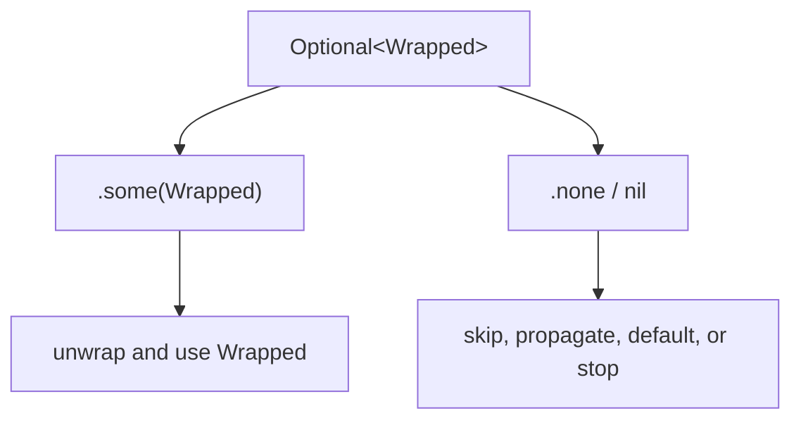

<TLDR>
  <TLDRCell label="what">
    <Term id="optional-value">可选值（optional value）</Term>写作 `Wrapped?`，它要么包含一个 `Wrapped` 值，要么是 `nil`。缺失状态属于类型，因此调用方不能把可能缺失的值直接当成普通值使用。
  </TLDRCell>
  <TLDRCell label="trap">
    `!` 会绕过安全检查；`??` 会用默认值覆盖缺失；可选链只告诉你整条链是否成功。三种写法都可能让不同业务状态失去区别。
  </TLDRCell>
  <TLDRCell label="fix">
    先定义 `nil` 的业务含义，再选择 `if let`、`guard let`、`?.`、`??` 或显式模式匹配。调用方需要失败原因时，改用 `throws` 或 `Result`。
  </TLDRCell>
</TLDR>

## 是什么，为什么存在

Swift 可选类型把「可能没有值」写进静态类型。
`String` 必须包含字符串，`String?` 则可以是 `.some(String)` 或 `.none`；`nil` 是 `.none` 的字面量写法。
因此，`nil` 不是能赋给任意变量的无类型空指针。

这个区分解决的是接口契约问题。
整数解析可能失败，字典查询可能找不到键，用户也可能没有填写昵称；这些操作返回可选值，让缺失状态在调用点仍然可见。
编译器会拒绝直接对 `String?` 调用只属于 `String` 的操作。

可选类型并不保证程序永不因空值崩溃。
强制解包 `value!` 在值为 `nil` 时仍会触发运行时错误，隐式解包可选值也有同样风险。
Swift 提供的是显式建模和安全处理路径，而不是对错误断言的自动修复。

只有「存在」与「缺失」两个结果足以描述契约时，`Optional` 才合适。
如果调用方需要区分权限不足、网络失败与格式错误，单个 `nil` 会丢失原因，此时应使用抛错函数或 `Result`。
同样，空字符串、空数组、`false` 与 `0` 都是实际值，不应自动当成 `nil`。

你会在标准库和应用边界频繁遇到可选值。
`Int(_:)` 解析文本时返回 `Int?`，字典下标读取返回 `Value?`，集合的 `first` 与 `last` 也返回可选值。
数据解码、用户输入和对象关系则让可选属性进入自己的模型。

## 工作原理

`Wrapped?` 是 `Optional<Wrapped>` 的简写。
`Optional` 是泛型枚举，包含 `.some(Wrapped)` 与 `.none` 两个 case。
这也解释了为什么可选值能使用 `switch` 和可选模式进行匹配。



声明 `var nickname: String?` 且不提供初始值时，变量默认是 `nil`。
非可选变量不能保存 `nil`，而且在读取前必须完成初始化。
可选与非可选是不同类型，即使它们共享同一个 `Wrapped`。

<Term id="optional-binding">可选绑定（optional binding）</Term>在检查值存在的同时创建解包后的名称。
`if let value = candidate` 适合存在与缺失两个分支都需要处理的情况。
Swift 5.7 起，同名绑定可以简写为 `if let candidate`。

`guard let` 适合表达后续代码的前置条件。
当值缺失时，`else` 分支必须用 `return`、`throw`、`break` 或其他方式离开当前作用域；通过检查后，解包名称在剩余作用域内可用。
这条规则让主要路径不必嵌套在额外的大括号中。

<Term id="optional-chaining">可选链（optional chaining）</Term>把成员访问、方法调用或下标访问放在 `?.` 之后。
接收值为 `nil` 时，后续操作不会执行，整个表达式返回 `nil`；接收值存在时，操作使用解包值继续执行。
即使末端成员原本是非可选类型，经过可选链后结果也是可选值。

<Term id="nil-coalescing">空合并（nil coalescing）</Term>表达式 `candidate ?? fallback` 在左侧有值时返回解包值，否则计算并返回右侧默认值。
右侧采用短路求值，因此昂贵或有副作用的默认表达式只会在左侧为 `nil` 时运行。
默认值必须与左侧包装类型兼容。

可选值的 `map` 只在值存在时执行转换，并把结果重新包装。
`flatMap` 接受本身返回可选值的转换，并避免得到额外一层 `Optional`。
序列的 `compactMap` 是另一项操作：它转换每个元素，并收集所有非 `nil` 结果。

后缀 `!` 是<Term id="force-unwrapping">强制解包（force unwrapping）</Term>。
它表示程序员断言值一定存在，而不是执行检查；断言错误会停止程序。
只有缺失确实代表内部不变量被破坏，而且安全形式会掩盖该错误时，才应考虑使用它。

## 示例

下面四个示例依次处理边界解析、成员访问、可选转换与嵌套状态。
当前环境没有 Swift 工具链，所以代码块按规则标明未执行，不提供猜测的运行结果。

### 解析边界输入

预订人数来自字符串字典，键可能缺失，文本也可能不是整数。
`guard` 把三项要求收束在函数入口；函数返回后，调用方仍要决定怎样处理无效请求。

<Depth level="quick">

```swift title="seat_request.swift"
// # not executed here: Swift toolchain is not installed.
func confirmedSeats(from fields: [String: String]) -> Int? {
    guard
        let rawSeats = fields["seats"],
        let seats = Int(rawSeats),
        (1...8).contains(seats)
    else {
        return nil
    }

    return seats
}

let requests = [
    ["name": "Mina", "seats": "4"],
    ["name": "Noah", "seats": "many"],
    ["name": "Iris"],
]

for request in requests {
    let name = request["name"] ?? "unknown"
    if let seats = confirmedSeats(from: request) {
        print("\(name): \(seats)")
    } else {
        print("\(name): invalid")
    }
}
```

```text
Not executed here: Swift toolchain is not installed.
```

<TryToBreak items={['缺少 seats 字段', '无法解析的整数', '范围外的 0 与 9']} />

</Depth>

`confirmedSeats(from:)` 使用 `nil` 合并了键缺失、解析失败和范围错误。
如果调用方需要向用户显示不同错误，这个返回类型就太窄，应换成带具体 case 的错误类型。
在只需要接受或拒绝请求的边界，两个结果则足够。

### 沿对象关系读取成员

可选链适合「任一环缺失就没有结果」的查询。
末尾的 `??` 只负责界面展示默认文本，并没有修改模型中的缺失状态。

```swift title="profile_contact.swift"
// # not executed here: Swift toolchain is not installed.
struct Contact {
    var email: String?
}

struct Profile {
    let displayName: String
    var contact: Contact?
}

func contactLine(for profile: Profile?) -> String {
    let email = profile?.contact?.email?.lowercased()
    return email ?? "no email"
}

let profiles: [Profile?] = [
    Profile(
        displayName: "Mina",
        contact: Contact(email: "MINA@EXAMPLE.COM")
    ),
    Profile(displayName: "Noah", contact: nil),
    nil,
]

for profile in profiles {
    let name = profile?.displayName ?? "missing profile"
    print("\(name): \(contactLine(for: profile))")
}
```

```text
Not executed here: Swift toolchain is not installed.
```

对第二与第三个元素，`email` 都是 `nil`。
单条可选链无法说明缺失的是资料、联系方式还是邮箱；如果这些状态需要不同界面或指标，应在合并前分支处理。
这不是语法缺陷，而是返回结果的信息量选择。

### 转换并筛掉无效元素

`flatMap` 适合把「可能有输入」连接到「可能失败的转换」。
数组上的 `compactMap` 则把每个元素的转换结果收集起来，并丢弃 `nil`。

```swift title="optional_transforms.swift"
// # not executed here: Swift toolchain is not installed.
let discountText: String? = "15"
let discountLabel = discountText
    .flatMap { Int($0) }
    .map { "\($0)%" }
    ?? "none"

let rawOrderIDs: [String?] = ["101", nil, "bad", "205"]
let orderIDs = rawOrderIDs.compactMap { rawID -> Int? in
    guard let rawID else {
        return nil
    }
    return Int(rawID)
}

let missingText: String? = nil
let skipped = missingText.map { value in
    print("transforming \(value)")
    return value.uppercased()
}

print(discountLabel)
print(orderIDs)
print(skipped == nil)
```

```text
Not executed here: Swift toolchain is not installed.
```

当 `discountText` 是有效整数文本时，`flatMap` 产生一个 `Int?`，后续 `map` 再生成标签。
如果输入本身缺失或解析失败，两个步骤都会传播 `nil`。
最后一项转换不会执行其闭包，因为接收值为 `nil`。

### 保留字典的三种状态

当字典的值类型本身是可选类型时，下标读取会得到嵌套可选值。
外层表示键是否存在，内层表示已存在键是否保存 `nil`。

```swift title="nested_optional.swift"
// # not executed here: Swift toolchain is not installed.
let ratings: [String: Int?] = [
    "approved": 5,
    "pending": nil,
]

func describe(_ rating: Int??) -> String {
    switch rating {
    case .none:
        return "missing key"
    case .some(.none):
        return "present, unrated"
    case .some(.some(let value)):
        return "rating \(value)"
    }
}

print(describe(ratings["approved"]))
print(describe(ratings["pending"]))
print(describe(ratings["unknown"]))

let flattened: Int? = ratings["pending"].flatMap { $0 }
print(flattened == nil)
```

```text
Not executed here: Swift toolchain is not installed.
```

直接使用两次绑定或 `flatMap` 会把外层与内层的缺失都压成一个 `nil`。
只有业务确实不区分「没有记录」与「记录尚未评分」时才应展平。
需要保留三种状态时，`switch` 比连续的便捷操作更诚实。

## 陷阱

### 用强制解包修复编译错误

> [!PITFALL]
> 生成代码常在编译器要求处理 `String?` 时添加 `!`。这只把编译期提醒改成运行时陷阱；异步响应、空集合和测试夹具很容易让原先的非空假设失效。

**修复方法：** 在产生可选值的边界验证假设。缺失可恢复时使用绑定、默认值或抛错；缺失表示内部不变量破坏时，可以用明确消息的 `preconditionFailure` 暴露契约，而不是让远处的 `!` 模糊原因。

### 用默认值掩盖无效数据

> [!PITFALL]
> `Int(text) ?? 0` 同时把真正的零、缺失输入和格式错误变成 `0`。如果零具有业务含义，程序之后无法恢复原始状态，也可能把坏数据写入存储。

**修复方法：** 只在默认值与缺失状态确实等价时使用 `??`。验证边界需要报告错误时，先用 `guard let` 或抛错解析器拒绝无效数据，再在展示层提供默认文本。

### 假设可选链说明了失败位置

> [!PITFALL]
> `account?.owner?.email` 返回 `nil` 时，没有记录是哪个环节缺失。把它直接用于错误消息或分析指标，会把不同修复路径混在一起。

**修复方法：** 只把可选链用于各环节缺失后处理方式相同的查询。需要具体原因时，在有意义的边界使用 `guard` 或 `switch`，并把领域错误保留下来。

### 混淆可选集合与可选元素

> [!PITFALL]
> `[Order]?` 表示整个集合可能缺失，`[Order?]` 表示集合存在但个别位置可能缺值。把两者都立刻 `compactMap` 成 `[Order]` 会删除来源不同的信息。

**修复方法：** 为两个层次分别写出契约。空集合通常已经能表达「查询成功但没有结果」；只有位置本身有意义时才保留可选元素，并明确说明删除缺口是否安全。

### 无意展平嵌套可选值

> [!PITFALL]
> 对 `[Key: Value?]` 读取下标会产生 `Value??`。连续绑定或 `flatMap { $0 }` 很方便，但会把「键不存在」与「键存在且值缺失」合成同一状态。

**修复方法：** 先决定外层与内层状态是否各自承载业务信息。需要区分时，用三分支 `switch` 或更明确的领域枚举；不需要区分时，再有意展平，并用测试固定这个决定。

## AI 时代

**生成代码在这里常犯的错**

模型很容易把编译器的「optional must be unwrapped」诊断机械修成 `!`，尤其是在字典读取、`first`、URL 构造和测试夹具附近。它也常把解析写成 `Int(raw) ?? 0`，把解码失败当作字段缺失，或在 `account?.profile?.email` 返回 `nil` 后声称邮箱字段一定缺失。处理 `[String: Value?]` 时，生成代码还可能把 `Value??` 展平，悄悄删除「键不存在」这一状态。

**让 AI 检查**

- 列出每个 `!`、隐式解包属性与 `as!`，说明非空或类型断言由哪项可执行前置条件保证。
- 为每个 `??` 写出左侧为 `nil` 的所有来源，并判断默认值是否会掩盖格式错误或缺失记录。
- 标注每条可选链和每个嵌套可选值会合并哪些失败状态，指出调用方是否需要区分它们。

**审查清单**

- 用缺失键、无效文本、空集合和可选链中每个 `nil` 位置分别运行测试。
- 检查 `nil`、空字符串、零、`false` 与空集合是否在领域中具有不同含义。
- 确认需要失败原因的接口没有只返回 `nil`，需要保留三态的代码没有意外展平。

**提示词词汇**

使用准确术语：`optional value`（可选值）、`wrapped type`（包装类型）、`optional binding`（可选绑定）、`optional chaining`（可选链）、`nil-coalescing operator`（空合并运算符）、`force unwrap`（强制解包）、`implicitly unwrapped optional`（隐式解包可选值）、`nested optional`（嵌套可选值）。要求模型说明每个 `nil` 的来源和业务含义；「让代码不崩溃」不足以判断默认值或展平是否正确。

<Depth level="deep">

## `Optional` 是枚举

标准库把 `Optional` 定义为带泛型参数 `Wrapped` 的枚举。
`.some` 保存一个包装值，`.none` 表示缺失；`nil` 可以在编译器知道可选类型的上下文中构造 `.none`。
常用的问号语法不会创建另一套运行时概念。

```swift
// # not executed here: Swift toolchain is not installed.
let short: Int? = 42
let long: Optional<Int> = .some(42)
let empty: Optional<Int> = .none

switch short {
case .some(let value):
    print(value)
case .none:
    print("missing")
}

print(short == long)
print(empty == nil)
```

```text
Not executed here: Swift toolchain is not installed.
```

这层枚举语义解释了可选模式 `case let value?`。
它匹配 `.some` 并绑定关联值，`case nil` 则匹配 `.none`。
处理多个状态组合时，模式匹配通常比一串布尔检查更容易验证穷尽性。

不要根据这一定义推断固定内存开销。
具体布局受包装类型、目标平台和编译器实现影响；源码契约保证可观察语义，不保证 `Int?` 比 `Int` 多几个字节。
没有目标平台上的测量，就不应给出性能结论。

## 嵌套可选值保留三态

`Wrapped??` 等同于 `Optional<Optional<Wrapped>>`。
它可以是 `.none`、`.some(.none)` 或 `.some(.some(value))`。
这不是重复语法，而是确实能承载三种状态的类型。

字典值已经是 `Value?` 时，下标还要用外层可选值表示键是否存在，所以读取类型是 `Value??`。
同类情况也可能出现在泛型 API：若函数声明返回 `T?`，而调用处选择的 `T` 本身就是可选类型，结果自然会嵌套。
API 作者不应假定问号总会自动折叠。

写入可选字典需要格外小心。
字典下标的赋值接口用外层 `nil` 表示移除键；要保存一个存在但内部为 `nil` 的值，必须让赋值表达式保留外层 `.some`。
领域枚举通常能让这种写操作比两层问号更直观。

## 转换与缺失传播

`Optional.map` 的转换返回普通值 `U`，整体结果是 `U?`。
接收值为 `nil` 时，闭包不会运行，结果仍为 `nil`；接收值存在时，即使包装值是 `false`、`0` 或空字符串，闭包也会运行。
判断依据只有可选 case，不是真值规则。

`Optional.flatMap` 的转换返回 `U?`，整体结果仍是 `U?`。
它把「上一步缺失」与「转换失败」都传播为一个 `nil`，很适合原因不重要的短转换链。
调用方需要知道哪一步失败时，应该使用抛错转换或显式分支。

`Sequence.compactMap` 与 `Optional.flatMap` 名称相关，但作用层次不同。
前者遍历多个元素并删除 `nil` 结果，可能改变集合长度与位置；后者只处理一个可选值。
对有位置语义的数据使用 `compactMap` 前，要先确认删除缺口不会错位。

`??` 也会合并状态，但它返回一个替代值。
由于右侧短路，`cached ?? loadDefault()` 只在缓存缺失时调用函数。
如果默认函数可能失败或产生副作用，这个执行条件应有测试覆盖。

## 强制与隐式解包

强制解包是运行时断言。
它适合表示程序自身已经证明的不变量，例如固定测试资源在测试开始时完成校验；它不适合未经验证的网络、磁盘、用户输入或生命周期状态。
把「通常不为 nil」写成 `!` 仍然是错误契约。

隐式解包声明写作 `Type!`，底层仍是 `Optional<Type>`。
它允许在需要非可选值的上下文中自动尝试解包，所以访问 `nil` 仍会失败。
它主要服务于初始化阶段暂时无法提供值、但使用阶段有外部生命周期保证的接口。

现代代码不应把每个延后初始化属性都声明为隐式解包。
构造器注入、普通可选属性、惰性属性或明确的状态枚举通常能把生命周期契约写得更清楚。
如果外部系统保证注入，测试还应覆盖保证尚未建立时的访问路径。

`try?` 会把抛错表达式转换成可选结果。
当错误原因确实不重要时它很简洁，但在日志、重试或用户提示需要原因时会删除信息。
生成代码经常用 `try?` 消除编译错误，因此审查时要把它与 `!`、`??` 一起搜索。

## 在 `Optional`、`throws` 与 `Result` 之间选择

返回 `T?` 表达「得到一个 `T`，或者没有结果」。
它适合查找未命中、可选字段或无需解释的转换失败。
文档仍应说明 `nil` 的具体含义，不能让调用方猜测。

抛错函数适合失败原因会改变当前调用方控制流的同步或异步操作。
错误可以携带上下文并沿调用栈传播；成功路径仍直接返回 `T`。
不要把正常的查找未命中都升级为异常，也不要把需要诊断的失败都压成 `nil`。

`Result<T, Failure>` 适合把成功或失败作为数据保存、排队或传给回调。
它保留失败类型，但不会替调用方决定恢复策略。
选择这三种形式时，问题是调用方需要观察哪些状态，而不是哪种语法最短。

有时领域枚举比三者都清楚。
例如缓存读取可能需要区分 `.hit(Value)`、`.miss` 与 `.stale(Value)`；把后两种都表示为 `nil` 会丢失刷新决策。
只有两态契约真正成立时，才让 `Optional` 承担它。

## 测试缺失契约

可选逻辑的测试至少覆盖 `.some` 与 `.none`。
但边界函数通常有多个通往 `nil` 的路径，例如字段缺失、解析失败和范围错误；若这些路径在业务上不同，就应分别断言行为。
只测试一个 `nil` 样例无法证明状态合并合理。

可选链要逐环断开测试。
分别让根对象、中间属性和末端属性为 `nil`，再确认展示默认值、日志和副作用符合契约。
如果所有样例只把根对象设为 `nil`，中间层的错误映射可能一直未被发现。

嵌套可选值需要三个测试输入。
断言 `.none`、`.some(.none)` 与 `.some(.some(value))` 的结果，才能防止维护者以后无意添加绑定或 `flatMap`，把三态压成两态。
测试名称应写出业务状态，而不是只写 `nil1` 与 `nil2`。

强制解包处应有建立不变量的相邻测试。
如果保证来自资源、配置、依赖注入或 UI 生命周期，测试必须覆盖那个边界，而不只是覆盖 `!` 之后的正常路径。
无法写出这项保证时，代码通常应该改用安全处理形式。

</Depth>

<Checkpoint id="swift/optionals" />

## 延伸阅读

- [Swift 编程语言：可选类型](https://docs.swift.org/swift-book/documentation/the-swift-programming-language/thebasics/#Optionals)
- [Swift 编程语言：可选链](https://docs.swift.org/swift-book/documentation/the-swift-programming-language/optionalchaining/)
- [Swift 编程语言：空合并运算符](https://docs.swift.org/swift-book/documentation/the-swift-programming-language/basicoperators/#Nil-Coalescing-Operator)
- [Apple 开发者文档：`Optional`](https://developer.apple.com/documentation/swift/optional)
- [Swift Evolution SE-0345：`if let` 简写](https://raw.githubusercontent.com/swiftlang/swift-evolution/main/proposals/0345-if-let-shorthand.md)
