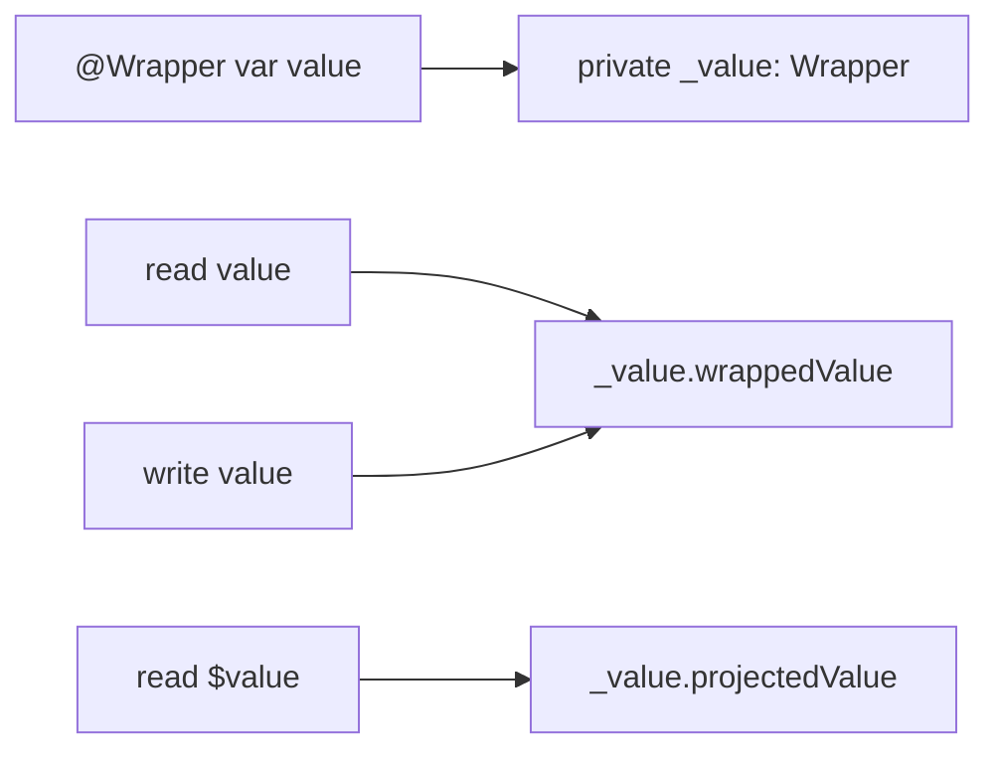

<TLDR>
  <TLDRCell label="what">
    A <Term id="property-wrapper">property wrapper</Term> puts reusable access logic in a type; the source property still exposes the domain value while the compiler synthesizes separate wrapper storage.
  </TLDRCell>
  <TLDRCell label="trap">
    A wrapper hides initialization, copy, persistence, and synchronization semantics; names such as `Atomic`, `Validated`, or `Default` don't prove those contracts are satisfied.
  </TLDRCell>
  <TLDRCell label="fix">
    Expand the `_property`, `property`, and `$property` paths, then test initial values, later assignments, copying, encoding, and concurrent compound operations separately.
  </TLDRCell>
</TLDR>

## What it is and why it exists

A property wrapper is a structure, class, or enumeration marked with `@propertyWrapper`. It defines at least one instance property named <Term id="wrapped-value">`wrappedValue`</Term>. A user applies the wrapper as an attribute, as in `@Clamped var score = 80`; reading and writing `score` still deals in `Int`, not `Clamped`.

It solves recurring property implementation patterns. Range limiting, normalization, deferred lookup, and framework state interfaces can all require the same access code; a wrapper lets a library author implement the mechanism once and a model author select it at the declaration. Wrappers fit stable mechanisms shared by several properties, not one-off business rules hidden behind ordinary-looking assignment.

You'll most often meet wrappers in SwiftUI's `@State`, `@Binding`, and `@Environment`, as well as application wrappers for persistence, validation, or dependency access. Every framework wrapper defines its own ownership and lifetime rules; the `@` syntax supplies none of those semantics. Understanding the language-level expansion is what lets you read `property`, `$property`, and `_property` correctly in framework documentation.

A wrapper isn't a macro and can't arbitrarily rewrite the declarations around it. The language fixes how storage, accessors, initialization, and projection relate; the behavior comes from ordinary Swift code in the wrapper type. When a feature must add several members, inspect adjacent properties, or transform a whole type, an explicit type or a macro usually states the boundary better.

Before choosing a wrapper, specify whether an invalid assignment is rejected, corrected, recorded, or reported as an error. A property setter can't throw, so an input boundary with recoverable failures is usually better modeled as a method or throwing initializer. A wrapper can preserve an invariant, but it shouldn't make an important failure disappear.

## How it works

For `@Clamped var score = 80`, the compiler conceptually synthesizes private <Term id="backing-storage">backing storage</Term> named `_score`, whose type is `Clamped`. The source-level `score` becomes a computed property that reads and writes `_score.wrappedValue`. This expansion explains semantics; the exact generated accessors and optimizer output aren't an ABI for application code to depend on.

If the wrapper also defines <Term id="projected-value">`projectedValue`</Term>, the compiler provides `$score`. A projection can be validation state, a binding, a publisher, or any other type the wrapper author chooses; no common protocol says it must be the wrapper itself. Without `projectedValue`, there is no `$score`.

Initialization syntax determines how the backing storage is constructed. When the declaration has an initial value, the compiler preferentially passes it to `init(wrappedValue:)`, with any other attribute arguments participating in the same call. Without a right-hand initial value, the wrapper can be initialized by an initializer matching the attribute arguments or by a parameterless `init()`.



The diagram has three distinct interfaces. The plain name serves domain callers, the `$` name serves capabilities the wrapper deliberately projects, and the `_` name is private implementation inside the enclosing type. Confusing them leads generated code to access a nonexistent projection or treat private backing storage as public API.

Trace a wrapper in this order:

1. Identify the type and mutability of `wrappedValue`, including side effects in its getter or setter.
2. Identify the initializer used at the declaration and whether the initial value goes through the same normalization or validation.
3. If `projectedValue` exists, record its exact type, mutability, and lifetime.
4. Determine whether the wrapper is a value or reference type and whether copies of the enclosing value share state.
5. Review encoding, error propagation, thread safety, and actor isolation separately instead of inferring guarantees from the wrapper's name.

Wrappers can compose, but their order matters. The backing storage for `@Outer @Inner var value: Int` is conceptually `Outer<Inner<Int>>`, and access passes through both `wrappedValue` layers. Only the outer wrapper determines the `$value` projection, so swapping the order can change types and behavior or make the declaration fail type checking.

## Examples

These four examples begin with normalization, then add a projection, dynamic initialization, and reference sharing. This environment has no Swift toolchain, so every block follows the repository convention by saying it wasn't executed; no output has been fabricated.

### Clamp a property's range

`Clamped` applies the same range rule during initialization and later assignment. Callers still use `health` as an `Int`, while the wrapper stores a value inside the range.

<Depth level="quick">

```swift title="clamped_health.swift"
// # not executed here: Swift toolchain is not installed.
@propertyWrapper
struct Clamped {
    private var value: Int
    let range: ClosedRange<Int>

    var wrappedValue: Int {
        get { value }
        set {
            value = min(max(newValue, range.lowerBound), range.upperBound)
        }
    }

    init(wrappedValue: Int, _ range: ClosedRange<Int>) {
        self.range = range
        self.value = min(max(wrappedValue, range.lowerBound), range.upperBound)
    }
}

struct Player {
    @Clamped(0...100) var health = 120
}

var player = Player()
print(player.health)
player.health = -15
print(player.health)
```

```text
Not executed here: Swift toolchain is not installed.
```

<TryToBreak items={['set the initial value to the lower bound', 'set a new value to the upper bound', 'write values below and above the range in succession']} />

</Depth>

Testing only the setter isn't enough. If the initializer stored `wrappedValue` directly, the initial `120` would violate the wrapper's promise until the first assignment corrected it. The range is also part of the contract; if its bounds come from untrusted input, validate their order before creating the `ClosedRange`.

### Project a rejection reason

`Accepted` retains the last valid value and exposes the most recently rejected candidate through a read-only projection. Reading `username` and reading `$username.lastRejected` are two explicitly different interfaces.

```swift title="accepted_username.swift"
// # not executed here: Swift toolchain is not installed.
@propertyWrapper
struct Accepted<Value> {
    struct Projection {
        let lastRejected: Value?
    }
    private var value: Value
    private var lastRejected: Value?
    private let accepts: (Value) -> Bool
    var wrappedValue: Value {
        get { value }
        set {
            if accepts(newValue) {
                value = newValue
                lastRejected = nil
            } else {
                lastRejected = newValue
            }
        }
    }
    var projectedValue: Projection {
        Projection(lastRejected: lastRejected)
    }

    init(wrappedValue: Value, _ accepts: @escaping (Value) -> Bool) {
        precondition(accepts(wrappedValue), "invalid initial value")
        self.value = wrappedValue
        self.accepts = accepts
    }
}

struct Profile {
    @Accepted({ !$0.isEmpty }) var username = "Guest"
}

var profile = Profile()
profile.username = ""
print(profile.username, profile.$username.lastRejected == "")
profile.username = "Amina"
print(profile.username, profile.$username.lastRejected == nil)
```

```text
Not executed here: Swift toolchain is not installed.
```

The projection makes failure observable, but assignment still doesn't force the caller to handle it.
If rejecting a value affects payments, permissions, or data integrity, use a result-returning or throwing method.
This wrapper fits a UI draft where a caller can inspect validation state separately.

### Configure backing storage in the enclosing initializer

The range comes from an `ExamResult` initializer argument and can't be written as a constant at the property declaration. The enclosing initializer assigns `_score` directly while keeping `score` as the public wrapped-value interface.

```swift title="configured_score.swift"
// # not executed here: Swift toolchain is not installed.
@propertyWrapper
struct Clamped {
    private var value: Int
    private let range: ClosedRange<Int>

    var wrappedValue: Int {
        get { value }
        set {
            value = min(max(newValue, range.lowerBound), range.upperBound)
        }
    }

    init(wrappedValue: Int, _ range: ClosedRange<Int>) {
        self.range = range
        self.value = min(max(wrappedValue, range.lowerBound), range.upperBound)
    }
}

struct ExamResult {
    @Clamped var score: Int

    init(score: Int, maximum: Int) {
        precondition(maximum >= 0, "maximum must be nonnegative")
        _score = Clamped(wrappedValue: score, 0...maximum)
    }
}

let result = ExamResult(score: 92, maximum: 80)
print(result.score)
```

```text
Not executed here: Swift toolchain is not installed.
```

`_score` is visible only inside `ExamResult`, which is exactly where construction-time wrapper configuration belongs. External callers shouldn't depend on this name; removing or replacing the wrapper should remain an implementation change. The initializer must validate `maximum` first, or creating an invalid closed range can fail before the wrapper runs.

### Expose sharing from a reference-type wrapper

A property wrapper can be a class. Copying the enclosing structure copies only the class reference in its backing storage, so both `Counter` values access the same `Shared<Int>` instance.

```swift title="shared_wrapper.swift"
// # not executed here: Swift toolchain is not installed.
@propertyWrapper
final class Shared<Value> {
    var wrappedValue: Value

    init(wrappedValue: Value) {
        self.wrappedValue = wrappedValue
    }
}

struct Counter {
    @Shared var count = 0
}

var original = Counter()
var copy = original

copy.count += 1
print(original.count)
print(copy.count)
```

```text
Not executed here: Swift toolchain is not installed.
```

Wrapper syntax hasn't broken Swift's copy rules; the field's value is a class reference. The sharing isn't visible on `Counter`'s surface, however, so the API must document that choice. When you need <Term id="value-semantics">value semantics</Term>, use a value-type wrapper or implement and test copy-on-write along every mutation path.

## Pitfalls

> [!PITFALL]
> A wrapper named `Validated` or `Clamped` can silently replace invalid input with a default or previous value. The caller sees an ordinary assignment and may assume the new value was stored.

**Fix:** define the failure policy and test both initial and subsequent assignment. If the caller must handle failure, use a method returning `Bool` or `Result`, or one that throws; projected state fits only an interaction model where checking later is acceptable.

> [!PITFALL]
> Locking the getter and setter separately doesn't make `counter.count += 1` atomic. That expression reads under one lock and writes under another, so a competing execution can interleave between them.

**Fix:** put the whole read-modify-write operation behind one protected method, or give the state to an actor. A concurrency test should start several callers together and verify the final invariant, not merely show that isolated reads and writes don't crash.

> [!PITFALL]
> A generic `UserDefaults` wrapper often uses `as? Value ?? defaultValue`, collapsing absence, an old schema, a wrong type, and corrupt data into the same default. It may also treat every `Codable` value as though `UserDefaults` natively supported it.

**Fix:** define a boundary of supported storage types and design schema migration and corrupt-data handling. Don't swallow encoding failures with `try?`; if values are stored as `Data`, let errors reach a boundary that can report or recover from them.

> [!PITFALL]
> Treating every `$property` as a `Binding` or wrapper instance produces type errors. The presence, type, and mutability of a projection come entirely from that wrapper's `projectedValue`, and composition exposes only the outermost projection.

**Fix:** read the exact projection type from the wrapper declaration or framework documentation. Project only the stable capability callers need instead of exposing all internal mutable state for convenience.

> [!PITFALL]
> Synthesized `Codable` conformance processes backing storage instead of bypassing the wrapper to process the domain value. Even when the wrapper has a default, a wholly missing key can fail before the wrapper's `init(from:)` gets control.

**Fix:** test a missing key, explicit `null`, wrong type, and corrupt content separately. For missing-key defaults, customize the enclosing type's `init(from:)` or provide a reviewed keyed-container decoding policy instead of adding only a default wrapper initializer.

## In the AI era

**What generated code gets wrong here**

Models often generate a wrapper named `Atomic`, lock its getter and setter separately, and keep using `+=` at call sites; the reassuring name hides lost updates. They also overgeneralize `UserDefaults` wrappers, erase encoding errors with `try?`, and print authentication tokens to logs. Another common change turns a wrapper into a class to “avoid copies” without disclosing that copies of the enclosing structure now share state.

There is also a Swift 6 migration failure: a model sees `wrappedValue` marked `@MainActor` and assumes the containing type automatically becomes `@MainActor`. SE-0401 removed that outward inference in Swift 6 language mode; a type or member that needs isolation must say so explicitly. Models also guess a projection type from a same-named wrapper in another framework instead of reading the current definition.

**Ask your AI to check**

- Expand each wrapped property into `_property`, `property`, and the optional `$property`, naming the initializer actually used and the projection's exact type.
- List the wrapper's copy, error, persistence, and concurrency semantics, then propose the smallest test that could falsify each guarantee.
- Check every compound read-modify-write synchronization boundary and confirm Swift 6 actor isolation comes from explicit declarations, not outward wrapper inference.

**Review checklist**

- Test both initial values and later assignment, including boundaries, invalid values, and whether failure is observable.
- Copy the enclosing value, mutate each copy separately, and confirm whether backing storage should be shared or independent.
- For persistence and concurrency wrappers, test corrupt data, upgrades, compound updates, isolation, and sensitive logging.

**Prompt vocabulary**

Use the exact terms `property wrapper`, `wrapped value`, `projected value`, `backing storage`, `init(wrappedValue:)`, `wrapper composition`, `compound read-modify-write`, and `outward actor isolation inference`. Ask for a syntax expansion and state-ownership table; “make this property safer” doesn't define a contract.

<Depth level="deep">

## Initialization and synthesized API

The three names created by a wrapper declaration serve different users. The plain property keeps its declared access level; backing storage `_value` is always private implementation in the enclosing type; `$value` exists only when `projectedValue` does. A projection can't be more visible than the original property, so a public wrapper type doesn't expose every property's backing state.

| Name | Conceptual type | Purpose |
| --- | --- | --- |
| `value` | The type of `Wrapper.wrappedValue` | The property used by domain code |
| `_value` | `Wrapper` | Compiler-synthesized private backing storage |
| `$value` | The type of `Wrapper.projectedValue` | The projection chosen by the wrapper |

For `@Rule(options) var value = initial`, `initial` corresponds to the `wrappedValue` parameter and `options` to the remaining wrapper parameters. Without a right-hand initial value, the compiler can use an initializer matching the attribute arguments; with no arguments, it can also use `init()`. Wrapper authors should avoid initializer sets distinguished only by subtle overloads because call sites then obscure the selected semantics.

An enclosing initializer can perform out-of-line initialization through `self.value = initial` when the wrapper provides a suitable `init(wrappedValue:)`. When it must also choose wrapper configuration, assigning `self._value = Wrapper(wrappedValue: initial, ...)` is explicit. That access belongs to the enclosing implementation and shouldn't appear in the consumer API.

A structure's synthesized memberwise initializer is also affected by the wrapper's initialization capabilities. Its parameter is sometimes the original property type and sometimes the wrapper type, depending on whether the declaration supplies an initial value and whether the wrapper can initialize from `wrappedValue`. A public model that needs a stable construction signature should declare an initializer instead of treating the synthesized shape as durable API.

## Mutability, observation, and composition

The accessors on `wrappedValue` determine whether the outer property can be written and whether a structure's getter or setter mutates `self`. A class wrapper, or a wrapper with a `nonmutating set`, can make apparent assignment modify state behind a reference or in external storage. When an enclosing value is bound with `let`, inspect wrapper accessor mutability instead of deciding from the property declaration alone.

A wrapped property can't define its own explicit `get` or `set` because the compiler synthesizes those accessors, but it can declare `willSet` and `didSet`. Observers sit on the wrapped-value assignment path and don't replace invariants inside the wrapper. If observation needs the raw candidate, normalized result, and rejection reason, design an unambiguous explicit interface.

A value-type wrapper is copied with its enclosing structure and usually preserves value semantics naturally. A class wrapper copies a reference and can make two enclosing values share hidden state; a structure wrapper containing closures, pointers, or other references still needs field-by-field analysis. A `struct` label alone doesn't guarantee an independent object graph.

Wrapper composition is nested typing, not two independent interceptors installed side by side. The outer wrapper's `wrappedValue` must hold the inner wrapper, and initialization nests through each layer. Composition isn't commutative; during review, write the types from outer to inner and then follow the actual getter and setter path.

The composed `$value` comes only from the outermost `projectedValue`. If callers need inner state, the outer wrapper must deliberately include it in its own projection contract. Reaching through wrapper layers directly makes implementation order a public dependency and makes later recomposition hazardous.

## `Codable` and concurrency boundaries

When the compiler synthesizes `Encodable`, `Decodable`, `Equatable`, or `Hashable` for an enclosing type, it works from the backing-storage property. Encoding uses the original property name as the key, but the wrapper type is what participates in conformance. A wrapper can therefore control representation or equality, and adding one can change whether synthesis is available and what it means.

A missing key is the easiest path to overlook in a property-wrapper default. A keyed container usually tries to decode the wrapper type by key first; if the key is absent, it can throw without calling the wrapper's `init(from:)`. A `null`, a wrong type, and a wrapper value that decodes but violates a domain rule are different paths and shouldn't be collapsed through one `try?` fallback.

Property wrappers don't automatically provide thread safety. Even if a single getter and setter synchronize independently, a caller's `+=`, check-then-set, or read-then-mutate operation can span several critical sections. The wrapper must offer an operation covering the whole invariant, or place mutable state in an actor and document the isolation domain from which it can be accessed.

Swift 6 no longer infers isolation for an entire enclosing type merely because a wrapped property's `wrappedValue` has a global-actor annotation. That prevents a private wrapper from silently changing isolation of sibling members. Code that relies on the main actor or a custom global actor should annotate the type, property, or method explicitly and let strict concurrency checking validate accesses.

`Sendable` doesn't follow from wrapper syntax either. If an enclosing value crosses isolation domains, inspect every field, closure, and reference stored by the wrapper for the transfer contract. Adding an incorrect `@unchecked Sendable` to the wrapper only suppresses compiler diagnostics; it supplies no synchronization.

## Applicability and restrictions

Property wrappers apply to mutable declarations with storage semantics. They can appear on class or structure instance properties, type properties, and local stored variables; the wrapper type itself can be an enumeration, but an enumeration can't have instance storage, so its instance properties can't use wrappers. Where a wrapper is applied and what kind of type implements it are separate questions.

| Declaration location or form | Supported | Main reason |
| --- | --- | --- |
| Class or structure instance `var` | Yes | The compiler can synthesize wrapper backing storage |
| `static var` type property | Yes | Storage belongs to the type instead of an instance |
| Local stored `var` | Yes | Backing storage belongs to the local scope |
| Global variable | No | The `propertyWrapper` attribute explicitly excludes globals |
| `let` constant | No | A wrapper requires a variable declaration |
| Explicit computed property | No | The wrapper already synthesizes `get` and optional `set` |
| Property requirement in a protocol | No | A requirement has nowhere to store a wrapper instance |
| Instance property in an extension | No | An extension can't add this instance backing storage |
| `lazy`, `weak`, or `unowned` property | No | Those storage modifiers can't be combined with a wrapper |

A wrapped property also can't override a superclass property or combine with `@NSCopying` or `@NSManaged`. These constraints follow from synthesized storage and accessors rather than style preferences. When the compiler rejects a use, check the declaration location and modifiers instead of adding another abstraction layer to evade the rule.

Check at least these four points when reviewing where a wrapper is used:

- The declaration is a storage-bearing `var`, not a constant or custom computed property.
- The enclosing declaration can actually gain backing storage; it isn't a protocol requirement or extension instance property.
- The wrapper's access level can support the wrapped property's visibility.
- Attribute arguments depend only on values available during initialization and don't read an incompletely initialized `self`.

A wrapped property can have `willSet` and `didSet`, but observers aren't another custom accessor implementation. Observers should respond only to the defined assignment contract; if they also normalize, persist, or notify, behavior is split across two layers and its order and failure result become harder to reason about.

Some libraries use an underscored static-subscript technique to give a wrapper access to its enclosing instance. That facility never became a formal stable capability in SE-0258, so don't teach `_enclosingInstance` to a generator as general public language API. When logic needs adjacent properties or complete `self`, prefer a method on the enclosing type, an explicit collaborator, or a stable macro interface.

A local-variable wrapper can narrow a mechanism to one function, but it can still hide cost and side effects. When a local declaration is used only once, an explicit function call is usually clearer; a wrapper earns its place when several reads and writes in that scope need the same interception.

## Testing hidden behavior

A wrapper's minimum test matrix covers a declaration-time initial value, initializer assignment, in-range writes, and out-of-range writes. Each path should assert the plain property and its projection so a correct wrapped value can't hide stale diagnostic state. If the property has observers, also verify their count and visible values against the API contract.

A copy test creates at least two enclosing values, mutates one, and observes both. When independence is intended, this catches sharing from a class wrapper or nested reference; when sharing is intended, it tests lifetime and ownership. Testing through the public interface survives an implementation change better than assertions against `_property`.

A persistence wrapper needs cases for first installation, a normal round trip, a missing key, old-version data, corrupt data, and write failure. Fixtures should use an isolated container or suite instead of polluting process-wide standard user defaults. A security review should also scan logs, error descriptions, and projections for secrets or personal data.

A concurrency test must target the business-atomic operation rather than isolated getters and setters. Race several tasks against the same update and assert a count, uniqueness constraint, or state-transition invariant; when actor isolation is part of the contract, compile cross-domain access cases too. Without measurements, don't claim that wrapper inlining, locking cost, or memory layout is better than an explicit type.

</Depth>

<Checkpoint id="swift/property-wrappers" />

## Further reading

- [Swift reference — `propertyWrapper` attribute](https://docs.swift.org/swift-book/documentation/the-swift-programming-language/attributes/)
- [Apple Developer — `Codable`](https://developer.apple.com/documentation/swift/codable/)
- [The Swift Programming Language — Concurrency](https://docs.swift.org/swift-book/documentation/the-swift-programming-language/concurrency/)
- [The Swift Programming Language — Automatic Reference Counting](https://docs.swift.org/swift-book/documentation/the-swift-programming-language/automaticreferencecounting/)
