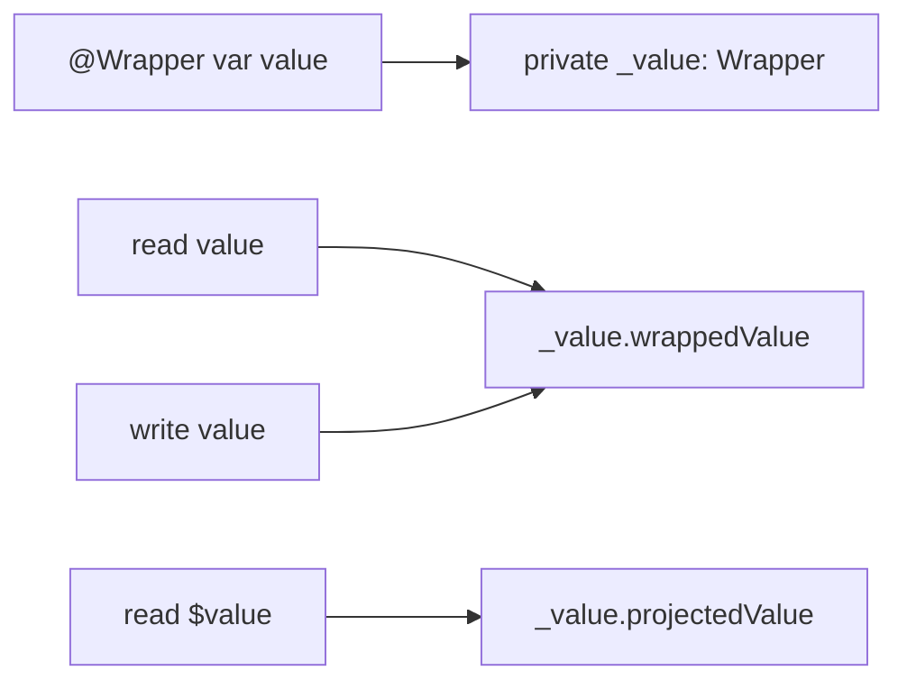

<TLDR>
  <TLDRCell label="what">
    <Term id="property-wrapper">属性包装器（property wrapper）</Term>把可复用的存取逻辑放进一个类型；源码中的普通属性仍暴露业务值，编译器另外合成包装器存储。
  </TLDRCell>
  <TLDRCell label="trap">
    包装器会隐藏初始化、复制、持久化和同步语义；名字叫 `Atomic`、`Validated` 或 `Default`，不等于实现已经满足这些契约。
  </TLDRCell>
  <TLDRCell label="fix">
    展开 `_property`、`property` 与 `$property` 三条访问路径，分别测试初始值、后续赋值、复制、编码和并发复合操作。
  </TLDRCell>
</TLDR>

## 是什么，为什么存在

属性包装器是一种标记了 `@propertyWrapper` 的结构体、类或枚举。它至少定义一个名为 <Term id="wrapped-value">`wrappedValue`（包装值）</Term>的实例属性；使用方把包装器作为属性特性写成 `@Clamped var score = 80`，读写 `score` 时仍得到 `Int`，而不是 `Clamped`。

它解决的是重复的属性实现模式。范围限制、规范化、延迟取值或框架状态接口都可能需要相同的存取代码；包装器让库作者写一次机制，模型作者在声明处选择它。包装器适合横跨多个属性且契约稳定的机制，不适合把一次性的业务规则藏进看似普通的赋值。

你最常在 SwiftUI 的 `@State`、`@Binding` 与 `@Environment` 中遇到它，也会在应用代码里看到持久化、验证或依赖访问包装器。每个框架包装器都有自己的所有权和生命周期规则，`@` 语法本身并不提供这些语义。理解语言层的展开方式，才能正确阅读框架文档里的 `property`、`$property` 和 `_property`。

包装器不是宏，也不会任意改写声明周围的代码。语言规定了合成存储、访问器、初始化和投影的固定关系；真正的行为来自包装器类型的普通 Swift 代码。需要新增多个成员、检查相邻属性或改变整个类型时，显式类型或宏通常更能表达边界。

选择包装器之前，先写清赋值失败时是拒绝、修正、记录错误还是抛出错误。属性 setter 不能抛错，因此需要可恢复错误的输入边界通常更适合方法或可抛构造器。包装器可以维护不变量，但不应让重要失败静默消失。

## 工作原理

对 `@Clamped var score = 80`，编译器概念上合成一个私有的 <Term id="backing-storage">后备存储（backing storage）</Term> `_score`，其类型是 `Clamped`。源码中的 `score` 变成通过 `_score.wrappedValue` 读写的计算属性。这里的展开用于理解语义；生成的具体访问器和优化结果不是应用代码应依赖的 ABI。

若包装器还定义 <Term id="projected-value">`projectedValue`（投影值）</Term>，编译器会提供 `$score`。投影可以是验证状态、绑定、发布者或包装器作者选择的其他类型，并没有统一协议保证它一定是包装器本身。没有 `projectedValue`，就没有 `$score`。

初始化语法决定后备存储如何构造。声明右侧有初始值时，编译器优先把它传给 `init(wrappedValue:)`，包装器特性中的其他参数随后参与同一次调用。没有右侧初始值时，包装器可以通过特性参数对应的构造器或无参数 `init()` 完成初始化。



这张图中有三种不同接口。普通名称服务业务调用方，`$` 名称服务包装器刻意公开的附加能力，`_` 名称则是外围类型内部的私有实现。把三者混为一谈，会让生成代码访问不存在的投影，或把私有后备存储当成公开 API。

判断一个包装器时，按以下顺序追踪：

1. 确认 `wrappedValue` 的类型、可读写性，以及 getter 或 setter 是否有副作用。
2. 确认声明使用了哪个包装器构造器，初始值是否也经过同一套规范化或验证。
3. 若存在 `projectedValue`，记录其准确类型、可变性与生命周期。
4. 确认包装器是值类型还是引用类型，并检查外围值复制后是否共享状态。
5. 单独审查编码、错误传播、线程安全和 actor 隔离，不从包装器名称推断这些保证。

包装器可以组合，但顺序有意义。`@Outer @Inner var value: Int` 的后备存储概念上是 `Outer<Inner<Int>>`，读写路径逐层经过两个 `wrappedValue`。只有最外层包装器决定 `$value` 的投影，因此交换顺序可能改变类型、行为，甚至使声明无法通过类型检查。

## 示例

下面四个示例从基本规范化开始，再加入投影、动态初始化和引用共享。当前环境没有 Swift 工具链，因此每个代码块都按仓库约定明确标为未执行，没有伪造输出。

### 限制属性范围

`Clamped` 在初始化和后续赋值时使用同一条限制规则。调用方仍把 `health` 当作 `Int`，包装器负责保存符合范围的值。

<Depth level="quick">

```swift title="clamped_health.swift"
// # not executed here: Swift toolchain is not installed.
@propertyWrapper
struct Clamped {
    private var value: Int
    let range: ClosedRange<Int>

    var wrappedValue: Int {
        get { value }
        set {
            value = min(max(newValue, range.lowerBound), range.upperBound)
        }
    }

    init(wrappedValue: Int, _ range: ClosedRange<Int>) {
        self.range = range
        self.value = min(max(wrappedValue, range.lowerBound), range.upperBound)
    }
}

struct Player {
    @Clamped(0...100) var health = 120
}

var player = Player()
print(player.health)
player.health = -15
print(player.health)
```

```text
Not executed here: Swift toolchain is not installed.
```

<TryToBreak items={['把初始值设为下界', '把新值设为上界', '连续写入低于和高于范围的值']} />

</Depth>

这里不能只测试 setter。若构造器直接保存 `wrappedValue`，初始的 `120` 会违反包装器承诺，直到第一次赋值才被修正。范围本身也属于契约；若上下界来自不可信输入，应在创建 `ClosedRange` 之前验证顺序。

### 用投影报告拒绝原因

`Accepted` 保留最后一次有效值，并通过只读投影报告最近被拒绝的候选值。直接读取 `username` 与读取 `$username.lastRejected` 是两个明确不同的接口。

```swift title="accepted_username.swift"
// # not executed here: Swift toolchain is not installed.
@propertyWrapper
struct Accepted<Value> {
    struct Projection {
        let lastRejected: Value?
    }
    private var value: Value
    private var lastRejected: Value?
    private let accepts: (Value) -> Bool
    var wrappedValue: Value {
        get { value }
        set {
            if accepts(newValue) {
                value = newValue
                lastRejected = nil
            } else {
                lastRejected = newValue
            }
        }
    }
    var projectedValue: Projection {
        Projection(lastRejected: lastRejected)
    }

    init(wrappedValue: Value, _ accepts: @escaping (Value) -> Bool) {
        precondition(accepts(wrappedValue), "invalid initial value")
        self.value = wrappedValue
        self.accepts = accepts
    }
}

struct Profile {
    @Accepted({ !$0.isEmpty }) var username = "Guest"
}

var profile = Profile()
profile.username = ""
print(profile.username, profile.$username.lastRejected == "")
profile.username = "Amina"
print(profile.username, profile.$username.lastRejected == nil)
```

```text
Not executed here: Swift toolchain is not installed.
```

投影让失败可观察，但赋值表达式本身仍不能强迫调用方处理失败。
若拒绝值会影响付款、权限或数据完整性，应使用返回结果或抛错的方法。
这个包装器适合 UI 草稿之类允许调用方另行检查状态的场景。

### 在外围构造器中配置后备存储

范围来自 `ExamResult` 的构造参数，无法在属性声明处写成常量。外围构造器直接初始化 `_score`，同时保留 `score` 作为对外的包装值接口。

```swift title="configured_score.swift"
// # not executed here: Swift toolchain is not installed.
@propertyWrapper
struct Clamped {
    private var value: Int
    private let range: ClosedRange<Int>

    var wrappedValue: Int {
        get { value }
        set {
            value = min(max(newValue, range.lowerBound), range.upperBound)
        }
    }

    init(wrappedValue: Int, _ range: ClosedRange<Int>) {
        self.range = range
        self.value = min(max(wrappedValue, range.lowerBound), range.upperBound)
    }
}

struct ExamResult {
    @Clamped var score: Int

    init(score: Int, maximum: Int) {
        precondition(maximum >= 0, "maximum must be nonnegative")
        _score = Clamped(wrappedValue: score, 0...maximum)
    }
}

let result = ExamResult(score: 92, maximum: 80)
print(result.score)
```

```text
Not executed here: Swift toolchain is not installed.
```

`_score` 只在 `ExamResult` 内部可见，这正适合构造阶段选择包装器配置。不要让外部调用方依赖这个名称；把包装器移除或替换应当只是类型的实现变化。构造器还必须先验证 `maximum`，否则创建无效闭区间可能在包装器执行前失败。

### 看见引用类型包装器的共享状态

属性包装器可以是类。复制外围结构体时，类类型后备存储只复制引用，因此两个 `Counter` 值会访问同一个 `Shared<Int>` 实例。

```swift title="shared_wrapper.swift"
// # not executed here: Swift toolchain is not installed.
@propertyWrapper
final class Shared<Value> {
    var wrappedValue: Value

    init(wrappedValue: Value) {
        self.wrappedValue = wrappedValue
    }
}

struct Counter {
    @Shared var count = 0
}

var original = Counter()
var copy = original

copy.count += 1
print(original.count)
print(copy.count)
```

```text
Not executed here: Swift toolchain is not installed.
```

包装器语法没有破坏 Swift 的复制规则；字段的值本来就是类引用。但 `Counter` 的表面看不出共享关系，因此 API 必须记录这种选择。需要 <Term id="value-semantics">值语义（value semantics）</Term>时，应使用值类型包装器，或在所有修改路径上实现并测试写时复制。

## 陷阱

> [!PITFALL]
> 名为 `Validated` 或 `Clamped` 的包装器很容易把无效输入静默改成默认值或旧值。调用方看到一次普通赋值，可能误以为新值已经保存。

**修复方法：** 明确失败策略，并同时测试初始值与后续赋值。需要调用方处理失败时，使用 `throws`、`Result` 或返回 `Bool` 的方法；投影状态只适合允许稍后检查的交互模型。

> [!PITFALL]
> 在 getter 与 setter 中分别加锁，不会让 `counter.count += 1` 原子化。这个表达式先在一次加锁中读取，再在另一次加锁中写入，其他执行单元可以插入两步之间。

**修复方法：** 把完整的读改写操作放进同一个受保护方法，或把状态交给 actor。并发测试要同时启动多个调用方并检查最终不变量，不能只分别测试读和写没有崩溃。

> [!PITFALL]
> 泛型 `UserDefaults` 包装器常用 `as? Value ?? defaultValue`，把缺失、旧模式、错误类型和损坏数据全部折叠成默认值。它还可能把任意 `Codable` 值当成属性列表原生支持的值。

**修复方法：** 为支持的存储类型建立明确边界，并设计模式迁移与损坏数据处理。编码失败不能用 `try?` 静默吞掉；若使用 `Data`，让错误到达可以记录或恢复的边界。

> [!PITFALL]
> 把 `$property` 一律当成 `Binding` 或包装器实例会生成类型错误。投影的存在、类型和可写性完全由每个包装器的 `projectedValue` 决定，组合时还只暴露最外层投影。

**修复方法：** 从包装器声明或框架文档读取投影的准确类型。只公开调用方真正需要的稳定能力，不要为了方便把所有内部可变状态作为投影泄露出去。

> [!PITFALL]
> 生成的 `Codable` 遵循会处理后备存储，而不是绕过包装器直接处理业务值。即使包装器内部有默认值，缺少整个键也可能在包装器的 `init(from:)` 获得控制之前就失败。

**修复方法：** 用缺失键、显式 `null`、错误类型和损坏内容分别测试解码。需要缺失键默认行为时，在外围类型自定义 `init(from:)`，或提供经过审查的键控容器解码策略，不要只给包装器增加默认构造器。

<Depth level="deep">

## 初始化与合成接口

包装器声明产生的三个名称面向不同使用者。普通属性保持原声明的访问级别；后备存储 `_value` 始终是外围类型的私有实现；只有定义了 `projectedValue` 才会出现 `$value`。投影的访问级别不会比原属性更宽，因此公开包装器类型不等于公开每个属性的后备状态。

| 名称 | 概念类型 | 作用 |
| --- | --- | --- |
| `value` | `Wrapper.wrappedValue` 的类型 | 业务代码读写的属性 |
| `_value` | `Wrapper` | 编译器合成的私有后备存储 |
| `$value` | `Wrapper.projectedValue` 的类型 | 包装器选择公开的投影 |

当声明写成 `@Rule(options) var value = initial`，`initial` 对应 `wrappedValue` 参数，`options` 对应其余包装器参数。若声明没有右侧初始值，编译器可以使用与特性参数匹配的构造器；没有参数时还可以使用 `init()`。包装器作者应避免一组仅凭细微重载差异选择的构造器，否则调用点很难判断实际语义。

外围构造器可以通过 `self.value = initial` 进行脱离声明位置的初始化，前提是包装器提供合适的 `init(wrappedValue:)`。需要同时选择包装器配置时，直接赋值 `self._value = Wrapper(wrappedValue:initial, ...)` 更明确。这种访问只属于外围类型实现，不应出现在使用方 API 中。

结构体的合成逐成员构造器也会受包装器初始化能力影响。参数有时是原属性类型，有时是包装器类型，具体取决于声明是否提供初始值以及包装器能否从 `wrappedValue` 构造。公共模型若依赖稳定的构造签名，应显式声明构造器，而不是把编译器合成形状当作长期 API。

## 可变性、观察与组合

`wrappedValue` 的访问器决定外层属性能否写入，以及结构体 getter 或 setter 是否需要修改 `self`。类包装器或带 `nonmutating set` 的包装器可以让表面上的赋值修改引用后方或其他外部存储。看到外围值绑定为 `let` 时，仍要检查包装器访问器的可变性，不能只凭属性声明判断。

被包装属性不能再定义自己的显式 `get` 或 `set`，因为这两个访问器已经由编译器合成；但它可以声明 `willSet` 和 `didSet`。观察器位于包装值赋值路径上，不会代替包装器内部的不变量。若观察时需要原始候选值、修正后值和拒绝原因，应设计一个没有歧义的显式接口。

值类型包装器随外围结构体一起复制，通常自然保留值语义。类包装器则复制引用，可能让两个外围值共享隐藏状态；包含闭包、指针或其他引用字段的结构体包装器也需要逐字段分析。`struct` 标签本身不保证完整对象图独立。

组合包装器相当于嵌套类型，而不是把两个独立拦截器并排安装。外层包装器的 `wrappedValue` 必须能够容纳内层包装器，初始化也逐层嵌套。组合不满足交换律；评审时要按源码从外到内写出类型，再按实际 getter 和 setter 路径检查顺序。

组合后的 `$value` 只来自最外层 `projectedValue`。如果调用方需要内层状态，外层包装器必须有意把它纳入自己的投影契约。直接穿透多层包装器会把实现顺序变成公开依赖，使以后调整组合变得危险。

## `Codable` 与并发边界

编译器为外围类型合成 `Encodable`、`Decodable`、`Equatable` 或 `Hashable` 时，依据的是后备存储属性。编码使用原属性名作为键，但真正参与遵循的是包装器类型。因此包装器可以控制表示或比较方式，也意味着给普通属性加包装器可能改变自动合成是否可用及其语义。

缺失键是属性包装器默认值最容易漏测的路径。键控容器通常先尝试按键解码包装器类型，键不存在时就会抛错，未必调用包装器的 `init(from:)`。`null`、错误类型和包装器能解析但业务值无效又是不同路径，不能用一个 `try?` 后备值把它们视为同一状态。

属性包装器不自动提供线程安全。即使单次 getter 与 setter 各自同步，调用方的 `+=`、检查后设置以及集合的读取后修改仍可能跨越多个临界区。包装器需要公开能够覆盖完整不变量的操作，或者把可变状态放在 actor 中，并记录允许从哪个隔离域访问。

Swift 6 不再因为某个被包装属性的 `wrappedValue` 具有全局 actor 限定，就把该隔离向外推断给整个外围类型。这让私有包装器不再暗中改变兄弟成员的隔离。依赖主 actor 或自定义全局 actor 的代码应在类型、属性或方法上显式标注，并让编译器在严格并发检查下验证访问。

`Sendable` 也不会由包装器语法自动成立。外围值若跨隔离域传递，必须检查包装器保存的每个字段、闭包和引用是否满足传递契约。给包装器加上不正确的 `@unchecked Sendable` 只会移除编译器诊断，不会增加同步。

## 适用位置与限制

属性包装器用于有存储语义的可变声明。它可以出现在类或结构体的实例属性、类型属性以及局部存储变量上；包装器类型本身可以是枚举，但枚举不能拥有实例存储属性，所以不能在枚举实例属性上使用它。是否写在类型内部与包装器自身采用什么类型是两个不同问题。

| 声明位置或形式 | 是否支持 | 关键原因 |
| --- | --- | --- |
| 类或结构体的实例 `var` | 支持 | 编译器可以合成包装器后备存储 |
| 类型属性 `static var` | 支持 | 存储属于类型而不是实例 |
| 局部存储 `var` | 支持 | 后备存储属于局部作用域 |
| 全局变量 | 不支持 | `propertyWrapper` 特性明确排除全局变量 |
| `let` 常量 | 不支持 | 包装器要求可变声明 |
| 显式计算属性 | 不支持 | 包装器已经合成 `get` 和可选的 `set` |
| 协议中的属性要求 | 不支持 | 要求没有可供协议存储的包装器实例 |
| 扩展中的实例属性 | 不支持 | 扩展不能为实例增加这项后备存储 |
| `lazy`、`weak` 或 `unowned` 属性 | 不支持 | 这些存储修饰不能与包装器叠加 |

包装器属性也不能覆盖父类属性，不能与 `@NSCopying` 或 `@NSManaged` 组合。限制来自后备存储和访问器的合成模型，而不是风格建议。编译诊断出现时，应检查声明位置与修饰符，不要用额外包装层绕过语言限制。

评审使用位置时，至少确认以下四项：

- 声明是存储语义的 `var`，而不是常量或自定义计算属性。
- 外围声明实际允许新增后备存储，不是协议要求或扩展实例属性。
- 包装器的访问级别足以支持被包装属性的可见性。
- 特性参数只依赖初始化时已经可用的值，不读取尚未初始化的 `self`。

被包装属性可以拥有 `willSet` 与 `didSet`，但观察器不是新增的自定义访问器。观察器应只响应已定义的赋值契约；若它又执行规范化、持久化或通知，行为会分散到两个层次，更难推断顺序与失败结果。

一些库使用带下划线的静态下标技巧，让包装器取得外围实例。该机制没有成为 SE-0258 的正式稳定能力，不能把 `_enclosingInstance` 当作通用公开语言 API 教给生成器。需要相邻属性或完整 `self` 的逻辑时，优先使用外围类型的方法、显式协作者或稳定的宏接口。

局部变量包装器适合缩小一次函数内部的机制范围，但它仍可能隐藏成本与副作用。局部声明若只使用一次，显式函数调用通常更直接；只有同一作用域内多次读写都需要一致拦截时，包装器才真正减少重复。

## 测试隐藏行为

包装器的最小测试矩阵包含声明时初始值、构造器赋值、边界内写入和边界外写入。每条路径都应断言普通属性与投影，避免包装值正确但诊断状态过期。若属性带观察器，还要确认观察次数与可见值符合 API 契约。

复制测试至少创建两个外围值，修改其中一个，再从两个入口观察结果。期望独立时，这能发现类包装器或嵌套引用造成的共享；期望共享时，则要验证生命周期和所有权。测试公开接口比直接断言 `_property` 更能承受实现替换。

持久化包装器需要覆盖首次安装、正常往返、缺失键、旧版本数据、损坏数据和写入失败。测试夹具应使用独立容器或 suite，不能污染进程的标准用户默认值。安全评审还要扫描日志、错误描述和投影，确认其中没有密钥或个人数据。

并发测试必须针对业务原子操作，而不是孤立的 getter 和 setter。让多个任务竞争同一更新，并断言总数、唯一性或状态转换不变量；若契约要求 actor 隔离，还要编译跨域访问案例。没有测量数据时，不要声称包装器内联、加锁开销或内存布局一定优于显式类型。

</Depth>

<Checkpoint id="swift/property-wrappers" />

## 延伸阅读

- [Swift 语言参考：`propertyWrapper` 特性](https://docs.swift.org/swift-book/documentation/the-swift-programming-language/attributes/)
- [Apple Developer：`Codable`](https://developer.apple.com/documentation/swift/codable/)
- [Swift 语言指南：并发](https://docs.swift.org/swift-book/documentation/the-swift-programming-language/concurrency/)
- [Swift 语言指南：自动引用计数](https://docs.swift.org/swift-book/documentation/the-swift-programming-language/automaticreferencecounting/)
