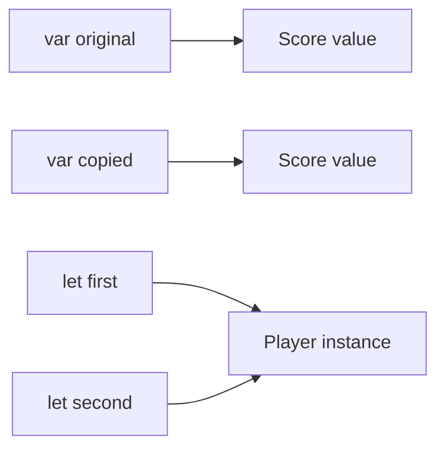

<TLDR>
  <TLDRCell label="what">
    Structures are copyable value types by default, so assignment and parameter passing create logically independent values; classes are reference types, so several references can point to one instance.
  </TLDRCell>
  <TLDRCell label="trap">
    Copying a structure does not recursively copy class instances stored inside it, and a `let` class reference does not freeze the instance's mutable properties.
  </TLDRCell>
  <TLDRCell label="fix">
    Start with a structure; choose a class only when the model needs shared identity, inheritance, or an ARC-managed lifetime, and inspect ownership for every nested reference.
  </TLDRCell>
</TLDR>

## What it is and why it exists

Structures and classes both organize data and behavior into a named type.
Both can declare properties, methods, subscripts, and initializers, conform to protocols, and gain capabilities through extensions.
The design choice comes from what happens when a value is assigned, passed, and mutated, not from this shared syntax.

An ordinary structure has <Term id="value-semantics">value semantics</Term>.
Assigning a structure to another variable or passing it to a function produces a logical copy; subsequently mutating one value must not change the other's observable state.
A “logical copy” does not require the runtime to duplicate every byte immediately, because the compiler and standard library may share unobservable internal storage.

A class has reference semantics.
A variable holds a reference to an instance, and copying that reference does not create an instance; several callers can read and write the same object through different names.
Class instances also have <Term id="reference-identity">reference identity</Term>, so `===` and `!==` tell whether two references point to the same instance.

This distinction supports two different modeling needs.
Money, coordinates, configuration snapshots, and parse results usually represent “what this value is” and suit independent copying; sessions, connections, controllers, and resources with explicit lifetimes often represent “which object this is” and may need shared identity.
If a rule needs only equality and not identity, convenience of mutation alone is not a reason to introduce shared references.

You encounter this choice in API models, collection elements, SwiftUI state, caches, protocol implementations, and concurrency boundaries.
It is not a size rule in which structures are small and classes are large, nor a simplified stack-versus-heap rule.
Choose semantics and ownership first, then address performance with measurements.

## How it works

When you declare a structure value, the variable represents that value directly.
Assignment of a copyable structure establishes a new logical value, and function parameters receive values by the same principle.
An implementation may eliminate copies, store fields inline, or use a shared buffer for a collection as long as value semantics remain externally observable.

When you create a class instance, a variable represents a reference.
After assigning the reference to another variable, both point to the same instance; mutating a property through either reference is visible through the other.
Swift uses Automatic Reference Counting (ARC) to manage class-instance lifetimes, while a structure value itself is not managed by reference-counting that value.



The two variables at the top own observably independent `Score` values.
The two constant references at the bottom point to one `Player` instance.
`let` fixes the binding: it prevents mutation or reassignment of a structure value and prevents a class reference from pointing elsewhere, but it does not stop the class instance's `var` properties from changing.

A structure method cannot mutate `self` or its stored properties by default.
A method that does so must be marked `mutating`, and the structure binding at the call site must be a `var`.
A `mutating` method can even replace the whole `self`, so the marker expresses write access to the complete value.

Class instance methods need no `mutating` marker to change `var` properties because the reference keeps pointing to the same instance.
That convenience also means aliases can observe a change from far away.
When shared mutation is not part of the domain contract, return a new structure value or confine mutation to an explicit owner.

A structure receives a synthesized <Term id="memberwise-initializer">memberwise initializer</Term> when no conflicting custom initializer prevents synthesis.
It supplies a parameter for each stored property, but its default access level is not a public API you should casually depend on; explicitly declare the construction contract of a public model.
Classes do not receive a memberwise initializer, although every stored property must still have a value before initialization finishes.

Classes support inheritance, type casting, `deinit`, and reference identity; structures do not have these class-only capabilities.
Both can conform to protocols, so a need for polymorphism does not itself imply a need for a class.
Inheritance justifies a class only when a base implementation and overrides genuinely belong in the model.

The following comparison reduces the choice to testable contracts:

| Contract | Structure | Class |
| --- | --- | --- |
| Assignment and passing | Creates a logically independent value | Copies a reference to the same instance |
| Mutating methods | Requires `mutating` to change `self` | Can change instance `var` properties directly |
| Identity | Has no `===` instance identity | Uses `===` or `!==` |
| Initialization | Can synthesize a memberwise initializer | Does not synthesize a memberwise initializer |
| Inheritance and teardown | Has no class inheritance or `deinit` | Supports inheritance and `deinit` |
| Typical role | Snapshots, records, independent state | Shared entities, lifetimes, and base-class hierarchies |

A structure can also contain a class reference.
The outer structure is still copied, but the field copies only the reference, so two outer values can share one nested instance.
This forms a <Term id="shallow-copy">shallow-copy</Term> boundary that the type design and tests must make explicit.

## Examples

### Independent values and shared instances after assignment

The first program puts the same score into structure variables and a class instance.
Mutating the structure copy affects only that copy; mutating the instance through the second class reference changes what the first reference observes too.
The final identity check directly confirms that both references point to the same instance.

<Depth level="quick">

```swift title="value_and_reference.swift"
// # not executed here: Swift toolchain is not installed.
struct Score {
    var points: Int
}

final class Player {
    let name: String
    var score: Score

    init(name: String, score: Score) {
        self.name = name
        self.score = score
    }
}

var homeScore = Score(points: 10)
var copiedScore = homeScore
copiedScore.points += 5

let firstView = Player(name: "Mina", score: homeScore)
let secondView = firstView
secondView.score.points += 7

print("values:", homeScore.points, copiedScore.points)
print("references:", firstView.score.points, secondView.score.points)
print("same instance:", firstView === secondView)
```

```text
Not executed here: Swift toolchain is not installed.
```

</Depth>

`homeScore` and `copiedScore` are two values, so writing to the latter does not feed back into the former.
`firstView` and `secondView` are two entrances to one `Player`.
Notice that placing `Score` in `Player.score` also copies the value, so the score inside the instance starts from `10`, not the copy's `15`.

### A memberwise initializer and a mutating method

`Cart` has no handwritten initializer, so the compiler synthesizes a memberwise initializer.
Because `itemCount` has a default, the caller needs to pass only `owner`; `add(_:)` changes the structure itself and must therefore be marked `mutating`.
The `snapshot` saved before the next mutation continues to represent the old state.

```swift title="cart_snapshot.swift"
// # not executed here: Swift toolchain is not installed.
struct Cart {
    let owner: String
    private(set) var itemCount = 0

    mutating func add(_ quantity: Int) {
        precondition(quantity > 0)
        itemCount += quantity
    }
}

var cart = Cart(owner: "Mina")
cart.add(2)

let snapshot = cart
cart.add(3)

print("owner:", cart.owner)
print("snapshot items:", snapshot.itemCount)
print("current items:", cart.itemCount)
```

```text
Not executed here: Swift toolchain is not installed.
```

Declaring `cart` with `let` would make the call to `add(_:)` a compile error.
The `snapshot` needs no freezing operation because it is already an independent value from that moment.
A public library should still consider declaring `init(owner:)` explicitly instead of treating the synthesized initializer as a stable external contract.

### A reference inside a structure is not deep-copied

This example deliberately stores a mutable `Counter` class inside a `Report` structure.
After `Report` is copied, the title fields are independent, but both `counter` references still point to the same instance.
The outer value semantics do not automatically become deep independence for the complete object graph.

```swift title="nested_reference.swift"
// # not executed here: Swift toolchain is not installed.
final class Counter {
    var value: Int

    init(value: Int) {
        self.value = value
    }
}

struct Report {
    var title: String
    var counter: Counter
}

var morning = Report(
    title: "Morning",
    counter: Counter(value: 1)
)
var evening = morning

evening.title = "Evening"
evening.counter.value += 1

print("titles:", morning.title, evening.title)
print("counts:", morning.counter.value, evening.counter.value)
print("shared counter:", morning.counter === evening.counter)
```

```text
Not executed here: Swift toolchain is not installed.
```

Swift has not violated value semantics here: the value of `Report.counter` is itself a class reference.
When you need a complete snapshot, make the nested state a value too, or provide a clearly named copy operation that creates a new `Counter`.
Do not make generic “deep copy” the default answer; first define which resources are allowed to be shared.

### Wrap value snapshots in shared identity

Many real models combine both semantics instead of choosing only one.
An editing session needs shared identity, so it is a class; document content represents state at a moment, so it is a structure.
Copying `document` before changing the session creates a snapshot unaffected by the later rename.

```swift title="editor_session.swift"
// # not executed here: Swift toolchain is not installed.
struct Document {
    let id: Int
    var title: String
}

final class EditorSession {
    let sessionID: String
    var document: Document

    init(sessionID: String, document: Document) {
        self.sessionID = sessionID
        self.document = document
    }

    func renameDocument(to title: String) {
        document.title = title
    }
}

let session = EditorSession(
    sessionID: "S-42",
    document: Document(id: 7, title: "Draft")
)
let collaborator = session
let beforeRename = session.document

collaborator.renameDocument(to: "Reviewed")

print("before:", beforeRename.title)
print("current:", session.document.title)
print("shared session:", session === collaborator)
```

```text
Not executed here: Swift toolchain is not installed.
```

The purpose of `beforeRename` is clear from its name and type: it is a value snapshot, not a second live view.
`collaborator` intentionally shares the session's identity, so `session` observes a mutation made through it.
This combination limits sharing to the object that genuinely needs coordination.

## Pitfalls

> [!PITFALL]
> Treating “a structure is a value type” as “the whole object graph is deep-copied” leaves nested class instances shared by accident.
> **Fix:** inspect every stored property's semantics; prefer values inside a snapshot boundary, provide an explicit copy when a class instance must be independent, and test interleaved mutations of both copies.

> [!PITFALL]
> `let service = Service()` fixes which instance `service` references; it does not make the instance's `var` properties immutable.
> **Fix:** maintain class invariants with access control, immutable properties, and narrow methods; return a structure value instead of exposing a mutable instance when callers need a snapshot.

> [!PITFALL]
> Depending on a synthesized memberwise initializer as public API can break callers when a stored property or handwritten initializer is added, and its access level can be lower than the type's.
> **Fix:** explicitly declare construction paths promised to other modules, and treat memberwise synthesis as an implementation convenience rather than a stable interface.

> [!PITFALL]
> Turning a structure into a class merely because one method mutates state silently introduces aliasing, a shared lifetime, and possible concurrent access.
> **Fix:** first try a `mutating` method, return a new value, or keep the structure under one owner; use a class only when shared identity is itself a requirement.

> [!PITFALL]
> Predicting performance from “structures are on the stack and classes are on the heap” is unreliable; escape analysis, generic specialization, boxing, and internal buffers all affect actual storage and copy costs.
> **Fix:** choose by semantics, then profile an optimized build under a representative workload. Without measurements, do not claim that a structure or class is necessarily faster.

> [!PITFALL]
> Using `===` for business-content equality, or assuming two class instances with equal fields have the same identity, confuses identity with equality.
> **Fix:** use `===` to ask whether class references point to one instance; define `Equatable` and use `==` for content equality, and state which relation an API requires.

## In the AI era

**What generated code gets wrong here**

Models often turn a pure data record into a class to “avoid copies” without proving that identity or shared mutation is required, so a change at one call site leaks to other holders.
They also copy a structure containing class properties and claim to have made a complete snapshot, or describe a `let` class reference as deeply immutable.
Another recurring failure is exposing a synthesized memberwise initializer as public API and then breaking callers when a property is added; under Swift 6 strict concurrency checking, the generated shared mutable class may also produce diagnostics across isolation boundaries.

**Ask your AI to check**

- For each custom type, state whether it needs value equality or stable identity, and identify real uses of inheritance, `deinit`, or shared mutation.
- Trace every assignment and argument to show where values are copied and where references are copied, then inspect every class, closure, and buffer field inside a structure.
- Compile complete call sites with Swift 6.3.3 and check synthesized-initializer access, `let`/`var` bindings, and strict-concurrency diagnostics.

**Review checklist**

- Interleave mutations of an original and a copy, verifying that each field's shared or independent behavior matches its contract.
- Test `===` identity and `==` content equality separately for classes instead of substituting one for the other.
- Inspect class owners and lifetimes, and confirm that value snapshots contain no hidden mutable references.

**Prompt vocabulary**

Use the exact terms `value semantics`, `reference semantics`, `reference identity`, `aliasing`, `memberwise initializer`, `mutating method`, `shallow copy`, and `copy-on-write`.
Ask for an assignment-and-mutation trace, a nested-reference inventory, and an ownership graph; “help me choose a struct or class” is too vague to expose semantic assumptions.

<Depth level="deep">

## Copy-on-write and noncopyable structures

<Term id="copy-on-write">Copy-on-write (COW)</Term> is a storage optimization for implementing value semantics.
Several logical values may temporarily share an internal class instance; when one value is about to mutate, it first copies the storage if that storage is not unique.
Callers still observe two independent values, so COW changes the timing of physical copying, not the type's public semantics.

Swift standard-library value types including `Array`, `Dictionary`, and `String` use strategies of this kind.
A custom large value can use the same pattern, but it must fully encapsulate its reference storage and check uniqueness on every mutation path.
Checking only some methods exposes shared mutation again through values that appear independent.

```swift title="copy_on_write.swift"
// # not executed here: Swift toolchain is not installed.
final class Storage {
    var values: [Int]

    init(_ values: [Int]) {
        self.values = values
    }
}

struct Buffer {
    private var storage: Storage

    init(_ values: [Int]) {
        storage = Storage(values)
    }

    var values: [Int] {
        storage.values
    }

    mutating func append(_ value: Int) {
        if !isKnownUniquelyReferenced(&storage) {
            storage = Storage(storage.values)
        }
        storage.values.append(value)
    }
}

let original = Buffer([1, 2])
var revised = original
revised.append(3)

print("original:", original.values)
print("revised:", revised.values)
```

```text
Not executed here: Swift toolchain is not installed.
```

`isKnownUniquelyReferenced(_:)` checks whether the passed class reference is currently known to be unique.
It is not a synchronization primitive or proof that there will always be one owner; an extra reference makes it return false, while concurrent access still needs a separate isolation design.
Encapsulation must prevent callers from reaching around `append(_:)` to mutate `Storage` directly.

Modern Swift also has one exception that the shorthand “structures copy” must acknowledge.
Structures and enumerations conform to `Copyable` by default, but they can explicitly opt out with `~Copyable` to model linear resources such as file descriptors or unique tokens.
Such a declaration is still a value type, but ordinary assignment-is-copy teaching no longer applies; APIs must also say whether they borrow or consume that value.

Choosing a structure therefore chooses a value model first; it does not promise that every value can be copied without limit or that it occupies a particular memory location.
For an ordinary copyable model, independent mutation is the key guarantee; for a noncopyable model, unique ownership constraints become part of the contract.
Both should be expressed by the type interface rather than left for callers to infer from an implementation.

</Depth>

<Checkpoint id="swift/structs-classes" />

## Further reading

- [The Swift Programming Language: Structures and Classes](https://docs.swift.org/swift-book/documentation/the-swift-programming-language/classesandstructures/)
- [The Swift Programming Language: Methods](https://docs.swift.org/swift-book/documentation/the-swift-programming-language/methods/)
- [The Swift Programming Language: Inheritance](https://docs.swift.org/swift-book/documentation/the-swift-programming-language/inheritance/)
- [The Swift Programming Language: Automatic Reference Counting](https://docs.swift.org/swift-book/documentation/the-swift-programming-language/automaticreferencecounting/)
- [SE-0390: Noncopyable Structs and Enums](https://github.com/swiftlang/swift-evolution/blob/main/proposals/0390-noncopyable-structs-and-enums.md)
