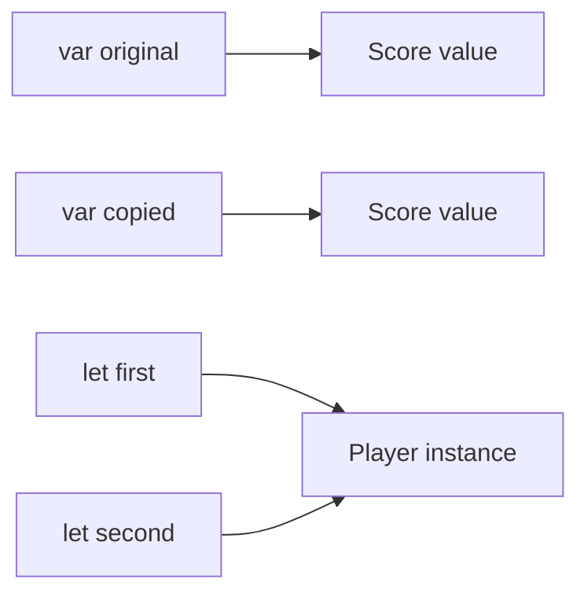

<TLDR>
  <TLDRCell label="what">
    结构体默认是可复制的值类型，赋值与传参产生逻辑上独立的值；类是引用类型，多个引用可以指向同一个实例。
  </TLDRCell>
  <TLDRCell label="trap">
    复制结构体不会递归复制其中的类实例，而 `let` 类引用也不会冻结实例的可变属性。
  </TLDRCell>
  <TLDRCell label="fix">
    默认从结构体开始；只有模型确实需要共享身份、继承或受 ARC 管理的生命周期时才选择类，并检查每个嵌套引用的所有权。
  </TLDRCell>
</TLDR>

## 是什么，为什么存在

结构体（structure）和类（class）都能把数据与行为组织成一个具名类型。
两者都可以声明属性、方法、下标和初始化器，也都能遵循协议并通过扩展增加能力。
真正影响设计的不是语法相似处，而是值在赋值、传参和修改时的语义。

普通结构体采用<Term id="value-semantics">值语义（value semantics）</Term>。
把一个结构体赋给另一个变量，或把它传给函数时，会得到一个逻辑副本；之后修改一份值，不应改变另一份值的可观察状态。
“逻辑副本”不要求运行时立刻复制全部字节，编译器和标准库仍可共享不可观察的内部存储。

类采用引用语义。
变量保存的是对实例的引用，复制该引用不会创建新实例；多个调用方可以通过不同名称读写同一对象。
类实例还具有<Term id="reference-identity">引用恒等性（reference identity）</Term>，可用 `===` 和 `!==` 判断两个引用是否指向同一个实例。

这个区别解决了两类不同建模需求。
金额、坐标、配置快照和解析结果通常表示“这个值是什么”，适合独立复制；会话、连接、控制器和具有明确生命周期的资源通常表示“这是哪个对象”，可能需要共享身份。
如果业务规则只要求相等性，不要求身份，就不应仅为方便修改而引入共享引用。

你会在 API 模型、集合元素、SwiftUI 状态、缓存、协议实现和并发边界中反复遇到这个选择。
它不是“结构体小、类大”的尺寸判断，也不是栈与堆的简化判断。
先决定语义和所有权，再用测量结果处理性能问题。

## 工作原理

声明结构体值时，变量直接代表那个值。
默认可复制结构体的赋值会建立新的逻辑值，函数参数也按同样原则接收值。
实现可以消除复制、以内联形式存储字段，或为集合等类型使用共享缓冲区，只要外部仍观察到值语义。

声明类实例时，变量代表一个引用。
把引用赋给另一个变量后，两者指向同一个实例；通过任一引用修改可变属性，另一引用随后会观察到修改。
Swift 使用自动引用计数（Automatic Reference Counting，ARC）管理类实例的生命周期，而结构体值本身不靠对该值做引用计数来管理。



图上方的两个变量各自拥有一个可观察上独立的 `Score` 值。
下方的两个常量引用则指向同一个 `Player` 实例。
`let` 固定的是绑定：它阻止结构体值发生修改或重新赋值，也阻止类引用改指向其他实例，但不阻止类实例的 `var` 属性改变。

结构体方法默认不能修改 `self` 或其存储属性。
需要修改时，方法必须标记为 `mutating`，调用点的结构体绑定也必须是 `var`。
一个 `mutating` 方法甚至可以用新值替换整个 `self`，所以这个标记表达的是对完整值的写访问。

类的实例方法不需要 `mutating` 就能修改 `var` 属性，因为引用保持指向同一个实例。
这种便利也意味着别名可能在远处观察到变化。
如果共享修改不是领域契约的一部分，应通过结构体返回新值，或把可变范围限制在明确的拥有者内部。

结构体会在没有自定义初始化器妨碍合成时获得<Term id="memberwise-initializer">成员初始化器（memberwise initializer）</Term>。
它为存储属性提供对应参数，但默认访问级别不是可随意依赖的公开 API；声明公共模型时应显式写出要承诺的初始化器。
类不会自动获得成员初始化器，所有存储属性仍必须在初始化结束前得到值。

类支持继承、类型转换、`deinit` 和引用恒等性，结构体不支持这些类专属能力。
两者都能遵循协议，因此“需要多态”本身并不等于“需要类”。
只有基类实现与覆盖关系确实属于模型时，继承才是选择类的理由。

下面的对照表把选择压缩为可检查的契约：

| 契约 | 结构体 | 类 |
| --- | --- | --- |
| 赋值与传参 | 创建逻辑上独立的值 | 复制指向同一实例的引用 |
| 修改方法 | 修改 `self` 时需要 `mutating` | 可直接修改实例的 `var` 属性 |
| 恒等性 | 没有 `===` 实例恒等性 | 使用 `===` 或 `!==` |
| 初始化 | 可合成成员初始化器 | 不合成成员初始化器 |
| 继承与析构 | 不支持类继承或 `deinit` | 支持继承与 `deinit` |
| 典型用途 | 快照、记录、独立状态 | 共享实体、生命周期与基类层次 |

结构体也可以包含类引用。
外层结构体仍会被复制，但其中的引用只复制引用本身，因此两个外层值可能共享同一个嵌套实例。
这是一种<Term id="shallow-copy">浅拷贝（shallow copy）</Term>边界，必须在类型设计和测试中明确。

## 示例

### 赋值后的独立值与共享实例

第一个程序把同一份分数分别放入结构体变量和类实例。
修改结构体副本只影响副本；修改第二个类引用看到的实例，也会改变第一个引用观察到的结果。
最后的恒等性检查直接确认两个引用指向同一个实例。

<Depth level="quick">

```swift title="value_and_reference.swift"
// # not executed here: Swift toolchain is not installed.
struct Score {
    var points: Int
}

final class Player {
    let name: String
    var score: Score

    init(name: String, score: Score) {
        self.name = name
        self.score = score
    }
}

var homeScore = Score(points: 10)
var copiedScore = homeScore
copiedScore.points += 5

let firstView = Player(name: "Mina", score: homeScore)
let secondView = firstView
secondView.score.points += 7

print("values:", homeScore.points, copiedScore.points)
print("references:", firstView.score.points, secondView.score.points)
print("same instance:", firstView === secondView)
```

```text
Not executed here: Swift toolchain is not installed.
```

</Depth>

`homeScore` 与 `copiedScore` 是两个值，因此对后者的写入不会回到前者。
`firstView` 与 `secondView` 则只是同一 `Player` 的两个入口。
注意，放入 `Player.score` 时还会复制 `Score`，所以类实例中的分数从 `10` 开始，而不是从副本的 `15` 开始。

### 成员初始化器与 mutating 方法

`Cart` 没有手写初始化器，因此编译器合成成员初始化器。
`itemCount` 带有默认值，调用方只需传入 `owner`；`add(_:)` 会修改结构体自身，所以必须标记为 `mutating`。
修改购物车前保存的 `snapshot` 继续表示旧状态。

```swift title="cart_snapshot.swift"
// # not executed here: Swift toolchain is not installed.
struct Cart {
    let owner: String
    private(set) var itemCount = 0

    mutating func add(_ quantity: Int) {
        precondition(quantity > 0)
        itemCount += quantity
    }
}

var cart = Cart(owner: "Mina")
cart.add(2)

let snapshot = cart
cart.add(3)

print("owner:", cart.owner)
print("snapshot items:", snapshot.itemCount)
print("current items:", cart.itemCount)
```

```text
Not executed here: Swift toolchain is not installed.
```

如果把 `cart` 声明为 `let`，调用 `add(_:)` 会产生编译错误。
而 `snapshot` 无需“冻结”操作，它本来就是复制时刻的独立值。
公开库仍应考虑显式声明 `init(owner:)`，避免把合成初始化器当成稳定的外部契约。

### 结构体中的引用不会深拷贝

这个示例故意把可变的 `Counter` 类放入 `Report` 结构体。
复制 `Report` 后，标题字段独立，但 `counter` 的两个引用仍指向同一实例。
外层值语义并不会自动递归成整个对象图的深层独立性。

```swift title="nested_reference.swift"
// # not executed here: Swift toolchain is not installed.
final class Counter {
    var value: Int

    init(value: Int) {
        self.value = value
    }
}

struct Report {
    var title: String
    var counter: Counter
}

var morning = Report(
    title: "Morning",
    counter: Counter(value: 1)
)
var evening = morning

evening.title = "Evening"
evening.counter.value += 1

print("titles:", morning.title, evening.title)
print("counts:", morning.counter.value, evening.counter.value)
print("shared counter:", morning.counter === evening.counter)
```

```text
Not executed here: Swift toolchain is not installed.
```

这里不是 Swift 违反了值语义，而是 `Report.counter` 这个字段的值本来就是类引用。
需要完整快照时，可以让嵌套状态也采用值类型，或者提供含义明确的复制操作来创建新 `Counter`。
不要把通用“深拷贝”当作默认答案；应先定义哪些资源允许共享。

### 用值快照包住共享身份

很多真实模型会组合两种语义，而不是只选一种。
编辑会话需要共享身份，所以使用类；文档内容是某一时刻的状态，所以使用结构体。
在修改会话前复制 `document`，就得到不受后续改名影响的快照。

```swift title="editor_session.swift"
// # not executed here: Swift toolchain is not installed.
struct Document {
    let id: Int
    var title: String
}

final class EditorSession {
    let sessionID: String
    var document: Document

    init(sessionID: String, document: Document) {
        self.sessionID = sessionID
        self.document = document
    }

    func renameDocument(to title: String) {
        document.title = title
    }
}

let session = EditorSession(
    sessionID: "S-42",
    document: Document(id: 7, title: "Draft")
)
let collaborator = session
let beforeRename = session.document

collaborator.renameDocument(to: "Reviewed")

print("before:", beforeRename.title)
print("current:", session.document.title)
print("shared session:", session === collaborator)
```

```text
Not executed here: Swift toolchain is not installed.
```

`beforeRename` 的用途从名称和类型上都很清楚：它是值快照，不是第二个实时视图。
`collaborator` 则有意共享会话身份，因此通过它修改会被 `session` 观察到。
这种组合把共享范围限制在确实需要协调的对象内。

## 陷阱

> [!PITFALL]
> 把“结构体是值类型”理解成“整个对象图都会深拷贝”，会让嵌套类实例意外共享。
> **修复：**逐个检查存储属性的语义；快照边界内优先使用值类型，需要独立类实例时提供显式复制，并测试副本交错修改。

> [!PITFALL]
> `let service = Service()` 只固定 `service` 指向哪个实例，不会让实例的 `var` 属性不可变。
> **修复：**使用访问控制、不可变属性和窄方法维护类不变量；如果调用方需要不可变快照，返回结构体值，而不是暴露可变类实例。

> [!PITFALL]
> 把合成的成员初始化器当作公共 API，会在增加存储属性或手写初始化器后破坏调用方，而且它的访问级别可能低于类型本身。
> **修复：**对外部模块承诺的构造方式显式声明初始化器，把成员初始化器当作实现便利而不是稳定接口。

> [!PITFALL]
> 因为某个方法需要修改状态就把结构体改成类，会无意中引入别名、共享生命周期和并发访问问题。
> **修复：**先尝试 `mutating` 方法、返回新值或由单一拥有者保存结构体；只有共享身份本身属于需求时才采用类。

> [!PITFALL]
> 用“结构体在栈上、类在堆上”预测性能并不可靠；逃逸分析、泛型特化、装箱和内部缓冲区都会改变实际存储与复制成本。
> **修复：**先按语义选型，再在发布构建和代表性负载下分析分配与耗时。没有测量，就不要声称结构体或类一定更快。

> [!PITFALL]
> 用 `===` 判断业务内容是否相等，或假设两个字段相同的类实例具有同一身份，会混淆恒等性与相等性。
> **修复：**类引用是否指向同一实例用 `===`；内容相等则定义并使用 `Equatable` 的 `==`，并在 API 契约中说明需要哪一种判断。

<Depth level="deep">

## 写时复制与不可复制结构体

<Term id="copy-on-write">写时复制（copy-on-write，COW）</Term>是一种实现值语义的存储优化。
多个逻辑值可以暂时共享一个内部类实例；其中一份准备修改时，如果存储不唯一，就先复制存储再写入。
调用方仍然观察到两个独立值，因此 COW 改变的是物理复制时机，而不是类型的公开语义。

Swift 的 `Array`、`Dictionary` 和 `String` 等标准库值类型使用这类策略。
自定义大型值也可以采用同样模式，但需要把引用存储完全封装起来，使每条修改路径都先检查唯一性。
只在部分方法中执行检查，会让看似独立的值重新暴露共享修改。

```swift title="copy_on_write.swift"
// # not executed here: Swift toolchain is not installed.
final class Storage {
    var values: [Int]

    init(_ values: [Int]) {
        self.values = values
    }
}

struct Buffer {
    private var storage: Storage

    init(_ values: [Int]) {
        storage = Storage(values)
    }

    var values: [Int] {
        storage.values
    }

    mutating func append(_ value: Int) {
        if !isKnownUniquelyReferenced(&storage) {
            storage = Storage(storage.values)
        }
        storage.values.append(value)
    }
}

let original = Buffer([1, 2])
var revised = original
revised.append(3)

print("original:", original.values)
print("revised:", revised.values)
```

```text
Not executed here: Swift toolchain is not installed.
```

`isKnownUniquelyReferenced(_:)` 检查传入类引用当前是否已知唯一。
它不是线程同步工具，也不是“永远只有一个所有者”的证明；额外引用会让结果变为 false，而并发访问仍需独立的隔离方案。
封装应确保调用方无法绕过 `append(_:)` 直接修改 `Storage`。

“结构体会复制”还有一个现代 Swift 例外需要说清楚。
结构体与枚举默认遵循 `Copyable`，但可以用 `~Copyable` 明确声明为不可复制类型，以表示文件描述符或唯一令牌等线性资源。
这类声明仍是值类型，却不能套用普通赋值会复制的教学简写；API 还必须明确借用或消耗该值。

因此，选择结构体首先是在选择值模型，不是在承诺每个值都能无限复制，也不是在承诺特定内存位置。
对于普通可复制模型，独立修改是关键保证；对于不可复制模型，唯一所有权约束成为契约的一部分。
两者都应由类型接口表达，而不是依靠调用方猜测实现。

</Depth>

<Checkpoint id="swift/structs-classes" />

## 延伸阅读

- [Swift 编程语言：结构体与类](https://docs.swift.org/swift-book/documentation/the-swift-programming-language/classesandstructures/)
- [Swift 编程语言：方法](https://docs.swift.org/swift-book/documentation/the-swift-programming-language/methods/)
- [Swift 编程语言：继承](https://docs.swift.org/swift-book/documentation/the-swift-programming-language/inheritance/)
- [Swift 编程语言：自动引用计数](https://docs.swift.org/swift-book/documentation/the-swift-programming-language/automaticreferencecounting/)
- [SE-0390：不可复制结构体与枚举](https://github.com/swiftlang/swift-evolution/blob/main/proposals/0390-noncopyable-structs-and-enums.md)
