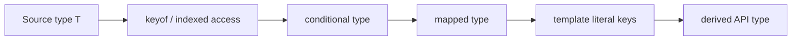

<TLDR>
  <TLDRCell label="what">
    Advanced TypeScript types take existing types as input and produce new types by selecting, testing, iterating, and renaming.
    They let one domain model drive several static interfaces.
  </TLDRCell>
  <TLDRCell label="trap">
    Type transformations exist only at compile time: they neither validate external data nor generate the runtime code implied by a derived type.
  </TLDRCell>
  <TLDRCell label="fix">
    Start with small, constrained type functions, test them against unions and boundary types, and validate data at runtime when it enters the system.
  </TLDRCell>
</TLDR>

## What it is and why it exists

“Advanced types” is not one TypeScript construct; it is a working name for techniques that create types from existing types.
The main tools are `keyof`, indexed access, conditional types, `infer`, mapped types, and template literal types.
Combined, they let you write “type functions” that accept types and return types.

These tools solve drift between static relationships.
If event names, event payloads, and handlers are written separately in three places, adding an event can easily update only two of them.
When both the handler map and the discriminated union derive from one payload map, the compiler can identify missing or mismatched branches.

Advanced types work best for mechanical relationships already present in the code, such as “make every field readonly,” “get an array's element type,” or “associate each event name with one payload.”
You encounter them in library APIs, form models, state selectors, route parameters, and message protocols.
They are not a replacement for business rules, and they cannot prove that a value from a network or file matches a declaration.

This topic explains how the operators work together and where composed types lose fidelity.
Conditional types, mapped types, template literal types, `infer`, and recursive types also have dedicated topics; use those when you need every rule of one construct.

## How it works

The TypeScript checker maintains a type world used only during compilation.
Advanced types compute in that world; type aliases, conditional branches, and mapped iterations do not survive in the JavaScript output.
The type-level result and the runtime implementation therefore need separate verification.

A common derivation starts with a source type, selects keys or values, filters them with a condition, then rebuilds an object shape or its property names.
The steps can nest, but each should have a clear input and output.
The arrows below show type dependencies, not runtime data flow.



### Selecting keys and values

`keyof T` produces the union of known property keys in `T`; `T[K]` is an <Term id="indexed-access-type">indexed access type</Term>.
When `K` is a union of keys, `T[K]` is the union of their property value types.
A numeric array index, `Items[number]`, obtains an element type by the same rule.

The generic constraint `K extends keyof T` connects a key to an object.
Without that constraint, an arbitrary string could index `T`, and the checker could not guarantee that the property exists.
The constraint describes accepted input; indexed access describes the output associated with it.

### Choosing by assignability

A <Term id="conditional-type">conditional type</Term> has the form `T extends U ? X : Y`.
Here, `extends` tests assignability; it is not a runtime Boolean expression.
Conditional types commonly filter union members or choose a result type from an input shape.

`infer` can declare a type variable to extract only inside the matching branch of a conditional type.
For example, `T extends Promise<infer Value> ? Value : T` obtains the value type from a matching `Promise`.
Prefer built-ins such as `Awaited`, `ReturnType`, and `Parameters`; a custom extractor should capture a domain relationship instead of duplicating the standard library.

When the checked side is a naked type parameter, a conditional type evaluates separately for every member of a union.
This behavior is called a <Term id="distributive-conditional-type">distributive conditional type</Term>.
Wrapping both sides as `[T] extends [U]` treats the union as one input and prevents distribution.

### Iterating and rebuilding objects

A <Term id="mapped-type">mapped type</Term> iterates over keys with `[K in keyof T]` and computes a property type for each key.
The modifiers `readonly`, `?`, `-readonly`, and `-?` add or remove property modifiers.
Which modifiers survive the mapping is API semantics, not a formatting choice.

An `as` clause can remap keys.
Mapping a key to `never` removes that property; mapping a string key through a template literal type can produce a consistent set of member names.
Symbol and number keys do not automatically fit a string template, so mappings commonly select string keys with `Extract<keyof T, string>` or a conditional branch.

A <Term id="template-literal-type">template literal type</Term> combines string literal unions into a new string union.
If interpolation positions are themselves unions, the result contains every combination.
This suits an existing naming convention, but the union should remain small enough for readers and tools to understand.

### Recursing through nested structures

A type alias can refer to itself through a conditional branch or object member to process trees, tuples, and nested configuration.
A recursive type should define terminal cases before recursive cases such as arrays and objects.
Mapping every `object` recursively usually gives functions, `Date`, `Map`, and class instances the wrong semantics.

The narrower a recursive type's input domain is, the more reliable its contract becomes.
If a helper handles only JSON, constraining its input to JSON values is more accurate than claiming to support every object.
Its runtime implementation must recurse over the same domain, or the static result and actual behavior diverge.

## Examples

The next four examples start from a domain map, then add conditional extraction, key remapping, and constrained recursion.
Each program produces observable runtime output; TypeScript 6 separately checks its type-level relationships.

### Building a discriminated union from a map

An event payload map can be the single source of truth.
A mapped type first constructs one event member per key, then indexed access extracts those members as a union.
The payload narrows with `type` inside the `switch`.

<Depth level="quick">

```typescript run title="domain-events.ts"
type EventPayloads = {
  orderPlaced: { orderId: string; total: number };
  orderCancelled: { orderId: string; reason: string };
};

type DomainEvent = {
  [Kind in keyof EventPayloads]: {
    type: Kind;
    payload: EventPayloads[Kind];
  };
}[keyof EventPayloads];

function assertNever(value: never): never {
  throw new Error(`Unhandled event: ${JSON.stringify(value)}`);
}

function summarize(event: DomainEvent): string {
  switch (event.type) {
    case "orderPlaced":
      return `placed ${event.payload.orderId}: ${event.payload.total}`;
    case "orderCancelled":
      return `cancelled ${event.payload.orderId}: ${event.payload.reason}`;
    default:
      return assertNever(event);
  }
}

const events: DomainEvent[] = [
  { type: "orderPlaced", payload: { orderId: "A-104", total: 58 } },
  { type: "orderCancelled", payload: { orderId: "A-105", reason: "duplicate" } },
];

for (const event of events) console.log(summarize(event));
```

```text
placed A-104: 58
cancelled A-105: duplicate
```

</Depth>

`DomainEvent` is not the broad `{ type: keyof EventPayloads; payload: EventPayloads[keyof EventPayloads] }`.
That version loses the association between an event name and its payload, allowing a cancellation reason to appear in an order-placement event.
Mapping first and indexing second produces a union of two complete objects, so the association survives.

`assertNever` turns exhaustiveness into a compile-time check.
If the payload map gains an event but the `switch` does not gain a branch, `event` in the default branch is no longer `never`, and compilation fails.
The function still keeps a runtime error because unchecked JavaScript values can bypass the type checker.

### Extracting successful values from a union

A conditional type can filter a discriminated union and use `infer` to extract a value from matching members.
The naked type parameter `Candidate` distributes over union members, and `never` from failed members disappears from the final union.

```typescript run title="result-values.ts"
type Result<Value> =
  | { ok: true; value: Value }
  | { ok: false; error: string };

type SuccessValue<Candidate> =
  Candidate extends { ok: true; value: infer Value } ? Value : never;

function successfulValues<Value>(results: readonly Result<Value>[]): Value[] {
  const values: Value[] = [];

  for (const result of results) {
    if (result.ok) values.push(result.value);
  }

  return values;
}

const attempts: Result<number>[] = [
  { ok: true, value: 12 },
  { ok: false, error: "timeout" },
  { ok: true, value: 7 },
];

const values: SuccessValue<(typeof attempts)[number]>[] =
  successfulValues(attempts);

console.log(values.join(", "));
```

```text
12, 7
```

`(typeof attempts)[number]` first obtains the array element union, and `SuccessValue` then keeps only `value` from the successful branch.
The type computation and the runtime loop express the same rule, but they are separate implementations.
When one changes, tests must confirm that the other remains consistent.

If the requirement asks whether an entire union is assignable to a type, distribution answers the wrong question.
Write the check as `[Candidate] extends [Target]` in that case, and include a mixed union in the type tests.

### Remapping keys with template literals

The `as` clause of a mapped type can turn data fields into getter names.
Runtime code must still create those functions; a type declaration does not make `Object.fromEntries()` do any work.

```typescript run title="make-getters.ts"
type GetterName<Key extends string> = `get${Capitalize<Key>}`;

type Getters<Source extends Record<string, unknown>> = {
  [Key in keyof Source as Key extends string
    ? GetterName<Key>
    : never]: () => Source[Key];
};

function makeGetters<Source extends Record<string, unknown>>(
  source: Source,
): Getters<Source> {
  const entries = Object.entries(source).map(([key, value]) => {
    const getterName = `get${key.charAt(0).toUpperCase()}${key.slice(1)}`;
    return [getterName, () => value] as const;
  });

  // This assertion covers enumerable own string keys on plain objects only.
  return Object.fromEntries(entries) as Getters<Source>;
}

const order = {
  id: "A-104",
  total: 58,
  paid: true,
};

const getters = makeGetters(order);
console.log(getters.getId());
console.log(getters.getTotal());
console.log(getters.getPaid());
```

```text
A-104
58
true
```

`Key extends string` excludes number and symbol keys that cannot be interpolated into this template literal.
`Capitalize<Key>` describes the compile-time name, while the runtime code constructs the same name with `toUpperCase()`.
The helper's contract is limited to plain data objects because classes, non-enumerable properties, and accessors make the keys seen by `Object.entries()` differ from `keyof`.

The return assertion is a local bridge, not a proof.
Review it by checking the key source, name conversion, value types, and property-enumeration rules one by one.
Keeping the assertion at this implementation boundary is easier to audit than making callers use `as` everywhere.

### Matching recursive types to runtime freezing

A recursive utility should not pretend to support every object.
This version limits input to JSON values and gives the type recursion and runtime recursion the same terminal cases.

```typescript run title="deep-freeze-json.ts"
type JSONValue =
  | string
  | number
  | boolean
  | null
  | JSONValue[]
  | { [key: string]: JSONValue };

type DeepReadonly<Value> =
  Value extends string | number | boolean | null
    ? Value
    : Value extends (infer Item)[]
      ? readonly DeepReadonly<Item>[]
      : Value extends object
        ? { readonly [Key in keyof Value]: DeepReadonly<Value[Key]> }
        : never;

function deepFreeze<Value extends JSONValue>(
  value: Value,
): DeepReadonly<Value> {
  if (value !== null && typeof value === "object") {
    for (const nested of Object.values(value)) deepFreeze(nested);
    Object.freeze(value);
  }

  return value as DeepReadonly<Value>;
}

const config = deepFreeze({
  region: "eu-west",
  flags: ["audit", "retry"],
  limits: { attempts: 3 },
});

console.log(Object.isFrozen(config));
console.log(Object.isFrozen(config.flags));
console.log(`${config.region}: ${config.flags.join(",")}`);
```

```text
true
true
eu-west: audit,retry
```

Primitives return directly at the type level, arrays become readonly arrays of transformed elements, and plain JSON objects map over their keys.
The runtime function likewise descends only into non-null objects, then freezes from the inside out.
Nested arrays are therefore statically non-writable and are actually processed by `Object.freeze()`.

The contract deliberately excludes `Date`, `Map`, functions, and user-defined classes.
Freezing the surface properties of those objects does not necessarily freeze their internal slots or domain behavior.
Support them by defining semantics for each class rather than widening the constraint to any `object`.

## Pitfalls

> [!PITFALL]
> Asserting an external value as a complex derived type disguises unvalidated data as something the compiler has proved.

`JSON.parse(raw) as DomainEvent` checks neither the event name, required fields, nor numeric ranges.
**Fix:** Parse at runtime where data enters from a network, file, message queue, or local storage, and return the domain type only after validation succeeds.
Type transformations maintain relationships among trusted values; validators establish the first trusted value.

> [!PITFALL]
> Adding `any` to a type utility or its implementation lets unsafe values bypass conditional branches and property checks, then spreads the problem to callers.

In a conditional type, `any` can also produce both branches and make the result look wider than the real contract.
**Fix:** Accept unknown input as `unknown`, then narrow or validate it; when an implementation genuinely needs an assertion, keep it at one auditable boundary and document its premise.

> [!PITFALL]
> A conditional over a naked type parameter distributes, so its result may answer “how should each union member be handled?” when the requirement asks “does this whole union satisfy the condition?”

The mistake often hides in negative tests, empty unions, and nested conditionals.
**Fix:** Make the distributive or non-distributive intent explicit; use `[T] extends [U]` for a whole-union test, and test one member, a mixed union, `never`, and `unknown`.

> [!PITFALL]
> Treating `?` as “the property's value always includes `undefined`” conflates an absent property with a present property explicitly set to `undefined`.

Reading an optional property can normally produce `undefined`, but assignment rules also depend on `exactOptionalPropertyTypes`.
**Fix:** Model “may be absent” separately from “present with an undefined value,” and do not use one deep `Partial` type for patches, forms, and stored records.

> [!PITFALL]
> Generating property names at the type level does not put those properties on a runtime object or guarantee that both sides apply the same case conversion.

`keyof` can also contain inherited, number, or symbol keys, while `Object.keys()` returns only enumerable own string keys.
**Fix:** Write paired tests for the type transform and runtime transform, and audit every assertion that crosses between them.

> [!PITFALL]
> Recursively mapping every `object` destroys function call signatures, built-in object semantics, and classes with private state.

Recursion can also produce `Type instantiation is excessively deep and possibly infinite`, which means the computation has exceeded a boundary the compiler accepts.
**Fix:** Narrow the input domain and handle terminal types and container exceptions first; if callers still cannot understand failures, split the utility or use a direct domain type.

<Depth level="deep">

## Distribution, correlation, and type boundaries

### Distribution depends on syntax position

Whether a conditional distributes depends on the checked position being a naked type parameter, not on whether its author calls it a union utility.
`T extends U ? X<T> : Y<T>` distributes; `[T] extends [U] ? X<T> : Y<T>` does not.
Wrapping `T` in an object, tuple, or another type also changes this behavior.

Distribution is not a simple global switch.
An outer conditional may be non-distributive while an inner helper still distributes; after alias expansion, behavior may be less obvious than the call site suggests.
Type tests should instantiate the final public alias, not only its internal helpers.

### `never` is both a filter result and empty input

`never` is the type with no possible values.
When a distributive conditional maps non-matching members to `never`, the union removes those members, which is why `Extract` and `Exclude` can be expressed as conditional types.
That algebraic property is useful, but it creates an easily missed boundary case.

When the naked type parameter itself is `never`, there are no union members over which to distribute, so the entire conditional produces `never`.
It enters neither the true branch nor the false branch.
If a utility must detect `never`, start with the non-distributive test `[T] extends [never]`.

### Mapping before indexing preserves member relationships

The example's `DomainEvent` uses a “map, then index” pattern: every key first becomes an independent object, and only then do those objects join a union.
As a result, `type` and `payload` always come from the same key.
Indexing both properties independently before putting them in an object loses that correlation.

The pattern suits discriminated unions for events, commands, routes, and form actions.
It does not guarantee that arbitrary dynamic indexing preserves correlation; after a union key and union value are stored separately, the checker may no longer prove that they remain paired.
Prefer keeping and narrowing the complete union object, or let one type parameter carry the key-value relationship through a generic function.

### Structural types are not exact object schemas

TypeScript is structurally typed: a value that has the required members is generally assignable to a target type even if it has more members.
Object literals receive excess-property checks in certain positions, but that is not a general “exact object” guarantee.
The behavior can differ after a value passes through a variable, generic, or assertion.

`satisfies` can check an expression against a target type while preserving the expression's own more precise inferred type.
It does not remove extra properties, freeze the object, or validate runtime data.
When using it for configuration and maps, design the target type around whether additional keys are allowed.

### Public types should bound complexity

The first costs of a complex type are error messages and maintenance difficulty.
If callers must understand several layers of conditional distribution, key remapping, and recursion to explain an ordinary argument error, the abstraction has leaked.
A public API should name important intermediate concepts and make failures occur as close to the input as possible.

The compiler can reject excessively deep or potentially infinite type instantiations, but a fixed recursion count should not become a long-term contract.
The effective boundary changes with type shape, composition, and compiler version.
It is more robust to constrain supported data shapes, separate recursive stages, or return a named domain type at the boundary.

Type utilities also need regression tests.
Cover at least assignments that should pass, assignments that should fail, and a few special inputs, then compile them again when upgrading TypeScript.
Passing runtime examples cannot replace these static assertions because type errors are erased before execution.

</Depth>

<Checkpoint id="typescript/advanced-types" />

## Further reading

- [TypeScript Handbook: Creating Types from Types](https://www.typescriptlang.org/docs/handbook/2/types-from-types.html)
- [TypeScript Handbook: Indexed Access Types](https://www.typescriptlang.org/docs/handbook/2/indexed-access-types.html)
- [TypeScript Handbook: Conditional Types](https://www.typescriptlang.org/docs/handbook/2/conditional-types.html)
- [TypeScript Handbook: Mapped Types](https://www.typescriptlang.org/docs/handbook/2/mapped-types.html)
- [TypeScript Handbook: Template Literal Types](https://www.typescriptlang.org/docs/handbook/2/template-literal-types.html)
