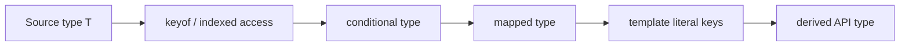

<TLDR>
  <TLDRCell label="what">
    TypeScript 高级类型把已有类型当作输入，通过选取、判断、遍历和重命名得到新类型。
    它们用于让一份领域模型成为多个静态接口的共同来源。
  </TLDRCell>
  <TLDRCell label="trap">
    类型转换只在编译期存在，既不会验证外部数据，也不会自动生成与派生类型对应的运行时代码。
  </TLDRCell>
  <TLDRCell label="fix">
    从小型、受约束的类型函数开始，在联合类型和边界值上写类型测试，并把运行时检查放在数据入口。
  </TLDRCell>
</TLDR>

## 是什么，为什么存在

“高级类型”不是 TypeScript 中的一种独立语法，而是一组从已有类型创建新类型的组合技术。
核心工具包括 `keyof`、索引访问、条件类型、`infer`、映射类型和模板字面量类型。
把它们组合起来，就能编写接收类型并返回类型的“类型函数”。

这些工具解决的是静态关系容易漂移的问题。
假设事件名、事件载荷和处理器分别手写在三处，新增事件时很容易只改其中两处。
如果处理器表和可辨识联合都从同一个载荷映射派生，编译器就能指出缺失或不匹配的分支。

高级类型最适合表达代码中本来就存在的机械关系，例如“所有字段都只读”“取得数组元素类型”或“每个事件名对应一种载荷”。
你会在库的公共 API、表单模型、状态选择器、路由参数和消息协议中遇到它们。
它们不适合替代业务规则，也不能证明网络或文件中的值真的符合声明。

这篇主题讲这些操作符如何协作，以及组合后的类型在哪些地方会失真。
条件类型、映射类型、模板字面量类型、`infer` 和递归类型各自还有独立主题；需要穷尽某一语法的规则时，应继续阅读对应主题。

## 工作原理

TypeScript 的类型检查器维护一个只在编译期间使用的类型世界。
高级类型在这个世界里计算，JavaScript 输出中不会保留类型别名、条件分支或映射循环。
因此，类型层的结果必须与实际运行时代码分别验证。

常见的推导流程从一个源类型开始，先取得键或值，再根据条件筛选，最后重建对象形状或属性名。
这些步骤可以嵌套，但每一步都应有清楚的输入和输出。
下图中的箭头表示类型依赖，不表示运行时数据流。



### 选取键和值

`keyof T` 产生 `T` 的已知属性键联合，`T[K]` 则是<Term id="indexed-access-type">索引访问类型（indexed access type）</Term>。
当 `K` 是键的联合时，`T[K]` 是对应属性值的联合。
数组的数字索引 `Items[number]` 以同样方式取得元素类型。

泛型约束 `K extends keyof T` 把键与对象联系起来。
没有这个约束，任意字符串都可能被拿来索引 `T`，类型检查器无法保证属性存在。
约束描述允许的输入，索引访问描述该输入对应的输出。

### 根据关系选择分支

<Term id="conditional-type">条件类型（conditional type）</Term>写作 `T extends U ? X : Y`。
这里的 `extends` 是可赋值关系测试，不是运行时布尔表达式。
条件类型常用来过滤联合成员，或者根据输入形状选择结果类型。

`infer` 只能在条件类型的匹配分支中声明待提取的类型变量。
例如，`T extends Promise<infer Value> ? Value : T` 会从匹配的 `Promise` 中取得值类型。
优先使用内置的 `Awaited`、`ReturnType` 和 `Parameters`；自定义提取器应表达领域关系，而不是重复标准库。

当检查对象是裸类型参数时，条件类型会对联合的每个成员分别计算。
这种行为叫作<Term id="distributive-conditional-type">分布式条件类型（distributive conditional type）</Term>。
用 `[T] extends [U]` 包住两侧，可以把整个联合当作一次输入，阻止分布。

### 遍历并重建对象

<Term id="mapped-type">映射类型（mapped type）</Term>通过 `[K in keyof T]` 遍历键，并为每个键计算新的属性类型。
`readonly`、`?`、`-readonly` 和 `-?` 可以添加或移除属性修饰符。
映射类型保留哪些修饰符是 API 语义的一部分，不只是排版选择。

`as` 子句可以重映射键。
把键映射为 `never` 会删除该属性；把字符串键映射为模板字面量类型则能生成统一命名的成员。
符号键和数字键不会自动适合字符串模板，所以通常先用 `Extract<keyof T, string>` 或条件分支筛出字符串键。

<Term id="template-literal-type">模板字面量类型（template literal type）</Term>把字符串字面量联合组合成新的字符串联合。
若插值位置各自是联合，结果包含它们的所有组合。
这很适合表达已有命名规则，但联合规模应保持在读者和工具都能理解的范围内。

### 递归处理嵌套结构

类型别名可以在条件分支或对象成员中引用自身，从而处理树、元组和嵌套配置。
递归类型必须先定义终止分支，再处理数组或对象等递归分支。
如果把所有 `object` 都递归映射，函数、`Date`、`Map` 和类实例往往会得到错误语义。

递归类型的输入域越窄，契约越可靠。
只处理 JSON 时，把输入约束成 JSON 值比声称支持任意对象更准确。
运行时实现也必须沿着相同的数据域递归，否则静态结果和实际行为会分离。

## 示例

下面四个示例从一份领域映射开始，逐步加入条件提取、键重映射和受约束的递归。
每段代码都同时产生可观察的运行时结果；类型层关系则由 TypeScript 6 编译器检查。

### 从映射生成可辨识联合

事件载荷映射可以成为唯一事实来源。
映射类型先为每个键构造一个事件成员，随后用索引访问把这些成员取成联合。
`switch` 中的载荷会跟随 `type` 自动收窄。

<Depth level="quick">

```typescript run title="domain-events.ts"
type EventPayloads = {
  orderPlaced: { orderId: string; total: number };
  orderCancelled: { orderId: string; reason: string };
};

type DomainEvent = {
  [Kind in keyof EventPayloads]: {
    type: Kind;
    payload: EventPayloads[Kind];
  };
}[keyof EventPayloads];

function assertNever(value: never): never {
  throw new Error(`Unhandled event: ${JSON.stringify(value)}`);
}

function summarize(event: DomainEvent): string {
  switch (event.type) {
    case "orderPlaced":
      return `placed ${event.payload.orderId}: ${event.payload.total}`;
    case "orderCancelled":
      return `cancelled ${event.payload.orderId}: ${event.payload.reason}`;
    default:
      return assertNever(event);
  }
}

const events: DomainEvent[] = [
  { type: "orderPlaced", payload: { orderId: "A-104", total: 58 } },
  { type: "orderCancelled", payload: { orderId: "A-105", reason: "duplicate" } },
];

for (const event of events) console.log(summarize(event));
```

```text
placed A-104: 58
cancelled A-105: duplicate
```

</Depth>

`DomainEvent` 不是宽泛的 `{ type: keyof EventPayloads; payload: EventPayloads[keyof EventPayloads] }`。
后者会丢失事件名与载荷之间的对应关系，允许把取消原因放进下单事件。
先映射、再索引得到的是两个完整对象的联合，因此保留了相关性。

`assertNever` 让穷尽性成为编译期检查。
如果载荷映射新增事件而 `switch` 没有新增分支，默认分支中的 `event` 就不再是 `never`，编译会失败。
这个函数仍保留运行时异常，因为未经验证的 JavaScript 值可能绕过类型检查。

### 从联合提取成功值

条件类型可以从可辨识联合中过滤成员，再用 `infer` 提取其中的值。
裸类型参数 `Candidate` 会对联合成员分布计算，失败成员返回的 `never` 会从最终联合中消失。

```typescript run title="result-values.ts"
type Result<Value> =
  | { ok: true; value: Value }
  | { ok: false; error: string };

type SuccessValue<Candidate> =
  Candidate extends { ok: true; value: infer Value } ? Value : never;

function successfulValues<Value>(results: readonly Result<Value>[]): Value[] {
  const values: Value[] = [];

  for (const result of results) {
    if (result.ok) values.push(result.value);
  }

  return values;
}

const attempts: Result<number>[] = [
  { ok: true, value: 12 },
  { ok: false, error: "timeout" },
  { ok: true, value: 7 },
];

const values: SuccessValue<(typeof attempts)[number]>[] =
  successfulValues(attempts);

console.log(values.join(", "));
```

```text
12, 7
```

`(typeof attempts)[number]` 先取得数组元素联合，`SuccessValue` 再只保留成功分支中的 `value`。
这里的类型计算和运行时循环表达同一规则，但它们是两套实现。
修改其中一套时，测试必须确认另一套仍然一致。

如果需求是判断“整个联合是否都可赋给某类型”，分布反而会给出错误问题的答案。
此时应把检查写成 `[Candidate] extends [Target]`，并给混合联合写一个类型测试。

### 用模板字面量重映射键

映射类型的 `as` 子句可以把数据字段转换成 getter 名称。
运行时仍需真的创建这些函数；类型声明不会替 `Object.fromEntries()` 做任何工作。

```typescript run title="make-getters.ts"
type GetterName<Key extends string> = `get${Capitalize<Key>}`;

type Getters<Source extends Record<string, unknown>> = {
  [Key in keyof Source as Key extends string
    ? GetterName<Key>
    : never]: () => Source[Key];
};

function makeGetters<Source extends Record<string, unknown>>(
  source: Source,
): Getters<Source> {
  const entries = Object.entries(source).map(([key, value]) => {
    const getterName = `get${key.charAt(0).toUpperCase()}${key.slice(1)}`;
    return [getterName, () => value] as const;
  });

  // 这个断言只覆盖普通对象的可枚举自有字符串键。
  return Object.fromEntries(entries) as Getters<Source>;
}

const order = {
  id: "A-104",
  total: 58,
  paid: true,
};

const getters = makeGetters(order);
console.log(getters.getId());
console.log(getters.getTotal());
console.log(getters.getPaid());
```

```text
A-104
58
true
```

`Key extends string` 会排除无法放入模板字面量的数字键和符号键。
`Capitalize<Key>` 描述编译期名称，运行时代码则用 `toUpperCase()` 构造相同名称。
辅助函数的契约限定为普通数据对象，因为类、不可枚举属性和访问器会让 `Object.entries()` 看到的键不同于 `keyof`。

返回处的类型断言是一座局部桥梁，不是证明。
审查时应逐项核对键的来源、名称转换、值类型和属性枚举规则。
把断言限制在这个实现边界，比让调用者到处使用 `as` 更容易审核。

### 让递归类型与运行时冻结一致

递归工具不应假装支持所有对象。
这个版本把输入限制为 JSON 值，并让类型递归与运行时递归使用同一终止条件。

```typescript run title="deep-freeze-json.ts"
type JSONValue =
  | string
  | number
  | boolean
  | null
  | JSONValue[]
  | { [key: string]: JSONValue };

type DeepReadonly<Value> =
  Value extends string | number | boolean | null
    ? Value
    : Value extends (infer Item)[]
      ? readonly DeepReadonly<Item>[]
      : Value extends object
        ? { readonly [Key in keyof Value]: DeepReadonly<Value[Key]> }
        : never;

function deepFreeze<Value extends JSONValue>(
  value: Value,
): DeepReadonly<Value> {
  if (value !== null && typeof value === "object") {
    for (const nested of Object.values(value)) deepFreeze(nested);
    Object.freeze(value);
  }

  return value as DeepReadonly<Value>;
}

const config = deepFreeze({
  region: "eu-west",
  flags: ["audit", "retry"],
  limits: { attempts: 3 },
});

console.log(Object.isFrozen(config));
console.log(Object.isFrozen(config.flags));
console.log(`${config.region}: ${config.flags.join(",")}`);
```

```text
true
true
eu-west: audit,retry
```

原始值在类型层直接返回，数组先变成只读元素数组，普通 JSON 对象再逐键映射。
运行时函数也只对非空对象向下遍历，然后从内到外冻结。
因此，嵌套数组既在类型上禁止写入，也确实被 `Object.freeze()` 处理。

这个契约有意排除了 `Date`、`Map`、函数和用户定义类。
冻结这些对象的表面属性，并不一定冻结它们的内部槽位或领域行为。
需要支持它们时，应逐类定义语义，而不是把约束放宽成任意 `object`。

## 陷阱

> [!PITFALL]
> 把外部值断言成复杂派生类型，会把未经验证的数据伪装成编译器已经证明的值。

`JSON.parse(raw) as DomainEvent` 不会检查事件名、必填字段或数字范围。
**修复方法：** 在网络、文件、消息队列和本地存储入口做运行时解析，成功后再返回领域类型。
类型转换负责维护已验证值之间的关系，验证器负责建立最初的可信值。

> [!PITFALL]
> 在类型工具或实现中加入 `any`，会让不安全的值绕过条件分支和属性检查，并把问题传播给调用者。

`any` 在条件类型中还可能同时产生两个分支，使结果看起来比实际契约更宽。
**修复方法：** 对未知输入使用 `unknown`，通过收窄或验证获得具体类型；实现确实需要断言时，把它放在一个可审核的边界并写清前提。

> [!PITFALL]
> 裸类型参数上的条件类型会分布，生成的结果可能回答“联合的每个成员如何处理”，而需求问的是“整个联合是否满足条件”。

这种错误常藏在否定判断、空联合和嵌套条件中。
**修复方法：** 明确写出分布或非分布意图；需要整体判断时使用 `[T] extends [U]`，并测试单成员、混合联合、`never` 和 `unknown`。

> [!PITFALL]
> 把 `?` 理解成“属性值一定包含 `undefined`”，会混淆属性缺失与显式赋值为 `undefined`。

读取可选属性通常可能得到 `undefined`，但写入规则还受 `exactOptionalPropertyTypes` 影响。
**修复方法：** 根据领域含义分别建模“可以缺失”和“存在但值可为 `undefined`”，不要用一个深度 `Partial` 同时代表补丁、表单和持久化记录。

> [!PITFALL]
> 类型层生成了属性名，不代表运行时对象真的含有这些属性，也不代表两边使用同一种大小写规则。

`keyof` 还可能包含继承属性、数字键或符号键，而 `Object.keys()` 只返回可枚举自有字符串键。
**修复方法：** 为类型转换与运行时转换写成对测试，并逐条审核跨越两者的断言。

> [!PITFALL]
> 对所有 `object` 递归应用映射类型，会破坏函数调用签名、内置对象和带私有状态的类。

递归还可能触发 `Type instantiation is excessively deep and possibly infinite`，说明类型计算已经超出编译器可接受的边界。
**修复方法：** 缩小输入域，先处理终止类型和容器特例；如果调用者仍难以理解错误，就拆分工具或改用更直接的领域类型。

## AI 时代

**生成代码在这里常犯的错**

生成代码常写出 `DeepPartial<T>` 或 `DeepReadonly<T>`，却对函数、数组、`Date` 和 `Map` 使用同一个对象分支。
它也会在 `Object.keys()`、`JSON.parse()` 或动态属性赋值之后加上宽泛断言，把尚未验证的实现包装成精确 API。
另一个高频问题是条件类型意外分布，而示例只覆盖单个类型，直到真实联合输入出现才暴露错误。

**让 AI 检查**

- 列出每个 `as`、`any` 和非空断言的证明义务，并指出由哪项运行时检查或不变量支持。
- 用单成员联合、混合联合、`never`、`unknown` 和可选属性实例化每个条件类型，说明是否发生分布。
- 对照 `keyof` 与实际枚举逻辑，确认数字键、符号键、继承属性、不可枚举属性和访问器是否在支持范围内。

**审查清单**

- 在所有不可信数据入口先运行验证器，再允许值进入派生的领域类型。
- 为类型层结果写赋值测试，为相应运行时助手写输出和失败路径测试。
- 确认递归工具有明确终止分支、受限输入域，并为内置对象定义了取舍。

**提示词词汇**

使用 `indexed access type`（索引访问类型）、`conditional type`（条件类型）、`distributive conditional type`（分布式条件类型）、`mapped type`（映射类型）、`key remapping`（键重映射）、`template literal type`（模板字面量类型）、`naked type parameter`（裸类型参数）和 `type erasure`（类型擦除）。
要求 AI 分别给出编译期关系、运行时实现和跨越两者的断言；只说“让类型更安全”不足以暴露边界。

<Depth level="deep">

## 分布、相关性与类型边界

### 分布发生在语法位置上

条件类型是否分布，取决于受检查位置是不是裸类型参数，而不取决于作者是否把它称为联合工具。
`T extends U ? X<T> : Y<T>` 会分布，`[T] extends [U] ? X<T> : Y<T>` 不会。
把 `T` 先包装进对象、元组或其他类型，也会改变这项行为。

分布不是简单的“开”或“关”。
外层条件可以不分布，内层辅助类型仍可能分布；别名展开后，行为可能比调用位置看起来复杂。
类型测试应直接实例化最终公开别名，而不是只测试内部辅助类型。

### `never` 是过滤结果，也是空输入

`never` 是没有可能值的类型。
分布式条件类型把不匹配成员变成 `never` 后，联合会自动消去这些成员，所以 `Extract` 和 `Exclude` 可以被表达成条件类型。
这个代数性质很有用，但也造成一个容易漏测的边界。

当裸类型参数本身是 `never` 时，没有联合成员可供分布，整个条件类型直接得到 `never`。
它不会进入真分支或假分支。
如果工具需要专门识别 `never`，应先用 `[T] extends [never]` 做非分布判断。

### 映射后再索引会保留成员关系

示例中的 `DomainEvent` 使用“映射后再索引”模式：每个键先形成独立对象，最后才合并为联合。
这样，`type` 和 `payload` 始终来自同一个键。
如果先分别索引两个属性再放进一个对象，相关性就会丢失。

这种模式适合生成事件、命令、路由和表单操作的可辨识联合。
它并不保证任意动态索引操作都能保留相关性；把联合键和联合值分别存入变量后，检查器可能无法证明它们仍然成对。
此时优先保留完整联合对象并收窄，或者让泛型函数在一个类型参数上携带键值关系。

### 结构类型不是精确对象模式

TypeScript 采用结构类型：只要值拥有所需成员，通常就可以赋给目标类型，即使它还有额外成员。
对象字面量在特定位置会触发额外属性检查，但这不是通用的“精确对象”保证。
值一旦经过变量、泛型或断言，检查行为可能不同。

`satisfies` 可以检查表达式符合目标类型，同时保留表达式自身更精确的推断结果。
它不会删除额外属性，不会冻结对象，也不会验证运行时数据。
把它用于配置和映射表时，仍需根据是否允许额外键来设计目标类型。

### 公共类型应控制复杂度

复杂类型的成本首先体现在错误信息和维护难度上。
如果调用者必须理解多层条件分布、键重映射和递归，才能解释一个普通参数错误，那么抽象已经泄漏。
公开 API 应给重要中间概念命名，并让失败尽量发生在靠近输入的位置。

编译器可能拒绝过深或可能无限的类型实例化，但不应依赖某个固定递归次数作为长期契约。
实际边界会随类型形状、组合方式和编译器版本变化。
更稳妥的做法是限制支持的数据形状、拆开递归步骤，或者在边界处返回命名的领域类型。

类型工具也需要回归测试。
至少覆盖应接受的赋值、应拒绝的赋值和几个特殊输入，并在升级 TypeScript 时重新编译。
运行时示例通过并不能代替这些静态断言，因为类型错误会在执行前被擦除。

</Depth>

<Checkpoint id="typescript/advanced-types" />

## 延伸阅读

- [TypeScript 手册：从类型创建类型](https://www.typescriptlang.org/docs/handbook/2/types-from-types.html)
- [TypeScript 手册：索引访问类型](https://www.typescriptlang.org/docs/handbook/2/indexed-access-types.html)
- [TypeScript 手册：条件类型](https://www.typescriptlang.org/docs/handbook/2/conditional-types.html)
- [TypeScript 手册：映射类型](https://www.typescriptlang.org/docs/handbook/2/mapped-types.html)
- [TypeScript 手册：模板字面量类型](https://www.typescriptlang.org/docs/handbook/2/template-literal-types.html)
