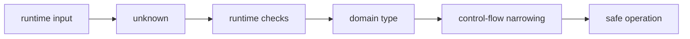

<TLDR>
  <TLDRCell label="what">
    TypeScript checks which operations JavaScript values can support before the program runs, using annotations and inference to describe those values.
  </TLDRCell>
  <TLDRCell label="trap">
    Types are erased from the emitted JavaScript, so a type assertion neither converts data nor validates external input.
  </TLDRCell>
  <TLDRCell label="fix">
    Enable strict checking and let local values infer naturally; accept network, file, and JSON data as `unknown`, then run checks before assigning a domain type.
  </TLDRCell>
</TLDR>

## What it is and why it exists

TypeScript is JavaScript with static type checking.
It analyzes source code before execution to decide whether a value can be called, has a requested property, and can be assigned to a parameter or return type.
TypeScript that passes those checks still runs as JavaScript, so annotations don't replace the language's runtime rules.

A type describes a set of permitted values and the operations those values support.
`string` describes JavaScript strings, `number[]` describes an array of numbers, and `{ id: string }` describes an object with a string `id` property.
The more precise the type, the more help the editor and compiler can provide during refactoring, property access, and function calls.

A <Term id="type-annotation">type annotation</Term> is a type written explicitly in source code, such as `: number` after a function parameter.
<Term id="type-inference">Type inference</Term> lets the compiler derive a type from an initializer, arguments, and the surrounding expected type.
Everyday code usually annotates function boundaries, empty containers, and places that need a wider contract while leaving other local variables to inference.

The type system addresses questions that can be checked statically, such as whether an operation is valid for a value.
It can catch misspelled properties, missing arguments, unhandled `null`, and strings passed to number-only functions before execution.
It cannot decide whether an order is genuine, whether a user is authorized, or whether a network response really matches a declaration.

You encounter these basic types in variables, functions, objects, arrays, asynchronous results, and library APIs.
Enums, generics, type guards, and advanced types have their own topics; this page builds the model needed to read them without cataloging every syntax form.

## How it works

TypeScript operates across two worlds: the static types visible to the compiler and the runtime values visible to the JavaScript engine.
The compiler rejects unsafe operations using declarations and control flow, then removes most type syntax and emits JavaScript.
Only the expressions and checks that remain are executed at runtime.



### Common value types

JavaScript primitives use lowercase TypeScript names: `string`, `number`, `boolean`, `bigint`, `symbol`, `null`, and `undefined`.
Use `string`, not the wrapper-object type `String`; the former describes ordinary string values, while the latter describes objects you rarely need to construct yourself.
`number` covers both JavaScript integers and floating-point numbers, while `bigint` is a separate runtime type that cannot be mixed directly with `number` arithmetic.

Arrays can be written as `number[]` or `Array<number>`; both forms describe the same kind of mutable array.
`readonly number[]` prevents mutation through that reference, but it neither freezes the runtime object nor stops another mutable reference from changing the same array.
Use a tuple when positions have distinct meanings, as in `[orderId: string, total: number]`, and an array when a variable number of elements share one meaning.

An object type lists the properties the code needs and their types.
A `?` after a property name means the property can be absent; with strict null checking, reading it usually produces a union of its declared type and `undefined`.
A `readonly` property only restricts assignment through the current static type and provides no runtime access control.

A function type describes parameters and a return value, such as `(amount: number) => string`.
Parameters usually need annotations because a function body alone cannot reliably infer what callers may pass; return types are often inferable, but an explicit return type on a public API fixes the contract.
A `void` return says callers should not use a result, while `never` says normal control flow cannot produce a value at that point.

### Annotations, inference, and literals

An initializer usually provides enough information.
The value of `const retries = 3` cannot be reassigned, so the compiler can retain more precise literal information; `let retries = 3` must allow other numbers later and is usually inferred as `number`.
This movement from a specific literal toward a wider type is called widening.

Object properties are still considered mutable by default.
In `const request = { method: "GET" }`, the variable binding cannot be reassigned, but `request.method` is usually `string`, not the literal type `"GET"`.
Use `as const` when the whole literal structure must remain precise, remembering that it also makes properties and array elements readonly.

Context can contribute to inference too.
When an arrow function is passed to a method known to accept `(item: LineItem) => number`, the `item` parameter gets its type from the call site.
If that context is missing and strict options forbid implicit `any`, the parameter needs an annotation.

An annotation should express the allowed set, not merely repeat the initializer.
A variable initialized to `null` but later assigned a string needs to be declared as `string | null`.
An empty array without enough context likewise needs a variable or containing-object type that states which elements may be added later.

### Unions, nulls, and narrowing

The union type `string | number` means a value can belong to either member.
Until the specific member is known, you can perform only operations supported by every member.
After a `typeof`, equality, `in`, `instanceof`, or discriminant check, the compiler derives a more precise type for the corresponding branch.

This process of changing a variable's type along reachable paths is <Term id="control-flow-narrowing">control-flow narrowing</Term>.
The check must agree with runtime facts; if a custom predicate returns a false conclusion, the compiler trusts its contract while JavaScript still receives the real data.
Prefer direct runtime checks and let each branch handle only members it has proved.

`null` and `undefined` are different runtime values with their own types.
An absent optional property produces `undefined`, while an API may use `null` to represent an explicitly missing value.
Record the actual possibilities in a union, then handle them with explicit comparisons, optional chaining `?.`, and nullish coalescing `??`.

A discriminated union gives each object member a literal tag.
Checking that tag narrows the accompanying payload; once every member is handled, the remaining type is `never`.
Assigning the remainder to `never` makes a newly added state with a missing branch fail at compile time.

### `unknown`, `any`, and assertions

`unknown` means that a value exists but its type is not yet known.
Any value is assignable to `unknown`, but you cannot read arbitrary properties, call it, or use it in an operation that requires a concrete type before narrowing.
That makes it appropriate for untrusted boundaries such as `JSON.parse` results, message payloads, and third-party callbacks.

`any`, by contrast, opts out of type checking.
Property access, calls, and assignments involving `any` keep spreading unchecked values, so a mistake may surface far from the original boundary.
It can serve a controlled migration seam or an unmodelled legacy interface, but it should not be the default answer to “the type is not known yet.”

A <Term id="type-assertion">type assertion</Term>, written `value as Target`, supplies information from the developer to the compiler.
It performs no conversion, checks no properties, and generates no validation code.
It is trustworthy only when a runtime check, platform guarantee, or narrow implementation invariant has already proved its precondition.

## Examples

The next four examples follow one path through order data.
They begin with local data, then handle optional values and external input, and finally model state with a union.
Each block was executed locally with `tsx`, and its output is the actual result.

### Let inference support explicit boundaries

`LineItem` fixes the shape of the domain object, while the function parameter and return type fix its call boundary.
The array literal, reduction callback parameters, and use of `summary` are inferred from context.
The readonly parameter says the function does not need to modify its caller's array.

<Depth level="quick">

```typescript run title="order-total.ts"
type LineItem = {
  description: string;
  unitPrice: number;
  quantity: number;
};

function orderTotal(items: readonly LineItem[]): number {
  return items.reduce(
    (total, item) => total + item.unitPrice * item.quantity,
    0,
  );
}

const items = [
  { description: "notebook", unitPrice: 4.75, quantity: 2 },
  { description: "pen", unitPrice: 1.5, quantity: 2 },
];

const summary: readonly [orderId: string, total: number] = [
  "ORD-204",
  orderTotal(items),
];

console.log(`${summary[0]}: ${summary[1].toFixed(2)}`);
```

```text
ORD-204: 12.50
```

</Depth>

`items` does not need a repeated `LineItem[]` annotation because its use as a function argument receives a complete check.
Named tuple elements make the positional meaning easier to read, but `summary` is still an ordinary array at runtime.
If more fields will be accessed by name, an object is usually clearer than a tuple that keeps growing.

### Handle missing values explicitly

A customer can have an address, explicitly have no address, or omit the address property.
The type includes all three inputs, while optional chaining and nullish coalescing map the latter two to pickup.

```typescript run title="shipping-label.ts"
type Address = {
  line1: string;
  city: string;
};

type Customer = {
  name: string;
  address?: Address | null;
};

function shippingLabel(customer: Customer): string {
  const destination = customer.address?.city ?? "pickup";
  return `${customer.name}: ${destination}`;
}

const customers: Customer[] = [
  { name: "Ada", address: { line1: "8 River Road", city: "Paris" } },
  { name: "Lin", address: null },
  { name: "Sam" },
];

for (const customer of customers) {
  console.log(shippingLabel(customer));
}
```

```text
Ada: Paris
Lin: pickup
Sam: pickup
```

`?.` stops property access when the address is `null` or `undefined` and produces `undefined`.
`??` uses the default only when its left side is `null` or `undefined`, so it does not mistake another falsy value such as an empty string for absence.
Whether the domain permits an empty city is a separate validation rule and should not be decided implicitly by `??`.

### Validate `unknown` at a JSON boundary

Parsing JSON proves only that text follows JSON syntax, not that the result is an order.
This function first treats the result as `unknown`, then validates the object itself and its two required properties.
After those checks, the newly constructed return object satisfies `IncomingOrder`.

```typescript run title="parse-order.ts"
type IncomingOrder = {
  id: string;
  total: number;
};

function parseOrder(raw: string): IncomingOrder {
  const value: unknown = JSON.parse(raw);

  if (typeof value !== "object" || value === null) {
    throw new Error("invalid order");
  }

  const candidate = value as Record<string, unknown>;
  if (typeof candidate.id !== "string" || typeof candidate.total !== "number") {
    throw new Error("invalid order");
  }

  return { id: candidate.id, total: candidate.total };
}

for (const raw of ['{"id":"ORD-204","total":12.5}', '{"id":204,"total":"12.5"}']) {
  try {
    const order = parseOrder(raw);
    console.log(`${order.id}: ${order.total.toFixed(2)}`);
  } catch {
    console.log("invalid order");
  }
}
```

```text
ORD-204: 12.50
invalid order
```

The assertion here only bridges a value already proved to be a non-null object to a record whose string-keyed properties can be inspected.
Every property read from it remains `unknown` and must be checked separately.
A real system should also validate finite numbers, ranges, and extra fields according to its domain instead of copying this minimal validator unchanged.

### Close the state space with a discriminated union

Each order-state tag carries its corresponding fields.
After `status` is checked, the compiler narrows `state` to one member, preventing code from reading a signer from a failed state.

```typescript run title="order-state.ts"
type OrderState =
  | { status: "pending"; etaMinutes: number }
  | { status: "delivered"; signedBy: string }
  | { status: "failed"; reason: string };

function describeState(state: OrderState): string {
  switch (state.status) {
    case "pending":
      return `arrives in ${state.etaMinutes} minutes`;
    case "delivered":
      return `signed by ${state.signedBy}`;
    case "failed":
      return `failed: ${state.reason}`;
    default: {
      const unreachable: never = state;
      return unreachable;
    }
  }
}

const states: OrderState[] = [
  { status: "pending", etaMinutes: 12 },
  { status: "delivered", signedBy: "Mina" },
  { status: "failed", reason: "address not found" },
];

for (const state of states) console.log(describeState(state));
```

```text
arrives in 12 minutes
signed by Mina
failed: address not found
```

If the union gains a `cancelled` member without another branch, `state` in the default branch is no longer assignable to `never`.
That compiler error connects a state change to its consumers.
Runtime input can still contain an invalid tag, so exhaustive checking does not replace boundary validation.

## Pitfalls

> [!PITFALL]
> Annotating ordinary primitives with the wrapper-object types `String`, `Number`, or `Boolean` introduces methods and assignability rules that do not match everyday JavaScript values.

Use lowercase `string`, `number`, and `boolean` for ordinary text, numbers, and Boolean values.
**Fix:** Reserve uppercase types for code that genuinely handles wrapper-object instances; start business fields and function parameters with primitive types.

> [!PITFALL]
> Receiving JSON or third-party data as `any` lets one escape spread through property access, calls, and returns until it fails at runtime.

Adding an annotation to the final variable does not validate the original data.
**Fix:** Receive `unknown` at the boundary, check the object, properties, and value ranges, and then return a new domain object; use an audited runtime validator for large structures.

> [!PITFALL]
> `value as User` and the non-null assertion `value!` only suppress compiler doubt; they neither change nor inspect the runtime value.

Generated code often uses a double assertion to cross clearly incompatible types, which usually signals a missing contract or validation step.
**Fix:** Write down the runtime evidence that makes the assertion valid, contain unavoidable assertions in a small helper, and test its failure path.

> [!PITFALL]
> Using `value || fallback` for nullable data replaces `0`, the empty string, and `false` as well as missing values.

That collapses “absent” and “present but falsy” into one state.
**Fix:** Use `??` when only `null` and `undefined` should trigger a default; if the domain also rejects an empty string, write and name that validation rule separately.

> [!PITFALL]
> An array lookup can produce `undefined` at runtime even when a permissive configuration shows only the element type statically.

Generated code often reads `items[0]` directly because its sample data is non-empty.
**Fix:** Check the length or the result against `undefined`, and consider enabling `noUncheckedIndexedAccess`; see the related strict-mode topic for the complete configuration.

## In the AI era

**What generated code gets wrong here**

Models often repeat obvious annotations on every local variable while writing `any` or `JSON.parse(raw) as DomainType` at the boundary that matters.
They also treat `as` as a conversion, use a non-null assertion as null handling, or make every field optional in a broad interface to silence errors.
Another concrete failure is adding a discriminated-union member without updating every `switch`, leaving some states to fall silently into default behavior.

**Ask your AI to check**

- List every `any`, type assertion, and non-null assertion, then state its runtime evidence and failure path.
- Trace data from every network, file, environment-variable, and JSON entry point, confirming that it enters as `unknown` and is validated before receiving a domain type.
- Enumerate each union member, prove that branches are exhaustive, and test `null`, `undefined`, empty arrays, and incorrectly typed fields.

**Review checklist**

- Run type checking in strict mode and confirm no error was silenced by widening to `any` or an all-optional object.
- Execute boundary code with untrusted, missing-field, and wrong-type input, confirming that it fails before first use.
- Change one union member or function return type and confirm the compiler identifies every consumer that must be updated.

**Prompt vocabulary**

Use precise terms: `type annotation`, `type inference`, `literal widening`, `union type`, `control-flow narrowing`, `discriminated union`, `type assertion`, `type erasure`, and `runtime validation`.
Ask the model to distinguish “proved by the compiler,” “asserted by the developer,” and “validated at runtime”; “make this type-safe” alone does not expose the difference among those guarantees.

<Depth level="deep">

## Structural types and assignability

TypeScript primarily decides object compatibility by member shape, an approach called <Term id="structural-typing">structural typing</Term>.
A value with the properties required by a target type is usually assignable without declaring an explicit implementation relationship.
This fits JavaScript's ability-oriented object style and makes ordinary objects easy to pass to small interfaces.

Structural compatibility does not convert the runtime object into the target type.
Extra properties remain, and prototypes and methods do not change.
A function should depend only on the members published by its parameter type, not assume the caller passed an instance of a named class.

The compiler also performs an excess-property check when an object literal is assigned directly to a target type, which helps catch misspelled fields.
If the same object is first stored in a variable, structural compatibility may permit its extra fields as long as every required target member exists.
This is not boundary validation, because external objects still need runtime checks; it is a static diagnostic for common literal mistakes.

Function types are compared structurally too, although parameter positions are affected by options such as strict function types.
At a beginner level, give public callbacks accurate parameter types instead of adapting a wider callback with assertions.
When several input types need abstraction, the generics topic explains how to preserve specific information supplied by callers.

## Inference is local evidence

Inference does not guess a variable's business meaning across the entire program.
The compiler uses only visible initializers, control flow, call signatures, and contextual types.
If that evidence is already broad, such as a source typed as `any`, later inference faithfully propagates the broad type.

Conversely, the narrowest literal is not always the right contract.
When a state variable starts as `"idle"` but will later accept `"loading"` and `"done"`, declare the permitted union instead of using assertions to work around its initial inference.
Declaring intent at boundaries and using inference inside implementations creates a more stable division of responsibility.

Contextual inference also means moving an expression can change its type.
An inline callback parameter can receive a type from the consumer's signature, while a separately declared function without annotations loses that context.
Run the type checker after refactoring; moving code is not necessarily only a formatting change.

`as const`, explicit unions, and `satisfies` can all control literal precision, but they do different jobs.
`as const` makes the expression deeply readonly and retains literals; an annotation determines the type presented by a variable; `satisfies` checks compatibility while preserving as much of the expression's inferred type as possible.
Continue with the literal-types and `satisfies` topics when you need to compare those behaviors directly.

## Responsibility after type erasure

TypeScript performs <Term id="type-erasure">type erasure</Term> when emitting JavaScript.
Type aliases, interfaces, union members, and most annotations do not become objects available for runtime queries.
Consequently, `type User = ...` does not generate `User.parse`, a serializer, or a database constraint.

Some TypeScript syntax does produce JavaScript, including ordinary enums and class forms with parameter properties.
That fact does not imply that every type feature has a runtime representation.
To determine whether a guarantee exists, inspect the actual output and runtime checks instead of guessing from a type name.

Type checking alone also does not guarantee that a build refuses to emit JavaScript.
A toolchain can be configured to emit despite type errors, and a transpiler may remove types without performing a complete check.
A release pipeline must run type checking independently and use build configuration to decide explicitly whether errors block artifacts.

Static checks and runtime validation solve different problems.
The former keeps operations consistent among modeled parts of the program; the latter confirms external facts against the model.
A reliable data path validates at the boundary and then propagates precise types internally instead of asking either layer to replace the other.

</Depth>

<Checkpoint id="typescript/basics" />

## Further reading

- [TypeScript Handbook: The Basics](https://www.typescriptlang.org/docs/handbook/2/basic-types.html)
- [TypeScript Handbook: Everyday Types](https://www.typescriptlang.org/docs/handbook/2/everyday-types.html)
- [TypeScript Handbook: Narrowing](https://www.typescriptlang.org/docs/handbook/2/narrowing.html)
- [TypeScript Handbook: Type Compatibility](https://www.typescriptlang.org/docs/handbook/type-compatibility.html)
