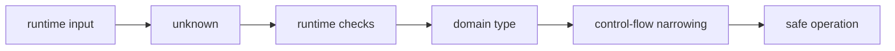

<TLDR>
  <TLDRCell label="what">
    TypeScript 在 JavaScript 运行前检查值可以参与哪些操作，并通过类型注解与类型推断描述这些值。
  </TLDRCell>
  <TLDRCell label="trap">
    类型会从输出的 JavaScript 中擦除，因此类型断言既不会转换数据，也不会验证外部输入。
  </TLDRCell>
  <TLDRCell label="fix">
    开启严格检查，让局部值自然推断；在网络、文件和 JSON 边界先接收 `unknown`，通过运行时检查后再获得领域类型。
  </TLDRCell>
</TLDR>

## 是什么，为什么存在

TypeScript 是带静态类型检查的 JavaScript。
它分析源码，在程序运行前判断某个值能否被调用、是否具有指定属性，以及参数和返回值能否相互赋值。
通过检查的 TypeScript 最终仍作为 JavaScript 运行，所以语言的运行时语义没有因为类型注解而变成另一套规则。

类型描述的是一组允许的值，以及这些值上允许的操作。
`string` 表示 JavaScript 字符串，`number[]` 表示元素为数字的数组，`{ id: string }` 表示具有字符串 `id` 属性的对象。
类型越精确，编辑器和编译器就越能在重构、属性访问和函数调用时指出不一致。

<Term id="type-annotation">类型注解（type annotation）</Term>是源码中显式写出的类型，例如函数参数后的 `: number`。
<Term id="type-inference">类型推断（type inference）</Term>则让编译器根据初始化值、实参和周围的预期类型得出类型。
日常代码通常只在函数边界、空容器或需要表达更宽契约的位置添加注解，其余局部变量交给推断。

类型系统解决的是“某种操作是否适用于这个值”这类可静态判断的问题。
它能在运行前发现拼错属性、漏传参数、没有处理 `null`，或者把字符串交给只接受数字的函数。
它不能判断一笔订单是否真实、用户是否有权限，也不能仅凭声明证明网络响应符合预期结构。

你会在变量、函数、对象、数组、异步结果和库 API 中持续遇到这些基础类型。
枚举、泛型、类型守卫和高级类型各有独立主题；这里建立阅读这些主题所需的共同模型，而不罗列整套语法。

## 工作原理

TypeScript 同时面对两个世界：编译器看到的静态类型，以及 JavaScript 引擎看到的运行时值。
编译器根据声明与控制流拒绝不安全的操作，然后移除大多数类型语法并输出 JavaScript。
运行时只会执行保留下来的表达式和检查。



### 常用值类型

JavaScript 的原始值在 TypeScript 中使用小写类型名：`string`、`number`、`boolean`、`bigint`、`symbol`、`null` 和 `undefined`。
应使用 `string` 而不是包装对象类型 `String`；前者描述普通字符串值，后者描述很少需要手动创建的对象包装器。
`number` 同时覆盖 JavaScript 的整数和浮点数，`bigint` 则是不能与 `number` 直接混算的另一种运行时类型。

数组可以写成 `number[]` 或 `Array<number>`，两种形式表示同一类可变数组。
`readonly number[]` 禁止通过该引用修改数组，但不会冻结运行时对象，也不会阻止其他可变引用修改同一数组。
元素位置具有不同含义时可使用元组，例如 `[orderId: string, total: number]`；元素数量可变且含义相同时则应使用数组。

对象类型列出代码需要的属性及其类型。
属性名后的 `?` 表示属性可以缺失；开启严格空值检查时，读取这种属性通常得到声明类型与 `undefined` 的联合。
`readonly` 属性只限制通过当前静态类型进行赋值，并不是运行时访问控制。

函数类型描述参数与返回值，例如 `(amount: number) => string`。
参数通常需要注解，因为仅从函数体无法可靠推断调用方可以传入什么；返回类型往往可以推断，但公共 API 上显式写出返回类型能固定契约。
返回 `void` 表示调用方不应使用返回结果，而 `never` 表示正常控制流不可能从该位置产生值。

### 注解、推断与字面量

初始化表达式通常已经提供足够信息。
`const retries = 3` 的值不会被重新赋值，编译器可以保留更精确的字面量信息；`let retries = 3` 需要容纳之后的其他数字，因此通常推断为 `number`。
这种从具体字面量走向更宽类型的过程叫作拓宽。

对象属性默认仍被视为可变。
因此，`const request = { method: "GET" }` 中变量绑定不可重新赋值，但 `request.method` 通常是 `string`，不是字面量类型 `"GET"`。
需要保持整个字面量结构时可以使用 `as const`，但这也会把属性和数组元素变成只读。

上下文也能参与推断。
把箭头函数传给一个已知接收 `(item: LineItem) => number` 的方法时，参数 `item` 可以从调用位置获得类型。
如果上下文缺失并且严格选项禁止隐式 `any`，就必须给参数写注解。

注解应表达允许的集合，而不是简单复述初始化值。
例如，初始状态为 `null`、稍后会变成字符串的变量，需要声明为 `string | null`。
一个空数组若没有足够上下文，也应通过变量类型或所在对象的类型说明将来允许放入什么元素。

### 联合、空值与收窄

联合类型 `string | number` 表示值可能属于任一成员。
在尚未确认具体成员前，只能执行所有成员共同支持的操作。
用 `typeof`、相等比较、`in`、`instanceof` 或可辨识字段检查后，编译器会在相应分支中得到更精确的类型。

这种根据可达路径改变变量类型的过程叫作<Term id="control-flow-narrowing">控制流收窄（control-flow narrowing）</Term>。
检查必须与运行时事实一致；如果自定义判断函数返回了错误结论，编译器会相信这个契约，而 JavaScript 仍会遇到真实数据。
优先使用直接的运行时检查，并让每个分支只处理已经证明的成员。

`null` 和 `undefined` 是不同的运行时值，也各自拥有类型。
可选属性缺失时得到 `undefined`；某个 API 也可能用 `null` 明确表示没有值。
用联合类型记录实际可能出现的情况，再通过显式比较、可选链 `?.` 和空值合并 `??` 处理它们。

可辨识联合让每个对象成员带有一个字面量标签。
检查标签后，载荷会一起收窄；所有分支处理完毕后，剩余类型就是 `never`。
把剩余值赋给 `never` 可以让新增状态但遗漏处理分支的错误在编译期出现。

### `unknown`、`any` 与断言

`unknown` 表示“这里确实有一个值，但目前不知道它是什么类型”。
任何值都可以赋给 `unknown`，但在收窄之前不能读取任意属性、调用它或参与只接受具体类型的操作。
这正适合描述 `JSON.parse` 结果、消息载荷和第三方回调等不可信边界。

`any` 则选择退出类型检查。
对 `any` 的属性访问、调用和赋值会继续传播不受检查的值，使错误离开最初的边界后才暴露。
它适合受控的迁移接缝或无法建模的遗留接口，但不应作为“暂时不知道类型”的默认答案。

<Term id="type-assertion">类型断言（type assertion）</Term>写作 `value as Target`，表示开发者向编译器提供额外信息。
断言不执行转换、不检查属性，也不生成验证代码。
它只有在前置条件已经由运行时检查、平台保证或狭窄的实现不变量证明时才可靠。

## 示例

下面四个示例沿着一条订单数据路径前进。
它们先描述本地数据，再处理可选值和外部输入，最后用联合类型表达状态。
每段代码都由本地 `tsx` 执行，输出来自实际运行结果。

### 让推断服务于显式边界

`LineItem` 固定领域对象的形状，函数参数和返回值固定调用边界。
数组字面量、归约回调中的参数以及 `summary` 的使用方式则由上下文推断。
只读参数说明函数不需要修改调用方的数组。

<Depth level="quick">

```typescript run title="order-total.ts"
type LineItem = {
  description: string;
  unitPrice: number;
  quantity: number;
};

function orderTotal(items: readonly LineItem[]): number {
  return items.reduce(
    (total, item) => total + item.unitPrice * item.quantity,
    0,
  );
}

const items = [
  { description: "notebook", unitPrice: 4.75, quantity: 2 },
  { description: "pen", unitPrice: 1.5, quantity: 2 },
];

const summary: readonly [orderId: string, total: number] = [
  "ORD-204",
  orderTotal(items),
];

console.log(`${summary[0]}: ${summary[1].toFixed(2)}`);
```

```text
ORD-204: 12.50
```

</Depth>

`items` 不必重复写成 `LineItem[]`，因为它作为函数实参时已经接受完整检查。
命名元组元素让位置含义更容易阅读，但运行时的 `summary` 仍只是普通数组。
如果后续要按名称访问更多字段，对象通常比不断增长的元组清楚。

### 明确处理缺失值

客户可以有地址、明确没有地址，或者省略地址属性。
类型把这三种输入都写进契约，而可选链与空值合并把后两种情况统一成自提货。

```typescript run title="shipping-label.ts"
type Address = {
  line1: string;
  city: string;
};

type Customer = {
  name: string;
  address?: Address | null;
};

function shippingLabel(customer: Customer): string {
  const destination = customer.address?.city ?? "pickup";
  return `${customer.name}: ${destination}`;
}

const customers: Customer[] = [
  { name: "Ada", address: { line1: "8 River Road", city: "Paris" } },
  { name: "Lin", address: null },
  { name: "Sam" },
];

for (const customer of customers) {
  console.log(shippingLabel(customer));
}
```

```text
Ada: Paris
Lin: pickup
Sam: pickup
```

`?.` 在地址为 `null` 或 `undefined` 时停止属性访问，得到 `undefined`。
`??` 只在左侧为 `null` 或 `undefined` 时使用默认值，因此不会误把空字符串等其他假值当成缺失。
领域是否允许空城市名是另一个验证规则，不应由 `??` 暗中决定。

### 在 JSON 边界验证 `unknown`

解析 JSON 只保证文本符合 JSON 语法，并不保证结果是订单。
这个函数先把结果视为 `unknown`，再验证对象本身和两个必需属性。
通过检查后，新建的返回对象满足 `IncomingOrder`。

```typescript run title="parse-order.ts"
type IncomingOrder = {
  id: string;
  total: number;
};

function parseOrder(raw: string): IncomingOrder {
  const value: unknown = JSON.parse(raw);

  if (typeof value !== "object" || value === null) {
    throw new Error("invalid order");
  }

  const candidate = value as Record<string, unknown>;
  if (typeof candidate.id !== "string" || typeof candidate.total !== "number") {
    throw new Error("invalid order");
  }

  return { id: candidate.id, total: candidate.total };
}

for (const raw of ['{"id":"ORD-204","total":12.5}', '{"id":204,"total":"12.5"}']) {
  try {
    const order = parseOrder(raw);
    console.log(`${order.id}: ${order.total.toFixed(2)}`);
  } catch {
    console.log("invalid order");
  }
}
```

```text
ORD-204: 12.50
invalid order
```

这里的断言只把已经证明为非空对象的值桥接到可按字符串键检查的记录类型。
每个读取出的属性仍然是 `unknown`，必须分别验证。
真实系统还应根据领域要求检查有限数值、取值范围和多余字段，而不是仅复制这个最小验证器。

### 用可辨识联合封闭状态空间

订单状态的每个标签都带有对应字段。
检查 `status` 后，编译器会把 `state` 收窄到一个成员，因此不会在失败状态上误读签收人。

```typescript run title="order-state.ts"
type OrderState =
  | { status: "pending"; etaMinutes: number }
  | { status: "delivered"; signedBy: string }
  | { status: "failed"; reason: string };

function describeState(state: OrderState): string {
  switch (state.status) {
    case "pending":
      return `arrives in ${state.etaMinutes} minutes`;
    case "delivered":
      return `signed by ${state.signedBy}`;
    case "failed":
      return `failed: ${state.reason}`;
    default: {
      const unreachable: never = state;
      return unreachable;
    }
  }
}

const states: OrderState[] = [
  { status: "pending", etaMinutes: 12 },
  { status: "delivered", signedBy: "Mina" },
  { status: "failed", reason: "address not found" },
];

for (const state of states) console.log(describeState(state));
```

```text
arrives in 12 minutes
signed by Mina
failed: address not found
```

如果联合新增 `cancelled` 成员而函数没有新增分支，默认分支中的 `state` 就不能赋给 `never`。
这个编译错误把状态变化连接到使用方。
运行时仍可能收到不合法标签，所以边界验证不能由穷尽检查替代。

## 陷阱

> [!PITFALL]
> 使用 `String`、`Number` 或 `Boolean` 包装对象类型来标注普通原始值，会引入与 JavaScript 日常值不一致的方法和赋值关系。

普通文本、数值和布尔值应分别使用小写的 `string`、`number` 和 `boolean`。
**修复方法：** 只在确实操作包装对象实例时使用大写类型；业务字段和函数参数一律从小写原始类型开始。

> [!PITFALL]
> 用 `any` 接收 JSON 或第三方数据，会让一次逃逸传播到属性访问、函数调用和返回值，直到运行时才失败。

给最终变量补一个类型注解并不能验证原始数据。
**修复方法：** 在边界接收 `unknown`，检查对象、属性和值域，然后返回新建的领域对象；大型结构可使用经过审核的运行时验证器。

> [!PITFALL]
> `value as User` 和非空断言 `value!` 只压制编译器怀疑，不会改变或检查运行时值。

生成代码常用双重断言跨过明显不兼容的类型，这通常说明契约或验证缺失。
**修复方法：** 写出断言成立的运行时证据，把不得不用的断言限制在一个小型辅助函数中，并测试其失败路径。

> [!PITFALL]
> 用 `value || fallback` 处理可空值时，`0`、空字符串和 `false` 也会触发默认值。

这会把“缺失”和“存在但为假”混成同一种状态。
**修复方法：** 只想处理 `null` 与 `undefined` 时使用 `??`；业务上还要拒绝空字符串时，单独写出并命名那条验证规则。

> [!PITFALL]
> 数组索引在运行时可能得到 `undefined`，但宽松配置下的静态类型可能仍只显示元素类型。

测试样例常常使用非空数组，因此生成代码容易直接读取 `items[0]`。
**修复方法：** 检查长度或读取结果是否为 `undefined`，并考虑启用 `noUncheckedIndexedAccess`；严格选项的整体配置见相关主题。

<Depth level="deep">

## 结构类型与赋值兼容性

TypeScript 主要按成员结构判断对象类型是否兼容，这叫作<Term id="structural-typing">结构类型（structural typing）</Term>。
一个值只要拥有目标类型要求的属性，通常就能赋给目标类型，不需要显式声明实现关系。
这符合 JavaScript 中对象按能力协作的习惯，也让普通对象容易交给小型接口。

结构兼容并不意味着运行时对象被转换成目标类型。
额外属性仍然存在，原型和方法也不会变化。
函数只应依赖其参数类型公开的成员，不应假定调用方传入的是某个命名类的实例。

直接把对象字面量赋给目标类型时，编译器还会执行额外属性检查，帮助发现拼错字段。
同一个对象先放入变量再赋值时，只要包含目标所需成员，结构兼容可能允许额外字段。
这不是验证边界，外部对象仍需运行时检查；它只是针对常见字面量错误的静态诊断。

函数类型也通过结构比较，但参数位置会受到严格函数类型等选项影响。
初学阶段应给公共回调使用准确参数类型，不要靠更宽的回调加断言适配。
需要抽象多个输入类型时，泛型主题会解释如何保留调用方提供的具体信息。

## 推断是局部证据

推断不是猜测变量在整个程序中的业务含义。
编译器只使用当前可见的初始化值、控制流、调用签名和上下文类型。
如果这些证据过宽，例如来源已经是 `any`，后续推断只会忠实传播这个宽类型。

反过来，过窄的字面量也不总是正确契约。
状态变量一开始是 `"idle"`，但之后还要接收 `"loading"` 和 `"done"` 时，应把允许状态写成联合类型，而不是用断言逐次绕过初始推断。
在边界声明意图，在实现内部利用推断，是更稳定的分工。

上下文推断还意味着把表达式移到别处可能改变其类型。
内联回调参数可以从接收方签名获得类型，单独声明的函数若没有注解则失去这份上下文。
重构后运行类型检查，不能假定移动代码只改变排版。

`as const`、显式联合和 `satisfies` 都能控制字面量精度，但作用不同。
`as const` 让整个表达式深度只读并保留字面量；注解决定变量对外呈现的类型；`satisfies` 检查兼容性，同时尽量保留表达式自身的推断结果。
需要专门比较这些行为时，应继续阅读字面量类型与 `satisfies` 主题。

## 类型擦除后的责任

TypeScript 输出 JavaScript 时会进行<Term id="type-erasure">类型擦除（type erasure）</Term>。
类型别名、接口、联合成员和大多数注解不会成为可供运行时查询的对象。
因此，`type User = ...` 不会自动生成 `User.parse`、序列化器或数据库约束。

有些 TypeScript 语法确实会产生 JavaScript，例如普通枚举和带参数属性的类构造形式。
不能因此推断所有类型功能都有运行时表示。
判断某项保证是否存在时，应查看实际输出和运行时检查，而不是根据类型名称猜测。

类型检查本身也不保证构建一定拒绝发出 JavaScript。
工具链可以配置为在存在类型错误时仍然输出，转译器也可能只删除类型而不执行完整检查。
发布流程需要独立运行类型检查，并用构建配置明确决定错误是否阻止产物。

静态检查与运行时验证解决不同问题。
前者确保已建模代码之间的操作保持一致，后者确认外部事实符合模型。
可靠的数据路径会先验证边界，再让精确类型在内部传播，而不是要求其中一层替代另一层。

</Depth>

<Checkpoint id="typescript/basics" />

## 延伸阅读

- [TypeScript Handbook：基础](https://www.typescriptlang.org/docs/handbook/2/basic-types.html)
- [TypeScript Handbook：日常类型](https://www.typescriptlang.org/docs/handbook/2/everyday-types.html)
- [TypeScript Handbook：类型收窄](https://www.typescriptlang.org/docs/handbook/2/narrowing.html)
- [TypeScript Handbook：类型兼容性](https://www.typescriptlang.org/docs/handbook/type-compatibility.html)
