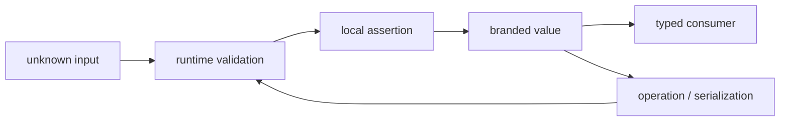

<TLDR>
  <TLDRCell label="what">
    A branded type intersects a base type with a marker that only the type checker sees, distinguishing values with the same structure but different meanings.
  </TLDRCell>
  <TLDRCell label="trap">
    A brand does not exist at runtime; `as UserId` changes the checker's judgment but neither validates the input nor adds a property to the value.
  </TLDRCell>
  <TLDRCell label="fix">
    Keep the assertion inside a constructor that performs real checks, accept external data as `unknown`, and re-establish the proof after operations, mutation, or deserialization.
  </TLDRCell>
</TLDR>

## What it is and why it exists

TypeScript uses <Term id="structural-typing">structural typing</Term>: whether two types are compatible depends mainly on their members, not on the names used to declare them. `type UserId = number` and `type ProductId = number` are therefore two aliases for the same base type. When a parameter is written as `UserId`, any `number` can enter, because the checker cannot see the business distinction “this is another kind of ID.”

A <Term id="branded-type">branded type</Term> intersects a base type with a fictitious marker property. Different markers make the structures of `UserId` and `ProductId` differ, so the checker can reject mixing them. This pattern simulates part of <Term id="nominal-typing">nominal typing</Term> inside a structural type system; it does not add a second type system to TypeScript.

Brands fit domain values where the underlying representation is the same but substitution would be wrong: IDs for different resources, normalized paths, validated email addresses, or integer amounts in different units. They let a function signature state a precondition and concentrate repeated checks at a few boundaries. Code that receives a branded value can still use the read operations of its base type.

Brands do not replace ordinary objects, literal unions, or authorization checks. If two values need different fields or runtime behavior, model those differences directly; if a value comes from a finite set, a literal union is usually clearer. A `UserId` says only that a value meets its constructor's convention, not that the user exists or that the current caller may access that user.

A brand is also a bypassable static convention. A type assertion, `any`, or unchecked JavaScript can forge one, so a brand is only as trustworthy as its creation paths. The design goal is not to eliminate assertions but to confine them to an auditable point after runtime validation has finished.

Brands and adjacent modeling tools solve different problems. First decide whether you need to express static identity, a set of values, data shape, or a dynamic policy, then choose the narrowest tool.

| Constraint to express | Better model |
| --- | --- |
| Different meanings for one base type | Branded type |
| A finite, known set of values | String literal union |
| Different fields or runtime behavior | Object type or class |
| Explicit workflow stages | Discriminated union |
| Whether external data is valid | Runtime parser, then grant the brand |
| Whether a caller is authorized | Separate authorization policy |

These models can be combined: a parser may validate an order ID's format before an authorization policy decides whether the current principal can read that order. Keep their boundaries separate so one impressive-sounding type name does not take on several promises it cannot fulfill.

## How it works

A common definition first declares a <Term id="unique-symbol">`unique symbol`</Term> key, then intersects the base type with a readonly computed property. The marker property never has to be written onto the value; it only gives the checker an extra member during structural comparison. One symbol key plus different string-literal tags can define a family of mutually incompatible brands.

For `Brand<number, "UserId">`, a branded value is assignable to `number` because it meets the numeric requirement. The reverse is not true because an ordinary number lacks the marker property. `UserId` and `ProductId` are also incompatible because their shared marker property requires different literal values. This one-way relationship lets existing read-only numeric APIs consume a brand while preventing unproved numbers from entering an API that requires it.

The type system cannot construct that intersection by itself. A constructor checks the base value, then uses a <Term id="type-assertion">type assertion</Term> at the return point to tell the checker about the result. The assertion is not validation; it records the claim that the preceding code has proved the condition.

A dependable data path looks like this. “Construction” in the diagram is a static state change, not runtime metadata being attached to the value.



### The marker exists only in the type world

TypeScript performs <Term id="type-erasure">type erasure</Term> when it emits JavaScript. `declare const brandKey: unique symbol` emits no runtime code, and intersections and type aliases disappear too. A branded number is still a number at runtime; reading a nonexistent brand property cannot recover a usable type identity.

JSON serialization therefore does not “lose a real brand field,” because that field never existed. What is lost is the compiler's static proof about the value's origin. Data returned by `JSON.parse()` must be treated as untrusted input and validated again; another assertion cannot restore the proof.

### Constructors carry the proof obligation

The constructor defines what the brand promises. If `UserId` means a positive safe integer, the constructor must check integrality, positivity, and the safe-integer range. Testing only `value > 0` would brand fractions and numbers beyond exact integer representation. Callers should not have to guess these rules repeatedly.

A constructor may throw, or it may return a `Result`, `null`, or a discriminated union carrying an error. That choice is an error-handling policy, not part of branding itself. What matters is that every success path performs the same checks and no public shortcut skips them.

A type predicate such as `value is UserId` is the same kind of hand-written promise. The checker does not prove that the predicate body establishes the brand, so an incorrect implementation creates apparently trusted values. For complex inputs, returning a newly constructed value is usually easier to maintain than narrowing a mutable input in place.

### Module boundaries control construction

The branded type and its constructor are normally exported together while the symbol key stays private to the module. Consumers can declare variables, receive returned values, and widen the brand to its base type, but they cannot fill in the private symbol property with an ordinary object literal. This prevents accidental fabrication, though it cannot stop an explicit double assertion or `any`.

If separate modules each declare their own `unique symbol` key, their brands remain different even when the tag text matches. By contrast, two independent declarations that both use a public string property such as `__brand: "UserId"` can be structurally compatible. When a brand must cross package boundaries, import its type and constructor from one authoritative module instead of copying the definition.

## Examples

The next four programs show brand assignability, external-data validation, re-establishing a brand after an operation, and handling mutable objects. Each program runs independently and is type-checked separately with TypeScript 6.

### Distinguishing structurally identical IDs

The first program defines a generic `Brand` around one symbol key. Its two constructors enforce the same positive-integer rule but return different brands, so a domain API cannot mix the two ID categories.

<Depth level="quick">

```typescript run title="distinct-ids.ts"
declare const brandKey: unique symbol;

type Brand<Value, Name extends string> = Value & {
  readonly [brandKey]: Name;
};

type UserId = Brand<number, "UserId">;
type ProductId = Brand<number, "ProductId">;

function userId(value: number): UserId {
  if (!Number.isSafeInteger(value) || value <= 0) {
    throw new Error("UserId must be a positive safe integer");
  }
  return value as UserId;
}

function productId(value: number): ProductId {
  if (!Number.isSafeInteger(value) || value <= 0) {
    throw new Error("ProductId must be a positive safe integer");
  }
  return value as ProductId;
}

function renderUser(id: UserId): string {
  return `user:${id}`;
}

const owner = userId(42);
const keyboard = productId(42);
console.log(renderUser(owner));
console.log(typeof owner);

if (false) {
  // @ts-expect-error ProductId is not assignable to UserId.
  console.log(renderUser(keyboard));
}
```

```text
user:42
number
```

</Depth>

`owner` carries a `UserId` marker in its static type but is just `42` at runtime. The `@ts-expect-error` line is a negative type test: if the checker does not find the expected error, the test itself fails. Keeping the line in an unreachable branch lets the program show the real output from its valid path.

A branded value can enter a function that accepts `number` because it still meets the base type. A plain number, `ProductId`, or external JSON cannot enter `renderUser()` directly. That is the boundary of the protection a brand provides.

### Establishing a brand at a JSON boundary

The second program keeps parsed data as `unknown`. `parseOrderId()` checks the complete string format, and only one local assertion in its success branch can create an `OrderId`.

```typescript run title="parse-order.ts"
declare const brandKey: unique symbol;

type Brand<Value, Name extends string> = Value & {
  readonly [brandKey]: Name;
};

type OrderId = Brand<string, "OrderId">;
type OrderRequest = { orderId: OrderId };

function parseOrderId(value: unknown): OrderId {
  if (typeof value !== "string" || !/^ord-[1-9]\d*$/.test(value)) {
    throw new Error("invalid orderId");
  }
  return value as OrderId;
}

function parseOrderRequest(raw: string): OrderRequest {
  const data: unknown = JSON.parse(raw);
  if (typeof data !== "object" || data === null || !("orderId" in data)) {
    throw new Error("orderId is required");
  }
  return { orderId: parseOrderId(data.orderId) };
}

const samples = ['{"orderId":"ord-104"}', '{"orderId":"104"}'];

for (const raw of samples) {
  try {
    const request = parseOrderRequest(raw);
    console.log(`accepted ${request.orderId}`);
  } catch (error) {
    const message = error instanceof Error ? error.message : "unknown error";
    console.log(`rejected ${message}`);
  }
}
```

```text
accepted ord-104
rejected invalid orderId
```

Writing `JSON.parse(raw) as OrderRequest` would skip both the object-shape and ID-format checks. The outer parser first proves that the property exists, and the inner parser then validates its value. Once the object is returned, other functions can rely on `orderId` meeting this local contract.

The regular expression defines the sample system's order-ID rule; it is not an external standard. A real project should derive its validator from the business protocol and test valid, missing, mistyped, and boundary values. A brand name cannot compensate for an incomplete parser.

### Revalidating after arithmetic

The third program represents money as non-negative safe integer cents. JavaScript addition accepts branded numbers, but TypeScript infers only `number` for the result because an arbitrary numeric operation need not preserve the brand's invariant.

```typescript run title="add-money.ts"
declare const brandKey: unique symbol;

type Brand<Value, Name extends string> = Value & {
  readonly [brandKey]: Name;
};

type UsdCents = Brand<number, "UsdCents">;

function usdCents(value: number): UsdCents {
  if (!Number.isSafeInteger(value) || value < 0) {
    throw new Error("UsdCents must be a non-negative safe integer");
  }
  return value as UsdCents;
}

function addUsd(left: UsdCents, right: UsdCents): UsdCents {
  return usdCents(left + right);
}

const subtotal = usdCents(1250);
const shipping = usdCents(300);
const rawSum = subtotal + shipping;
const total = addUsd(subtotal, shipping);

console.log(`raw sum: ${rawSum} (${typeof rawSum})`);
console.log(`branded total: ${total}`);

if (false) {
  // @ts-expect-error number does not carry the UsdCents brand.
  const notBranded: UsdCents = rawSum;
  console.log(notBranded);
}
```

```text
raw sum: 1550 (number)
branded total: 1550
```

`addUsd()` preserves the unit and reruns the range check. Adding two safe integers can still exceed the safe-integer range, so asserting the result as `UsdCents` would expand the constructor's promised input domain. A domain operation should state which invariants it preserves and handle overflow or rounding rules.

Different currencies should have different brands even when both use integer cents. A brand can prevent euro cents from entering a dollar function, but it does not supply an exchange rate, rounding method, or accounting rule. Those remain runtime code and tests.

### Freezing a validated object snapshot

Object brands are easier to invalidate than primitive brands because a caller may retain a mutable alias to the same object. This program copies the required fields and shallow-freezes the new object after validation, so the returned value no longer depends on later changes to the source.

```typescript run title="verified-profile.ts"
declare const brandKey: unique symbol;

type Brand<Value, Name extends string> = Value & {
  readonly [brandKey]: Name;
};

type ProfileData = Readonly<{
  email: string;
  age: number;
}>;

type VerifiedProfile = Brand<ProfileData, "VerifiedProfile">;

function verifiedProfile(value: unknown): VerifiedProfile {
  if (typeof value !== "object" || value === null) {
    throw new Error("profile must be an object");
  }
  if (!("email" in value) || typeof value.email !== "string") {
    throw new Error("invalid email");
  }
  if (
    !("age" in value) ||
    typeof value.age !== "number" ||
    !Number.isInteger(value.age) ||
    value.age < 18
  ) {
    throw new Error("invalid age");
  }

  const snapshot: ProfileData = { email: value.email, age: value.age };
  return Object.freeze(snapshot) as VerifiedProfile;
}

const source = { email: "alice@example.com", age: 32 };
const profile = verifiedProfile(source);
source.email = "changed@example.com";

console.log(profile.email);
console.log(Object.isFrozen(profile));
```

```text
alice@example.com
true
```

The copy breaks the sharing of top-level fields between `source` and the branded value, while `Readonly` prevents direct assignment by TypeScript consumers. `Object.freeze()` rejects top-level runtime mutation, so the example establishes both a static and a runtime boundary. The three mechanisms have different jobs; retaining only one does not produce the same guarantee.

This is a shallow strategy. If the object contains arrays or nested objects, shallow copying, `Readonly`, and `Object.freeze()` do not recursively protect their state. Construct deeply immutable data, select only the needed scalars, or make every state transition revalidate and return a new object.

## Pitfalls

> [!PITFALL]
> **Exposing a generic brand factory that does not validate.** `brand<UserId>(input)` or `input as UserId` can turn any value into a trusted type, making every caller an unaudited construction site.

**Fix:** Give every domain brand a constructor that expresses its complete invariant, and keep the final assertion inside that function. If migration code requires an unsafe entry point, include `unsafe` in its name, limit its visibility, and record each call site.

> [!PITFALL]
> **Treating a brand as runtime validation or authorization evidence.** A brand neither checks that a database record exists nor proves that the current principal owns it; a branded value from an old cache may also be stale.

**Fix:** Validate format when data enters, query an authoritative source when fresh state matters, and perform a separate authorization decision before a sensitive operation. A type can record an established local precondition, not replace facts that change over time.

> [!PITFALL]
> **Assuming operations, normalization, and deserialization preserve a brand.** Numeric arithmetic and string methods normally return base types; a JSON round trip also produces unproved data, not the original branded value.

**Fix:** Return a brand from domain operations that genuinely preserve its invariant, and call the constructor after a transformation that may break it. Start deserialized results as `unknown` and apply the same rules used for first-time input.

> [!PITFALL]
> **Branding a mutable object as “validated” and then changing it.** If fields can change after construction, the validated condition can become false while the static brand remains on the variable's type.

**Fix:** Use readonly fields for validated objects, copy input during construction, and design state-changing operations to return a newly validated value. `Object.freeze()` provides only shallow runtime freezing, so nested objects still need separate treatment.

> [!PITFALL]
> **Stacking different brands through the same marker property.** `Brand<Brand<number, "Positive">, "Integer">` requires one property to have two incompatible string literals and can reduce to `never` instead of representing two completed stages.

**Fix:** Use one composite tag such as `PositiveInteger` for one complete invariant. Discriminated unions or explicit wrapper objects are clearer for real workflow stages; if independent proofs must compose, give each proof a different symbol key and keep construction controlled.

## In the AI era

**What generated code gets wrong here**

Models often append `as UserId` after `JSON.parse()`, a database result, or an environment variable, making a compiler error disappear without establishing a runtime proof. They also generate public unconditional `brand()` helpers, claim that JSON retains brands, or force an old brand through arithmetic and string normalization with another assertion. More dangerous output confuses “this is a `UserId`” with “the current user is authorized to act on this ID.”

**Ask your AI to check**

- List every creation site for the branded value and the runtime checks immediately before its assertion.
- Trace external input to sensitive consumers, marking operations, mutation, caching, and serialization that invalidate the proof.
- Write cross-brand negative tests with `@ts-expect-error`, then run constructor tests with invalid, missing, extreme, and stale data.

**Review checklist**

- Search for `as`, `any`, generic brand factories, and type predicates, and confirm that none widens the trusted input domain.
- Check that the brand's promise agrees with its constructor, domain operations, and object mutability.
- Review format validation, record existence, and authorization separately; do not derive one fact from another brand.

**Prompt vocabulary**

Use the exact terms `branded type`, `nominal typing`, `structural typing`, `unique symbol key`, `phantom property`, `smart constructor`, `runtime validation boundary`, `type assertion escape hatch`, and `brand preservation`. Ask for both static negative tests and runtime invalid-input tests; “make the ID more type-safe” is too vague to constrain creation paths.

<Depth level="deep">

## Assignability and brand propagation

A brand is an intersection, so it preserves the base type's capabilities instead of wrapping the value in a runtime container. A `UserId` can be used for read-only numeric formatting or stored in a structure that accepts `number`. Widening it to the base type loses the static proof; the resulting variable cannot later be promoted back to `UserId` unconditionally.

Whether a generic preserves a brand depends on its signature. `identity<Value>(value: Value): Value` can keep the `UserId` inferred at a call, while a function declared to return `number` or `string` promises only the base type. Review the public return type of a wrapper instead of guessing from an implementation that “seems not to change the value.”

Arithmetic is particularly easy to misread. TypeScript permits branded numbers as operands because they are subtypes of numbers, but the operator result does not automatically inherit the brand. Even an operation that preserves a unit mathematically may violate non-negativity, safe-integer range, bounds, or precision, so a domain function should decide whether to construct the brand again.

Collections propagate the same distinction. Reading an element from `UserId[]` can produce `UserId`, but mapping the array to strings, numbers, or serialized representations gives a result determined by the callback's return type. A generic collection helper that claims to retain a brand must prove it does not change any condition represented by that brand.

## Isolation with `unique symbol`

The `unique symbol` type is allowed only on `const` declarations and readonly static properties. Each unique-symbol declaration has a separate identity, even when two symbols use the same description. Using one as a computed property key makes structural compatibility depend on that declaration rather than on a collision-prone public string field.

Whether the symbol key is exported determines who can refer to the identity in an ordinary type expression. Keeping the key private while exporting the branded alias creates a useful module boundary: consumers can still cheat with a forced assertion, but they cannot accidentally spell the brand's structure. A library that needs to share identity across packages should export one authoritative type rather than have each package redeclare a “matching” symbol.

String-key brands can still work in one application, but their isolation is weaker. If two modules both declare `string & { readonly __brand: "UserId" }`, structural typing considers them compatible. If the tag is a public generic parameter, callers may also select the broad type `string` and weaken the distinction between brands.

A private symbol is not a security boundary. TypeScript types disappear at runtime, careless or malicious consumers can still use `unknown as UserId`, and JavaScript callers are not constrained by the declarations. Runtime validation, encapsulation, and access control remain necessary when a caller is untrusted.

## The lifecycle of a brand's promise

The most reliable interpretation of a brand is “this value passed the invariant checks of one named constructor.” That interpretation requires stable constructor semantics and requires subsequent operations not to violate the invariant silently. When validation rules evolve, persisted old values do not automatically satisfy the new rules; the read boundary must choose whether to migrate, reject, or revalidate them.

Primitives reduce the ways a proof can become stale because they are immutable. Strings and numbers cannot be changed in place, but operations create new strings or numbers, so the brand naturally falls away. For objects, aliases and nested mutable data make the proof more fragile; readonly types and copying are only the first layer of protection.

A brand is not a complete refinement-type system. TypeScript does not prove arbitrary predicates, arithmetic relations, or state transitions; the checker trusts the statement made at an assertion point. A brand lets that statement propagate between APIs, but it cannot prove that the statement was initially true.

When an invariant spans several fields, changes with state, or needs rich error information, an object with a private constructor or a discriminated union is often a better model. Brands work best for lightweight, stable semantic distinctions that one boundary can validate. When choosing one, write down what the brand represents, where it can be created, and which operations invalidate it.

</Depth>

<Checkpoint id="typescript/branded-types" />

## Further reading

- [TypeScript handbook: type compatibility](https://www.typescriptlang.org/docs/handbook/type-compatibility.html)
- [TypeScript handbook: `unique symbol`](https://www.typescriptlang.org/docs/handbook/symbols.html#unique-symbol)
- [TypeScript handbook: type assertions](https://www.typescriptlang.org/docs/handbook/2/everyday-types.html#type-assertions)
- [TypeScript handbook: type predicates](https://www.typescriptlang.org/docs/handbook/2/narrowing.html#using-type-predicates)
