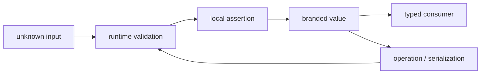

<TLDR>
  <TLDRCell label="what">
    品牌类型（branded type）把基础类型与一个仅供类型检查器识别的标记相交，从而区分结构相同但业务含义不同的值。
  </TLDRCell>
  <TLDRCell label="trap">
    品牌在运行时不存在；`as UserId` 只改变检查器的判断，既不验证输入，也不会给值添加属性。
  </TLDRCell>
  <TLDRCell label="fix">
    把断言封装在执行真实检查的构造函数中，让外部数据先以 `unknown` 进入，并在运算、修改或反序列化后重新建立证明。
  </TLDRCell>
</TLDR>

## 是什么，为什么存在

TypeScript 采用<Term id="structural-typing">结构类型（structural typing）</Term>：两个类型是否兼容，主要取决于它们拥有的成员，而不是声明时使用的名称。`type UserId = number` 和 `type ProductId = number` 因此只是同一个基础类型的两个别名。函数参数写成 `UserId` 时，任何 `number` 都可以传入，检查器看不到“这是另一类 ID”这一业务差异。

<Term id="branded-type">品牌类型（branded type）</Term>把基础类型与一个虚构的标记属性组成交叉类型。不同标记让 `UserId` 与 `ProductId` 的结构不再相同，于是检查器能够拒绝混用。这个模式在结构类型系统中模拟了<Term id="nominal-typing">名义类型（nominal typing）</Term>的一部分行为，但它不是 TypeScript 新增的一套类型系统。

品牌适合表达“底层表示相同，互换却会出错”的领域值，例如不同资源的 ID、已经规范化的路径、经过验证的邮箱地址，或单位不同的整数金额。它让函数签名写出调用前必须成立的条件，也把大量重复检查集中到少数边界函数。代码内部拿到品牌值后，仍可使用基础类型的读取操作。

品牌不适合替代普通对象、字面量联合或权限检查。若两个值需要不同字段或运行时行为，应直接建模这些差异；若值只能从有限集合中选择，字面量联合通常更清楚。一个 `UserId` 只说明它满足构造函数约定，不说明对应用户存在，也不说明当前调用者有权访问该用户。

品牌还是一种可绕过的静态约定。类型断言、`any` 或未检查的 JavaScript 都能伪造它，因此品牌的可信度取决于创建路径是否受控。真正的设计目标不是消灭断言，而是把断言压缩到一个已经完成运行时验证、容易审核的位置。

品牌与相邻建模工具各自解决不同问题。先判断你要表达的是静态身份、值集合、数据形状还是动态策略，再选择最窄的工具。

| 需要表达的约束 | 更合适的模型 |
| --- | --- |
| 同一基础类型的不同语义 | 品牌类型 |
| 有限且已知的值集合 | 字符串字面量联合 |
| 不同字段或运行时行为 | 对象类型或类 |
| 明确的工作流阶段 | 可辨识联合 |
| 外部数据是否有效 | 运行时解析器，成功后再授予品牌 |
| 调用方是否有权限 | 单独的授权策略 |

这些模型可以组合，例如解析器先验证订单 ID 的格式，再由授权策略判断当前主体是否能读取该订单。组合时仍应保留各自的边界，避免一个听起来很强的类型名称承担无法兑现的多项承诺。

## 工作原理

常用定义先声明一个<Term id="unique-symbol">唯一符号（`unique symbol`）</Term>键，再把基础类型与只读计算属性相交。标记属性无需真的写入值；它只让检查器在比较结构时看到额外成员。用同一个符号键和不同字符串字面量作为标签，可以建立一组互不兼容的品牌。

对于 `Brand<number, "UserId">`，一个品牌值仍可赋给 `number`，因为它满足数字要求；反方向则不成立，因为普通数字缺少标记属性。`UserId` 与 `ProductId` 也不兼容，因为同一标记属性要求不同的字面量值。这种单向关系让现有只读数字 API 可以消费品牌值，同时阻止未经证明的数字进入要求品牌的 API。

类型系统无法凭空创建那个交叉类型。构造函数先检查基础值，再在返回点使用<Term id="type-assertion">类型断言（type assertion）</Term>把验证结果交给检查器。断言本身不是验证逻辑；它只是记录“前面的代码已经证明了这个条件”。

一条可靠的数据路径如下。图中的“品牌化”是静态状态变化，不是给运行时值附加元数据。



### 标记只存在于类型世界

TypeScript 输出 JavaScript 时会进行<Term id="type-erasure">类型擦除（type erasure）</Term>。`declare const brandKey: unique symbol` 不会创建运行时代码，交叉类型和类型别名也会消失。一个品牌化数字在运行时仍是数字，读取并不存在的品牌属性得不到可用的类型身份。

因此，JSON 序列化不会“丢掉某个真实品牌字段”，因为这个字段从未存在。真正丢失的是编译器对值来源的静态证明。`JSON.parse()` 返回的数据必须重新视为不可信输入并再次验证，不能靠另一个断言“恢复”证明。

### 构造函数承担证明义务

构造函数定义品牌究竟承诺什么。若 `UserId` 表示正安全整数，构造函数就要同时检查整数、正数和安全整数范围；只检查 `value > 0` 会让小数或超过精确表示范围的数字获得品牌。调用方不应重复猜测这些规则。

构造函数可以抛出异常，也可以返回 `Result`、`null` 或带错误信息的可辨识联合。选择哪一种是错误处理策略，与品牌机制无关。关键是所有成功路径执行同一组检查，而且不提供跳过检查的公开快捷入口。

类型谓词 `value is UserId` 同样是一项人工承诺。检查器不会验证谓词函数体是否足以证明品牌，因此实现写错时会产生一个看似安全的品牌值。对于复杂输入，返回新构造的值通常比把可变输入原地收窄更容易维护。

### 模块边界控制创建能力

品牌类型和构造函数通常一起导出，而符号键留在模块内部。使用方能够声明变量、接收返回值并把品牌降级为基础类型，却无法通过普通对象字面量补齐私有符号属性。这减少了意外伪造，但无法阻止显式双重断言或 `any`。

若多个模块各自声明自己的 `unique symbol` 键，即使标签文字相同，得到的品牌也不同。相反，大家都使用公开的 `__brand: "UserId"` 字符串属性时，两个独立声明仍可能结构兼容。跨包共享一个品牌时，应从一个权威模块导入类型和构造函数，而不是复制定义。

## 示例

下面四个程序依次展示品牌的可分配性、外部数据验证、运算后如何重新建立品牌，以及可变对象的处理。每个程序都可以独立运行，并由 TypeScript 6 单独执行类型检查。

### 区分结构相同的 ID

第一个程序用一个符号键定义通用 `Brand`。两个构造函数实施相同的正整数规则，但返回不同品牌，因此业务 API 不能混用两类 ID。

<Depth level="quick">

```typescript run title="distinct-ids.ts"
declare const brandKey: unique symbol;

type Brand<Value, Name extends string> = Value & {
  readonly [brandKey]: Name;
};

type UserId = Brand<number, "UserId">;
type ProductId = Brand<number, "ProductId">;

function userId(value: number): UserId {
  if (!Number.isSafeInteger(value) || value <= 0) {
    throw new Error("UserId must be a positive safe integer");
  }
  return value as UserId;
}

function productId(value: number): ProductId {
  if (!Number.isSafeInteger(value) || value <= 0) {
    throw new Error("ProductId must be a positive safe integer");
  }
  return value as ProductId;
}

function renderUser(id: UserId): string {
  return `user:${id}`;
}

const owner = userId(42);
const keyboard = productId(42);
console.log(renderUser(owner));
console.log(typeof owner);

if (false) {
  // @ts-expect-error ProductId 不能赋给 UserId。
  console.log(renderUser(keyboard));
}
```

```text
user:42
number
```

</Depth>

`owner` 在静态类型中包含 `UserId` 标记，在运行时却只是 `42`。`@ts-expect-error` 行是一项负向类型测试：若检查器没有发现预期错误，测试本身就会失败。把这行放在不会执行的分支中，可以让程序展示有效路径的真实输出。

品牌值能够传给接受 `number` 的函数，因为它仍满足基础类型。普通数字、`ProductId` 或外部 JSON 则不能直接传给 `renderUser()`。这正是品牌带来的防错范围。

### 在 JSON 边界建立品牌

第二个程序让解析结果先保持 `unknown`。`parseOrderId()` 检查字符串的完整格式，只有成功分支中的一个局部断言能够创建 `OrderId`。

```typescript run title="parse-order.ts"
declare const brandKey: unique symbol;

type Brand<Value, Name extends string> = Value & {
  readonly [brandKey]: Name;
};

type OrderId = Brand<string, "OrderId">;
type OrderRequest = { orderId: OrderId };

function parseOrderId(value: unknown): OrderId {
  if (typeof value !== "string" || !/^ord-[1-9]\d*$/.test(value)) {
    throw new Error("invalid orderId");
  }
  return value as OrderId;
}

function parseOrderRequest(raw: string): OrderRequest {
  const data: unknown = JSON.parse(raw);
  if (typeof data !== "object" || data === null || !("orderId" in data)) {
    throw new Error("orderId is required");
  }
  return { orderId: parseOrderId(data.orderId) };
}

const samples = ['{"orderId":"ord-104"}', '{"orderId":"104"}'];

for (const raw of samples) {
  try {
    const request = parseOrderRequest(raw);
    console.log(`accepted ${request.orderId}`);
  } catch (error) {
    const message = error instanceof Error ? error.message : "unknown error";
    console.log(`rejected ${message}`);
  }
}
```

```text
accepted ord-104
rejected invalid orderId
```

直接写 `JSON.parse(raw) as OrderRequest` 会跳过对象形状和 ID 格式检查。这里的外层解析器先确认属性存在，内层解析器再验证其值。返回对象之后，其他函数可以依赖 `orderId` 已符合这份本地契约。

正则表达式只定义了示例系统的订单 ID 规则，不是某个外部标准。真实项目应从业务协议导出验证规则，并用有效、缺失、类型错误和边界值测试它。品牌名称无法弥补不完整的解析器。

### 运算后重新验证

第三个程序把金额表示为非负安全整数分值。JavaScript 的加法接受品牌化数字，但结果只推断为 `number`，因为任意数字运算未必保持原品牌的不变量。

```typescript run title="add-money.ts"
declare const brandKey: unique symbol;

type Brand<Value, Name extends string> = Value & {
  readonly [brandKey]: Name;
};

type UsdCents = Brand<number, "UsdCents">;

function usdCents(value: number): UsdCents {
  if (!Number.isSafeInteger(value) || value < 0) {
    throw new Error("UsdCents must be a non-negative safe integer");
  }
  return value as UsdCents;
}

function addUsd(left: UsdCents, right: UsdCents): UsdCents {
  return usdCents(left + right);
}

const subtotal = usdCents(1250);
const shipping = usdCents(300);
const rawSum = subtotal + shipping;
const total = addUsd(subtotal, shipping);

console.log(`raw sum: ${rawSum} (${typeof rawSum})`);
console.log(`branded total: ${total}`);

if (false) {
  // @ts-expect-error number 没有 UsdCents 品牌。
  const notBranded: UsdCents = rawSum;
  console.log(notBranded);
}
```

```text
raw sum: 1550 (number)
branded total: 1550
```

`addUsd()` 不仅保留单位，还重新执行范围检查。两个安全整数相加仍可能超过安全整数范围，因此直接把结果断言为 `UsdCents` 会扩大构造函数没有承诺的输入域。领域运算应明确说明哪些不变量被保留，并处理溢出或舍入规则。

不同货币即使都有整数分值，也应使用不同品牌。品牌可以阻止把欧元分直接传给美元函数，却不会提供汇率、舍入方式或会计规则。这些仍然属于运行时代码和测试。

### 冻结验证后的对象快照

对象品牌比原始值品牌更容易失效，因为调用方可能保留同一对象的可变别名。这个程序验证输入后复制需要的字段并浅冻结新对象，使返回值不再依赖原对象之后的修改。

```typescript run title="verified-profile.ts"
declare const brandKey: unique symbol;

type Brand<Value, Name extends string> = Value & {
  readonly [brandKey]: Name;
};

type ProfileData = Readonly<{
  email: string;
  age: number;
}>;

type VerifiedProfile = Brand<ProfileData, "VerifiedProfile">;

function verifiedProfile(value: unknown): VerifiedProfile {
  if (typeof value !== "object" || value === null) {
    throw new Error("profile must be an object");
  }
  if (!("email" in value) || typeof value.email !== "string") {
    throw new Error("invalid email");
  }
  if (
    !("age" in value) ||
    typeof value.age !== "number" ||
    !Number.isInteger(value.age) ||
    value.age < 18
  ) {
    throw new Error("invalid age");
  }

  const snapshot: ProfileData = { email: value.email, age: value.age };
  return Object.freeze(snapshot) as VerifiedProfile;
}

const source = { email: "alice@example.com", age: 32 };
const profile = verifiedProfile(source);
source.email = "changed@example.com";

console.log(profile.email);
console.log(Object.isFrozen(profile));
```

```text
alice@example.com
true
```

复制动作让 `source` 与品牌值不再共享顶层字段，`Readonly` 则阻止 TypeScript 使用方直接赋值。`Object.freeze()` 在运行时阻止顶层修改，所以示例同时建立静态与运行时边界。三者承担的责任不同，不能只保留其中一个就声称效果相同。

这是浅层策略。若对象包含数组或其他嵌套对象，浅复制、`Readonly` 和 `Object.freeze()` 都不会递归保护内部状态。此时应构造深层不可变数据、只选择所需标量，或让每次状态转换重新验证并返回新对象。

## 陷阱

> [!PITFALL]
> **公开一个不验证的通用品牌工厂。** `brand<UserId>(input)` 或 `input as UserId` 能把任何值包装成可信类型，使所有调用方都成为未经审计的构造点。

**修复：** 每个领域品牌提供一个表达完整不变量的构造函数，并把最终断言留在该函数内部。若迁移代码必须有不安全入口，应在名称中写出 `unsafe`，限制可见性，并逐个记录调用点。

> [!PITFALL]
> **把品牌当成运行时验证或授权凭据。** 品牌不会检查数据库中是否存在对应记录，也不会证明当前主体拥有该记录；从旧缓存拿到的品牌值也可能已经失效。

**修复：** 在数据进入系统时验证格式，在需要新鲜状态时查询权威来源，并在执行敏感操作时单独做授权判断。类型只能记录已经建立的本地前置条件，不能替代会随时间变化的事实。

> [!PITFALL]
> **假设运算、规范化和反序列化会保留品牌。** 数字算术与字符串方法通常返回基础类型；JSON 往返得到的也是未证明的数据，而不是原品牌值。

**修复：** 为确实保持不变量的领域操作返回品牌，并在可能破坏不变量的转换后调用构造函数。反序列化结果从 `unknown` 开始，按首次输入时的相同规则验证。

> [!PITFALL]
> **给可变对象贴上“已验证”品牌后继续修改它。** 如果对象字段能在构造后改变，先前验证的条件可能失效，而静态品牌仍留在变量类型上。

**修复：** 对验证后的对象使用只读字段，构造时复制所需数据，并把改变状态的操作设计为重新验证后返回新值。`Object.freeze()` 只能提供浅层运行时冻结，嵌套对象仍需单独处理。

> [!PITFALL]
> **用同一个标记属性逐层叠加不同品牌。** `Brand<Brand<number, "Positive">, "Integer">` 会让同一属性同时要求两个互斥的字符串字面量，类型可能缩减为 `never`，而不是表示两个已完成阶段。

**修复：** 对一个完整不变量使用单个复合标签，例如 `PositiveInteger`。真正的工作流阶段更适合可辨识联合或显式包装对象；若必须组合独立证明，则为每项证明使用不同的符号键，并保持构造路径受控。

## AI 时代

**生成代码在这里常犯的错**

生成模型经常在 `JSON.parse()`、数据库结果或环境变量后直接补上 `as UserId`，让编译错误消失却没有建立运行时证明。它们也会生成一个公开的无条件 `brand()` 辅助函数，声称 JSON 会保存品牌，或在算术与字符串规范化后用断言强行保留旧品牌。更危险的版本会把“这是 `UserId`”误写成“当前用户有权操作这个 ID”。

**让 AI 检查**

- 列出品牌值的每个创建点，以及紧邻断言之前实际执行的运行时检查。
- 从外部输入追踪到敏感使用方，标出运算、修改、缓存和序列化让证明失效的位置。
- 用 `@ts-expect-error` 编写跨品牌负向测试，并用无效、缺失、极值和过期数据运行构造函数测试。

**审查清单**

- 搜索 `as`、`any`、通用品牌工厂和类型谓词，确认它们没有扩大可信输入域。
- 检查品牌承诺是否与构造函数、领域运算及对象可变性保持一致。
- 把格式验证、记录存在性与授权分开审核，不从一个品牌推导另一个事实。

**提示词词汇**

使用准确术语：`branded type`（品牌类型）、`nominal typing`（名义类型）、`structural typing`（结构类型）、`unique symbol key`（唯一符号键）、`phantom property`（虚构属性）、`smart constructor`（智能构造函数）、`runtime validation boundary`（运行时验证边界）、`type assertion escape hatch`（类型断言逃生口）和 `brand preservation`（品牌保持）。要求 AI 同时给出静态负向测试和运行时无效输入测试；只说“让 ID 更类型安全”不足以约束创建路径。

<Depth level="deep">

## 可分配性与品牌传播

品牌是交叉类型，所以它保留基础类型的能力，而不是把值装进运行时容器。`UserId` 可以用于只读的数字格式化，也可以作为 `number` 存入只接受基础值的结构。这种向基础类型的赋值会丢失静态证明；之后不能无条件把同一个变量提升回 `UserId`。

泛型是否保留品牌取决于签名。返回同一类型参数的 `identity<Value>(value: Value): Value` 可以保留调用时推断出的 `UserId`，而声明返回 `number` 或 `string` 的函数只承诺基础类型。审核包装函数时，应看公开返回类型，而不是根据实现“似乎没改值”来猜测。

算术尤其容易造成误解。TypeScript 允许品牌化数字参与运算，因为它们是数字的子类型，但运算符的结果不会自动继承品牌。即使某项运算在数学上保持单位，也可能破坏非负、安全整数、范围或精度等其他不变量，所以应由领域函数决定是否重新构造品牌。

集合也会传播同样的问题。从 `UserId[]` 读取元素可以得到 `UserId`，但把数组映射为字符串、数字或序列化表示后，结果类型由回调返回值决定。一个声称保留品牌的通用集合工具必须证明它没有改变品牌所代表的任何条件。

## `unique symbol` 的隔离边界

`unique symbol` 类型只允许在 `const` 声明或只读静态属性上使用。每个唯一符号声明都拥有独立身份，即使两个符号带有相同描述。把它用作计算属性键，可以让结构兼容性依赖于那个声明，而不是容易碰撞的公开字符串字段。

符号键是否导出决定了谁能在普通类型表达式中引用这项身份。保留私有键并导出品牌别名，可以形成实用的模块边界；使用方仍能通过强制断言作弊，但不会偶然拼出品牌结构。库若希望多个包共享身份，应导出一个权威类型，而不是让每个包重新声明“同名”符号。

字符串键品牌在单体应用中也可以工作，但它的隔离更弱。两个模块若都声明 `string & { readonly __brand: "UserId" }`，结构类型规则会把它们视为兼容。若标签是公共泛型参数，调用方还可能选择过于宽泛的 `string`，从而削弱不同品牌之间的区别。

私有符号不是安全边界。TypeScript 类型在运行时被擦除，恶意或疏忽的调用方仍可使用 `unknown as UserId`，JavaScript 调用方也不受这些类型约束。需要抵御不可信调用方时，必须使用运行时验证、封装和访问控制。

## 品牌承诺的生命周期

品牌最可靠的解释是“这个值通过了某个明确构造函数的不变量检查”。这项解释要求构造函数有稳定语义，并要求后续操作不悄悄破坏不变量。若验证规则升级，持久化的旧值不会自动接受新规则，读取边界应决定迁移、拒绝还是重新验证。

对原始值而言，不可变性减少了证明失效的方式。字符串和数字本身不能原地修改，但生成新字符串或数字的操作返回新值，因此品牌通常自然消失。对对象而言，属性别名和嵌套可变数据会让证明更脆弱，使用只读类型并复制数据只是第一层防护。

品牌也不等于完整的细化类型系统。TypeScript 不会证明任意谓词、算术关系或状态转换，检查器只是信任开发者在断言点作出的陈述。品牌能让这项陈述在 API 之间传播，却不能证明陈述最初为真。

当不变量涉及多个字段、随状态改变，或错误信息本身很重要时，带私有构造函数的对象或可辨识联合通常更合适。品牌最擅长的是轻量、稳定、能够在单一边界验证的语义区别。选择它时，应同时写出品牌代表什么、在哪里创建，以及什么操作会使它失效。

</Depth>

<Checkpoint id="typescript/branded-types" />

## 延伸阅读

- [TypeScript 手册：类型兼容性](https://www.typescriptlang.org/docs/handbook/type-compatibility.html)
- [TypeScript 手册：`unique symbol`](https://www.typescriptlang.org/docs/handbook/symbols.html#unique-symbol)
- [TypeScript 手册：类型断言](https://www.typescriptlang.org/docs/handbook/2/everyday-types.html#type-assertions)
- [TypeScript 手册：类型谓词](https://www.typescriptlang.org/docs/handbook/2/narrowing.html#using-type-predicates)
