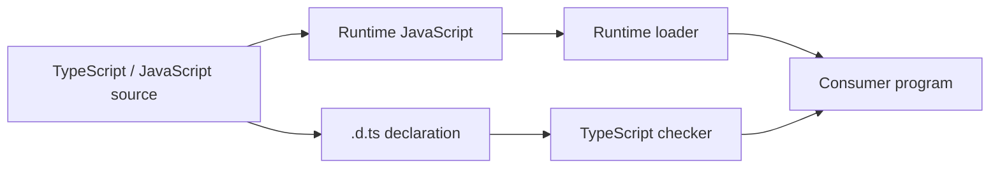

<TLDR>
  <TLDRCell label="what">
    A <Term id="declaration-file">declaration file</Term> uses `.d.ts`, `.d.mts`, or `.d.cts` to describe the public types of existing JavaScript without providing its runtime implementation.
  </TLDRCell>
  <TLDRCell label="trap">
    The compiler trusts declarations, so a file can type-check even when a function is missing, its export style differs, or its return type is wrong.
  </TLDRCell>
  <TLDRCell label="fix">
    Map each declaration to a real export, generate types from typed source when possible, and lock the public contract with positive and negative type tests.
  </TLDRCell>
</TLDR>

## What it is and why it exists

A declaration file is the static shape of a JavaScript API. It records the functions, classes, constants, and types exported by a module, or the global names supplied by a host. TypeScript reads this information while checking consumers but does not turn declarations into values when it emits JavaScript; this is <Term id="type-erasure">type erasure</Term>.

That boundary matters. `declare function charge(): Receipt` means "this function exists elsewhere at runtime," not "generate this function." A declaration can give the editor and compiler an accurate view of an API. A wrong declaration can also give an entire project false confidence.

You meet declarations in three common places. A JavaScript package can bundle its own types, an `@types` package can cover a package without built-in types, and an application can keep local declarations for host-injected globals or non-code resources. If a library is already written in TypeScript, you should usually generate its public declarations instead of maintaining a second handwritten API.

Declaration files do not validate network responses, configuration files, or arbitrary JavaScript values. External data should still enter as `unknown`, pass runtime validation, and only then receive a domain type. Declarations answer "how does the checker understand this existing API?", not "is this runtime value trustworthy?"

As a consumer, your job is to find declarations that match the dependency version and confirm what resolution selected. As a library author, your job is to publish a contract reachable through consumer paths and consistent with every runtime entry point.

## How it works

TypeScript works with two related graphs: the runtime module graph decides what JavaScript loads, while the type graph decides what the checker sees. A declaration file belongs to the type graph but must faithfully describe the runtime graph. A mismatch in export names, default exports, calling conventions, or module format can make checked code fail when it loads or calls the API.



Both paths in the diagram must meet at the consumer. The checker finding `formatInvoice` does not prove that the runtime loader can get that name from the same module. Test declarations with `tsc` and at least one real import.

### The boundary between declarations and implementations

An <Term id="ambient-declaration">ambient declaration</Term> tells the checker that another piece of code supplies an entity. A variable after `declare` cannot have a normal initializer, and a declared function cannot have a body; either would cross the "describe, don't implement" boundary. Top-level declarations in a `.d.ts` file are already in an ambient context, so many positions do not need another `declare` modifier.

A declaration should describe the public surface that consumers can observe, not copy implementation details. Unexported helpers, cache layouts, and private locals are not part of the contract. Whether a returned object is readonly, an argument is optional, or a function can return `undefined` does change how callers use the API and must be represented accurately.

The types cannot be more precise than the runtime facts. If JavaScript accepts a string or a number, the declaration cannot claim it accepts only strings; if lookup can fail, the return type cannot omit `undefined`. A broad `any` loses errors, while a signature that is too narrow rejects valid calls. Both are declaration bugs.

### Scripts, modules, and global scope

If a declaration file has no top-level `import` or `export`, its top-level names enter global scope. That fits a legacy API genuinely installed by a script tag or host, but it can pollute every file in an application. Modern packages should normally use module declaration files and export public members explicitly at the top level.

Any top-level `import` or `export` makes the file a module. To add a global name from a module file, use `export {}` to establish the module boundary, then put the addition inside `declare global {}`. The structure makes intentional global changes visible.

The string form `declare module "package-name"` can describe an external module that has no types. Similar syntax inside a file that already resolves a module can perform module augmentation; augmentation extends an existing declaration and cannot replace a default export or create a runtime member. The related topic covers the full augmentation rules.

Declaration merging applies only to declaration kinds that permit it. Two `interface` declarations with the same name in one scope can merge members, but `type` aliases do not. Do not assemble a package API through accidental global merging; keep file and module ownership explicit.

### How the compiler finds declarations

For a relative import, TypeScript follows the host lookup modeled by the active `moduleResolution` mode, then uses extension substitution to look for a `.ts` file or the corresponding declaration. If the runtime target is `./invoice-tools.js`, for example, the checker can read `invoice-tools.d.ts` next to it. This does not rewrite the module specifier sent to the runtime.

For a package import, `package.json` fields such as `exports` and `types`, the module format, and the resolution mode all affect the result. When `exports` is not being read, `types` provides an explicit declaration entry for the package root. When `exports` is present, each public subpath should also map to types that agree with its runtime target. A root `index.d.ts` is not enough if exported subpaths have been omitted.

Visible packages under `node_modules/@types` can supply global types and package declarations. `compilerOptions.types` limits which `@types` packages enter global scope, while `typeRoots` changes the directories treated as type package roots; neither is a general-purpose path alias. When resolution is unclear, use `tsc --traceResolution` to inspect actual candidates instead of guessing from a fixed list.

Successful resolution only proves that the checker found a declaration. It does not prove that the declaration matches the current JavaScript version or that the runtime can load the same entry. Package upgrades, conditional exports, and dual ESM/CommonJS releases need contract tests.

## Examples

The next four examples follow one workflow: add types to an existing JavaScript module, declare a real host global, generate declarations from TypeScript source, and prevent contract drift with type tests. The implementation and declaration files belong to one small example workspace.

### Handwriting types for a JavaScript module

The legacy module already exports `currency` and `formatInvoice` at runtime. Its implementation remains JavaScript; the declaration file records only the shape visible to callers.

<Depth level="quick">

```javascript title="invoice-tools.js"
export const currency = "EUR";

export function formatInvoice(invoice) {
  const total = Number(invoice.total);

  if (!Number.isFinite(total)) {
    throw new TypeError("invoice.total must be finite");
  }

  return `${invoice.id}: ${currency} ${total.toFixed(2)}`;
}
```

```typescript title="invoice-tools.d.ts"
export interface Invoice {
  readonly id: string;
  readonly total: number;
}

export declare const currency: "EUR";

export declare function formatInvoice(
  invoice: Invoice,
): string;
```

```typescript run title="invoice-consumer.ts"
import {
  currency,
  formatInvoice,
  type Invoice,
} from "./invoice-tools.js";

const invoice: Invoice = { id: "INV-104", total: 58 };

console.log(formatInvoice(invoice));
console.log(`settlement currency: ${currency}`);
```

```text
INV-104: EUR 58.00
settlement currency: EUR
```

</Depth>

The declaration and JavaScript use exactly the same export names, and the consumer keeps the `.js` module specifier. `Invoice` exists only in the type layer, so `import type` says so directly. `currency` is a runtime value and cannot be imported as a type only.

The literal type `"EUR"` comes from a real constant, not the declaration author's wish. If the implementation later allows configurable currencies, the declaration needs a wider type. Conversely, adding a function to the declaration does not make JavaScript export it at runtime.

### Declaring a host-provided global

Some build systems provide build information before an application starts. A local declaration teaches application code its shape, but the example still installs the runtime value explicitly so the declaration cannot be mistaken for an implementation.

```typescript title="globals.d.ts"
export {};

declare global {
  var BUILD_INFO: Readonly<{
    version: string;
    channel: "stable" | "canary";
    builtAt: string;
  }>;
}
```

```typescript run title="build-info.ts"
/// <reference path="./globals.d.ts" />

globalThis.BUILD_INFO = Object.freeze({
  version: "6.2.0",
  channel: "stable",
  builtAt: "2026-09-04T08:30:00Z",
});

const label = `${BUILD_INFO.version} (${BUILD_INFO.channel})`;
console.log(label);
console.log(BUILD_INFO.builtAt);
```

```text
6.2.0 (stable)
2026-09-04T08:30:00Z
```

`export {}` stops helper names other than `Readonly` from leaking into global scope, while `declare global` explicitly opens the part being extended. This example uses `var` because a global `var` declaration corresponds to a property on `globalThis`; that is not a recommendation to introduce mutable global state throughout an application.

Test environments, server rendering, and command-line scripts must install the same value or check for it during startup. The declaration cannot replace that work. If the data can come from an ordinary module import, a module is usually easier to trace and test than a global name.

### Generating declarations from typed source

When library source is already TypeScript, compiler output avoids a second handwritten API. This module has a public interface, constant, and function; first run the behavior, then inspect declaration output separately.

```typescript run title="inventory.ts"
export interface InventoryItem {
  readonly sku: string;
  readonly available: number;
}

export const inventoryVersion = 3 as const;

export function stockLabel(item: InventoryItem): string {
  const state = item.available > 0 ? "in stock" : "back order";
  return `${item.sku}: ${state}`;
}

const sample: InventoryItem = {
  sku: "KB-87",
  available: 12,
};

console.log(stockLabel(sample));
```

```text
KB-87: in stock
```

```bash
npx tsc inventory.ts \
  --declaration --emitDeclarationOnly \
  --module nodenext --moduleResolution nodenext \
  --target es2022 --outDir dist
sed -n '1,80p' dist/inventory.d.ts
```

```text
export interface InventoryItem {
    readonly sku: string;
    readonly available: number;
}
export declare const inventoryVersion: 3;
export declare function stockLabel(item: InventoryItem): string;
```

`declaration` enables <Term id="declaration-emit">declaration emit</Term>, while `emitDeclarationOnly` suppresses JavaScript output. This pair fits a build where another tool transpiles JavaScript; it is wrong if `tsc` is also responsible for producing the runtime code.

The generated file keeps public signatures and drops the function body and sample call. `inventoryVersion` retains the literal `3` because `as const` fixes the public value in source. Before each release, check that the generated artifact enters the package; a declaration generated locally can still be excluded by `.gitignore` or a package file allowlist.

### Locking the contract with type tests

Runtime tests prove JavaScript behavior for a few inputs. Type tests must also prove that valid calls are accepted and invalid calls are rejected. `@ts-expect-error` is better than `@ts-ignore` for negative cases because the test fails if the expected diagnostic disappears.

```typescript run title="declaration-contract.test.ts"
import {
  formatInvoice,
  type Invoice,
} from "./invoice-tools.js";

const valid: Invoice = { id: "INV-105", total: 21.5 };

if (false) {
  // @ts-expect-error total must be a number.
  formatInvoice({ id: "INV-106", total: "21.5" });

  // @ts-expect-error id is required.
  formatInvoice({ total: 21.5 });
}

console.log(formatInvoice(valid));
```

```text
INV-105: EUR 21.50
```

Run this file through `tsc --noEmit` before executing its success path. Running only with `tsx` is insufficient because it transpiles and executes the file without replacing full type checking. Tests should also import from the installed package entry instead of bypassing `exports` and reaching into source.

Negative cases should represent the real contract, not arbitrary mistakes added to inflate a count. If a package supports several subpaths or two module formats, every public entry needs at least one successful import. Overloads, generic inference, and optional properties that often drift need focused cases of their own.

## Pitfalls

> [!PITFALL]
> A declaration is more precise than its implementation, so the project looks type-safe while runtime code returns another shape.

A handwritten `.d.ts` does not stay synchronized with JavaScript. **Fix:** Generate it from published source when possible. If it must be handwritten, run real import tests and compare return values, errors, optional members, and asynchronous behavior with the implementation.

> [!PITFALL]
> A missing module marker puts local helper interfaces into global scope, where they merge unexpectedly with other declarations.

The bug can pass quietly in one project and produce duplicate or widened members under another dependency set. **Fix:** Give module declarations a top-level `export`. For an intentional global addition, use `export {}` with `declare global`, and keep the added surface small.

> [!PITFALL]
> A `declare module "*"` shim or an `any` return type silences diagnostics and disables checking downstream of that dependency.

A shim can be a very short migration seam, but it is not a publishable contract. **Fix:** Start with precise signatures for the smallest API actually used, keep uncertain data as `unknown`, and add members as coverage grows. Do not claim that unchecked API surface has types.

> [!PITFALL]
> A green build with `skipLibCheck` is treated as proof that declarations are correct.

The option skips full checking inside declaration files and is commonly used to cope with duplicated or inconsistent dependency types. It does not compare declarations with JavaScript. **Fix:** Check your library's declarations and type tests separately, and track the upstream issue being skipped instead of replacing a fix with one global switch.

> [!PITFALL]
> A package's type entry and runtime entry use different export shapes or module formats.

The editor may accept a named import that gives Node only a default value, or a typed `exports` subpath may be unreachable at runtime. **Fix:** Test ESM and CommonJS entries from a temporary installation of the packed artifact. Match `.d.mts`, `.d.cts`, or package-typed `.d.ts` files to the corresponding JavaScript format.

## In the AI era

**What generated code gets wrong here**

Models often infer a polished but false `.d.ts` from README examples: a synchronous function becomes a `Promise`, `null` disappears, a named export is invented, or a configurable constant becomes a literal type. They also reach for `declare module "*"`, `any`, and `skipLibCheck` to suppress diagnostics, or add members only to the declaration without implementing them. In dual-format package configs, another common failure sends every `exports` branch to one declaration file despite real differences between ESM and CommonJS exports.

**Ask your AI to check**

- Produce a one-to-one map from every declared export to the packed JavaScript exports, and flag names with no runtime counterpart.
- Run `tsc --traceResolution` against the installed package, then report which JavaScript and declaration files the root and every public subpath resolve to.
- Generate negative type tests for parameter boundaries, optional results, asynchronous errors, and the wrong module format, then execute at least one real import.

**Review checklist**

- Compare every function, constant, class, default export, and named export with an actual runtime value; do not substitute README signatures for source or execution evidence.
- Search for new `any`, `@ts-ignore`, wildcard modules, and `skipLibCheck`, and require a scope and removal condition for each occurrence.
- Check declaration generation, package file lists, conditional exports, and consumer type tests from packed output rather than source paths.

**Prompt vocabulary**

Use the terms `declaration file`, `ambient declaration`, `declaration emit`, `module resolution`, `conditional exports`, `module augmentation`, `type-only import`, `positive type test`, and `negative type test`. Ask the AI to report "type-checks" and "imports successfully at runtime" separately; "add types to this library" does not identify the package entries the declarations must match.

<Depth level="deep">

## Keeping one contract across published artifacts

### Package entries form a map

Type entries cannot be designed separately from runtime entries. A package with one root can point `types` to a root declaration. A package that exposes subpaths through `exports` must consider both loading and type conditions for each one. A file omitted from `exports` may be unavailable to consumers even when it exists on disk.

The following structure gives the package root separate ESM and CommonJS artifacts, with declaration extensions matching each format. `types` remains an explicit top-level hint, while `exports` defines what resolvers supporting that mechanism can actually see.

```json title="package.json"
{
  "name": "invoice-kit",
  "version": "2.0.0",
  "type": "module",
  "types": "./dist/index.d.ts",
  "exports": {
    ".": {
      "import": {
        "types": "./dist/index.d.mts",
        "default": "./dist/index.mjs"
      },
      "require": {
        "types": "./dist/index.d.cts",
        "default": "./dist/index.cjs"
      }
    }
  },
  "files": ["dist"]
}
```

A correct config does not prove that its files exist. A publish check should create a tarball or temporary installation, then run both imports from outside the package. That catches workspace path aliases, excluded declarations, and casing mistakes that appear only for consumers.

If ESM and CommonJS expose the same API, both declarations can come from one source or a controlled copy, but their extensions still communicate module format. Do not stop after renaming the file; test both consumer modes. Default exports and `export =` are especially prone to false positives under interop options.

### Declaration extensions carry module information

Under Node-style resolution, `.d.mts` always describes an ESM `.mjs` counterpart, and `.d.cts` always describes a CommonJS `.cjs` counterpart. Plain `.d.ts` corresponds to `.js`, and its module format can also depend on the closest package's `type` field. The extension is part of the resolution contract, not an arbitrary naming convention.

This is why copying one `.d.ts` to every build target can fail. ESM export syntax in a declaration is not enough to prove that every context interprets it as ESM; resolution mode and package boundaries participate too. When diagnosing module-format problems, record the consumer config, module specifier, matched `package.json`, and final file paths.

A browser bundler, Node, and a test runner may use different resolution conditions. A library should state which environments it supports and verify them with minimal consumer projects instead of piling on compatibility flags until diagnostics disappear. An application should choose `module` and `moduleResolution` settings that model its real host.

### Generated declarations still need API review

Generating from source removes much spelling and member drift, but it does not automatically create a good public API. An inferred return type can expose an internal class, an exported function can mention a type without a stable public name, and a constant can be inferred more narrowly than the compatibility policy allows. Review generated diffs like JavaScript artifacts.

TypeScript source uses `declaration: true` to produce types. JavaScript source can also combine `allowJs`, JSDoc, `declaration`, and `emitDeclarationOnly`, but the output is only as accurate as the JSDoc. In either source language, unexported implementation statements do not become callable implementations in the declaration.

Large builds may use toolchains that support isolated declaration generation, but TypeScript consumers still need to verify the published contract. Faster tooling does not make a signature correct. If generators disagree, reduce the case to one public declaration with a stated input and expected output instead of patching artifacts by hand during release.

### Type tests verify acceptance and rejection

A positive type test proves that intended use compiles and that inference has not widened unexpectedly. A negative test uses `@ts-expect-error` to record a call that must be rejected; if a later declaration accepts it, the compiler reports the now-unused directive. Together, the two kinds define the compatibility boundary.

Tests should not import only from the source directory. Consumers use package roots, subpaths, and conditional exports, so declaration tests should take those paths too. If a package claims support for several TypeScript versions, run the corresponding version matrix; declarations using newer syntax can fail as soon as an older compiler reads them.

Type tests cannot notice that an implementation returned the wrong data, so runtime contract tests are still required. A useful regression test sends one public call through `tsc`, loads the packed JavaScript, and asserts its result. The checks share a scenario but cover different failure surfaces.

### Choosing built-in types, `@types`, or local declarations

Before adding types for a dependency, check whether the package already bundles declarations. If it does, installing a matching `@types` package is usually wrong; two independently owned contracts can duplicate or mismatch members. If the package has no types, look for an `@types` package compatible with the runtime major version.

Missing types in a public ecosystem can go to DefinitelyTyped. Local or private APIs fit an application's own declaration directory. In either location, declaration versions should follow the JavaScript contract they describe, not only the consumer's compiler version.

A temporary local declaration should state its coverage and removal condition. It can accurately cover the two functions the project uses without pretending to model an entire library. When upstream publishes official types, compare them through type tests before deleting the local patch; leaving both sources in place lets declaration merging obscure ownership.

</Depth>

<Checkpoint id="typescript/declaration-files" />

## Further reading

- [TypeScript Handbook: declaration files introduction](https://www.typescriptlang.org/docs/handbook/declaration-files/introduction.html)
- [TypeScript Handbook: module declaration template](https://www.typescriptlang.org/docs/handbook/declaration-files/templates/module-d-ts.html)
- [TypeScript Handbook: global declaration template](https://www.typescriptlang.org/docs/handbook/declaration-files/templates/global-d-ts.html)
- [TypeScript Handbook: module resolution reference](https://www.typescriptlang.org/docs/handbook/modules/reference.html)
- [TypeScript TSConfig: `declaration`](https://www.typescriptlang.org/tsconfig/declaration.html)
