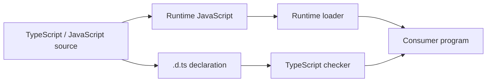

<TLDR>
  <TLDRCell label="what">
    <Term id="declaration-file">声明文件（declaration file）</Term>用 `.d.ts`、`.d.mts` 或 `.d.cts` 描述已有 JavaScript 的公开类型，不提供运行时实现。
  </TLDRCell>
  <TLDRCell label="trap">
    编译器会相信声明；即使函数不存在、导出方式不符或返回值写错，声明本身仍可能通过类型检查。
  </TLDRCell>
  <TLDRCell label="fix">
    让声明逐项映射真实导出，优先从类型化源码生成，并用正向与负向类型测试锁定公开契约。
  </TLDRCell>
</TLDR>

## 是什么，为什么存在

声明文件是 JavaScript API 的静态外形。它记录模块导出的函数、类、常量和类型，或者记录宿主环境提供的全局名称。TypeScript 检查使用方时读取这些信息，但输出 JavaScript 时不会把声明变成值；这属于<Term id="type-erasure">类型擦除（type erasure）</Term>。

这条边界很重要。`declare function charge(): Receipt` 的意思是“运行时别处已有这个函数”，而不是“请生成这个函数”。声明可以让编辑器补全和编译器检查变得准确，也可以用一份写错的契约让整个项目产生错误信心。

你会在三类位置遇到声明文件。JavaScript 包可以随包发布自己的类型；没有内置类型的包可以由 `@types` 包补充；应用也可以用本地声明描述构建工具注入的全局值或非代码资源。用 TypeScript 写库时，通常不应手写整份公开声明，而应让编译器从源码生成。

声明文件不验证网络响应、配置文件或任意 JavaScript 值。外部数据仍应先以 `unknown` 进入运行时验证，再获得领域类型。声明解决的是“检查器如何理解现有 API”，不是“这个值在运行时是否可信”。

对使用方来说，目标是找到与依赖版本匹配的声明并确认解析结果。对库作者来说，目标是发布一份可由消费者路径访问、并且与每个运行时入口一致的契约。

## 工作原理

TypeScript 同时处理两个相互关联的图：运行时模块图决定 JavaScript 会加载什么，类型图决定检查器看到什么。声明文件位于类型图中，却必须忠实描述运行时图。导出名称、默认导出、调用方式和模块格式中任何一项不一致，都会让编译通过的代码在加载或调用时失败。



图中的两条路径必须在使用方汇合。检查器找到 `formatInvoice` 并不证明运行时加载器也能从同一模块取得这个名称。测试声明时既要运行 `tsc`，也要执行至少一个真实导入。

### 声明与实现的边界

<Term id="ambient-declaration">环境声明（ambient declaration）</Term>告诉检查器某个实体由其他代码提供。`declare` 后的变量不能带普通初始化器，函数不能带函数体，因为这两种写法都会越过“只描述、不实现”的边界。在 `.d.ts` 文件中，顶层声明本身就处于环境上下文，许多位置无需重复写 `declare`。

声明应描述使用方能够观察到的公开表面，而不是复制实现细节。未导出的辅助函数、缓存结构和私有局部变量不属于契约。返回对象是否只读、参数能否省略、函数是否会返回 `undefined`，则会改变使用方式，必须准确表达。

类型精确度不能高于运行时事实。如果 JavaScript 接受字符串或数字，就不能只声明字符串；如果函数可能找不到结果，就不能去掉 `undefined`。过宽的 `any` 会丢掉错误，过窄的签名则会拒绝合法调用，两者都是声明缺陷。

### 脚本、模块与全局作用域

声明文件没有顶层 `import` 或 `export` 时，顶层名称会进入全局作用域。这适合确实由脚本标签或宿主注入的传统全局 API，却很容易污染应用中每个文件的名称空间。现代包通常应该是模块声明文件，并从顶层显式导出公开成员。

任意顶层 `import` 或 `export` 都会让文件成为模块。需要从模块文件补充全局名称时，先用 `export {}` 建立模块边界，再把补充项放入 `declare global {}`。这样可以看出哪些内容有意进入全局范围。

字符串形式的 `declare module "package-name"` 可以描述没有类型的外部模块。在已经解析到某个模块的文件中，相似语法也可用于模块增强；后者只扩展现有声明，不能替换默认导出或凭空实现运行时成员。模块增强的完整规则属于相邻主题。

声明合并只发生在允许合并的声明种类上。把两个同名 `interface` 放进同一作用域可能合并成员，但 `type` 别名不会这样做。不要依赖偶然的全局合并来拼接包 API；让文件与模块所有权保持明确。

### 编译器如何找到声明

对相对导入，TypeScript 会按照当前 `moduleResolution` 模式模拟宿主的查找方式，再通过扩展名替换寻找 `.ts` 或对应声明文件。例如，运行时目标是 `./invoice-tools.js` 时，检查器可以读取同位置的 `invoice-tools.d.ts`。这不会改变发给运行时的模块说明符。

对包导入，`package.json` 的 `exports`、`types`、模块格式和解析模式共同决定结果。没有读取 `exports` 时，包根的 `types` 字段是明确的声明入口；存在 `exports` 时，每个公开子路径也应映射到与其运行时目标相符的类型。不能只给包根加一份 `index.d.ts`，却遗漏已经导出的子路径。

可见的 `node_modules/@types` 包可以提供全局类型和包声明。`compilerOptions.types` 限制哪些 `@types` 包进入全局作用域，`typeRoots` 则改变作为类型包根目录的位置；两者都不应该被当成普通路径别名。遇到解析问题时，用 `tsc --traceResolution` 查看实际候选路径，不要凭一份固定“查找顺序”猜测。

解析成功只说明检查器找到了一份声明。它不说明该声明与当前 JavaScript 版本匹配，也不说明运行时能加载同一入口。包升级、条件导出和双 ESM／CommonJS 发布都需要契约测试覆盖。

## 示例

下面四个示例沿着同一条工作流展开：先给现有 JavaScript 模块补类型，再声明一个真实全局值，然后从 TypeScript 源码生成声明，最后用类型测试防止契约漂移。示例中的实现与声明是同一个小型工作区内的文件。

### 为 JavaScript 模块手写声明

旧模块已经在运行时导出 `currency` 和 `formatInvoice`。实现保留在 JavaScript 中；声明文件只记录调用者可见的形状。

<Depth level="quick">

```javascript title="invoice-tools.js"
export const currency = "EUR";

export function formatInvoice(invoice) {
  const total = Number(invoice.total);

  if (!Number.isFinite(total)) {
    throw new TypeError("invoice.total must be finite");
  }

  return `${invoice.id}: ${currency} ${total.toFixed(2)}`;
}
```

```typescript title="invoice-tools.d.ts"
export interface Invoice {
  readonly id: string;
  readonly total: number;
}

export declare const currency: "EUR";

export declare function formatInvoice(
  invoice: Invoice,
): string;
```

```typescript run title="invoice-consumer.ts"
import {
  currency,
  formatInvoice,
  type Invoice,
} from "./invoice-tools.js";

const invoice: Invoice = { id: "INV-104", total: 58 };

console.log(formatInvoice(invoice));
console.log(`settlement currency: ${currency}`);
```

```text
INV-104: EUR 58.00
settlement currency: EUR
```

</Depth>

声明中的导出名称与 JavaScript 完全一致，使用方也保留 `.js` 模块说明符。`Invoice` 只存在于类型层，因此用 `import type` 表达这一点。`currency` 则是运行时值，不能只按类型导入。

字面量类型 `"EUR"` 来自真实常量，而不是作者的愿望。如果实现以后允许配置货币，声明也应改为更宽的类型。反过来，声明增加一个 JavaScript 没有导出的函数，也不会让该函数在运行时出现。

### 声明宿主提供的全局值

有些构建系统会在应用启动前提供构建信息。本地声明让业务代码知道其形状，但示例仍显式安装运行时值，避免把声明误当成实现。

```typescript title="globals.d.ts"
export {};

declare global {
  var BUILD_INFO: Readonly<{
    version: string;
    channel: "stable" | "canary";
    builtAt: string;
  }>;
}
```

```typescript run title="build-info.ts"
/// <reference path="./globals.d.ts" />

globalThis.BUILD_INFO = Object.freeze({
  version: "6.2.0",
  channel: "stable",
  builtAt: "2026-09-04T08:30:00Z",
});

const label = `${BUILD_INFO.version} (${BUILD_INFO.channel})`;
console.log(label);
console.log(BUILD_INFO.builtAt);
```

```text
6.2.0 (stable)
2026-09-04T08:30:00Z
```

`export {}` 阻止 `Readonly` 之外的辅助名称意外进入全局范围，`declare global` 则明确打开需要补充的部分。这里使用 `var` 是因为全局 `var` 声明会对应 `globalThis` 的属性；这不是鼓励在应用逻辑中随意使用可变全局状态。

测试环境、服务端渲染和命令行脚本也必须安装同样的值，或者在启动时检查它是否存在。声明不能替代这一步。若该数据可以通过普通模块导入，模块通常比全局名称更容易追踪和测试。

### 从类型化源码生成声明

库源码已经是 TypeScript 时，让编译器生成声明可以减少重复维护。下面的模块同时包含公开接口、常量和函数；运行代码验证行为，随后单独检查声明输出。

```typescript run title="inventory.ts"
export interface InventoryItem {
  readonly sku: string;
  readonly available: number;
}

export const inventoryVersion = 3 as const;

export function stockLabel(item: InventoryItem): string {
  const state = item.available > 0 ? "in stock" : "back order";
  return `${item.sku}: ${state}`;
}

const sample: InventoryItem = {
  sku: "KB-87",
  available: 12,
};

console.log(stockLabel(sample));
```

```text
KB-87: in stock
```

```bash
npx tsc inventory.ts \
  --declaration --emitDeclarationOnly \
  --module nodenext --moduleResolution nodenext \
  --target es2022 --outDir dist
sed -n '1,80p' dist/inventory.d.ts
```

```text
export interface InventoryItem {
    readonly sku: string;
    readonly available: number;
}
export declare const inventoryVersion: 3;
export declare function stockLabel(item: InventoryItem): string;
```

`declaration` 启用<Term id="declaration-emit">声明输出（declaration emit）</Term>，`emitDeclarationOnly` 则不输出 JavaScript。若另一个工具负责转译 JavaScript，这组配置很合适；若 `tsc` 同时负责运行时代码，就不能只输出声明。

生成结果保留公开签名，丢掉函数体和示例调用。`inventoryVersion` 保留字面量 `3`，因为源码用 `as const` 固定了公开值。每次发布前都应检查生成产物是否包含在包中，不能只在本地生成后被 `.gitignore` 或打包白名单漏掉。

### 用类型测试锁定契约

运行测试只能证明 JavaScript 对少量输入的行为，类型测试还要证明合法调用被接受、非法调用被拒绝。`@ts-expect-error` 比 `@ts-ignore` 更适合负向用例，因为预期错误消失时，测试本身会失败。

```typescript run title="declaration-contract.test.ts"
import {
  formatInvoice,
  type Invoice,
} from "./invoice-tools.js";

const valid: Invoice = { id: "INV-105", total: 21.5 };

if (false) {
  // @ts-expect-error total 必须是 number。
  formatInvoice({ id: "INV-106", total: "21.5" });

  // @ts-expect-error id 是必填字段。
  formatInvoice({ total: 21.5 });
}

console.log(formatInvoice(valid));
```

```text
INV-105: EUR 21.50
```

这个文件需要先用 `tsc --noEmit` 检查，再执行成功路径。只用 `tsx` 运行并不足够，因为它转译并执行代码，却不替代完整类型检查。测试还应从安装后的包入口导入，而不是绕过 `exports` 直接读取源码。

负向测试应对应真实契约，不要为了提高数量而罗列随意错误。包支持多个子路径或两种模块格式时，每个公开入口至少需要一次成功导入；容易漂移的重载、泛型推断和可选属性则需要针对性用例。

## 陷阱

> [!PITFALL]
> 声明比实现更精确，看起来类型安全，实际运行时却返回另一种形状。

手写 `.d.ts` 不会与 JavaScript 自动同步。**修复方法：** 能生成就从发布源码生成；必须手写时，同时运行真实导入测试，并把返回值、异常、可选成员和异步行为逐项与实现对照。

> [!PITFALL]
> 忘记模块标记会把本地辅助接口放进全局作用域，并与其他声明发生意外合并。

这种错误在单个项目中可能安静通过，到另一个依赖组合中才出现重复或被扩宽的成员。**修复方法：** 模块型声明使用顶层 `export`；确实需要补充全局时使用 `export {}` 加 `declare global`，并保持补充面最小。

> [!PITFALL]
> 用 `declare module "*"` 或返回 `any` 的占位声明消除报错，会让该依赖之后的类型检查失效。

占位声明适合极短的迁移接缝，不适合发布契约。**修复方法：** 从实际使用的最小 API 开始写精确签名，让未知数据保持 `unknown`，再随着覆盖面扩大补充成员；不要声称尚未检查的 API 已有类型。

> [!PITFALL]
> `skipLibCheck` 让构建变绿，就被当成声明正确的证据。

该选项跳过声明文件内部的完整检查，主要用于处理依赖图中的重复或不一致类型；它不会验证声明与 JavaScript 是否一致。**修复方法：** 发布库时单独检查自己的声明和类型测试，并追踪被跳过的上游问题，不能用一个全局开关替代修复。

> [!PITFALL]
> 包的声明入口与运行时入口使用不同导出形状或不同模块格式。

典型结果是编辑器接受命名导入，Node 却只得到默认值，或者某个 `exports` 子路径在检查时存在、运行时不可达。**修复方法：** 从打包后的临时安装目录分别测试 ESM 和 CommonJS 入口；让 `.d.mts`、`.d.cts` 或受包 `type` 约束的 `.d.ts` 与对应 JavaScript 格式一致。

## AI 时代

**生成代码在这里常犯的错**

模型常根据 README 示例猜出一份漂亮但虚假的 `.d.ts`：把同步函数写成 `Promise`、漏掉 `null`、发明命名导出，或者把可配置常量写成字面量。它还会用 `declare module "*"`、`any` 和 `skipLibCheck` 压掉诊断，或只修改声明而不实现新增成员。生成双格式包配置时，另一个高频错误是所有 `exports` 分支都指向同一份声明，忽略 ESM 与 CommonJS 的导出差异。

**让 AI 检查**

- 列出每个声明导出与打包后 JavaScript 导出的逐项映射，并指出找不到运行时对应项的名称。
- 从安装后的包运行 `tsc --traceResolution`，说明包根和每个公开子路径最终解析到哪份 JavaScript 与声明文件。
- 为参数边界、可选返回值、异步错误和错误模块格式生成负向类型测试，再执行至少一个真实导入。

**审查清单**

- 对照真实运行时值审查每个函数、常量、类、默认导出和命名导出，不以 README 签名代替源码或执行结果。
- 搜索新出现的 `any`、`@ts-ignore`、通配符模块和 `skipLibCheck`，要求每处都有范围与移除条件。
- 从打包产物而非源码路径检查声明生成、文件清单、条件导出和消费者类型测试。

**提示词词汇**

使用准确术语：`declaration file`（声明文件）、`ambient declaration`（环境声明）、`declaration emit`（声明输出）、`module resolution`（模块解析）、`conditional exports`（条件导出）、`module augmentation`（模块增强）、`type-only import`（仅类型导入）、`positive type test`（正向类型测试）和 `negative type test`（负向类型测试）。要求 AI 分开报告“类型检查通过”和“运行时导入成功”；“给这个库加类型”没有说明声明必须对应哪个发布入口。

<Depth level="deep">

## 让发布产物保持同一份契约

### 包入口是一张映射表

类型入口不能脱离运行时入口单独设计。包只有一个根入口时，`types` 可以指向根声明；包使用 `exports` 公开子路径时，每个子路径都要同时考虑加载条件和类型条件。未出现在 `exports` 中的文件，即使物理上存在，也可能不允许消费者导入。

下面的结构为包根提供 ESM 和 CommonJS 两套产物，并让对应声明采用不同扩展名。`types` 保留明确的顶层提示，而 `exports` 决定支持该机制的解析器实际可见的入口。

```json title="package.json"
{
  "name": "invoice-kit",
  "version": "2.0.0",
  "type": "module",
  "types": "./dist/index.d.ts",
  "exports": {
    ".": {
      "import": {
        "types": "./dist/index.d.mts",
        "default": "./dist/index.mjs"
      },
      "require": {
        "types": "./dist/index.d.cts",
        "default": "./dist/index.cjs"
      }
    }
  },
  "files": ["dist"]
}
```

配置正确仍不代表文件存在。发布检查应先生成 tarball 或临时安装包，再从包外部执行两种导入。这样才能发现工作区路径别名、未打包声明和错误大小写等只在消费端出现的问题。

若 ESM 与 CommonJS 暴露的 API 确实相同，两份声明可以由同一源码生成或经过受控复制，但扩展名仍表达模块格式。不要只把文件改名而跳过两种消费者测试。默认导出与 `export =` 尤其容易在互操作选项下产生假阳性。

### 声明扩展名携带模块信息

在 Node 风格解析中，`.d.mts` 总是描述 ESM 对应的 `.mjs`，`.d.cts` 总是描述 CommonJS 对应的 `.cjs`。普通 `.d.ts` 对应 `.js`，其模块格式还会受最近的 `package.json` 中 `type` 字段影响。扩展名是解析契约的一部分，不是任意命名习惯。

这也是复制一份 `.d.ts` 给所有构建目标可能失败的原因。声明使用 ESM 导出语法，不足以证明它会在所有上下文按 ESM 解释；解析模式和包边界也参与判断。诊断模块格式问题时，应记录消费者配置、模块说明符、命中的 `package.json` 和最终文件路径。

浏览器打包器、Node 和测试运行器可能使用不同解析条件。库应声明自己支持哪些环境，并用对应的最小消费者项目验证，而不是堆叠兼容选项直到诊断消失。应用项目则应选择与真实宿主相符的 `module` 和 `moduleResolution`。

### 生成声明仍需要 API 审查

从源码生成能消除大量拼写与成员漂移，却不会自动得到理想的公共 API。推断出的返回类型可能泄漏内部类，导出的函数可能引用没有稳定名称的类型，常量也可能被推断得比兼容性策略更窄。生成后的差异应像 JavaScript 产物一样接受代码审查。

TypeScript 源码使用 `declaration: true` 生成类型。JavaScript 源码也可以结合 `allowJs`、JSDoc、`declaration` 和 `emitDeclarationOnly` 生成声明，但输出质量取决于 JSDoc 是否准确。无论输入语言是什么，未导出的实现语句不会作为可调用实现出现在声明中。

大型构建可以采用支持隔离声明生成的工具链，但发布契约仍须由 TypeScript 消费者验证。工具更快不等于签名正确。若不同生成器输出不一致，应先缩小到一个公开声明的输入与期望结果，而不是在发布阶段手工修补产物。

### 类型测试验证接受与拒绝

正向类型测试证明预期用法能编译，并检查推断结果没有意外变宽。负向测试用 `@ts-expect-error` 记录必须拒绝的调用；如果声明后来宽到接受该调用，编译器会报告这条指令没有对应错误。两者一起定义兼容性边界。

测试不应只从源码目录导入。消费者真正使用包根、子路径和条件导出，声明测试也应走这些路径。若包声称支持多个 TypeScript 版本，还要在相应版本矩阵中运行测试；使用较新语法的声明可能让旧编译器在读取文件阶段就失败。

类型测试不能发现实现返回了错误数据，因此还需要运行时契约测试。一条实用的回归测试会让同一个公开调用先通过 `tsc`，再加载发布后的 JavaScript 并断言结果。两条检查共享场景，却验证不同失败面。

### 选择内置类型、`@types` 或本地声明

使用依赖前，先查看包是否已经发布自己的声明。若有，通常不应再安装同名 `@types` 包；两套所有者不同的声明容易重复或版本错位。包没有内置类型时，再查找与运行时主版本匹配的 `@types` 包。

公开生态中的缺失类型可以贡献给 DefinitelyTyped，本地或私有 API 则适合保留在应用自己的声明目录。无论放在哪里，声明版本都应跟随它描述的 JavaScript 契约，而不是只跟随使用方的编译器版本。

临时本地声明要标出覆盖范围和删除条件。它可以先描述项目实际使用的两个函数，而不必虚构完整库；当上游发布正式类型后，应通过类型测试比较差异，再移除本地补丁。长期叠加两个来源只会让声明合并掩盖所有权。

</Depth>

<Checkpoint id="typescript/declaration-files" />

## 延伸阅读

- [TypeScript 手册：声明文件简介](https://www.typescriptlang.org/docs/handbook/declaration-files/introduction.html)
- [TypeScript 手册：模块声明模板](https://www.typescriptlang.org/docs/handbook/declaration-files/templates/module-d-ts.html)
- [TypeScript 手册：全局声明模板](https://www.typescriptlang.org/docs/handbook/declaration-files/templates/global-d-ts.html)
- [TypeScript 手册：模块解析参考](https://www.typescriptlang.org/docs/handbook/modules/reference.html)
- [TypeScript TSConfig：`declaration`](https://www.typescriptlang.org/tsconfig/declaration.html)
