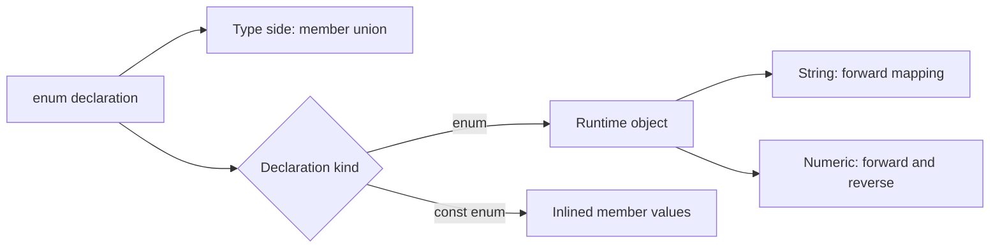

<TLDR>
  <TLDRCell label="what">
    An <Term id="enumeration">enumeration</Term> gives names to a fixed set of members; a regular `enum` is both a type and a runtime object.
  </TLDRCell>
  <TLDRCell label="trap">
    Numeric enums emit reverse mappings, external data does not become a valid member through an assertion, and `const enum` has cross-package inlining risks.
  </TLDRCell>
  <TLDRCell label="fix">
    Validate member values at data boundaries and handle every member exhaustively; compare string literal unions and `as const` objects when you only need JavaScript-shaped values.
  </TLDRCell>
</TLDR>

## What it is and why it exists

A TypeScript `enum` declaration gives stable names to a related set of constants and creates a type with the same name. It fits a closed member set whose names belong to the domain and whose members the program also needs at runtime, such as order states, protocol operation codes, or bit flags.

Enums are one of the few TypeScript type-system features that produce JavaScript. Interfaces and type aliases disappear through <Term id="type-erasure">type erasure</Term>, while a regular enum emits an object. That difference determines whether you can read members, iterate values, or look up a name from a number at runtime.

An enum is not a validator for external data. Network responses, database fields, environment variables, and results from `JSON.parse()` can still contain values outside the set. An external value should receive the enum type only after a runtime check succeeds.

A simple string set does not necessarily need an enum. A string literal union is more direct when the code only needs a closed type; an `as const` object often provides the same shape when it also needs an iterable JavaScript object. Choose from the required runtime representation and calling convention, not from which syntax looks more advanced.

## How it works

### One name on the type and value sides

After `enum OrderStatus { Draft = "DRAFT" }`, `OrderStatus` denotes the allowed member type in a type position and the generated object in an expression. `OrderStatus.Draft` is likewise both a runtime value and an enum member type that participates in narrowing.

Those two namespaces explain the common `keyof typeof` pattern. `typeof OrderStatus` first obtains the enum object's type, and `keyof` then produces a union of member names such as `"Draft" | "Submitted"`. Writing `keyof OrderStatus` instead asks for properties of the enum value type itself, not the member names.

A string enum member must be initialized by a string literal or another string enum member. Its runtime object only has name-to-value properties, so logs and JSON contain meaningful values such as `"DRAFT"`. A bare string with the same text does not automatically gain the enum member type; callers must use the member or return that type after validation.

### Numeric members and reverse mappings

The first uninitialized numeric member starts at `0`, and later uninitialized members increment the preceding constant number. Explicit numbering is safer for external protocols and persisted formats because reordering declarations cannot silently change existing values.

A regular numeric enum emits a <Term id="reverse-mapping">reverse mapping</Term>. The object stores both name-to-number and number-to-name properties, so `ExitCode.InvalidConfig` yields `2`, while `ExitCode[2]` yields `"InvalidConfig"`. String enums do not emit reverse mappings.

Reverse mappings also change enum-object iteration. `Object.keys()` sees numeric keys such as `"2"` alongside names such as `"InvalidConfig"`. Code that needs a member list must filter by the runtime type of keys or values instead of assuming one entry per declaration.

TypeScript 6 rejects a numeric literal that is visibly outside a numeric enum, such as assigning `100` directly to an enum containing only `0` and `1`. A value already widened to `number` remains assignable, however, to support patterns such as bit flags. A numeric enum therefore cannot replace boundary validation either.

### Member types and exhaustiveness

Every literal enum member has its own member type, and the whole enum behaves as a union of those members. Comparing a member drives control-flow narrowing, so each `switch` branch can eliminate the members it has handled.

Assigning the remaining value to `never` in the `default` branch turns the closed set into a checked maintenance contract. Adding a member then produces a compile-time error in a branch that omits it. This guarantee covers only checked values; an invalid value supplied through `any`, an unsafe assertion, or JavaScript can still reach runtime.

TypeScript 6 also creates unique member types for enums with computed members. The computed expressions execute during module initialization, so they can depend on the environment and have side effects. Domain constants should normally use literal initializers so a type declaration does not hide runtime behavior.

### From declaration to checking and output

An enum declaration leads to two different results. The checker uses member types for assignment, comparison, and exhaustiveness, while the emitter produces an object or inline values according to the declaration kind. Runtime validation can inspect only the emitted JavaScript values, not erased type information.



This split also gives you a debugging order. For a type error, inspect member types and narrowing paths; for a runtime enum error, inspect actual output, import shape, and input data. Mixing the layers leads to the mistaken question, “I wrote the type, so why did runtime accept the bad value?”

## Examples

The four examples progress through string members, boundary validation, numeric reverse mappings, and an `as const` alternative. Each runs directly, and the output comes from the local TypeScript toolchain.

### Model closed states with a string enum

A string enum gives logs and serialized data readable runtime values. The `never` check makes state handling evolve with the enum.

<Depth level="quick">

```typescript run title="order_status.ts"
enum OrderStatus {
  Draft = "DRAFT",
  Submitted = "SUBMITTED",
  Approved = "APPROVED",
  Cancelled = "CANCELLED",
}

function nextStep(status: OrderStatus): string {
  switch (status) {
    case OrderStatus.Draft:
      return "submit";
    case OrderStatus.Submitted:
      return "review";
    case OrderStatus.Approved:
      return "fulfill";
    case OrderStatus.Cancelled:
      return "stop";
    default: {
      const unreachable: never = status;
      throw new Error(`Unhandled status: ${unreachable}`);
    }
  }
}

console.log(`${OrderStatus.Draft} -> ${nextStep(OrderStatus.Draft)}`);
console.log(`${OrderStatus.Approved} -> ${nextStep(OrderStatus.Approved)}`);
```

```text
DRAFT -> submit
APPROVED -> fulfill
```

</Depth>

Member names serve source code, while member values enter logs or data formats. Adding a state makes the compiler require an explicit decision in `nextStep()` instead of silently accepting a broad fallback result.

### Validate enum values at a data boundary

External input first remains `unknown`. The runtime set performs validation, and the type predicate narrows the value to `Permission` only in the successful branch.

```typescript run title="parse_permission.ts"
enum Permission {
  Read = "READ",
  Write = "WRITE",
  Admin = "ADMIN",
}

const permissionValues = new Set<string>(Object.values(Permission));

function isPermission(value: unknown): value is Permission {
  return typeof value === "string" && permissionValues.has(value);
}

const inputs: unknown[] = [
  JSON.parse('"READ"'),
  JSON.parse('"OWNER"'),
];

for (const input of inputs) {
  const result = isPermission(input) ? "accepted" : "rejected";
  console.log(`${String(input)}: ${result}`);
}
```

```text
READ: accepted
OWNER: rejected
```

`JSON.parse()` does not read TypeScript types, and `as Permission` would emit no check. Centralizing validation in a boundary function lets internal code treat `Permission` as an established fact.

This predicate checks one scalar member. A real object parser must separately check the container, every required field, and domain constraints; validating one field does not prove the entire object type.

### Iterate a numeric enum correctly

A numeric enum object has properties in both directions. Observe the reverse lookup first, then filter for forward entries whose values are numbers.

```typescript run title="numeric_enum.ts"
enum ExitCode {
  Ok = 0,
  InvalidConfig = 2,
  PermissionDenied = 13,
}

console.log(ExitCode.InvalidConfig);
console.log(ExitCode[2]);

const members = Object.entries(ExitCode).filter(
  (entry): entry is [string, number] => typeof entry[1] === "number",
);

console.log(
  members.map(([name, value]) => `${name}=${value}`).join(", "),
);
```

```text
2
InvalidConfig
Ok=0, InvalidConfig=2, PermissionDenied=13
```

Filtering by value type excludes the string names held by reverse entries. If numeric members share a value, reverse lookup can retain only the last name written to that numeric key, so it cannot recover every alias.

### Keep a JavaScript object with `as const`

A constant object can provide both member values and a derived union. `satisfies` checks that the mapping covers every value while preserving the object's own precise type.

```typescript run title="delivery_state.ts"
const DeliveryState = {
  Queued: "QUEUED",
  InTransit: "IN_TRANSIT",
  Delivered: "DELIVERED",
} as const;

type DeliveryState = typeof DeliveryState[keyof typeof DeliveryState];

const messages = {
  QUEUED: "Parcel queued",
  IN_TRANSIT: "Parcel in transit",
  DELIVERED: "Parcel delivered",
} satisfies Record<DeliveryState, string>;

function messageFor(state: DeliveryState): string {
  return messages[state];
}

console.log(Object.values(DeliveryState).join(" | "));
console.log(messageFor("DELIVERED"));
```

```text
QUEUED | IN_TRANSIT | DELIVERED
Parcel delivered
```

There is no TypeScript-specific enum output here: the `DeliveryState` value is the plain object shown in the source. The derived type accepts a bare literal such as `"DELIVERED"`, unlike the calling convention of a string enum, which requires member identity.

## Pitfalls

### Letting numeric codes depend on declaration order

> [!PITFALL]
> When auto-incremented values enter persisted data or a network protocol, inserting or reordering members changes later codes. Old data remains a valid number but can now mean a different member.

**Fix:** Assign every numeric member explicitly when it crosses a process, version, or persistence boundary, and test the numbers as part of the protocol. Use auto-increment only when values stay within one process and order itself is the contract.

### Treating an assertion as parsing

> [!PITFALL]
> `payload.status as OrderStatus` only suppresses the checker. It neither confirms that the property exists nor checks that its string belongs to the enum; generated code often sends asserted JSON straight into business branches.

**Fix:** Accept `unknown` at the boundary, check the object shape and member value, and only then return a domain object. Do not export a helper that unconditionally converts any string into the enum.

### Iterating a numeric enum directly

> [!PITFALL]
> Calling `Object.keys()` or `Object.values()` directly on a numeric enum returns both directions of the mapping. Select options, validation sets, and metric labels can therefore be duplicated or include the wrong runtime type.

**Fix:** Filter name keys or numeric values for the intended use, and pin the behavior with tests containing non-contiguous and duplicate values. Consider an `as const` object with no reverse mapping when reverse lookup is unnecessary.

### Passing bare strings to a string enum

> [!PITFALL]
> The string `"APPROVED"` has the same text as `OrderStatus.Approved`, but it is not directly assignable as an `OrderStatus` member. Adding an assertion hides an API-design mismatch.

**Fix:** Internal APIs should import and use enum members; native string boundaries such as JSON or HTML should have a validator. If callers are meant to pass literals directly, a string union may be the more natural contract.

### Publishing an ambient `const enum`

> [!PITFALL]
> A consumer can inline values from dependency version A at compile time but load version B at runtime. Ambient `const enum` declarations also conflict with some single-file transpilation and `isolatedModules` workflows.

**Fix:** Do not publish ambient `const enum` declarations as a public contract. A library can expose a regular enum or `as const` object; if it needs internal inlining, it can emit objects with `preserveConstEnums` and remove `const` from published declarations.

## In the AI era

**What generated code gets wrong here:** Models often treat an enum as a purely erased type and then try to inspect an inlined `const enum` at runtime. They also accept JSON through `as SomeEnum`, mistake a numeric enum's bidirectional object for a one-way member table, or generate a `switch` with a broad `default` that returns “unknown” and defeats exhaustiveness when a member is added.

**Ask your AI to check:** Ask it to list whether each enum exists in emitted JavaScript, whether it has a reverse mapping, and which values cross network or persistence boundaries. Then ask it to find every path from `string`, `number`, `any`, or `unknown` into an enum and identify the actual runtime validation on that path. Finally, have it check `const enum` and `isolatedModules` under TypeScript 6 and the project's real transpiler.

**Review checklist:**

- Confirm that every external member value passes runtime validation instead of relying on an assertion or annotation.
- Check that numeric-enum iteration filters reverse entries and that protocol codes all have explicit values.
- Confirm that member handling stays exhaustive through `never`, and audit public declarations for leaked `const enum` types.

**Prompt vocabulary:** Use “runtime enum object,” “numeric reverse mapping,” “enum member type,” “exhaustiveness check,” “ambient const enum,” and “`as const` object.” These terms make the model distinguish the type side, value side, data boundary, and build boundary.

<Depth level="deep">

## Choosing between enums and alternatives

Regular enums, `as const` objects, and literal unions can all model a closed set, but they present different contracts to runtime code and callers. First decide whether you need an object, whether bare literals should be assignable, and how closely the output must follow plain JavaScript.

| Capability | Regular `enum` | `as const` object | Literal union |
| --- | --- | --- | --- |
| Runtime object | Yes | Yes | No |
| Read a value from a member name | Yes | Yes | No |
| Look up a name from a number | Generated automatically | Must be implemented explicitly | Not applicable |
| Accept the same bare string literal | No | Yes | Yes |
| Produce TypeScript-specific JavaScript | Yes | No | No; the type is erased |

When only parameter constraints matter, `type Mode = "read" | "write"` is the smallest and clearest option. When runtime lists, label maps, or a member namespace matter, a constant object adds a real value and can derive its union with `typeof Object[keyof typeof Object]`.

A regular enum fits an API already centered on enum members or code that genuinely relies on numeric reverse mappings. It also keeps members of separate string enums distinct even if their values have the same text, reducing accidental mixing between domains. That constraint is still a TypeScript checker contract, not a security boundary.

Bit flags are a legitimate numeric-enum use. Each base permission should occupy a distinct bit such as `1 << 0`, `1 << 1`, or `1 << 2`, and combinations use bitwise OR. A validator must decide whether to allow unknown bits because a general `number` can enter the numeric enum type and future versions may add bits.

Do not choose from context-free claims such as “better tree-shaking.” Final output depends on the module format, bundler, reference pattern, and minifier. Without measurements on the project's artifact, compare observable semantics and maintenance cost rather than claiming size or speed wins.

## Enum-object keys, values, and mappings

Member names and values serve different interfaces. `keyof typeof Direction` produces the name union, while the `Direction` type describes member values. Use the former for a configuration object keyed by source members and the latter for one keyed by serialized values.

`Record<OrderStatus, string>` can require a label for every string enum value. Adding a member then makes a missing property a type error. With `satisfies`, key coverage is checked while each property value retains its own inferred type.

Conversely, `Record<keyof typeof OrderStatus, string>` requires member names such as `Draft` and `Submitted`. That can fit developer tooling or documentation generation, but it usually should not become the key format for production JSON because renaming a source member changes it.

The static return type of `Object.keys()` is `string[]`; it does not automatically become the member-name union. Asserting the entire result as `(keyof typeof E)[]` is sound only when the runtime object truly has no other enumerable properties. A generic helper should not silently apply that premise to arbitrary objects.

`Object.values()` returns string member values for a string enum, but mixes name strings and member numbers for a numeric enum. A generic `enumValues()` that supports both often depends on fragile heuristics. A small validation set for a concrete enum is usually clearer and easier to test as the protocol evolves.

An enum object is an ordinary mutable JavaScript object; the TypeScript declaration does not freeze it. Application code should not add, delete, or overwrite member properties. If third-party code can reach the object, export a read-only wrapper or a separately frozen constant object instead of expecting type checking to prevent runtime mutation.

A map from names to display text is application data, not part of the enum itself. Merging localized labels, permission descriptions, or state-transition functions into an enum namespace couples domain constants to replaceable policy. A separate `Record` keeps coverage checks, replacement, and tests explicit.

## Version evolution and compatibility

Review an enum change against source, type, and data contracts separately. The same edit can affect each one differently, so a successful TypeScript rebuild is not the entire compatibility test.

- Adding a string member widens the member union and can break exhaustive handlers.
- Renaming a member changes source properties and the name union but can preserve data compatibility when its value stays fixed.
- Changing a string value changes logs, JSON, database fields, and message protocols.
- Inserting an auto-numbered member can change every later implicit code in a numeric enum.
- Before deleting a member, confirm that persisted data and old clients no longer send its value.

A closed protocol owned by one deployment unit usually rejects and records unknown values. In an open protocol evolved by independent services, a client may need to preserve an unknown raw value and degrade its display. An explicit union of known and unknown objects is then more honest than asserting every input as the enum.

Database migrations should also work with serialized values instead of source member names. Teach readers to understand both old and new values, migrate writers next, and remove old values last so a rolling deployment does not leave some instances unable to parse data.

If an old member name must remain as a compatibility alias, string enums can give two names the same value and numeric enums can repeat a code. A caller cannot determine which alias was used from the runtime value. Put deprecation guidance in declarations and migration documentation rather than relying on reverse mapping to reveal old use.

### Deprecation is development-time metadata

JSDoc `@deprecated` on a member can make editors and static analysis tools suggest migration, but it does not change the enum object. The old member remains readable, iterable, and serializable, and runtime parsers do not reject it automatically.

A migration should distinguish “read the old value” from “keep writing the old value.” A common sequence stops new writes first, keeps readers compatible while recording old-value use, and removes the member only after data migration and old clients have retired.

Before deletion, search source references, generated code, configuration, persisted data, and external protocol consumers. Looking only at TypeScript compiler results misses runtime values produced by JavaScript, templates, or historical records.

## A reproducible verification strategy

Enum tests must cover the checker and runtime because neither side substitutes for the other. Static tests prove accepted and rejected assignment relationships; runtime tests prove that emitted objects, parsers, and serialization formats match the protocol.

A minimal verification sequence is:

1. Run `tsc --noEmit` with the target TypeScript version, covering valid calls and invalid calls marked with `@ts-expect-error`.
2. Emit JavaScript with the project's real compiler options and inspect regular enums, numeric reverse mappings, and `const enum` output.
3. Execute forward member access, numeric lookup, and filtered iteration, recording the real output.
4. Feed every valid value, an unknown string, an unknown number, `null`, and wrong container types to boundary parsers.
5. For a published library, build a temporary consumer from the packed artifact and generated `.d.ts`, then test each supported module and transpiler configuration.

An `@ts-expect-error` in a type test is stronger than a silently commented-out invalid example. If a new version stops producing the expected diagnostic, the directive itself fails and forces a maintainer to decide whether the contract was deliberately widened or accidentally changed.

Inspect output produced by the project's actual configuration rather than relying on remembered compiler output. `target`, module mode, `preserveConstEnums`, and downstream transpilers can all affect the final shape. Treating generated files as evidence is the only reliable basis for claims about runtime behavior.

## `const enum` compilation and package boundaries

A <Term id="const-enum">const enum</Term> restricts members to constant expressions that the compiler can evaluate. By default, TypeScript removes the enum declaration and inlines the corresponding value at every member access. Code cannot iterate that enum at runtime because no object exists.

`preserveConstEnums` retains a runtime object much like a regular enum while member use sites can remain inlined. This option lets a library use constant enums in its own build and then remove `const` from generated declarations so downstream projects do not inline the library's values.

The dangerous case separates the dependency version used to compile from the one used to execute. A consumer inlines a number from version A's declaration, but tests or deployment load version B's JavaScript; a changed code can select the wrong branch. Ordinary tests often miss the mismatch because local compilation and execution use the same installation.

`isolatedModules` exposes constructs that single-file transpilers cannot process safely. Referencing an ambient `const enum` member requires the concrete value from another declaration file, which a single-file transpiler does not know, so that combination is rejected. This restriction concerns ambient constants across files; it does not mean every project-local `const enum` fails in every tool.

Whether an application uses `const enum` internally is a build-policy decision. A public library must also account for its consumers' compilers, transpilers, and version-installation behavior. If it cannot control those conditions, runtime values from a regular enum or constant object are safer contracts.

## External data, versions, and ownership

An enum value becomes only a string or number in JSON and carries no declaration identity. Deserialization does not restore that identity, so a parser must validate the primitive against the current protocol set. A string enum can use a `Set<string>`; a numeric enum must enumerate allowed values rather than merely checking `typeof value === "number"`.

Protocol evolution must distinguish “currently unknown” from “always invalid.” If a client reads an open protocol where a newer server may add members, the model should include an explicit unknown branch, such as an object union preserving the raw string, rather than pretending the enum is closed. Internal state owned by one release unit can stay closed and let exhaustiveness drive upgrades.

Enum member names and serialized values are separate contracts. Renaming `Approved` while keeping `"APPROVED"` leaves wire data unchanged but changes `keyof typeof OrderStatus` and source calls. Changing the string value or numeric code alters the data contract and requires a migration and compatibility policy.

Duplicate numeric values are legal, but the reverse mapping has only one property for each numeric key. The later member overwrites the earlier name, so reverse lookup cannot prove the original alias. If several names intentionally represent one protocol value, model that alias relationship explicitly instead of relying on object-assignment order.

Computed members run during module evaluation. An initializer that reads time, randomness, or environment state can produce different values in different processes and make an import perform hidden work. Keep fixed domain members as constant expressions; a dynamic registry belongs in an object, `Map`, or factory instead of an enum.

</Depth>

<Checkpoint id="typescript/enums" />

## Further reading

- [TypeScript Handbook: Enums](https://www.typescriptlang.org/docs/handbook/enums.html)
- [TSConfig: `preserveConstEnums`](https://www.typescriptlang.org/tsconfig/preserveConstEnums.html)
- [TSConfig: `isolatedModules`](https://www.typescriptlang.org/tsconfig/isolatedModules.html)
