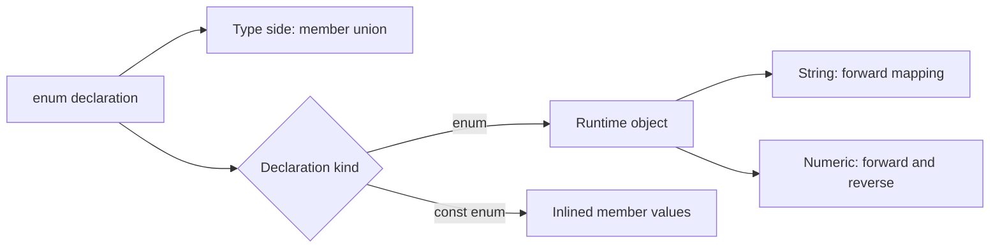

<TLDR>
  <TLDRCell label="what">
    <Term id="enumeration">枚举（enumeration）</Term>用名称表示一组固定成员；普通 `enum` 既是类型，也是运行时对象。
  </TLDRCell>
  <TLDRCell label="trap">
    数字枚举会生成反向映射，外部数据也不会因为类型断言而自动成为合法成员；`const enum` 还有跨包内联风险。
  </TLDRCell>
  <TLDRCell label="fix">
    在数据边界验证成员值，穷尽处理每个成员；只需要 JavaScript 形状时，优先比较字符串字面量联合与 `as const` 对象。
  </TLDRCell>
</TLDR>

## 是什么，为什么存在

TypeScript 的 `enum` 声明为一组相关常量提供稳定名称，并创建同名类型。它适合成员集合封闭、名称属于领域词汇，而且程序在运行时也需要读取这些成员的场景，例如订单状态、协议操作码或位标志。

枚举是 TypeScript 少数会生成 JavaScript 的类型系统特性之一。接口和类型别名经过<Term id="type-erasure">类型擦除（type erasure）</Term>后消失，普通枚举却会输出对象。这个差别决定了你能否在运行时读取成员、遍历值或通过数字查回名称。

枚举不是外部数据的验证器。网络响应、数据库字段、环境变量和 `JSON.parse()` 的结果仍可能包含集合以外的值。只有在运行时检查通过后，外部值才应获得枚举类型。

简单字符串集合并不一定需要枚举。若代码只需要一个封闭的类型，字符串字面量联合更直接；若还需要可遍历的 JavaScript 对象，`as const` 对象通常能提供相同形状。选择取决于运行时表示和调用约定，而不是哪种写法更“高级”。

## 工作原理

### 同一个名称的类型侧和值侧

声明 `enum OrderStatus { Draft = "DRAFT" }` 后，`OrderStatus` 在类型位置表示允许的成员类型，在表达式位置表示生成的对象。`OrderStatus.Draft` 同样既是一个运行时值，也是可以参与收窄的枚举成员类型。

这两个命名空间解释了常见的 `keyof typeof` 写法。`typeof OrderStatus` 先取得枚举对象的类型，`keyof` 再取得成员名称的联合，例如 `"Draft" | "Submitted"`。直接写 `keyof OrderStatus` 则是在查询枚举值类型本身的属性，不是在取成员名。

字符串枚举成员必须由字符串字面量或另一个字符串枚举成员初始化。其运行时对象只有从名称到值的属性，所以日志和 JSON 中会看到 `"DRAFT"` 这类明确值。相同文本的裸字符串并不会自动获得枚举成员类型；调用方要使用成员，或在验证后返回该类型。

### 数字成员与反向映射

数字枚举的首个未初始化成员从 `0` 开始，后续未初始化成员在前一个常量数字上递增。显式编号适合外部协议和持久化格式，因为重新排序成员时不会悄悄改变既有值。

普通数字枚举会生成<Term id="reverse-mapping">反向映射（reverse mapping）</Term>。对象同时保存名称到数字和数字到名称的属性，因此 `ExitCode.InvalidConfig` 得到 `2`，`ExitCode[2]` 得到 `"InvalidConfig"`。字符串枚举不生成反向映射。

反向映射也改变了枚举对象的遍历结果。`Object.keys()` 会同时看到类似 `"2"` 的数字键和 `"InvalidConfig"` 的名称键。需要成员列表时，应按键或值的运行时类型过滤，而不能假设每个声明只对应一个条目。

TypeScript 6 会拒绝明显不属于数字枚举的数字字面量，例如把 `100` 直接赋给只有 `0` 和 `1` 的枚举。不过，类型已扩宽为 `number` 的值仍可赋给数字枚举，以支持位标志等用法。因此，数字枚举同样不能代替边界验证。

### 成员类型与穷尽性

每个字面量枚举成员都有自己的成员类型，整个枚举则表现为这些成员的联合。比较成员会触发控制流收窄，所以 `switch` 的每个分支都能排除已经处理的成员。

在 `default` 分支把剩余值赋给 `never`，可以把封闭集合变成可检查的维护契约。新增成员后，遗漏它的分支会在编译阶段报错。这个保证只覆盖经过类型检查的值；通过 `any`、不安全断言或 JavaScript 调用传入的非法值仍能到达运行时。

具有计算成员的枚举在 TypeScript 6 中也会为成员创建独立类型。计算表达式在模块初始化时执行，因此它可能依赖环境并产生副作用。领域常量通常应使用字面量初始化，避免让类型声明的运行时行为变得隐蔽。

### 从声明到检查与输出

枚举声明会走向两个不同结果。检查器使用成员类型判断赋值、比较和穷尽性，输出器则根据声明种类生成对象或内联值。运行时验证只能检查输出后的 JavaScript 值，无法查询已经擦除的类型信息。



这条分界也是调试顺序。类型错误应检查成员类型和收窄路径，运行时枚举错误则应查看实际输出、导入形状和输入数据。把两个层面混在一起，往往会产生“类型已经写了，为什么运行时还接受坏值”的误判。

## 示例

下面四个示例依次展示字符串成员、边界验证、数字反向映射和 `as const` 替代方案。它们都可以直接运行，输出来自本地 TypeScript 工具链。

### 用字符串枚举表达封闭状态

字符串枚举让运行时值适合日志和序列化。`never` 检查让状态处理随枚举一起演进。

<Depth level="quick">

```typescript run title="order_status.ts"
enum OrderStatus {
  Draft = "DRAFT",
  Submitted = "SUBMITTED",
  Approved = "APPROVED",
  Cancelled = "CANCELLED",
}

function nextStep(status: OrderStatus): string {
  switch (status) {
    case OrderStatus.Draft:
      return "submit";
    case OrderStatus.Submitted:
      return "review";
    case OrderStatus.Approved:
      return "fulfill";
    case OrderStatus.Cancelled:
      return "stop";
    default: {
      const unreachable: never = status;
      throw new Error(`Unhandled status: ${unreachable}`);
    }
  }
}

console.log(`${OrderStatus.Draft} -> ${nextStep(OrderStatus.Draft)}`);
console.log(`${OrderStatus.Approved} -> ${nextStep(OrderStatus.Approved)}`);
```

```text
DRAFT -> submit
APPROVED -> fulfill
```

</Depth>

这里的成员名称供代码使用，成员值则进入日志或数据格式。新增状态时，编译器会要求 `nextStep()` 明确决定它的行为，而不是静默落入一个宽泛的兜底结果。

### 在数据边界验证枚举值

外部输入先保持为 `unknown`。运行时集合负责验证，类型谓词只在验证成功的分支把值收窄为 `Permission`。

```typescript run title="parse_permission.ts"
enum Permission {
  Read = "READ",
  Write = "WRITE",
  Admin = "ADMIN",
}

const permissionValues = new Set<string>(Object.values(Permission));

function isPermission(value: unknown): value is Permission {
  return typeof value === "string" && permissionValues.has(value);
}

const inputs: unknown[] = [
  JSON.parse('"READ"'),
  JSON.parse('"OWNER"'),
];

for (const input of inputs) {
  const result = isPermission(input) ? "accepted" : "rejected";
  console.log(`${String(input)}: ${result}`);
}
```

```text
READ: accepted
OWNER: rejected
```

`JSON.parse()` 不会读取 TypeScript 类型，`as Permission` 也不会生成检查。把验证集中在边界函数中，内部代码才能把 `Permission` 当作已经成立的事实。

这个谓词检查的是标量成员。真实对象还要分别验证容器、必填字段和业务约束；仅验证其中一个字段，不能证明整个对象类型。

### 正确遍历数字枚举

数字枚举对象包含两种方向的属性。先观察反向查询，再过滤出值为数字的正向条目。

```typescript run title="numeric_enum.ts"
enum ExitCode {
  Ok = 0,
  InvalidConfig = 2,
  PermissionDenied = 13,
}

console.log(ExitCode.InvalidConfig);
console.log(ExitCode[2]);

const members = Object.entries(ExitCode).filter(
  (entry): entry is [string, number] => typeof entry[1] === "number",
);

console.log(
  members.map(([name, value]) => `${name}=${value}`).join(", "),
);
```

```text
2
InvalidConfig
Ok=0, InvalidConfig=2, PermissionDenied=13
```

按值类型过滤后，反向条目中的字符串名称会被排除。若数字成员存在重复值，反向查询只能保留最后写入该数字键的名称，因此它不能恢复所有别名。

### 用 `as const` 保留 JavaScript 对象

常量对象可以同时提供成员值和派生联合。`satisfies` 检查映射是否覆盖全部值，同时保留对象自身的精确类型。

```typescript run title="delivery_state.ts"
const DeliveryState = {
  Queued: "QUEUED",
  InTransit: "IN_TRANSIT",
  Delivered: "DELIVERED",
} as const;

type DeliveryState = typeof DeliveryState[keyof typeof DeliveryState];

const messages = {
  QUEUED: "Parcel queued",
  IN_TRANSIT: "Parcel in transit",
  DELIVERED: "Parcel delivered",
} satisfies Record<DeliveryState, string>;

function messageFor(state: DeliveryState): string {
  return messages[state];
}

console.log(Object.values(DeliveryState).join(" | "));
console.log(messageFor("DELIVERED"));
```

```text
QUEUED | IN_TRANSIT | DELIVERED
Parcel delivered
```

这里没有 TypeScript 专属的运行时枚举输出，`DeliveryState` 值就是源码中的普通对象。派生类型接受 `"DELIVERED"` 这样的裸字面量，这与字符串枚举要求成员身份的调用体验不同。

## 陷阱

### 让数字编号依赖声明顺序

> [!PITFALL]
> 在持久化数据或网络协议中使用自动递增值时，在中间插入或重排成员会改变后续编号。旧数据仍是合法数字，却可能被解释成另一个成员。

**修复：** 对跨进程、跨版本或会持久化的数字成员显式赋值，并把数值当作协议的一部分测试。只在值完全局限于单次进程、顺序本身就是契约时使用自动递增。

### 把类型断言当作解析

> [!PITFALL]
> `payload.status as OrderStatus` 只压制检查器，不会确认属性存在，也不会检查字符串属于枚举。生成代码常用这种断言把未知 JSON 直接送进业务分支。

**修复：** 在边界接收 `unknown`，检查对象形状和成员值，再返回领域对象。不要导出一个无条件把任意字符串转换成枚举的辅助函数。

### 直接遍历数字枚举

> [!PITFALL]
> 对数字枚举直接调用 `Object.keys()` 或 `Object.values()` 会同时得到正向和反向映射。下拉选项、校验集合和指标标签因此可能重复，甚至混入错误类型。

**修复：** 根据用途过滤名称键或数字值，并用含非连续值和重复值的测试固定预期。如果不需要反向查询，可考虑没有反向映射的 `as const` 对象。

### 把裸字符串传给字符串枚举

> [!PITFALL]
> 字符串 `"APPROVED"` 的文本虽然与 `OrderStatus.Approved` 相同，却不是可直接赋给 `OrderStatus` 的枚举成员。硬加断言会把 API 设计问题藏起来。

**修复：** 内部 API 使用并导入枚举成员；面向 JSON 或 HTML 等原生字符串边界时，提供验证函数。若调用方本来就应直接传字面量，则改用字符串联合可能更自然。

### 跨包发布环境 `const enum`

> [!PITFALL]
> 使用方可能在编译时内联依赖版本 A 的值，却在运行时加载版本 B。环境 `const enum` 还与某些单文件转译和 `isolatedModules` 工作流不兼容。

**修复：** 不要在公共声明中发布环境 `const enum`。库可以发布普通枚举或 `as const` 对象；若内部需要内联，可用 `preserveConstEnums` 输出对象，并在发布声明时移除 `const`。

## AI 时代

**生成代码在这里容易出错的地方：** 模型常把枚举当成会被擦除的纯类型，随后尝试在运行时读取已内联的 `const enum`；也会用 `as SomeEnum` 接受 JSON，把数字枚举的双向对象误当成单向成员表。另一种常见失败是生成带宽泛 `default` 的 `switch`，新增成员后继续返回“未知”，从而绕过穷尽性检查。

**让 AI 检查：** 要求它列出每个枚举在输出 JavaScript 中是否存在、是否生成反向映射，以及哪些值会跨网络或持久化。再要求它找出所有从 `string`、`number`、`any` 或 `unknown` 进入枚举类型的路径，并为每条路径指出真实的运行时验证。最后让它在 TypeScript 6 和项目实际转译器下分别检查 `const enum` 与 `isolatedModules` 的兼容性。

**审查清单：**

- 确认每个外部成员值都经过运行时验证，而不是只靠断言或注解。
- 检查数字枚举遍历是否过滤反向条目，协议编号是否全部显式固定。
- 确认成员处理使用 `never` 保持穷尽，并审核公共声明中是否泄漏 `const enum`。

**提示词汇：** 使用「runtime enum object（运行时枚举对象）」「numeric reverse mapping（数字反向映射）」「enum member type（枚举成员类型）」「exhaustiveness check（穷尽性检查）」「ambient const enum（环境常量枚举）」和「`as const` object（`as const` 对象）」。这些词能让模型区分类型侧、值侧、数据边界与构建边界。

<Depth level="deep">

## 在枚举与替代方案之间选择

普通枚举、`as const` 对象和字面量联合都能表达封闭集合，但它们向运行时和调用方提供的契约不同。先决定是否需要对象、是否希望裸字面量可赋值，以及输出必须与纯 JavaScript 保持何种关系。

| 能力 | 普通 `enum` | `as const` 对象 | 字面量联合 |
| --- | --- | --- | --- |
| 运行时对象 | 有 | 有 | 无 |
| 从成员名读取值 | 有 | 有 | 无 |
| 数字值反查名称 | 自动生成 | 需要显式实现 | 不适用 |
| 接受相同的裸字符串字面量 | 否 | 是 | 是 |
| 产生 TypeScript 专属 JavaScript | 是 | 否 | 否，类型会擦除 |

只需要参数约束时，`type Mode = "read" | "write"` 最小也最清楚。需要运行时列表、标签映射或成员命名空间时，常量对象增加一个真实对象，并可通过 `typeof Object[keyof typeof Object]` 派生值联合。

普通枚举适合 API 已经以枚举成员为中心，或确实依赖数字反向映射的代码。它还让两个具有相同字符串值的不同枚举保持不同成员身份，减少领域之间的意外混用。不过，这种约束仍是 TypeScript 检查器的契约，不是安全边界。

位标志是数字枚举的合理用途。每个基础权限应使用不同的二进制位，例如 `1 << 0`、`1 << 1` 和 `1 << 2`，组合值使用按位或。验证器必须决定是否允许未知位，因为一般 `number` 可以进入数字枚举类型，而未来版本也可能新增位。

不要根据“更容易 tree-shaking”这类脱离构建配置的口号选择。最终输出会受到模块格式、打包器、引用方式和压缩器影响。没有针对项目产物的测量，就只比较可观察语义和维护成本，不写体积或性能结论。

## 枚举对象的键、值与映射

成员名称和值服务于不同接口。`keyof typeof Direction` 产生名称联合，而 `Direction` 类型描述成员值。配置对象按源码成员名建立时使用前者，按序列化值建立时使用后者。

`Record<OrderStatus, string>` 可以要求每个字符串枚举值都有对应标签。新增成员后，缺失属性会成为类型错误。配合 `satisfies` 时，对象的键覆盖得到检查，属性值仍保留自身推断结果。

反过来，`Record<keyof typeof OrderStatus, string>` 要求的是 `Draft`、`Submitted` 这类成员名称。它适合开发工具或文档生成，但通常不应直接成为线上 JSON 的键，因为重命名源码成员会改变它。

`Object.keys()` 的静态返回类型是 `string[]`，不会自动变成成员名称联合。把结果整体断言为 `(keyof typeof E)[]` 只对运行时确实没有其他可枚举属性的对象成立；通用辅助函数不应偷偷把这个前提应用到任意对象。

`Object.values()` 对字符串枚举给出字符串成员值，对数字枚举则混合名称字符串与成员数字。一个同时支持两类枚举的通用 `enumValues()` 往往需要脆弱的启发式规则。为具体枚举定义小型验证集合通常更清楚，也更容易测试协议变化。

枚举对象是可变的普通 JavaScript 对象，TypeScript 的声明没有把它冻结。应用代码不应添加、删除或改写成员属性；若第三方代码可能接触该对象，可以导出只读包装或单独的冻结常量对象，而不是依赖类型检查阻止运行时修改。

名称到显示文本的映射属于应用数据，不属于枚举自身。将本地化标签、权限说明或状态转换函数并入枚举命名空间，会把领域常量与可变策略绑在一起。独立的 `Record` 能让覆盖检查、替换和测试保持明确。

## 版本演进与兼容性

评审枚举变更时，要分别检查源码契约、类型契约和数据契约。同一个编辑对三者的影响可能不同，不能只看 TypeScript 是否重新编译通过。

- 新增字符串成员会扩大成员联合，并可能让穷尽处理失败。
- 重命名成员会改变源码属性和名称联合，但可在成员值不变时保持数据兼容。
- 修改字符串值会改变日志、JSON、数据库字段和消息协议。
- 在数字枚举中插入自动成员，可能改变后续所有隐式编号。
- 删除成员前要确认持久化数据和旧客户端不再发送对应值。

封闭协议由同一部署单元控制时，未知值通常应被拒绝并记录。开放协议由独立服务演进时，客户端可能需要保留未知原值并降级显示。此时显式的已知与未知对象联合，比强行把所有输入断言为枚举更诚实。

数据库迁移也应使用序列化值，而不是依赖成员的源码名称。先让读取端理解新旧值，再迁移写入端，最后清理旧值，可以避免滚动部署期间一部分实例无法解析数据。

若必须保留旧成员名称作为兼容别名，字符串枚举可以让两个名称共享一个值，数字枚举也允许重复编号。但调用方无法从运行时值判断使用了哪个别名。弃用提示应放在声明和迁移文档中，不能依赖反向映射发现旧用法。

### 弃用只是开发期元数据

成员上的 JSDoc `@deprecated` 可以让编辑器和静态分析工具提示迁移，但不会改变枚举对象。旧成员仍能被读取、遍历和序列化，运行时解析器也不会自动拒绝它。

迁移期应明确区分“读取旧值”和“继续写入旧值”。常见策略是先停止新写入，同时让读取端兼容旧值并记录命中情况，等数据迁移和旧客户端退出后再删除成员。

删除前要搜索源码引用、生成代码、配置、持久化数据和外部协议使用方。只看 TypeScript 编译结果会漏掉由 JavaScript、模板或历史数据产生的运行时值。

## 可复现的验证策略

枚举测试要覆盖检查器和运行时，因为任何一侧都无法替代另一侧。静态测试证明允许与拒绝的赋值关系，运行时测试证明输出对象、解析器和序列化格式符合协议。

一套最小验证顺序如下：

1. 用目标 TypeScript 版本运行 `tsc --noEmit`，检查合法调用与带 `@ts-expect-error` 的非法调用。
2. 用项目真实的编译选项输出 JavaScript，确认普通枚举、数字反向映射和 `const enum` 的形状。
3. 执行正向成员访问、数字反查和经过过滤的遍历，并记录真实输出。
4. 向边界解析器输入每个合法值、未知字符串、未知数字、`null` 和错误容器类型。
5. 在库发布场景中，用打包产物和生成的 `.d.ts` 建立临时使用方，分别测试支持的模块与转译配置。

类型测试中的 `@ts-expect-error` 比静默注释掉错误示例更可靠。如果新版本不再产生预期诊断，该指令本身会报错，迫使维护者确认契约是有意放宽还是意外改变。

输出检查应针对项目真实配置，而不是记忆中的编译结果。`target`、模块模式、`preserveConstEnums` 和下游转译器都会影响最终形状；把生成文件当作可检查证据，才能准确讨论运行时行为。

## `const enum` 的编译与发布边界

<Term id="const-enum">常量枚举（const enum）</Term>要求成员使用可在编译期求值的常量表达式。默认情况下，TypeScript 会移除枚举声明，并把每个成员访问内联为对应值。代码因此不能在运行时遍历该枚举对象，因为对象根本不存在。

`preserveConstEnums` 会为常量枚举保留与普通枚举相似的运行时对象，同时使用点仍可内联。这个选项有助于库在自身构建中使用常量枚举，再从生成的声明文件中移除 `const`，避免下游项目内联库的值。

危险发生在编译和执行使用不同依赖版本时。使用方针对版本 A 的声明内联一个数字，测试或部署却加载版本 B 的 JavaScript；如果编号变化，程序可能进入错误分支。因为本地测试通常用同一套依赖完成编译和执行，这种版本错配不容易被常规测试发现。

`isolatedModules` 用来暴露单文件转译器无法安全处理的结构。引用环境 `const enum` 成员需要知道另一个声明文件里的具体值，单文件转译器没有这项信息，因此该组合会报错。问题针对跨文件的环境常量枚举，不意味着项目内部所有 `const enum` 在所有工具中都必然失败。

应用内部是否使用 `const enum` 是构建策略。公共库则要把使用方的编译器、转译器和版本安装方式纳入契约。若无法控制这些条件，普通枚举或常量对象提供的运行时值更稳妥。

## 外部数据、版本与所有权

枚举值进入 JSON 后只剩字符串或数字，不携带声明来源。反序列化也不会恢复枚举身份，因此解析器要根据当前协议集合验证原始值。对字符串枚举，可以维护 `Set<string>`；对数字枚举，则要明确列出允许值，不能只检查 `typeof value === "number"`。

协议演进需要区分“当前未知”和“永远非法”。客户端读取可能由新服务器增加成员的开放协议时，模型应显式包含未知分支，例如保存原始字符串的对象联合，而不是伪装成封闭枚举。由同一发布单元控制的内部状态则可以保持封闭，并依赖穷尽检查推动升级。

枚举成员名称和序列化值也是两个不同契约。重命名 `Approved` 而保留 `"APPROVED"`，不会改变线上数据，却会改变 `keyof typeof OrderStatus` 和源码调用。修改字符串值或数字编号则会改变数据契约，需要迁移和兼容策略。

重复数字值合法，但反向映射只有一个数字键。后声明的成员会覆盖先前名称，所以反查结果不能证明原始别名。若多个名称确实代表同一协议值，应把别名关系写成显式映射，而不是依赖对象赋值顺序。

计算成员在模块求值时运行。若初始化表达式读取时间、随机数或环境状态，相同源码可能在不同进程得到不同值，声明还可能产生导入副作用。固定领域成员应保持为常量表达式；动态注册表属于对象、`Map` 或工厂，而不是枚举。

</Depth>

<Checkpoint id="typescript/enums" />

## 延伸阅读

- [TypeScript 手册：枚举](https://www.typescriptlang.org/docs/handbook/enums.html)
- [TSConfig：`preserveConstEnums`](https://www.typescriptlang.org/tsconfig/preserveConstEnums.html)
- [TSConfig：`isolatedModules`](https://www.typescriptlang.org/tsconfig/isolatedModules.html)
