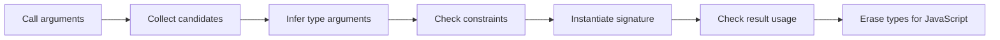

<TLDR>
  <TLDRCell label="what">
    泛型用类型参数描述多个位置必须保持的类型关系，让一份实现服务于多种具体类型，同时保留每次调用的类型信息。
  </TLDRCell>
  <TLDRCell label="trap">
    `T`只存在于类型检查阶段；`as T`、`any`或未经验证的JSON都能让泛型签名承诺运行时没有证明的结果。
  </TLDRCell>
  <TLDRCell label="fix">
    让类型参数至少连接两个有意义的位置，优先依赖推断，并把构造器或验证器作为运行时证据显式传入。
  </TLDRCell>
</TLDR>

## 是什么，为什么存在

<Term id="generic">泛型（generic）</Term>是一种用占位类型来写声明的机制。
这个占位类型叫作<Term id="type-parameter">类型参数（type parameter）</Term>，常写成`T`、`TKey`或`TValue`。
调用函数、实例化类或引用类型别名时，具体类型会代入这些参数。
它记录的是同一个未知类型在多个位置之间必须保持怎样的关系，而不只是接受任意值。

例如，`(value: T) => T`表示返回值与输入值属于同一类型。
`(items: T[]) => T | undefined`表示结果若存在，就来自该数组的元素类型。
如果把这些位置都换成`any`，代码仍可能运行，但调用者无法再从签名得知输出与输入的关系。
分别为`string`、`number`和每个领域对象复制一份实现，又会让相同逻辑分叉。

你会在数组方法、Promise、集合、React组件属性、API客户端和库函数中遇到泛型。
标准库中的`Array<T>`、`Map<TKey, TValue>`与`Promise<T>`都用类型参数记录容器和所含值的关系。
业务代码中的分页响应、仓储接口和事件映射也常需要同一种表达能力。

泛型是一项静态机制。
它能让检查器拒绝不一致的调用，并让编辑器保留准确的补全信息，却不会自动检查网络响应或在JavaScript中创建类型对象。
如果运行时值来自JSON、数据库驱动或无类型依赖，仍要先验证它。

## 工作原理

声明`function identity<T>(value: T): T`时，`T`的作用域覆盖参数类型、返回类型和函数体中的类型位置。
调用`identity("ready")`时，检查器从实参收集候选类型，并通过<Term id="type-inference">类型推断（type inference）</Term>选择本次调用的`T`。
这里通常不必写`identity<string>("ready")`；显式类型实参适合推断信息不足或你有意固定公共契约的场合。

一次泛型调用可以有多个类型参数。
`Map<TKey, TValue>`分开记录键和值，因为两者没有必须相同的理由。
名称应反映角色：很短、局部且关系明显时，`T`与`U`足够；公开API涉及多个角色时，`TInput`和`TResult`更容易读懂诊断。

<Term id="generic-constraint">泛型约束（generic constraint）</Term>使用`extends`限制可代入的类型。
在`TKey extends keyof TObject`中，`TKey`只能取`TObject`的已知键。
于是参数`key`与返回类型`TObject[TKey]`保持对应：传入`"id"`得到`id`属性的类型，而不是所有属性类型的宽泛联合。

约束按照TypeScript的结构类型规则检查能力。
`T extends { length: number }`表示值必须有数值型`length`属性，并不要求它来自某个特定类。
约束还让函数体可以安全访问所声明的成员，但不能访问约束中没有出现的成员。

类型参数也可以有默认值，例如`Result<TValue, TError = Error>`。
默认值减少常见调用中的标注，却不会覆盖已经推断出的候选类型。
公共API若把默认值写成`any`，调用者在省略参数后会失去检查，因此`unknown`、领域默认类型或不设默认值通常更诚实。

检查器大致沿着下面的路径处理泛型调用。
这张图描述静态阶段；最后生成的JavaScript不携带`T`。



泛型函数、接口、类型别名和类都能声明类型参数，但参数的归属不同。
`interface Box<T>`把`T`固定在整个实例契约上；`interface Converter { convert<T>(value: T): T }`则允许每次方法调用选择自己的`T`。
把类型参数放错层级，常会让本应独立的调用意外共享一个过宽的类型选择。

## 示例

### 让推断贯穿输入与输出

`firstMatch`只需要知道元素类型，并把同一个`T`放在数组、谓词参数和返回值中。
调用者传入`Product[]`后，谓词里的`product`与返回值都会保留`Product`类型。

<Depth level="quick">

```typescript run title="first_available.ts"
type Product = {
  sku: string;
  name: string;
  stock: number;
};

function firstMatch<T>(
  items: readonly T[],
  accepts: (item: T) => boolean,
): T | undefined {
  return items.find(accepts);
}

const products: Product[] = [
  { sku: "P-101", name: "mouse", stock: 0 },
  { sku: "P-102", name: "keyboard", stock: 7 },
];

const available = firstMatch(products, (product) => product.stock > 0);
console.log(available?.sku, available?.name);
console.log(firstMatch(products, (product) => product.stock > 10));
```

```text
P-102 keyboard
undefined
```

</Depth>

`readonly T[]`表明函数只读取集合。
因此它既接受普通数组，也接受只读数组，并且函数体不能误改调用者的数据。
返回类型保留`undefined`，因为类型关系不能证明一定存在匹配项。

这个例子不需要显式传入`<Product>`。
如果调用者把类型实参写成更宽的结构，反而可能掩盖本可由推断暴露的输入问题。
先让编译器推断，只有在错误信息或API边界确实需要时才固定类型实参。

### 用键约束建立合法访问

下面的两个类型参数不是独立占位符。
`TKey`受`keyof TObject`约束，而索引访问类型`TObject[TKey]`计算对应属性的值类型。

```typescript run title="get_property.ts"
function getProperty<TObject, TKey extends keyof TObject>(
  object: TObject,
  key: TKey,
): TObject[TKey] {
  return object[key];
}

const shipment = {
  id: "S-204",
  attempts: 2,
  delivered: false,
};

const shipmentId = getProperty(shipment, "id");
const attempts = getProperty(shipment, "attempts");

console.log(shipmentId.toLowerCase());
console.log(attempts + 1);
```

```text
s-204
3
```

`shipmentId`是`string`，`attempts`是`number`。
如果第二个参数改成`"owner"`，检查会在调用点失败，因为这个字面量不属于`keyof typeof shipment`。
这比返回`string | number | boolean`更准确，也比把结果断言成目标类型更可靠。

`keyof`只描述静态类型已知的键。
它不证明运行时对象没有额外属性，也不把`Object.keys()`的结果自动变成`(keyof T)[]`。
编写遍历所有键的通用工具时，要单独处理这个差异。

### 泛型类保存同一关系

函数的类型参数通常只服务于一次调用。
类的类型参数则属于实例；创建`Registry<number, Job>`后，该实例的所有`set`与`get`都遵守相同的键值关系。

```typescript run title="registry.ts"
class Registry<TKey, TValue> {
  readonly #entries = new Map<TKey, TValue>();

  set(key: TKey, value: TValue): void {
    this.#entries.set(key, value);
  }

  get(key: TKey): TValue | undefined {
    return this.#entries.get(key);
  }
}

type Job = {
  owner: string;
  state: "queued" | "running";
};

const jobs = new Registry<number, Job>();
jobs.set(17, { owner: "Lin", state: "queued" });

console.log(jobs.get(17));
console.log(jobs.get(99));
```

```text
{ owner: 'Lin', state: 'queued' }
undefined
```

这个类包装了`Map`，但没有假装`get`一定成功。
键缺失时，真实运行时结果就是`undefined`，所以签名也保留它。
生成代码常用非空断言把这一分支抹掉；那只会静音检查器，不会创建缺失的值。

类的静态成员不能直接使用实例类型参数。
静态成员属于构造函数本身，不属于某个`Registry<number, Job>`实例。
如果静态工厂需要泛型，它应声明自己的类型参数，并返回相应的实例类型。

### 把运行时证据传给泛型函数

类型参数会被擦除，所以`parseJson<T>`无法只凭`T`判断JSON是否有效。
下面的版本同时接收一个类型谓词；该函数是运行时证据，也是从`unknown`到`T`的唯一入口。

```typescript run title="parse_json.ts"
type Validator<T> = (value: unknown) => value is T;

function parseJson<T>(text: string, isValid: Validator<T>): T {
  const value: unknown = JSON.parse(text);
  if (!isValid(value)) {
    throw new Error("invalid payload");
  }
  return value;
}

type FeatureFlag = { name: string; enabled: boolean };

const isFeatureFlag: Validator<FeatureFlag> = (
  value,
): value is FeatureFlag =>
  typeof value === "object" &&
  value !== null &&
  "name" in value &&
  typeof value.name === "string" &&
  "enabled" in value &&
  typeof value.enabled === "boolean";

const flag = parseJson(
  '{"name":"new-checkout","enabled":true}',
  isFeatureFlag,
);
console.log(`${flag.name}: ${flag.enabled}`);
```

```text
new-checkout: true
```

泛型保证验证器接受的类型与函数返回的类型一致。
但类型谓词本身仍是人工编写的证明，检查器不会验证其逻辑是否完整。
要用错误字段类型、`null`、缺失字段和额外领域约束测试验证器，而不是因为签名漂亮就信任它。

同一种“传入证据”模式也适用于构造对象。
若函数需要创建`T`，可以接收`new (...args) => T`形式的构造签名；若要解析`T`，可以接收验证器或模式对象。
泛型负责保持关系，传入的值负责运行时行为。

## 陷阱

### 用`any`假装保留关系

> [!PITFALL]
> `(value: any) => any`接受很多类型，却没有表达输入与输出之间的关系；`any`还会把未检查的操作传播给调用者。

**修复方法：** 如果实现确实原样返回输入，写成`<T>(value: T) => T`。
如果输入可以是任何值，但使用前必须检查，参数应为`unknown`。
先写清哪些位置必须一致，再决定需要几个类型参数。

### 用`as T`凭空制造结果

> [!PITFALL]
> `JSON.parse(text) as T`、`{} as T`和`value as unknown as T`都能让实现声称返回任意调用者指定的类型，却没有构造或验证该值。

这种函数通常长得像通用解析器，实际契约却是“相信我”。
调用者写`<Account>`后会得到完整补全，但运行时可能连`id`都不存在。
错误因此从边界移动到更远的业务代码中。

**修复方法：** 从`unknown`开始，并要求调用者提供验证器、模式或构造器。
断言只能放在已经由其他机制证明过的窄边界，并要说明那个证明是什么。
无法证明时，返回`unknown`比返回虚假的`T`更准确。

### 把`extends`约束当作运行时验证

> [!PITFALL]
> `<T extends { id: string }>`只检查经过类型检查的调用；它不会检查来自JSON的对象，也不会在生成的JavaScript中留下守卫。

约束回答的是“函数体可以依赖哪些静态成员”。
它不回答“这个运行时值是否真的满足业务规则”。
即使结构正确，空字符串、格式错误或无权访问的ID仍可能不合法。

**修复方法：** 在外部边界验证形状和领域约束，然后再把值交给泛型核心。
让约束描述核心算法所需的最小能力。
不要为了方便访问额外字段而把约束扩大成一个庞大的业务接口。

### 让类型参数只出现一次

> [!PITFALL]
> 类型参数如果只出现在一个参数位置，通常没有连接任何关系，只是让简单签名更难读。

`function logValue<T>(value: T): void`通常不比`function logValue(value: unknown): void`提供更多信息。
相反，`T`同时出现在输入和返回位置，或连接集合元素与回调参数时，才向调用者传递有用事实。

**修复方法：** 检查每个类型参数至少连接两个有意义的位置，或者受到另一个参数约束。
如果参数只需接受一类固定值，就使用具体类型。
如果值确实未知且函数不依赖其结构，就使用`unknown`。

### 显式类型实参掩盖推断结果

> [!PITFALL]
> 主动给出一个过宽的类型实参，可能让原本不一致的值都落入该宽类型，从而失去最具体的返回类型与诊断。

同一个`T`也不表示两个实参必须具有完全相同的字面量类型。
检查器会根据所有推断位置寻找可接受的候选类型，结果可能是公共上界、宽化类型或联合。
需要严格相等关系时，应直接为领域状态建模并写类型测试，不要从字母相同推导出额外保证。

**修复方法：** 默认让调用实参驱动推断，并检查编辑器显示的实际结果类型。
只有推断缺少信息、需要固定返回契约或调用空集合API时才显式传入类型实参。
用`@ts-expect-error`为必须拒绝的调用写负向类型测试。

### 忽略只读输入与TSX语法

> [!PITFALL]
> 只读取数组的工具若声明为`T[]`，会拒绝只读数组并允许函数体误改数据；在`.tsx`中，单参数泛型箭头函数的`<T>`还可能被解析成JSX。

这两个问题都常见于模型把普通函数机械改写成泛型箭头函数时。
类型关系也许正确，调用面和解析环境却变差。

**修复方法：** 只读输入写成`readonly T[]`或`ReadonlyArray<T>`。
在TSX中把单个类型参数写成`<T,>`，或使用`function`声明消除歧义。
修改后要在项目真实的`.tsx`配置下运行检查，而不是只在孤立的`.ts`文件中查看代码。

<Depth level="deep">

## 类型擦除与运行时见证

<Term id="type-erasure">类型擦除（type erasure）</Term>意味着类型参数、接口和类型别名不会成为JavaScript值。
因此函数体不能执行`value instanceof T`，不能直接调用`new T()`，也不能读取`T.someStaticMember`。
这些表达式需要右侧或被调用者是运行时值，而`T`只属于检查器。

需要运行时操作时，要把相应证据放进值参数。
构造器参数让函数可以创建实例，类型谓词或模式对象让函数可以验证未知输入，带标签的对象则让代码可以在分支中区分成员。
这种做法没有绕开泛型；泛型会确保“证据针对的类型”和“函数承诺的类型”保持一致。

运行时见证也有自己的可信边界。
一个声明为`(value: unknown) => value is User`的函数可以直接返回`true`，检查器仍会接受它。
所以验证器要有运行时测试，构造器要执行真实不变量，模式的解析结果要成为静态类型的来源。
泛型能连接证据与结果，却不能证明证据实现得正确。

类型擦除还说明了为什么泛型本身通常不会改变同一函数的运行路径。
`identity<string>`与`identity<number>`最终调用的是同一份JavaScript逻辑。
如果程序要根据类型选择序列化方式，就必须传入明确的标签、策略函数或对象，而不能期待`T`在运行时分支中出现。

## 推断有信息边界

类型推断依赖调用点实际提供的信息。
参数值、回调的上下文类型和某些返回位置都能贡献候选类型，但“我希望稍后把它当作什么”不会凭空成为证据。
空数组、无参数工厂和只出现在返回位置的类型参数往往缺少足够信息，这时才可能需要显式类型实参或更好的API形状。

返回类型形如`T`，而参数中完全没有`T`时，应当格外警惕。
除非函数还接收构造器、验证器或其他能产生`T`的值，否则实现多半只能抛错、永不返回，或使用断言伪造结果。
阅读生成的泛型辅助函数时，这是一条很有效的快速检查。

推断还会进行宽化和候选合并。
字符串字面量可能变成`string`，多个位置可能导向联合或公共结构，约束也可能影响可接受的候选。
公共库应为代表性调用编写类型测试，并明确哪些字面量需要保留；仅凭函数声明看起来“很泛型”无法保证调用体验。

显式类型实参是契约选择，不是转换。
写`load<Account>()`不会把返回的对象变成`Account`，写`identity<string>(value)`也不会在运行时把值转换为字符串。
如果参数与选择的类型不兼容，检查器会报错；如果实现内部已经用断言绕过检查，显式实参反而会让错误承诺显得更可信。

## 泛型签名的归属

把类型参数放在调用签名上，表示每次调用都能独立选择类型。
把它放在接口或类名上，则表示使用方先选定一个类型关系，之后所有成员都服从这个选择。
回调库、仓储和状态容器的设计经常取决于这一区别。

例如，一个通用转换器的方法可以对每次输入选择新的`TInput`。
而`Repository<Entity>`的`save`、`find`和`delete`应围绕同一个`Entity`工作，因此参数属于接口更合适。
若错误地把`Entity`移到每个方法上，使用方可能在同一个仓储实例上混入互不相关的类型。

泛型类只描述实例一侧。
静态字段由所有实例共享，因此不能引用实例的`T`；静态工厂必须声明自己的类型参数。
类似地，构造函数本身是运行时值，而实例类型是静态描述，接受“类”作为参数时通常要同时考虑构造签名和实例结果。

设计时可以问一个具体问题：谁选择这个类型参数，选择能持续多久？
若答案是“每次调用者各选一次”，放在函数或方法上。
若答案是“创建这个客户端或容器时选定，成员共享”，放在接口、类型别名或类上。
这个所有权问题比一律使用单字母`T`更能决定API是否清楚。

</Depth>

<Checkpoint id="typescript/generics" />

## 延伸阅读

- [TypeScript手册：泛型](https://www.typescriptlang.org/docs/handbook/2/generics.html)
- [TypeScript手册：`keyof`类型运算符](https://www.typescriptlang.org/docs/handbook/2/keyof-types.html)
- [TypeScript手册：索引访问类型](https://www.typescriptlang.org/docs/handbook/2/indexed-access-types.html)
- [TypeScript手册：函数](https://www.typescriptlang.org/docs/handbook/2/functions.html)
- [TypeScript 6.0发布说明](https://www.typescriptlang.org/docs/handbook/release-notes/typescript-6-0.html)
