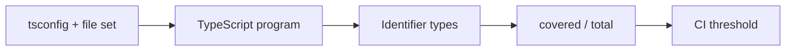

<TLDR>
  <TLDRCell label="what">
    Type coverage divides identifiers whose type is not `any` by all identifiers. It exposes where static checking stops, but it cannot prove that declarations are correct.
  </TLDRCell>
  <TLDRCell label="trap">
    The percentage changes with the TypeScript version, tool version, project configuration, and file set. Assertions, wrong declarations, and excluded files can also create a misleadingly high score.
  </TLDRCell>
  <TLDRCell label="fix">
    Use a fixed `tsconfig` and `--strict` policy, block regressions in CI, and run compiler checks and boundary tests separately.
  </TLDRCell>
</TLDR>

## What it is and why it exists

<Term id="type-coverage">Type coverage</Term> measures how many identifiers in TypeScript code have a non-`any` type according to the checker. The commonly used `type-coverage` tool calculates “identifiers not typed as `any` / all identifiers,” so it counts identifiers rather than source lines, branches, or files. When `any` flows through property reads and function calls, one expression can create several uncovered locations.

The metric solves a visibility problem. The `noImplicitAny` compiler option reports an <Term id="implicit-any">implicit `any`</Term> produced when inference lacks information, but it permits an author to write `any` explicitly; an `any` returned by a library or declaration file can spread as well. Type coverage turns those escape hatches into a trackable count and can stop new ones from entering a codebase unnoticed in CI.

Type coverage is not type safety. Declaring bad data as `User`, asserting JSON directly to a domain type, or writing an inaccurate declaration file can all produce high coverage while the runtime value still violates the model. The metric says what types the checker knows, not whether those types came from reliable evidence.

Do not conflate `unknown` with `any`. Both can receive any input, but `unknown` blocks property access, calls, and type-specific operations until the code narrows it. Because it is not `any`, `type-coverage` counts an `unknown` identifier as covered in both ordinary and strict mode; actual safety still comes from the validation that follows.

You usually meet this metric during a JavaScript migration, while tightening an older TypeScript project, when auditing third-party declarations, or when adding a pull-request quality gate. It answers “where do unchecked types enter and spread?” It does not answer “is the program free of runtime type errors?”

The programs on this page were type-checked with TypeScript 6.0.3 and executed by Node 24. The coverage output came from `type-coverage` 2.30.1 with the same `tsconfig.json` and file set for each comparison.

## How it works

`type-coverage` first asks TypeScript to build a program from the project configuration, then queries the types of source identifiers. The tool places identifiers accepted by the active counting policy in the numerator, all in-scope identifiers in the denominator, and finally compares the ratio with an optional threshold.



Ordinary mode primarily finds identifiers typed as `any`. `--strict` expands “uncovered” to include a nested `any` in a type argument such as `Promise<any>`, unsafe type and non-null assertions, `Object`, and the empty object type `{}`. The tool documentation explicitly warns that future minor releases may tighten strict mode further, so upgrading the tool can lower the score.

| Code shape | Ordinary mode | `--strict` | Meaning |
| --- | --- | --- | --- |
| `const value: any = input` | Uncovered | Uncovered | Explicitly opts out of static checking. |
| `Promise<any>` | The outer identifier may be covered | Uncovered | A nested type argument still propagates `any`. |
| `const value: unknown = input` | Covered | Covered | Must be narrowed before use. |
| `input as User` | The target type may count as covered | An unsafe assertion is uncovered | An assertion performs no validation. |
| `input as unknown` | Covered | Covered | Preserves uncertainty about the input. |

Both numerator and denominator depend on the effective project configuration. `include`, `exclude`, project references, `allowJs`, generated files, and command-line file filters all change the scope. To compare two commits, hold the compiler version, tool version, `tsconfig`, and file set constant; otherwise a percentage change may only be a policy change.

`type-coverage` does not replace full compiler diagnostics by default. Run `tsc --noEmit` as a separate gate, or enable the tool's `reportSemanticError` option. Code with 100% coverage can still contain ordinary TypeScript errors such as invalid assignments, wrong call arguments, or unresolved modules.

A project can store its stable policy in `package.json`. The `90` below is a configuration example, not a universal target; an existing project should measure its baseline before choosing a threshold that does not encourage bulk suppression.

```json title="package.json"
{
  "typeCoverage": {
    "project": "tsconfig.type-coverage.json",
    "strict": true,
    "detail": true,
    "atLeast": 90,
    "reportSemanticError": true,
    "showRelativePath": true
  }
}
```

A separate `tsconfig.type-coverage.json` can extend the build configuration and turn on stricter compiler options gradually. That gives a migration a temporary independent policy, but completed checks should eventually move into the main configuration so production builds and measurement do not drift apart indefinitely.

### Read detail from the source outward

Each row in detail output is an identifier position, not necessarily an independent design error. If `payload` is `any`, its properties, call results, and callback parameters may all appear. Annotating every row separately can leave the source of the problem intact.

Group positions by file and data flow, then trace the earliest inputs back to their declarations. JSON parsing, a missing third-party declaration, an overly broad generic default, or a JavaScript boundary often creates one cluster. Measure again after fixing the upstream source and confirm whether the whole cluster disappears.

Review the remaining isolated positions individually. When an `any` genuinely cannot be removed yet, keep it in a small adapter, assign its result to `unknown` immediately, and validate before the value enters domain code. The purpose of detail is to shorten unchecked paths, not merely empty the list.

Keep the reason and removal condition for an expected exception in the review record. On the next detail change, a reviewer can then distinguish new debt, a repaired propagation chain, and a file that only moved.

## Examples

First, observe how `any` hides a spelling error. Then keep the boundary as `unknown`, validate it at runtime, and turn the same command into a repeatable gate.

### Find a spreading `any`

The standard declaration of `JSON.parse()` returns `any`. The misspelled `itmes` property below receives no property check, and the later `reduce` call runs along the same `any` chain.

<Depth level="quick">

```typescript run title="unsafe-total.ts"
type Invoice = { items: Array<{ amountCents: number }> };

function unsafeTotal(text: string): number {
  const invoice = JSON.parse(text);
  const items = invoice.itmes ?? [];

  return items.reduce(
    (total: number, item: any) => total + item.amountCents,
    0,
  );
}

const rawInvoice = '{"items":[{"amountCents":500},{"amountCents":250}]}';
const expectedInvoice: Invoice = { items: [{ amountCents: 750 }] };

console.log(`unsafe total=${unsafeTotal(rawInvoice)}`);
console.log(`typed total=${expectedInvoice.items[0]?.amountCents ?? 0}`);
```

```text
unsafe total=0
typed total=750
```

</Depth>

The program runs but returns `0` on the broken path. The explicit `number` return type does not help because `any` is assignable to `number`; a return annotation checks the final assignment and cannot recreate evidence lost during intermediate operations.

Running a strict coverage threshold against this file lists the propagation chain and exits with a nonzero status. The output below is from the real command; the positions identify individual identifiers rather than whole lines.

```bash title="measure-unsafe.sh"
npx type-coverage --strict --show-relative-path --at-least 100 -p tsconfig.json -- unsafe-total.ts
```

```text
unsafe-total.ts:4:9: invoice
unsafe-total.ts:5:9: items
unsafe-total.ts:5:17: invoice
unsafe-total.ts:5:25: itmes
unsafe-total.ts:7:10: items
unsafe-total.ts:7:16: reduce
unsafe-total.ts:8:21: item
unsafe-total.ts:8:43: item
unsafe-total.ts:8:48: amountCents
(25 / 34) 73.52%
The type coverage rate(73.52%) is lower than the target(100%).
```

The `73.52%` describes only this sample file under this tool policy; it cannot be extrapolated into a defect probability. Detail is more useful than the percentage alone because it shows how one upstream `any` removes checks from a property name, method, and callback parameter together.

### Preserve a boundary with `unknown`

The repair is not a type assertion on the parsed result. Preserve the uncertainty first, then check the container, array, field type, and integer constraint. After validation succeeds, the type predicate gives later code an `Invoice`.

```typescript run title="safe-total.ts"
type Invoice = { items: Array<{ amountCents: number }> };

function isUnknownArray(value: unknown): value is unknown[] {
  return Array.isArray(value);
}

function isInvoice(value: unknown): value is Invoice {
  return (
    typeof value === "object" &&
    value !== null &&
    "items" in value &&
    isUnknownArray(value.items) &&
    value.items.every(
      (item) =>
        typeof item === "object" &&
        item !== null &&
        "amountCents" in item &&
        typeof item.amountCents === "number" &&
        Number.isSafeInteger(item.amountCents),
    )
  );
}

function totalInvoice(text: string): number {
  const value: unknown = JSON.parse(text);
  if (!isInvoice(value)) throw new Error("Invalid invoice");
  return value.items.reduce((total, item) => total + item.amountCents, 0);
}

for (const raw of [
  '{"items":[{"amountCents":500},{"amountCents":250}]}',
  '{"items":[{"amountCents":"500"}]}',
]) {
  try {
    console.log(`total=${totalInvoice(raw)}`);
  } catch (error) {
    const message = error instanceof Error ? error.message : String(error);
    console.log(`error=${message}`);
  }
}
```

```text
total=750
error=Invalid invoice
```

`isUnknownArray()` looks like a thin wrapper, but it deliberately narrows the result of the standard `Array.isArray()` to `unknown[]`. The standard predicate is `arg is any[]`; using it directly in the compound condition causes strict coverage to report the nested `any` on array elements. The wrapper invents no element shape—it expresses only the runtime fact that the value is an array with a safer static type.

The same strict command now reaches 100%. That proves this sample has no escape hatch recognized by the current rules; it does not prove that the business constraints on `Invoice` are complete. Whether negative amounts are legal, for example, still comes from the domain contract.

```bash title="measure-safe.sh"
npx type-coverage --strict --detail --show-relative-path --at-least 100 -p tsconfig.json -- safe-total.ts
```

```text
(66 / 66) 100.00%
type-coverage success.
```

### Narrow a migration seam

Some migration boundaries must temporarily call an old API that returns `any`. Confining that fact to a function type and assigning the call result to `unknown` immediately keeps the unchecked value out of domain logic.

```typescript run title="legacy-adapter.ts"
type FeatureFlags = { checkoutV2: boolean; maxItems: number };
type LegacyLoad = (key: string) => any;

function isFeatureFlags(value: unknown): value is FeatureFlags {
  return (
    typeof value === "object" &&
    value !== null &&
    "checkoutV2" in value &&
    "maxItems" in value &&
    typeof value.checkoutV2 === "boolean" &&
    typeof value.maxItems === "number" &&
    Number.isSafeInteger(value.maxItems) &&
    value.maxItems > 0
  );
}

function readFlags(load: LegacyLoad, key: string): FeatureFlags {
  const value: unknown = load(key);
  if (!isFeatureFlags(value)) throw new Error("Invalid feature flags");
  return value;
}

const legacyLoad: LegacyLoad = (key) =>
  key === "valid"
    ? JSON.parse('{"checkoutV2":true,"maxItems":20}')
    : JSON.parse('{"checkoutV2":"yes"}');

for (const key of ["valid", "invalid"]) {
  try {
    const flags = readFlags(legacyLoad, key);
    console.log(`${key}=${flags.checkoutV2}:${flags.maxItems}`);
  } catch (error) {
    const message = error instanceof Error ? error.message : String(error);
    console.log(`${key}=${message}`);
  }
}
```

```text
valid=true:20
invalid=Invalid feature flags
```

This does not claim the old API is safe. `LegacyLoad` records the legacy return explicitly, while `readFlags()` narrows the trust boundary to one call and validates before returning `FeatureFlags`. Invalid data is rejected inside the adapter.

The current strict rules still give this file 100%, which exposes the metric's boundary: it works from identifier types and does not turn every `any` keyword in source into an uncovered identifier. Review must continue to inventory `any` in public signatures rather than treating a perfect score as proof that every escape hatch is gone.

```bash title="measure-adapter.sh"
npx type-coverage --strict --detail --show-relative-path -p tsconfig.json -- legacy-adapter.ts
```

```text
(67 / 67) 100.00%
type-coverage success.
```

### Fix the policy in CI

The gate should execute a policy stored with the project instead of rebuilding an argument list in the workflow. The script runs ordinary type checking first and coverage second. Keep them as separate commands because their failures mean different things.

```json title="package.json"
{
  "scripts": {
    "typecheck": "tsc -p tsconfig.json --noEmit",
    "type-coverage": "type-coverage"
  },
  "typeCoverage": {
    "project": "tsconfig.type-coverage.json",
    "strict": true,
    "atLeast": 90,
    "reportSemanticError": true,
    "showRelativePath": true
  }
}
```

```bash title="ci-type-gate.sh"
npm run --silent typecheck
npm run --silent type-coverage
```

```text
(158 / 167) 94.61%
type-coverage success.
```

Use the process exit status to decide whether the run succeeded; do not extract the percentage from human-readable text with a regular expression. When another program needs the report, use `--json-output` and pin the tool version because both JSON fields and strict counting rules are tool interfaces.

An older project can set `atLeast` to its measured baseline so that a new `any` fails immediately, then fix one directory at a time and raise the number. Do not exclude the hardest files to reach a round target. Boundary adapters and missing declarations are often precisely where the metric is most valuable.

## Pitfalls

> [!PITFALL]
> Treating 100% type coverage as runtime type safety. A wrong interface, fabricated declaration file, or `as User` can make the checker trust a fact that does not exist.

**Fix:** audit every <Term id="type-assertion">type assertion</Term> and declaration boundary. Accept external values as `unknown`, establish the domain type with a runtime parser or guard, and keep behavioral tests.

> [!PITFALL]
> Comparing percentages measured under different policies. Upgrading TypeScript or `type-coverage`, switching `tsconfig`, or adding generated files changes both numerator and denominator.

**Fix:** pin dependency versions, name the project configuration in the command, and review the file set with every coverage change. When the policy intentionally changes, record a new baseline instead of calling the jump a code-quality improvement.

> [!PITFALL]
> Clearing detail output with ignore comments, `ignoreFiles`, or permissive `ignore*` options. The score rises without restoring any static evidence.

**Fix:** give each exclusion an owner, runtime guarantee, and removal condition. Enable `--report-unused-ignore`, and limit an ignore to adapter lines that cannot yet be repaired rather than a whole directory.

> [!PITFALL]
> Replacing `unknown` with `any` to raise coverage, or assuming strict mode penalizes `unknown`. The change weakens use-site rules and usually makes propagation wider.

**Fix:** preserve `unknown` at untrusted boundaries and narrow it with type guards, parsers, or exhaustive branches. The coverage tool counts `unknown` as covered, but review still has to confirm that narrowing checks every domain constraint.

> [!PITFALL]
> Running only the coverage command without `tsc` and tests. An identifier can have a non-`any` type while the code still has an ordinary type error or wrong behavior.

**Fix:** make compilation, coverage, and runtime tests independent gates. Coverage locates escape hatches, the compiler checks assignability and calls, and tests verify behavior after types are erased.

## In the AI era

**What generated code gets wrong here**

Generated TypeScript clients often write `response.json() as ApiResponse` directly or return `Promise<any>` from a generic helper. Models also clear diagnostics with `Record<string, any>`, non-null assertions, and broad ambient declarations. These changes lower coverage or, under non-strict counting, create a surface that looks typed without adding evidence.

A second failure appears in requests to “fix type coverage.” A model may add `type-coverage:ignore-next-line` in bulk, exclude generated directories, or annotate every local without repairing the earliest `any`. It may also describe a higher percentage as improved runtime safety while omitting validation for JSON, messages, environment variables, and plugin results.

**Ask your AI to check**

- With a fixed `tsconfig`, run `tsc --noEmit` and `type-coverage --strict --detail` separately, then list uncovered identifiers that appeared or disappeared.
- Trace each `any` backward to its earliest declaration or data boundary, and say whether it can become `unknown` followed by validation.
- Inventory type assertions, non-null assertions, ignore directives, and excluded files; state the runtime evidence and removal condition for each one.

**Review checklist**

- Confirm that baseline and current code use the same TypeScript version, tool version, project configuration, and file set.
- Exercise network, JSON, storage, environment, and JavaScript boundaries with malformed shapes, missing fields, and extreme values.
- Inspect propagation clusters in detail output and repair the upstream boundary that creates several downstream `any` values first.

**Prompt vocabulary**

Use the exact terms `type coverage`, `explicit any`, `implicit any`, `nested any`, `unknown boundary`, `unsafe assertion`, `coverage denominator`, and `ratcheting threshold`. Ask the AI to distinguish “improve the metric” from “establish runtime evidence,” and require it to report the effective `tsconfig` and file set.

<Depth level="deep">

## What the metric does not express

Type coverage samples checker state; it is not a mathematical proof that TypeScript is sound. <Term id="type-erasure">Type erasure</Term> removes interfaces, aliases, and most annotations from emitted JavaScript, so they do not validate inputs at runtime. Even when every identifier has a concrete type, values can violate the model through wrong declarations, handwritten `.d.ts` files, JavaScript callers, or suppressed diagnostics.

The denominator is not program complexity either. A short expression may contain several identifiers, while a long control structure without identifiers does not add to the total in the same way. Therefore, `80%` versus `90%` does not mean “10% more behavior covered” as it might suggest by analogy with test coverage, and it cannot be converted into a defect rate.

Ordinary and strict mode answer different questions. Ordinary mode is useful for quickly finding direct `any` values; strict mode also follows nested `any` and several assertion escape hatches. Once a team selects strict mode, it should keep that policy. Switching back and forth produces a history that cannot be compared.

Detail output can list many downstream locations caused by one source. Adding annotations one by one usually masks symptoms; the effective repair is to find the earliest parser, declaration, or wrapper that returns `any`. Once that boundary becomes `unknown` and is validated, control-flow inference restores concrete types across the chain at once.

Third-party declarations need their own review. A precise `.d.ts` file can restore coverage, but the declaration remains a promise about a runtime module. Verify export shapes, optional fields, and failure behavior with a temporary installation or integration test; do not accept the declaration merely because the percentage rises.

## A stable migration gate

Coverage works best as a ratchet rather than a one-time pursuit of 100%. Record the strict numerator, denominator, tool version, and file set at the current baseline, then prevent later changes from lowering it. Raise the threshold after repairing a directory so new debt fails immediately while old debt has an explicit reduction path.

Percentage rounding can hide a small regression. Large projects can record raw counts too and review detail diffs in pull requests. The tool also provides `--is`, but exact equality usually fits a scope that has already stabilized at its target; `--at-least` better expresses a nondecreasing policy during migration.

Excluding files is sometimes reasonable, such as code fully generated by an external tool and never maintained by hand. Keep the exclusion list under version control and review, and verify that another test covers the generated boundary's public declaration. Do not exclude tests, scripts, and migration adapters by default just because they hurt the score; they run during development or deployment too.

Good pull-request evidence contains more than one percentage. It includes a successful compile, a successful coverage gate, the expected change in uncovered detail, and runtime tests for affected boundaries. These answer semantic errors, escape-hatch count, propagation location, and real behavior respectively; none can replace another.

When upgrading the tool, recalculate the baseline in a dedicated change first. Read changes to strict-mode rules, inspect newly uncovered categories, and decide which represent risks to repair. Separating tool-policy changes from business changes prevents the history from mislabeling a counting adjustment as a regression.

</Depth>

<Checkpoint id="typescript/type-coverage" />

## Further reading

- [TypeScript TSConfig reference: `noImplicitAny`](https://www.typescriptlang.org/tsconfig/noImplicitAny.html)
- [TypeScript Handbook: `any`](https://www.typescriptlang.org/docs/handbook/2/everyday-types.html#any)
- [TypeScript Handbook: `unknown`](https://www.typescriptlang.org/docs/handbook/2/functions.html#unknown)
- [`type-coverage` repository and CLI reference](https://github.com/plantain-00/type-coverage)
