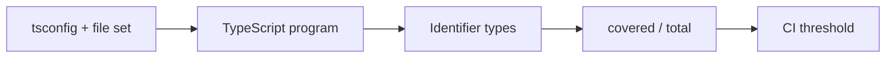

<TLDR>
  <TLDRCell label="what">
    类型覆盖率按标识符计算：类型不是`any`的标识符数量除以标识符总数。它能暴露静态检查失效的位置，但不能证明声明本身正确。
  </TLDRCell>
  <TLDRCell label="trap">
    百分比会随TypeScript版本、工具版本、项目配置和文件集合变化。类型断言、错误声明与被排除的文件还可能制造虚假的高分。
  </TLDRCell>
  <TLDRCell label="fix">
    使用固定的`tsconfig`和`--strict`口径，在CI中阻止覆盖率回退，同时单独运行编译检查与边界测试。
  </TLDRCell>
</TLDR>

## 是什么，为什么存在

<Term id="type-coverage">类型覆盖率（type coverage）</Term>衡量TypeScript检查器对代码中多少标识符掌握了非`any`类型。常用的`type-coverage`工具以“非`any`标识符数 / 标识符总数”计算结果，所以它数的是标识符，不是源码行、分支或文件。一个表达式中的`any`传播到属性读取和函数调用后，可能产生多个未覆盖位置。

这项指标解决的是可见性问题。`tsc`的`noImplicitAny`会报告无法推断而产生的<Term id="implicit-any">隐式`any`（implicit any）</Term>，却允许作者明确写出`any`；标准库或声明文件返回的`any`也可能继续传播。类型覆盖率把这些逃生口汇总成可跟踪的数量，并能在CI中阻止新逃生口悄悄进入代码库。

类型覆盖率不等于类型安全。把错误数据声明成`User`、把JSON直接断言成领域类型，或者写错声明文件，都可能得到很高的覆盖率，但运行时值仍不符合模型。指标只说明检查器掌握了什么类型，不说明这些类型来自可靠证据。

`unknown`与`any`也不能混为一谈。二者都能接收任意输入，但`unknown`会阻止属性访问、调用和类型特定操作，直到代码完成收窄。由于它不是`any`，`type-coverage`的普通模式与严格模式都会把`unknown`标识符计为已覆盖；真正的安全仍来自后续验证。

你通常会在JavaScript迁移、收紧旧TypeScript项目、审核第三方声明，或者给拉取请求设置质量门槛时遇到这项指标。它适合回答“未检查的类型从哪里进入并传播”，不适合回答“程序是否没有运行时类型错误”。

本页的程序使用TypeScript 6.0.3完成类型检查，并由Node 24执行。覆盖率输出来自`type-coverage` 2.30.1，命令固定使用同一份`tsconfig.json`和同一组文件。

## 工作原理

`type-coverage`先让TypeScript根据项目配置建立程序，再查询源码标识符的类型。工具把符合当前计数规则的标识符放入分子，把检查范围内的标识符放入分母，最后把比率与可选门槛比较。



默认模式主要寻找类型为`any`的标识符。`--strict`会扩大“未覆盖”的定义，包括类型参数中嵌套的`any`，例如`Promise<any>`，以及不安全的类型断言、非空断言、`Object`和空对象类型`{}`。工具文档明确说明，未来的小版本可能继续收紧严格模式，因此升级工具后分数可能下降。

| 代码形态 | 普通模式 | `--strict` | 含义 |
| --- | --- | --- | --- |
| `const value: any = input` | 未覆盖 | 未覆盖 | 明确退出静态检查。 |
| `Promise<any>` | 外层可能已覆盖 | 未覆盖 | 嵌套类型参数仍会传播`any`。 |
| `const value: unknown = input` | 已覆盖 | 已覆盖 | 使用前必须收窄。 |
| `input as User` | 目标类型可计为已覆盖 | 不安全断言会未覆盖 | 断言不执行验证。 |
| `input as unknown` | 已覆盖 | 已覆盖 | 保留输入的不确定性。 |

分子和分母都取决于有效项目配置。`include`、`exclude`、项目引用、`allowJs`、生成文件，以及传给命令的文件过滤器都会改变检查范围。比较两个提交时，必须固定编译器版本、工具版本、`tsconfig`和文件集合，否则百分比变化可能只是口径变化。

`type-coverage`默认并不替代完整的编译诊断。可以同时运行`tsc --noEmit`，也可以启用工具的`reportSemanticError`选项。覆盖率为100%的代码仍可能存在不可赋值、调用参数错误或无法解析模块等普通TypeScript错误。

项目可以把稳定口径写入`package.json`。下面的`90`只是配置示例，不是适用于所有代码库的通用目标；已有项目应先测量基线，再选择不会鼓励批量忽略的门槛。

```json title="package.json"
{
  "typeCoverage": {
    "project": "tsconfig.type-coverage.json",
    "strict": true,
    "detail": true,
    "atLeast": 90,
    "reportSemanticError": true,
    "showRelativePath": true
  }
}
```

单独的`tsconfig.type-coverage.json`可以继承构建配置，再逐步启用更严格的编译选项。这样做能让迁移暂时拥有独立口径，但最终仍应把已经完成的检查合并回主配置，避免生产构建与度量项目长期分叉。

### 从源头阅读详情

详情列表中的每一行都是一个标识符位置，不一定对应一个独立设计错误。若`payload`是`any`，它的属性、调用结果和回调参数可能全部出现；把每行分别修成显式类型，反而会留下错误源头。

先按文件和数据流把位置分组，再从最早的输入反向查找声明。JSON解析、缺失的第三方声明、过宽的泛型默认值和JavaScript边界通常会形成一簇结果。修复上游后重新测量，确认整簇是否消失。

剩余的单点再逐个审核。确实无法消除的`any`应位于小型适配器中，立即赋给`unknown`，并在值进入领域代码前验证。详情的目标是缩短未检查路径，不只是让列表变空。

在评审记录中保留预期例外的原因与删除条件。下一次详情变化时，评审者才能区分新增债务、已经修复的传播链和单纯的文件移动。

## 示例

下面先观察`any`如何隐藏拼写错误，再把边界改成`unknown`并进行运行时验证。最后把相同命令变成可重复的门槛。

### 发现传播的`any`

`JSON.parse()`的标准声明返回`any`。下面的`itmes`拼写错误不会触发属性检查，后续的`reduce`调用也沿着同一条`any`链执行。

<Depth level="quick">

```typescript run title="unsafe-total.ts"
type Invoice = { items: Array<{ amountCents: number }> };

function unsafeTotal(text: string): number {
  const invoice = JSON.parse(text);
  const items = invoice.itmes ?? [];

  return items.reduce(
    (total: number, item: any) => total + item.amountCents,
    0,
  );
}

const rawInvoice = '{"items":[{"amountCents":500},{"amountCents":250}]}';
const expectedInvoice: Invoice = { items: [{ amountCents: 750 }] };

console.log(`unsafe total=${unsafeTotal(rawInvoice)}`);
console.log(`typed total=${expectedInvoice.items[0]?.amountCents ?? 0}`);
```

```text
unsafe total=0
typed total=750
```

</Depth>

程序可以执行，但错误路径返回了`0`。显式的返回类型`number`没有帮助，因为`any`可以赋给`number`；返回类型只检查最后的赋值，不能恢复中间操作丢失的证据。

对这个文件运行严格覆盖率门槛，会列出传播链并以非零状态退出。下面的输出来自真实命令；行号指向标识符，而不是整行代码。

```bash title="measure-unsafe.sh"
npx type-coverage --strict --show-relative-path --at-least 100 -p tsconfig.json -- unsafe-total.ts
```

```text
unsafe-total.ts:4:9: invoice
unsafe-total.ts:5:9: items
unsafe-total.ts:5:17: invoice
unsafe-total.ts:5:25: itmes
unsafe-total.ts:7:10: items
unsafe-total.ts:7:16: reduce
unsafe-total.ts:8:21: item
unsafe-total.ts:8:43: item
unsafe-total.ts:8:48: amountCents
(25 / 34) 73.52%
The type coverage rate(73.52%) is lower than the target(100%).
```

`73.52%`只描述这一个示例文件和这套工具规则，不能外推为缺陷概率。详情比单独的百分比更有用：它显示一个上游`any`如何让属性名、方法和回调参数同时失去检查。

### 用`unknown`保留边界

修复不是给解析结果补一个类型断言，而是先保留未知性，再检查容器、数组、字段类型和整数约束。验证成功后，类型谓词让后续代码获得`Invoice`。

```typescript run title="safe-total.ts"
type Invoice = { items: Array<{ amountCents: number }> };

function isUnknownArray(value: unknown): value is unknown[] {
  return Array.isArray(value);
}

function isInvoice(value: unknown): value is Invoice {
  return (
    typeof value === "object" &&
    value !== null &&
    "items" in value &&
    isUnknownArray(value.items) &&
    value.items.every(
      (item) =>
        typeof item === "object" &&
        item !== null &&
        "amountCents" in item &&
        typeof item.amountCents === "number" &&
        Number.isSafeInteger(item.amountCents),
    )
  );
}

function totalInvoice(text: string): number {
  const value: unknown = JSON.parse(text);
  if (!isInvoice(value)) throw new Error("Invalid invoice");
  return value.items.reduce((total, item) => total + item.amountCents, 0);
}

for (const raw of [
  '{"items":[{"amountCents":500},{"amountCents":250}]}',
  '{"items":[{"amountCents":"500"}]}',
]) {
  try {
    console.log(`total=${totalInvoice(raw)}`);
  } catch (error) {
    const message = error instanceof Error ? error.message : String(error);
    console.log(`error=${message}`);
  }
}
```

```text
total=750
error=Invalid invoice
```

`isUnknownArray()`看似只是薄包装，却明确把标准库的`Array.isArray()`结果收窄为`unknown[]`。标准声明中的谓词是`arg is any[]`；直接在复合条件中使用它时，严格覆盖率会把数组元素的嵌套`any`标出来。包装器不会伪造元素结构，只把“是数组”这一项运行时事实表达成更安全的静态类型。

同样的严格命令现在达到100%。它证明这个示例里没有被当前规则识别出的逃生口，不证明`Invoice`的业务约束已经完整；例如是否允许负金额仍要由领域契约决定。

```bash title="measure-safe.sh"
npx type-coverage --strict --detail --show-relative-path --at-least 100 -p tsconfig.json -- safe-total.ts
```

```text
(66 / 66) 100.00%
type-coverage success.
```

### 收窄迁移接缝

有些迁移边界暂时必须调用返回`any`的旧接口。把这个事实限制在函数类型中，并立即把调用结果赋给`unknown`，可以阻止未检查值进入领域逻辑。

```typescript run title="legacy-adapter.ts"
type FeatureFlags = { checkoutV2: boolean; maxItems: number };
type LegacyLoad = (key: string) => any;

function isFeatureFlags(value: unknown): value is FeatureFlags {
  return (
    typeof value === "object" &&
    value !== null &&
    "checkoutV2" in value &&
    "maxItems" in value &&
    typeof value.checkoutV2 === "boolean" &&
    typeof value.maxItems === "number" &&
    Number.isSafeInteger(value.maxItems) &&
    value.maxItems > 0
  );
}

function readFlags(load: LegacyLoad, key: string): FeatureFlags {
  const value: unknown = load(key);
  if (!isFeatureFlags(value)) throw new Error("Invalid feature flags");
  return value;
}

const legacyLoad: LegacyLoad = (key) =>
  key === "valid"
    ? JSON.parse('{"checkoutV2":true,"maxItems":20}')
    : JSON.parse('{"checkoutV2":"yes"}');

for (const key of ["valid", "invalid"]) {
  try {
    const flags = readFlags(legacyLoad, key);
    console.log(`${key}=${flags.checkoutV2}:${flags.maxItems}`);
  } catch (error) {
    const message = error instanceof Error ? error.message : String(error);
    console.log(`${key}=${message}`);
  }
}
```

```text
valid=true:20
invalid=Invalid feature flags
```

这里没有声称旧接口安全。`LegacyLoad`明确记录遗留返回值，`readFlags()`则把信任边界缩到一次调用，并在返回`FeatureFlags`前完成验证。无效数据会在适配器中被拒绝。

当前严格规则仍给这个文件100%，这正好说明指标的边界：它按标识符类型工作，并不会把源码中每个`any`关键字都变成未覆盖标识符。评审必须继续清点公开签名中的`any`，不能把满分当成逃生口已经消失。

```bash title="measure-adapter.sh"
npx type-coverage --strict --detail --show-relative-path -p tsconfig.json -- legacy-adapter.ts
```

```text
(67 / 67) 100.00%
type-coverage success.
```

### 把口径固定在CI

门槛应执行项目已经固定的配置，而不是在工作流里重新拼一套参数。脚本先做普通类型检查，再做覆盖率检查；两步失败的含义不同，因此应保留为两个命令。

```json title="package.json"
{
  "scripts": {
    "typecheck": "tsc -p tsconfig.json --noEmit",
    "type-coverage": "type-coverage"
  },
  "typeCoverage": {
    "project": "tsconfig.type-coverage.json",
    "strict": true,
    "atLeast": 90,
    "reportSemanticError": true,
    "showRelativePath": true
  }
}
```

```bash title="ci-type-gate.sh"
npm run --silent typecheck
npm run --silent type-coverage
```

```text
(158 / 167) 94.61%
type-coverage success.
```

成功的运行应由进程退出状态决定，不要从人类可读文本中用正则提取百分比。需要机器读取报告时使用`--json-output`，并固定工具版本，因为JSON字段与严格计数规则都属于工具接口。

旧项目可以先把`atLeast`设为当前基线，让新增的`any`立即失败，再按目录修复并逐步提高数值。不要为了到达整数目标而排除最难的文件；边界适配器和缺失声明通常正是指标最有价值的地方。

## 陷阱

> [!PITFALL]
> 把100%类型覆盖率当成运行时类型安全。错误的接口、伪造的声明文件或`as User`都能让检查器相信并不存在的事实。

**修复方法：** 逐个审核<Term id="type-assertion">类型断言（type assertion）</Term>与声明边界。外部值先以`unknown`进入，再由运行时解析器或守卫建立领域类型；同时保留行为测试。

> [!PITFALL]
> 比较不同口径的百分比。升级TypeScript或`type-coverage`、切换`tsconfig`、加入生成文件，都会同时改变分子和分母。

**修复方法：** 锁定依赖版本，在命令中明确项目配置，并在覆盖率变化时同时审查文件集合。口径有意变化时，重新记录基线，不把跳变描述成代码质量改进。

> [!PITFALL]
> 用忽略注释、`ignoreFiles`或宽松的`ignore*`选项清空详情。这会提高分数，却没有恢复任何静态证据。

**修复方法：** 每个排除都写明所有者、运行时保证和删除条件。启用`--report-unused-ignore`，并让忽略范围只覆盖无法立即修复的适配器行，而不是整个目录。

> [!PITFALL]
> 为了提高覆盖率而把`unknown`改成`any`，或者误以为严格模式会惩罚`unknown`。这种修改会放宽使用规则，而且通常让传播范围更大。

**修复方法：** 在不可信边界保留`unknown`，通过类型守卫、解析器或穷尽分支完成收窄。覆盖率工具会把`unknown`计为已覆盖，但评审仍要检查收窄是否验证了全部领域约束。

> [!PITFALL]
> 只运行覆盖率命令，不运行`tsc`和测试。一个标识符可以拥有非`any`类型，同时代码仍存在普通类型错误或错误行为。

**修复方法：** 把编译、覆盖率与运行时测试设为独立门槛。覆盖率负责定位逃生口，编译器负责检查可赋值性和调用，测试负责验证擦除类型后的行为。

<Depth level="deep">

## 指标没有表达的内容

类型覆盖率是对检查器状态的抽样，不是TypeScript健全性的数学证明。类型在输出JavaScript时会发生<Term id="type-erasure">类型擦除（type erasure）</Term>，所以接口、类型别名和大多数注解不会在运行时检查输入。即使每个标识符都有具体类型，数据仍可能通过错误声明、手写`.d.ts`、JavaScript调用方或被压制的诊断违反模型。

分母也不是程序复杂度。一个短表达式可能包含多个标识符，而大段没有标识符的控制结构不会以同样方式增加总数。因而`80%`与`90%`不能解释为测试覆盖率式的“又覆盖了10%行为”，更不能换算成缺陷率。

普通模式与严格模式回答不同问题。普通模式适合快速发现直接的`any`，严格模式还追踪嵌套`any`和若干逃生断言。团队一旦选择严格模式，就应持续使用同一模式；来回切换只会制造无法比较的历史曲线。

工具详情可能在一个源头后列出许多下游位置。逐项添加注解通常只遮住症状，最有效的修复是找到最早返回`any`的解析、声明或包装器。把边界改成`unknown`并验证后，控制流推断会一次恢复整条链的具体类型。

第三方声明值得单独审查。把缺失声明补成精确`.d.ts`可以恢复覆盖率，但声明仍是对运行时模块的承诺。应使用临时安装或集成测试验证导出形状、可选字段和错误行为，不能仅因覆盖率升高就认为声明正确。

## 稳定的迁移门槛

覆盖率最适合作为棘轮，而不是一次性追求满分。先记录当前严格口径的分子、分母、工具版本和文件集合，让后续提交不得降低结果。修复一个目录后再提高门槛，这样新债务会立即失败，旧债务则有明确的消减路径。

百分比取整会隐藏小回退。大型项目可以同时记录原始计数，并在评审中查看详情差异；工具还提供`--is`，但要求完全相等通常只适合已经稳定达到目标的范围。对正在迁移的代码，`--at-least`更能表达只升不降的政策。

排除文件有时合理，例如由外部工具完全生成且从不手工维护的代码。排除清单仍要接受版本控制和评审，并确认生成边界的公开声明由其他测试覆盖。测试文件、脚本和迁移适配器不应仅因分数难看而默认排除，它们同样会在开发或部署流程中运行。

合并请求中的理想证据不只有一个百分比。它应包含编译成功、覆盖率门槛成功、未覆盖详情的预期变化，以及受影响边界的运行时测试。四者分别回答语义错误、逃生口数量、传播位置和真实行为，不能互相替代。

工具升级时先在独立提交中重新计算基线。阅读严格模式的变更说明，检查新增的未覆盖类别，再决定哪些是应修复的真实风险。把工具规则变化与业务改动分开，历史记录才不会把口径调整误认成回归。

</Depth>

<Checkpoint id="typescript/type-coverage" />

## 延伸阅读

- [TypeScript TSConfig参考：`noImplicitAny`](https://www.typescriptlang.org/tsconfig/noImplicitAny.html)
- [TypeScript手册：`any`](https://www.typescriptlang.org/docs/handbook/2/everyday-types.html#any)
- [TypeScript手册：`unknown`](https://www.typescriptlang.org/docs/handbook/2/functions.html#unknown)
- [`type-coverage`仓库与CLI参考](https://github.com/plantain-00/type-coverage)
