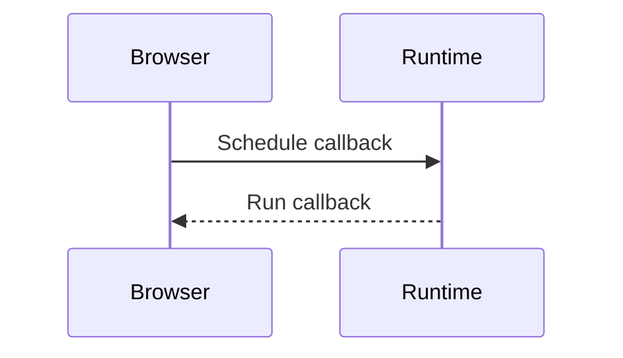
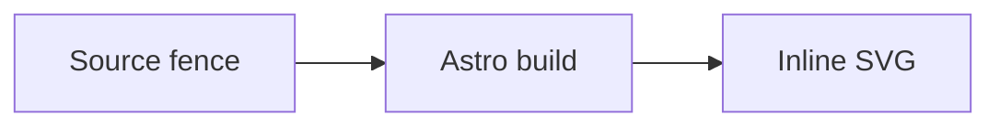
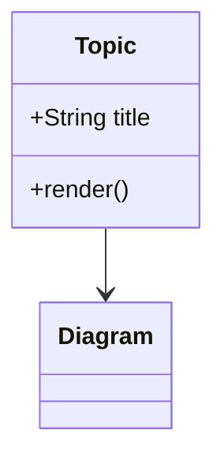

```mermaid
sequenceDiagram
  participant Browser
  participant Runtime
  Browser->>Runtime: Schedule callback
  Runtime-->>Browser: Run callback
```


```mermaid
flowchart LR
  Source[Source fence] --> Build[Astro build]
  Build --> SVG[Inline SVG]
```


```mermaid
classDiagram
  class Topic {
    +String title
    +render()
  }
  Topic --> Diagram
```

```python run title="diagram.py"
print("ordinary code")
```
